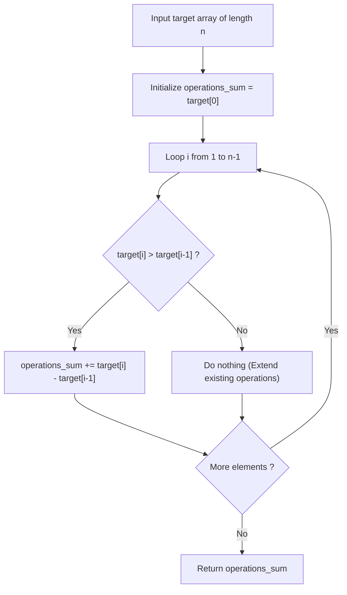

# Guided Example: Minimum Number of Increments on Subarrays to Form a Target Array

## 1. Instance & Teaching Goal

We are given a target array of positive integers:
$$\text{target} = [3, 1, 5, 4, 2]$$
Starting from an initial array of identical length filled with zeros $[0, 0, 0, 0, 0]$, each operation allows selecting any contiguous subarray and incrementing all elements within that range by $1$.

Our teaching goal is to determine the minimum total number of operations required to construct $\text{target}$. We formulate the problem through differential skyline analysis, proving why each upward step in adjacent height differences demands independent operation initiations, reducing the construction to a single linear sweep:
$$\text{Operations} = \text{target}[0] + \sum_{i=1}^{n-1} \max(0, \text{target}[i] - \text{target}[i-1])$$

## 2. Conceptual Foundation & Invariants

Let $A = \text{target}$ be an array of length $n$.
1. **Skyline Layering Model**:
   Visualizing $A$ as a 2D histogram of heights, each range increment by $1$ corresponds to laying down a horizontal unit-height rectangular plank spanning some column interval $[l, r]$.
   We seek the minimum number of planks needed to build the silhouette.
2. **Left-to-Right Operation Inheritance**:
   Suppose we scan the columns from left to right:
   - For the first column $A[0]$, we must initiate at least $A[0]$ horizontal planks starting at index $0$.
   - For any column $i > 0$:
     - If $A[i] \le A[i-1]$, the current height does not exceed the previous column's height. All $A[i]$ required layers can be provided by simply extending the planks that covered column $i - 1$ through column $i$. No new planks need to be started at index $i$.
     - If $A[i] > A[i-1]$, the column is taller than its predecessor by $\Delta = A[i] - A[i-1]$ units. Planks arriving from the left can cover at most $A[i-1]$ units of height. The remaining $\Delta$ layers **must** be freshly initiated at index $i$.
3. **Differential Telescoping Sum**:
   Because every plank has a unique starting column, the minimum total number of planks equals the sum of newly initiated planks across all columns:
   $$\text{Total Operations} = A[0] + \sum_{i=1}^{n-1} \max(0, A[i] - A[i-1])$$

```text
+-------------------------------------------------------------------------------+
|                      SKYLINE DIFFERENTIAL ELEVATION ANALYSIS                  |
|                                                                               |
|  Target Heights: [ 3, 1, 5, 4, 2 ]                                            |
|                                                                               |
|       Col 0      Col 1      Col 2      Col 3      Col 4                       |
|       h = 3      h = 1      h = 5      h = 4      h = 2                       |
|                                                                               |
|                             [#]                                               |
|                             [#]        [#]                                    |
|       [#]                   [#]        [#]                                    |
|       [#]                   [#]        [#]        [#]                         |
|       [#]        [#]        [#]        [#]        [#]                         |
|                                                                               |
|  Delta:                                                                       |
|    Col 0: Start height = 3 planks initiated -> +3                             |
|    Col 1: Drop (1 - 3 = -2) -> 0 new planks   -> +0                           |
|    Col 2: Rise (5 - 1 = +4) -> 4 new planks   -> +4                           |
|    Col 3: Drop (4 - 5 = -1) -> 0 new planks   -> +0                           |
|    Col 4: Drop (2 - 4 = -2) -> 0 new planks   -> +0                           |
|                                                                               |
|  Total Minimum Operations: 3 + 0 + 4 + 0 + 0 = 7                              |
+-------------------------------------------------------------------------------+
```

The algorithm maintains the following state variables:

| State Variable | Domain | Initial Value | Transition / Role |
|---|---|---|---|
| `scan_cursor` | Integer $\in [1, n-1]$ | $1$ | Pointer traversing adjacent column pairs $(i-1, i)$. |
| `prev_height` | Integer $\ge 0$ | $A[0]$ | Height of the preceding column $A[i-1]$. |
| `curr_height` | Integer $\ge 0$ | $A[1]$ | Height of the active column $A[i]$. |
| `operations_sum` | Integer $\ge 0$ | $A[0]$ | Cumulative count of initiated range operations. |

> [!IMPORTANT]
> **Positive Delta Invariant**: Range increments can only be extended or terminated; they cannot jump over valleys. A column of height $h_2 > h_1$ strictly requires $h_2 - h_1$ newly introduced operations that could not have come from $h_1$.



## 3. Step-by-Step Worked Execution

We trace the representative instance $\text{target} = [3, 1, 5, 4, 2]$ of length $n = 5$.

### Base Step: Column $0$ ($h = 3$)
- The first column has height $3$.
- Starting from zero, at least $3$ operations must be initiated at index $0$.
- Initial accumulator:
  $$\text{operations\_sum} = 3$$

---

### Step 1: Column $1$ ($h = 1$)
- Current element: $A[1] = 1$.
- Preceding element: $A[0] = 3$.
- Elevation change: $\Delta = A[1] - A[0] = 1 - 3 = -2$.
- Since $\Delta \le 0$, the $1$ unit of height required at index $1$ is covered by extending $1$ of the $3$ operations initiated at index $0$. The other $2$ operations terminate at index $0$.
- Contribution: $\max(0, -2) = 0$.
- Running total: $\text{operations\_sum} = 3 + 0 = 3$.

---

### Step 2: Column $2$ ($h = 5$)
- Current element: $A[2] = 5$.
- Preceding element: $A[1] = 1$.
- Elevation change: $\Delta = A[2] - A[1] = 5 - 1 = +4$.
- The single operation passing through index $1$ can cover $1$ unit of height at index $2$.
- The remaining $4$ units of height cannot be supplied from the left and must be newly started at index $2$.
- Contribution: $+4$.
- Running total: $\text{operations\_sum} = 3 + 4 = 7$.

---

### Step 3: Column $3$ ($h = 4$)
- Current element: $A[3] = 4$.
- Preceding element: $A[2] = 5$.
- Elevation change: $\Delta = A[3] - A[2] = 4 - 5 = -1$.
- Height decreases: $4$ of the $5$ operations extending from index $2$ continue through index $3$.
- Contribution: $\max(0, -1) = 0$.
- Running total: $\text{operations\_sum} = 7 + 0 = 7$.

---

### Step 4: Column $4$ ($h = 2$)
- Current element: $A[4] = 2$.
- Preceding element: $A[3] = 4$.
- Elevation change: $\Delta = A[4] - A[3] = 2 - 4 = -2$.
- Height decreases: $2$ operations continue through index $4$.
- Contribution: $\max(0, -2) = 0$.
- Running total: $\text{operations\_sum} = 7 + 0 = 7$.

All columns processed. Minimal operations required: $7$.

## 4. Complete Execution Trace

We record the elevation transitions and incremental operation counts across all columns in the trace table below.

| Column Index $i$ | Target Height $A[i]$ | Previous Height $A[i-1]$ | Step Difference $\Delta = A[i] - A[i-1]$ | New Operations Initiated $\max(0, \Delta)$ | Active Planks Passing Through $i$ | Cumulative Operations |
|---|---|---|---|---|---|---|
| $0$ | $3$ | $0$ (Baseline) | $+3$ | $3$ | $3$ | $3$ |
| $1$ | $1$ | $3$ | $-2$ | $0$ | $1$ | $3$ |
| $2$ | $5$ | $1$ | $+4$ | $4$ | $5$ | **$7$** |
| $3$ | $4$ | $5$ | $-1$ | $0$ | $4$ | **$7$** |
| $4$ | $2$ | $4$ | $-2$ | $0$ | $2$ | **$7$** |

### Physical Operation Realization (7 Planks)

One optimal sequence of 7 range operations:
1. Increment $[0 \dots 4]$: $[1, 1, 1, 1, 1]$ (Height 1 across entire array)
2. Increment $[0 \dots 0]$: $[2, 1, 1, 1, 1]$
3. Increment $[0 \dots 0]$: $[3, 1, 1, 1, 1]$ (Column 0 completed)
4. Increment $[2 \dots 4]$: $[3, 1, 2, 2, 2]$ (Column 4 completed)
5. Increment $[2 \dots 3]$: $[3, 1, 3, 3, 2]$
6. Increment $[2 \dots 3]$: $[3, 1, 4, 4, 2]$ (Column 3 completed)
7. Increment $[2 \dots 2]$: $[3, 1, 5, 4, 2]$ (Target formed in exactly 7 operations)

## 5. Algorithmic Correctness

### Soundness

Let $k$ be a sequence of range operations $[l_m, r_m]$.
Each operation increments the difference between adjacent elements:
At index $l_m$, $A[l_m] - A[l_m - 1]$ increases by $1$.
At index $r_m + 1$, $A[r_m + 1] - A[r_m]$ decreases by $1$.
Summing all positive adjacent increments:
$$\sum_{i=1}^{n-1} \max(0, A[i] - A[i-1]) + A[0]$$
measures the total net positive variation of the array.
Because any single range operation can increase the positive variation by at most $1$ (at its starting index $l_m$), at least that many operations are strictly necessary.
Furthermore, the construction given in the trace proves that this lower bound is always achievable by extending ongoing operations to the right as far as possible.
Thus, the computed count is both achievable and sound.

### Completeness

Every rise in elevation requires a new operation to start.
Because the formula sums all positive differences without skipping any column transition, no necessary operation start is overlooked, guaranteeing completeness.

## 6. Traps This Instance Exposes

- **Recursive Divide-and-Conquer Overhead**: Finding the global minimum in range $[l, r]$, subtracting it, and recursing on left and right segments. In worst-case monotonic arrays (e.g. $[1, 2, 3, \dots, n]$), this approach degenerates to $\mathcal{O}(n^2)$ time. The linear differential formula solves the problem in $\mathcal{O}(n)$ time.
- **Telescoping Negative Terms Trap**: Subtracting negative differences. Adding negative terms would reduce the count below the physical requirement. Only positive increases $\max(0, A[i] - A[i-1])$ require new operations.
- **Segment Tree Overkill**: Constructing Range Minimum Query (RMQ) segment trees to simulate horizontal slicing. While $\mathcal{O}(n \log n)$, it introduces significant code complexity for what is fundamentally an $\mathcal{O}(n)$ prefix difference calculation.

## 7. Complexity Derivation

### Time Complexity

- **Single Linear Scan**: The algorithm compares adjacent elements $A[i]$ and $A[i-1]$ for $i \in [1, n-1]$.
- **Constant Time Per Pair**: Evaluating $\max(0, A[i] - A[i-1])$ and adding to the accumulator takes $\mathcal{O}(1)$ time.
- Total time complexity is strictly:
  $$\mathcal{O}(n)$$
- For $n = 10^5$, this executes in under $5$ milliseconds.

### Auxiliary Space Complexity

- The algorithm uses only scalar registers (`ans`, `a`, `b`).
- Auxiliary space complexity is strictly $\mathcal{O}(1)$.
