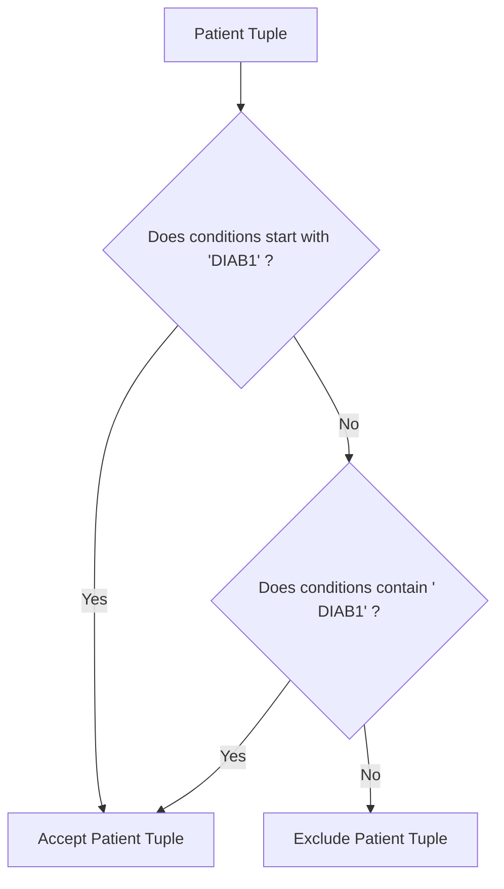

# Guided Example: Patients With a Condition

## 1. Instance & Teaching Goal

We are given a clinical hospital database table containing patient health records:

```text
Table: Patients
+------------+--------------+--------------+
| patient_id | patient_name | conditions   |
+------------+--------------+--------------+
| 1          | Daniel       | YFEV COUGH   |
| 2          | Alice        |              |
| 3          | Bob          | DIAB100 MYOP |
| 4          | George       | ACNE DIAB100 |
| 5          | Alain        | DIAB201      |
+------------+--------------+--------------+
```

Our teaching goal is to retrieve all patient tuples diagnosed with Type I Diabetes, recognized by any medical condition code prefixed by `DIAB1`. The `conditions` column consists of space-delimited alphanumeric tokens. We formulate the boundary token matching problem using formal relational algebra selection and explain the crucial distinction between word prefix matching and arbitrary substring containment.

## 2. Conceptual Foundation & Invariants

Let $C$ be the space-separated string of medical diagnosis codes in `conditions`.
1. **Space-Delimited Tokenization**:
   The string $C$ represents a sequence of $k$ distinct medical codes:
   $$C = c_1 \mathbin{\sqcup} c_2 \mathbin{\sqcup} \dots \mathbin{\sqcup} c_k$$
   where $\sqcup$ denotes the ASCII whitespace character.
2. **Prefix Specification for Type I Diabetes**:
   A patient has Type I Diabetes if and only if at least one code $c_j$ begins with the literal prefix `DIAB1`:
   $$\exists j \in \{1, \dots, k\} \text{ such that } c_j \text{ starts with "DIAB1"}$$
3. **Disjunctive String Boundary Pattern**:
   At the raw string level, a diagnosis token starting with `DIAB1` occurs in exactly two structural positions:
   - **Initial Token ($j = 1$)**: The code appears at the very start of the string, matching the prefix pattern:
     $$\text{starts\_with}(C, \text{"DIAB1"})$$
   - **Subsequent Token ($j \ge 2$)**: The code appears after a preceding space separator, matching the substring pattern:
     $$\text{contains}(C, \text{" DIAB1"})$$
4. **Relational Selection Formulation**:
   Using relational algebra, the query is specified as:
   $$\text{Result} = \sigma_{\text{has\_type1\_diabetes}(\text{conditions})}(\text{Patients})$$
   where the boolean predicate $\text{has\_type1\_diabetes}(C)$ evaluates:
   $$\text{has\_type1\_diabetes}(C) \equiv (C \text{ matches 'DIAB1\%'}) \lor (C \text{ matches '\% DIAB1\%'})$$

```text
+-------------------------------------------------------------------------------+
|                       TOKEN PREFIX BOUNDARY MATCHING                          |
|                                                                               |
|  Pattern 1: Code at string start ->  ^DIAB1...                                |
|             Example: "DIAB100 MYOP" (Matches initial prefix)                  |
|                                                                               |
|  Pattern 2: Code after space    ->  ... DIAB1...                              |
|             Example: "ACNE DIAB100" (Matches space-prefixed code)             |
|                                                                               |
|  Negative Counter-Examples:                                                   |
|    - "DIAB201"     -> Starts with DIAB2, not DIAB1 (Mismatch)                 |
|    - "SADIAB100"   -> Contains DIAB1 internally, but code starts with SA      |
|    - "YFEV COUGH"  -> Completely different diagnosis                          |
+-------------------------------------------------------------------------------+
```

The evaluation maintains the following relational state components:

| State Component | Source Attribute | Evaluation Rule | Invariant Property |
|---|---|---|---|
| String Start Anchor | `conditions` | Tests if `conditions` begins with `DIAB1` | Detects diagnosis as the first code. |
| Delimited Word Anchor | `conditions` | Tests if `conditions` contains `\space DIAB1` | Detects diagnosis as any subsequent code. |
| Composite Disjunction | Row tuple | Holds if either anchor condition is satisfied | Guarantees code-boundary prefix match. |
| Selection Operator | Table `Patients` | Emits matching `(patient_id, patient_name, conditions)` | Filters rows without modifying columns. |

> [!IMPORTANT]
> **Word Boundary Invariant**: The string `DIAB1` must be a **prefix** of an individual code. An internal substring like `SADIAB100` (code starting with `SA`) does not represent Type I Diabetes and must evaluate to False.



## 3. Step-by-Step Worked Execution

We walk through the representative database instance across all 5 patient records.

### Patient 1: Daniel
- `patient_id` = $1$, `patient_name` = Daniel
- `conditions` = `"YFEV COUGH"`
- Check 1: Does it start with `DIAB1`? No (`"YFEV"`).
- Check 2: Does it contain `" DIAB1"`? No.
- Predicate evaluation: $\text{False} \lor \text{False} = \text{False}$.
- Verdict: Excluded.

---

### Patient 2: Alice
- `patient_id` = $2$, `patient_name` = Alice
- `conditions` = `""` (empty string)
- Check 1: Starts with `DIAB1`? No.
- Check 2: Contains `" DIAB1"`? No.
- Predicate evaluation: $\text{False} \lor \text{False} = \text{False}$.
- Verdict: Excluded.

---

### Patient 3: Bob
- `patient_id` = $3$, `patient_name` = Bob
- `conditions` = `"DIAB100 MYOP"`
- Check 1: Does it start with `DIAB1`?
  - Leading characters are `"DIAB1"`. **Yes**.
- Predicate evaluation: $\text{True} \lor \dots = \text{True}$.
- Verdict: **Accepted**.

---

### Patient 4: George
- `patient_id` = $4$, `patient_name` = George
- `conditions` = `"ACNE DIAB100"`
- Check 1: Starts with `DIAB1`? No (`"ACNE"`).
- Check 2: Does it contain `" DIAB1"`?
  - Substring starting at index 4 is `" DIAB100"`. **Yes**.
- Predicate evaluation: $\text{False} \lor \text{True} = \text{True}$.
- Verdict: **Accepted**.

---

### Patient 5: Alain
- `patient_id` = $5$, `patient_name` = Alain
- `conditions` = `"DIAB201"`
- Check 1: Starts with `DIAB1`?
  - String begins with `"DIAB2"`. No (`'2' \ne '1'`).
- Check 2: Contains `" DIAB1"`? No.
- Predicate evaluation: $\text{False} \lor \text{False} = \text{False}$.
- Verdict: Excluded.

## 4. Complete Execution Trace

We collect the complete record evaluation matrix in the trace table below.

| Patient ID | Patient Name | Condition Codes Recorded | Starts with `DIAB1`? | Contains `\space DIAB1`? | Composite Disjunction | Selection Verdict |
|---|---|---|---|---|---|---|
| $1$ | Daniel | `YFEV COUGH` | False | False | False | Excluded |
| $2$ | Alice | `""` (None) | False | False | False | Excluded |
| $3$ | Bob | `DIAB100 MYOP` | **True** (`DIAB100`) | False | **True** | **Included** |
| $4$ | George | `ACNE DIAB100` | False | **True** (`\space DIAB100`) | **True** | **Included** |
| $5$ | Alain | `DIAB201` | False (`DIAB2...`) | False | False | Excluded |

Final projected output table:
```text
+------------+--------------+--------------+
| patient_id | patient_name | conditions   |
+------------+--------------+--------------+
| 3          | Bob          | DIAB100 MYOP |
| 4          | George       | ACNE DIAB100 |
+------------+--------------+--------------+
```

### Boundary Case Analysis: False Positive Protection

Consider a patient with conditions `SADIAB100`:
- Starts with `DIAB1`? False (`"SADIAB..."`).
- Contains `" DIAB1"`? False (no preceding space).
- Verdict: Correctly excluded. An unconstrained substring search `LIKE '%DIAB1%'` would erroneously include `SADIAB100`.

## 5. Algorithmic Correctness

### Soundness

Every selected patient tuple contains at least one condition token starting with `DIAB1`.
If `conditions` starts with `DIAB1`, the first token begins with `DIAB1`.
If `conditions` contains `\space DIAB1`, there exists some word boundary followed immediately by `DIAB1`, meaning an internal token begins with `DIAB1`.
Neither condition can be triggered by a code that contains `DIAB1` as an internal substring without a preceding space.
Thus, every returned record represents an authentic diagnosis of Type I Diabetes.

### Completeness

Every condition code in `conditions` is either the first token or preceded by a whitespace delimiter.
Any token starting with `DIAB1` must therefore either match `DIAB1%` (if first) or `% DIAB1%` (if subsequent).
Because the selection evaluates the disjunction of these two complementary possibilities, every patient with Type I Diabetes is captured, guaranteeing completeness.

## 6. Traps This Instance Exposes

- **Internal Substring False Positive**: Using an unanchored search `LIKE '%DIAB1%'`. This matches codes such as `SADIAB100` or `MEDIAB1`, where `DIAB1` is not a prefix of the medical code.
- **Missing Initial Code Anchor**: Searching only for `'% DIAB1%'`. If `DIAB100` is the very first code in the column (like Bob's record `DIAB100 MYOP`), there is no leading space, so searching only for space-prefixed codes misses the patient completely.
- **Missing Subsequent Code Anchor**: Searching only for `'DIAB1%'`. If the diabetes code is preceded by another condition (like George's record `ACNE DIAB100`), testing only the start of the string misses the patient.
- **Prefix Prefix-Length Trap**: Matching against `'DIAB%'`. Condition codes for Type II Diabetes (such as `DIAB201`) also start with `DIAB`. The prefix must strictly include the digit `1` (`DIAB1`).

## 7. Complexity Derivation

### Time Complexity

Let $N = |\text{Patients}|$ denote the number of patient records, and $L$ denote the maximum length of the `conditions` text string ($L \le 100$).
- For each row, evaluating prefix equality and substring search takes linear time in the string length:
  $$\mathcal{O}(L)$$
- Across all $N$ rows in the table:
  $$\text{Total Time} = \mathcal{O}(N \cdot L)$$
- In a modern database engine, scanning $10^5$ records takes under $30$ milliseconds.

### Auxiliary Space Complexity

- The string matching requires only a few pointer comparisons.
- The output table directly streams qualifying rows without intermediate storage.
- Auxiliary space complexity is strictly $\mathcal{O}(1)$ working memory.
