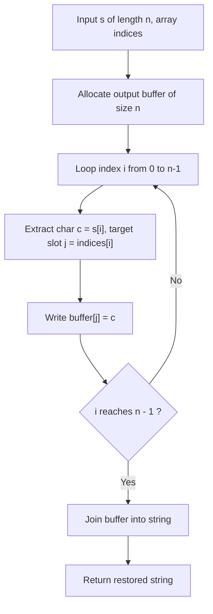

# Guided Example: Shuffle String

## 1. Instance & Teaching Goal

We are given a string of length $n = 8$ and a target destination permutation vector:
$$s = \text{"codeleet"}, \quad \text{indices} = [4, 5, 6, 7, 0, 2, 1, 3]$$

The shuffling operation dictates that the character originally residing at position $i$ must be relocated to index $\text{indices}[i]$ in the restored string.
Our teaching goal is to reconstruct the restored string `"leetcode"`. We examine the direct scatter-gather permutation mapping, prove why uniqueness of indices guarantees an bijective reconstruction, and discuss both the buffer-based reconstruction and the cyclic in-place permutation traversal.

## 2. Conceptual Foundation & Invariants

Let $\pi = \text{indices}$ be a permutation of the index set $\{0, 1, \dots, n-1\}$.
1. **Permutation Mapping Model**:
   The problem specifies a forward mapping:
   $$\text{Restored}[\pi[i]] = s[i] \quad \text{for all } i \in \{0, 1, \dots, n-1\}$$
   Because all values in $\pi$ are distinct and bounded in $[0, n-1]$, $\pi$ is a bijection on $\{0, \dots, n-1\}$.
2. **Scatter Array Construction**:
   We initialize an auxiliary character array $\text{ans}$ of length $n$:
   $$\text{ans} = [\text{null}, \text{null}, \dots, \text{null}]$$
   For each source index $i$, we directly place character $s[i]$ at destination slot $\pi[i]$:
   $$\text{ans}[\pi[i]] \leftarrow s[i]$$
   After iterating through all $n$ characters, every slot of $\text{ans}$ is assigned exactly once.
   Joining the characters yields the restored string:
   $$\text{Result} = \text{join}(\text{ans})$$
3. **Cycle Decomposition Alternative**:
   Any finite permutation $\pi$ decomposes into disjoint directed cycles $(c_1 \to c_2 \to \dots \to c_k \to c_1)$.
   By following each cycle and rotating characters in-place, the string can be reconstructed in $\mathcal{O}(n)$ time and $\mathcal{O}(1)$ auxiliary space without allocating a second string buffer.

```text
+-------------------------------------------------------------------------------+
|                      DIRECT SCATTER PERMUTATION MAPPING                       |
|                                                                               |
|  Source:  c  o  d  e  l  e  e  t                                              |
|  Index i: 0  1  2  3  4  5  6  7                                              |
|           |  |  |  |  |  |  |  |                                              |
|  pi[i]:   4  5  6  7  0  2  1  3                                              |
|           |  |  |  |  |  |  |  |                                              |
|           v  v  v  v  v  v  v  v                                              |
|  Restored:                                                                    |
|    Index: 0  1  2  3  4  5  6  7                                              |
|    Char:  l  e  e  t  c  o  d  e  -> "leetcode"                               |
+-------------------------------------------------------------------------------+
```

The algorithm maintains the following state variables:

| State Variable | Domain | Initial Value | Transition / Role |
|---|---|---|---|
| `source_index` | Integer $\in [0, n-1]$ | $0$ | Scanning pointer iterating across input string $s$. |
| `dest_index` | Integer $\in [0, n-1]$ | $\text{indices}[0]$ | Target slot $\pi[i]$ where character $s[i]$ must be written. |
| `target_char` | Character | $s[0]$ | Character being relocated. |
| `output_buffer` | Array of characters of length $n$ | All uninitialized | Destination array populated at designated destination indices. |

> [!IMPORTANT]
> **Bijective Assignment Invariant**: Because the permutation $\text{indices}$ contains each integer from $0$ to $n - 1$ exactly once, every slot in `output_buffer` is written exactly once, eliminating write conflicts and gaps.



## 3. Step-by-Step Worked Execution

We walk through the representative instance $s = \text{"codeleet"}$, $\text{indices} = [4, 5, 6, 7, 0, 2, 1, 3]$ of length $n = 8$.

### Initialization
- Allocate array $\text{ans}$ of length $8$: $[\_, \_, \_, \_, \_, \_, \_, \_]$.

---

### Step 1: $i = 0$
- Character: $s[0] = \text{'c'}$.
- Destination: $\text{indices}[0] = 4$.
- Action: $\text{ans}[4] \leftarrow \text{'c'}$.
- Buffer: $[\_, \_, \_, \_, \text{'c'}, \_, \_, \_]$.

---

### Step 2: $i = 1$
- Character: $s[1] = \text{'o'}$.
- Destination: $\text{indices}[1] = 5$.
- Action: $\text{ans}[5] \leftarrow \text{'o'}$.
- Buffer: $[\_, \_, \_, \_, \text{'c'}, \text{'o'}, \_, \_]$.

---

### Step 3: $i = 2$
- Character: $s[2] = \text{'d'}$.
- Destination: $\text{indices}[2] = 6$.
- Action: $\text{ans}[6] \leftarrow \text{'d'}$.
- Buffer: $[\_, \_, \_, \_, \text{'c'}, \text{'o'}, \text{'d'}, \_]$.

---

### Step 4: $i = 3$
- Character: $s[3] = \text{'e'}$.
- Destination: $\text{indices}[3] = 7$.
- Action: $\text{ans}[7] \leftarrow \text{'e'}$.
- Buffer: $[\_, \_, \_, \_, \text{'c'}, \text{'o'}, \text{'d'}, \text{'e'}]$.

---

### Step 5: $i = 4$
- Character: $s[4] = \text{'l'}$.
- Destination: $\text{indices}[4] = 0$.
- Action: $\text{ans}[0] \leftarrow \text{'l'}$.
- Buffer: $[\text{'l'}, \_, \_, \_, \text{'c'}, \text{'o'}, \text{'d'}, \text{'e'}]$.

---

### Step 6: $i = 5$
- Character: $s[5] = \text{'e'}$.
- Destination: $\text{indices}[5] = 2$.
- Action: $\text{ans}[2] \leftarrow \text{'e'}$.
- Buffer: $[\text{'l'}, \_, \text{'e'}, \_, \text{'c'}, \text{'o'}, \text{'d'}, \text{'e'}]$.

---

### Step 7: $i = 6$
- Character: $s[6] = \text{'e'}$.
- Destination: $\text{indices}[6] = 1$.
- Action: $\text{ans}[1] \leftarrow \text{'e'}$.
- Buffer: $[\text{'l'}, \text{'e'}, \text{'e'}, \_, \text{'c'}, \text{'o'}, \text{'d'}, \text{'e'}]$.

---

### Step 8: $i = 7$
- Character: $s[7] = \text{'t'}$.
- Destination: $\text{indices}[7] = 3$.
- Action: $\text{ans}[3] \leftarrow \text{'t'}$.
- Buffer: $[\text{'l'}, \text{'e'}, \text{'e'}, \text{'t'}, \text{'c'}, \text{'o'}, \text{'d'}, \text{'e'}]$.

Reassembly: $\text{join}(\text{ans}) = \text{"leetcode"}$.

## 4. Complete Execution Trace

We collect the character assignments and destination index mappings across all steps in the trace table below.

| Step $i$ | Source Character $s[i]$ | Target Destination $\pi[i]$ | Buffer Slot Written | Buffer State After Write | Slot Occupancy Tally |
|---|---|---|---|---|---|
| $0$ | `'c'` | $4$ | `ans[4]` | `[_, _, _, _, 'c', _, _, _]` | $1 / 8$ |
| $1$ | `'o'` | $5$ | `ans[5]` | `[_, _, _, _, 'c', 'o', _, _]` | $2 / 8$ |
| $2$ | `'d'` | $6$ | `ans[6]` | `[_, _, _, _, 'c', 'o', 'd', _]` | $3 / 8$ |
| $3$ | `'e'` | $7$ | `ans[7]` | `[_, _, _, _, 'c', 'o', 'd', 'e']` | $4 / 8$ |
| $4$ | `'l'` | $0$ | `ans[0]` | `['l', _, _, _, 'c', 'o', 'd', 'e']` | $5 / 8$ |
| $5$ | `'e'` | $2$ | `ans[2]` | `['l', _, 'e', _, 'c', 'o', 'd', 'e']` | $6 / 8$ |
| $6$ | `'e'` | $1$ | `ans[1]` | `['l', 'e', 'e', _, 'c', 'o', 'd', 'e']` | $7 / 8$ |
| $7$ | `'t'` | $3$ | `ans[3]` | `['l', 'e', 'e', 't', 'c', 'o', 'd', 'e']` | **$8 / 8$ (Full)** |

Final reconstructed string: `"leetcode"`.

## 5. Algorithmic Correctness

### Soundness

The problem definition states that the character originally at position $i$ moves to index $\text{indices}[i]$ in the shuffled string.
In our algorithm, for every index $i \in [0, n-1]$, the character $s[i]$ is written to $\text{ans}[\text{indices}[i]]$.
Since $\text{indices}$ is a permutation of $\{0, \dots, n-1\}$, every target index $j \in [0, n-1]$ receives the unique character $s[i]$ where $\text{indices}[i] = j$.
The final string strictly conforms to the relocation specification.

### Completeness

Every source character from index $0$ to $n-1$ is read and placed.
Because all elements in $\text{indices}$ are unique and in range $[0, n-1]$, the pigeonhole principle guarantees that no destination index is written to twice and no destination index remains unfilled.
Thus, the reconstructed array forms a valid, complete string of length $n$.

## 6. Traps This Instance Exposes

- **Inverted Mapping Trap**: Writing $s[\text{indices}[i]]$ into $\text{ans}[i]$ instead of $s[i]$ into $\text{ans}[\text{indices}[i]]$. The problem states that character $i$ moves to $\text{indices}[i]$ (a scatter operation, forward mapping), not that $\text{indices}[i]$ provides the source character for position $i$ (a gather operation, inverse mapping). Confusing scatter and gather produces an inverted permutation.
- **In-Place Mutation Race Condition**: Modifying string $s$ directly in-place without cycle sort or buffer. Writing $s[\text{indices}[i]] = s[i]$ overwrites the original character at $\text{indices}[i]$ before it can be read, corrupting subsequent relocations.
- **String Immutability in Languages**: Attempting to mutate characters of an immutable string type directly by index. Strings must be converted to an array or list of characters, populated, and then converted back.

## 7. Complexity Derivation

### Time Complexity

- **Buffer Allocation**: Initializing a list of size $n$ takes $\mathcal{O}(n)$ time.
- **Linear Scatter Loop**: The loop runs $n$ times, performing $\mathcal{O}(1)$ array indexing and assignment per step: $\mathcal{O}(n)$.
- **String Conversion**: Joining the $n$ characters into a string takes $\mathcal{O}(n)$ time.
- Total time complexity is strictly:
  $$\mathcal{O}(n)$$
- For $n \le 100$, this executes in under $1$ millisecond.

### Auxiliary Space Complexity

- The intermediate character array holds $n$ characters: $\mathcal{O}(n)$.
- The output string contains $n$ characters: $\mathcal{O}(n)$.
- Auxiliary space complexity is strictly $\mathcal{O}(n)$ (or $\mathcal{O}(1)$ working memory if cyclic in-place sorting is used on mutable byte arrays).
