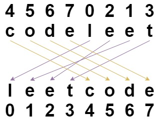

### 1. Description

You are given a string `s` and an integer array `indices` of the **same length**. The string `s` will be shuffled such that the character at the $$i^{\text{th}}$$ position moves to $\text{indices}[i]$ in the shuffled string.

Return *the shuffled string*.

### 2. Function Contract

**Inputs**

- `s`: Input parameter (`str`).
- `indices`: Input parameter (`List[int]`).

**Return value**

- Returns `str`.

### 3. Examples

#### Example 1

- **Input:** `s = "codeleet", indices = [4,5,6,7,0,2,1,3]`
- **Output:** `"leetcode"`
- **Explanation:** As shown, "codeleet" becomes "leetcode" after shuffling.

#### Example 2

- **Input:** `s = "abc", indices = [0,1,2]`
- **Output:** `"abc"`
- **Explanation:** After shuffling, each character remains in its position.

### 4. Constraints

- $\text{s.length} = \text{indices.length} = n$

- $1 \le n \le 100$

- `s` consists of only lowercase English letters.

- $0 \le \text{indices}[i] < n$

- All values of `indices` are **unique**.
