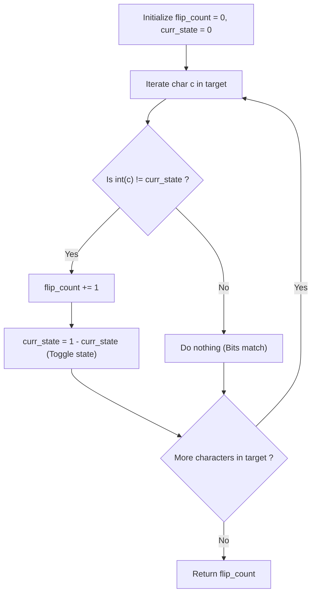

# Guided Example: Minimum Suffix Flips

## 1. Instance & Teaching Goal

We are given a binary target string of length $n = 5$:
$$\text{target} = \text{"10111"}$$

Starting from an initial string $s = \text{"00000"}$, each operation allows picking an index $i \in [0, n-1]$ and inverting all bits in the suffix $s[i \dots n-1]$ ($'0' \to '1'$ and $'1' \to '0'$).
Our teaching goal is to determine the minimum number of suffix flip operations required to transform $s$ into $\text{target}$. We demonstrate the greedy left-to-right causality principle, showing why fixing the leftmost mismatched bit is strictly necessary and uniquely dictates the minimal operation count.

## 2. Conceptual Foundation & Invariants

Let $s$ be initially filled with zeros.
1. **Unidirectional Suffix Impact**:
   A suffix flip at index $i$ alters all indices $j \ge i$, but has **zero effect** on any index $j < i$.
   Therefore, once index $i$ has been passed in a left-to-right scan, no subsequent suffix flip at any $i' > i$ can ever modify the value at index $i$.
2. **Greedy Causality Principle**:
   To establish the correct bit at index $i$, the bit currently residing at $i$ must match $\text{target}[i]$.
   If the bit at index $i$ currently differs from $\text{target}[i]$, we are **forced** to perform a suffix flip at index $i$.
   Performing a flip at any earlier index $< i$ would corrupt previously finalized positions; performing a flip at any later index $> i$ cannot affect position $i$.
   Thus, a suffix flip at index $i$ is both strictly necessary and locally unique.
3. **State Parity Tracking**:
   Rather than physically mutating an array of length $n$ on each operation (which would cost $\mathcal{O}(n^2)$ time), we track the effective state of the active suffix using a single parity bit:
   $$\text{curr\_bit} = \text{flips} \bmod 2$$
   - If $\text{flips}$ is even, the current background bit is `'0'`.
   - If $\text{flips}$ is odd, the current background bit is `'1'`.
   For each position $i \in [0, n-1]$:
   $$\text{if } \text{int}(\text{target}[i]) \ne \text{curr\_bit} \implies \text{flips} \leftarrow \text{flips} + 1$$

```text
+-------------------------------------------------------------------------------+
|                       GREEDY SUFFIX PARITY PROPAGATION                        |
|                                                                               |
|  Initial:        0  0  0  0  0   (Background: '0')                            |
|  Target:         1  0  1  1  1                                                |
|                  |                                                            |
|  Index 0: Diff -> FLIP at 0:    1  1  1  1  1   (Background becomes '1')     |
|                     |                                                         |
|  Index 1: Diff -> FLIP at 1:    1  0  0  0  0   (Background becomes '0')     |
|                        |                                                      |
|  Index 2: Diff -> FLIP at 2:    1  0  1  1  1   (Background becomes '1')     |
|                           |  |                                                |
|  Index 3: Match ('1' == '1') -> No operation                                  |
|  Index 4: Match ('1' == '1') -> No operation                                  |
|                                                                               |
|  Total Minimum Flips: 3                                                       |
+-------------------------------------------------------------------------------+
```

The algorithm maintains the following state variables:

| State Variable | Domain | Initial Value | Transition / Role |
|---|---|---|---|
| `scan_index` | Integer $\in [0, n-1]$ | $0$ | Scanning cursor traversing `target` from left to right. |
| `curr_state` | Integer $\in \{0, 1\}$ | $0$ | Effective bit currently occupying all unvisited suffix positions. |
| `flip_count` | Integer $\ge 0$ | $0$ | Cumulative number of suffix flips executed. |

> [!IMPORTANT]
> **Left-to-Right Independence Invariant**: Because a flip at index $i$ only alters indices $j \ge i$, the value at index $k < i$ is permanently frozen. The decision to flip at index $i$ is completely independent of all characters at indices $> i$.



## 3. Step-by-Step Worked Execution

We walk through the representative instance $\text{target} = \text{"10111"}$ with $n = 5$.

### Initialization
- Initial string: $s = \text{"00000"}$.
- Background state: $\text{curr\_state} = 0$.
- Cumulative flips: $\text{flip\_count} = 0$.

---

### Step 1: Index $i = 0$, Target Character `'1'`
- Target value: $1$.
- Current effective value at index $0$: $\text{curr\_state} = 0$.
- Comparison: $1 \ne 0$ (Mismatch).
- Action: Perform suffix flip at index $0$.
  - Conceptual string mutation: $[0, 4]$ flips $\implies \text{"11111"}$.
  - State toggle: $\text{curr\_state} \leftarrow 1$.
  - Increment count: $\text{flip\_count} \leftarrow 0 + 1 = 1$.

---

### Step 2: Index $i = 1$, Target Character `'0'`
- Target value: $0$.
- Current effective value at index $1$: $\text{curr\_state} = 1$.
- Comparison: $0 \ne 1$ (Mismatch).
- Action: Perform suffix flip at index $1$.
  - Conceptual string mutation: $[1, 4]$ flips $\implies \text{"10000"}$.
  - State toggle: $\text{curr\_state} \leftarrow 0$.
  - Increment count: $\text{flip\_count} \leftarrow 1 + 1 = 2$.

---

### Step 3: Index $i = 2$, Target Character `'1'`
- Target value: $1$.
- Current effective value at index $2$: $\text{curr\_state} = 0$.
- Comparison: $1 \ne 0$ (Mismatch).
- Action: Perform suffix flip at index $2$.
  - Conceptual string mutation: $[2, 4]$ flips $\implies \text{"10111"}$.
  - State toggle: $\text{curr\_state} \leftarrow 1$.
  - Increment count: $\text{flip\_count} \leftarrow 2 + 1 = 3$.

---

### Step 4: Index $i = 3$, Target Character `'1'`
- Target value: $1$.
- Current effective value at index $3$: $\text{curr\_state} = 1$.
- Comparison: $1 == 1$ (Match!).
- Action: No operation needed.
- State remains $\text{curr\_state} = 1$.

---

### Step 5: Index $i = 4$, Target Character `'1'`
- Target value: $1$.
- Current effective value at index $4$: $\text{curr\_state} = 1$.
- Comparison: $1 == 1$ (Match!).
- Action: No operation needed.

All indices finalized. Total flips executed: $3$.

## 4. Complete Execution Trace

We collect the character evaluations and state transitions in the trace table below.

| Step Index $i$ | Target Bit $\text{target}[i]$ | Current Effective Bit | Condition $\text{target}[i] \ne \text{curr\_state}$ | Operation Performed | Conceptual String After Step | Updated `curr_state` | Cumulative Flips |
|---|---|---|---|---|---|---|---|
| Init | — | $0$ | — | None | `"00000"` | $0$ | $0$ |
| $0$ | `'1'` | $0$ | **True** (Mismatch) | Flip suffix $[0, 4]$ | `"11111"` | $1$ | $1$ |
| $1$ | `'0'` | $1$ | **True** (Mismatch) | Flip suffix $[1, 4]$ | `"10000"` | $0$ | $2$ |
| $2$ | `'1'` | $0$ | **True** (Mismatch) | Flip suffix $[2, 4]$ | `"10111"` | $1$ | **$3$** |
| $3$ | `'1'` | $1$ | False (Match) | None | `"10111"` | $1$ | **$3$** |
| $4$ | `'1'` | $1$ | False (Match) | None | `"10111"` | $1$ | **$3$** |

### Run-Length Transition Equivalence

The total number of flips corresponds precisely to the number of alternating runs in the string, starting from the first `'1'`:
$$\text{"10111"} \implies \text{Block 1: "1"} \to \text{Block 2: "0"} \to \text{Block 3: "111"}$$
There are $3$ alternating blocks starting with `'1'`, requiring exactly $3$ flips.

## 5. Algorithmic Correctness

### Soundness

The algorithm maintains the invariant that after processing index $i$, the prefix $s[0 \dots i]$ matches $\text{target}[0 \dots i]$ exactly.
- Base: initially $s[0]$ must match $\text{target}[0]$. If it does not, a flip at $0$ sets $s[0] = \text{target}[0]$.
- Step: by induction, assume $s[0 \dots i-1] = \text{target}[0 \dots i-1]$.
  Because all flips at indices $\ge i$ leave $s[0 \dots i-1]$ unchanged, whatever operation is performed at index $i$ preserves the correctness of the prefix.
  If the bit at index $i$ currently matches $\text{target}[i]$, doing nothing preserves equality.
  If it differs, executing a flip at $i$ inverts the bit to match $\text{target}[i]$.
At termination, $s = \text{target}$, proving soundness.

### Completeness (Minimality)

Let $\mathcal{O}^*$ be any optimal sequence of flip indices.
Because flips at the same index commute ($x \oplus 1 \oplus 1 = x$), each index is flipped at most once.
Let $i_0$ be the smallest index flipped in $\mathcal{O}^*$.
Then for all $k < i_0$, bit $s[k]$ is never flipped and must match the initial zero state: $\text{target}[k] = 0$.
The bit at $i_0$ is flipped by $i_0$ and never flipped again by any smaller index, so $\text{target}[i_0]$ must equal $0 \oplus 1 = 1$.
Thus, $i_0$ must be the first index where $\text{target}[i] = 1$.
By repeating this argument inductively across all subsequent flips, the sequence of flip indices is uniquely determined.
Therefore, no solution can use fewer flips.

## 6. Traps This Instance Exposes

- **Physical String Inversion $\mathcal{O}(n^2)$**: Allocating a character list and slicing/flipping elements in a loop (`for j in range(i, n): s[j] = '1' if s[j] == '0' else '0'`). For $n = 10^5$, this causes Time Limit Exceeded ($10^{10}$ operations). Tracking the scalar parity bit achieves $\mathcal{O}(n)$ time.
- **Initial Zero Fallacy**: Assuming that the answer is always the number of character transitions in `target`. If `target` starts with `'0'` (e.g. `"0011"`), the leading zeros require no operations. Operations only begin when encountering the first `'1'`.
- **Right-to-Left Traversal Failure**: Attempting to fix characters from right to left. Flipping a suffix to correct a right character corrupts previously corrected characters to its right, whereas scanning left to right never affects finalized positions.

## 7. Complexity Derivation

### Time Complexity

- **Single Linear Scan**: The algorithm examines each character of `target` of length $n$ exactly once.
- **Constant Time Per Character**: In each step, an integer conversion, bitwise parity test, and conditional increment take $\mathcal{O}(1)$ operations.
- Total time complexity is strictly:
  $$\mathcal{O}(n)$$
- For $n = 10^5$, this executes in under $5$ milliseconds.

### Auxiliary Space Complexity

- The algorithm maintains only scalar registers (`ans`, `curr_state`).
- Auxiliary space complexity is strictly $\mathcal{O}(1)$.
