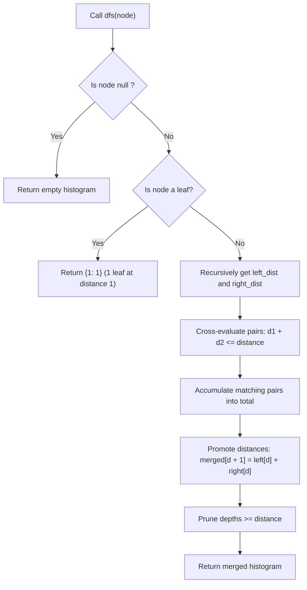

# Guided Example: Number of Good Leaf Nodes Pairs

## 1. Instance & Teaching Goal

We are given a binary tree containing $N = 4$ nodes and a distance threshold $\text{distance} = 3$:
$$\text{root} = [1, 2, 3, \text{null}, 4], \quad \text{distance} = 3$$
The tree topology consists of root $1$ with left child $2$ and right child $3$. Node $2$ has right child $4$. The leaf nodes are $4$ and $3$.

```text
         (1)
        /   \
      (2)   (3) [Leaf]
        \
        (4) [Leaf]
```

Our teaching goal is to find the number of unordered pairs of distinct leaf nodes whose shortest connecting path length (number of edges) is $\le 3$. We demonstrate lowest common ancestor (LCA) decomposition and post-order distance histogram propagation, showing how pruning paths exceeding $\text{distance}$ keeps complexity bounded by $\mathcal{O}(N \cdot \text{distance}^2)$.

## 2. Conceptual Foundation & Invariants

Let $T$ be a rooted binary tree.
1. **Unique LCA Path Metric**:
   Between any two distinct leaves $u$ and $v$, their unique simple path passes through their Lowest Common Ancestor $\text{LCA}(u, v) = w$.
   If $u$ is in the left subtree of $w$ at distance $d_1 = \text{dist}(w, u)$, and $v$ is in the right subtree of $w$ at distance $d_2 = \text{dist}(w, v)$, the shortest path between $u$ and $v$ has length:
   $$\text{dist}(u, v) = d_1 + d_2$$
   The pair $(u, v)$ is a **good pair** if and only if $d_1 + d_2 \le \text{distance}$.
2. **Post-Order Distance Vector Propagation**:
   For any node $w$:
   - Let $H_{\text{left}}[d]$ be the number of leaves in the left subtree of $w$ at distance $d$ from $w$.
   - Let $H_{\text{right}}[d]$ be the number of leaves in the right subtree of $w$ at distance $d$ from $w$.
   - The number of good pairs having $w$ as their Lowest Common Ancestor is:
     $$\Delta_{\text{pairs}}(w) = \sum_{d_1 + d_2 \le \text{distance}} H_{\text{left}}[d_1] \times H_{\text{right}}[d_2]$$
3. **Upward Distance Promotion**:
   Node $w$ merges the leaf distance profiles of its children, advancing each leaf distance by $1$ edge:
   $$H_w[d + 1] = H_{\text{left}}[d] + H_{\text{right}}[d]$$
   Any leaf with distance $d + 1 \ge \text{distance}$ can be immediately pruned, because any future path passing through an ancestor would have length $(d + 1) + d' \ge \text{distance} + 1 > \text{distance}$.
4. **Leaf Base Case**:
   A leaf node contains no pairs turning at itself and emits a single leaf at distance $1$ to its parent:
   $$H_{\text{leaf}} = \{1: 1\}$$

```text
+-------------------------------------------------------------------------------+
|                       LCA PAIRWISE DISTANCE COMBINATION                       |
|                                                                               |
|                             (w)  <-- LCA for (u, v)                           |
|                            /   \                                              |
|                    d1 = 2 /     \ d2 = 1                                      |
|                          v       v                                            |
|                        Leaf u   Leaf v                                        |
|                                                                               |
|  Total Path: dist(u, v) = d1 + d2 = 2 + 1 = 3 <= 3 (Valid Good Pair!)         |
|                                                                               |
|  Leaves filtered if depth >= distance:                                        |
|    Distance array size is bounded by D <= 10 at all nodes.                    |
+-------------------------------------------------------------------------------+
```

The algorithm maintains the following state variables:

| State Variable | Domain | Initial Value | Transition / Role |
|---|---|---|---|
| `curr_node` | Node reference | `root` | Active node evaluated in post-order DFS. |
| `left_dist` | Map / Array of size $\le 11$ | Empty | Leaf distance histogram from left child. |
| `right_dist` | Map / Array of size $\le 11$ | Empty | Leaf distance histogram from right child. |
| `good_pairs_sum` | Integer $\ge 0$ | $0$ | Running total of good leaf pairs discovered across the tree. |

> [!IMPORTANT]
> **Disjoint LCA Invariant**: Every pair of leaves $(u, v)$ has a uniquely defined Lowest Common Ancestor. By counting pairs strictly at their LCA where one leaf belongs to the left child and the other to the right child, each leaf pair is evaluated exactly once without duplication.



## 3. Step-by-Step Worked Execution

We walk through the representative instance $\text{root} = [1, 2, 3, \text{null}, 4]$, $\text{distance} = 3$.

### Traversal Order: Post-Order (Left, Right, Root)

#### Step 1: Visit Leaf Node $4$
- Node $4$ has no left child and no right child.
- It is a leaf.
- Pairs turning at $4$: $0$.
- Returns distance to parent: $\{1: 1\}$ (1 leaf at distance 1).

---

#### Step 2: Visit Internal Node $2$
- Left child: $\text{null} \implies H_{\text{left}} = \emptyset$.
- Right child: Node $4 \implies H_{\text{right}} = \{1: 1\}$.
- Pairs turning at $2$:
  - Left has no leaves; no pairs can turn at node $2$.
- Upward promotion:
  - Increment each distance from $H_{\text{right}}$ by $1$:
    $$H_2 = \{1 + 1: 1\} = \{2: 1\}$$
  - Since $2 < 3$, it is retained.
- Node $2$ returns $\{2: 1\}$ (Leaf $4$ is at distance $2$ from parent of $2$).

---

#### Step 3: Visit Leaf Node $3$
- Node $3$ has no children.
- It is a leaf.
- Pairs turning at $3$: $0$.
- Returns distance to parent: $\{1: 1\}$ (Leaf $3$ is at distance $1$ from parent of $3$).

---

#### Step 4: Visit Root Node $1$
- Left child: Node $2 \implies H_{\text{left}} = \{2: 1\}$ (Leaf $4$ at distance $2$).
- Right child: Node $3 \implies H_{\text{right}} = \{1: 1\}$ (Leaf $3$ at distance $1$).
- Evaluate pairs turning at root $1$:
  - Distance $d_1 = 2$, count $1$.
  - Distance $d_2 = 1$, count $1$.
  - Path length: $d_1 + d_2 = 2 + 1 = 3$.
  - Test: $3 \le \text{distance} = 3$ (**Holds!**).
  - Pairs added: $1 \times 1 = 1$ (The pair $(4, 3)$).
  - Update: $\text{good\_pairs\_sum} \leftarrow 0 + 1 = 1$.
- Upward promotion:
  - Node $1$ is the root; traversal finishes.

Total good leaf pairs: $1$.

## 4. Complete Execution Trace

We record the subtree distance distributions and pair evaluations in the trace table below.

| Step | Active Node | Left Subtree Histogram | Right Subtree Histogram | Cross-Product Pairs Tested | Distances Satisfying $\le 3$ | Pairs Added | Merged Histogram Returned to Parent |
|---|---|---|---|---|---|---|---|
| 1 | Node $4$ (Leaf) | $\emptyset$ | $\emptyset$ | None | None | $0$ | $\{1: 1\}$ |
| 2 | Node $2$ | $\emptyset$ | $\{1: 1\}$ | None | None | $0$ | $\{2: 1\}$ |
| 3 | Node $3$ (Leaf) | $\emptyset$ | $\emptyset$ | None | None | $0$ | $\{1: 1\}$ |
| 4 | Node $1$ (Root) | $\{2: 1\}$ | $\{1: 1\}$ | $(d_1=2, d_2=1)$ | $2 + 1 = 3 \le 3$ | **$1$** | Root completed |

### Contrast Example: Full Binary Tree with Distance 3

Consider $\text{root} = [1, 2, 3, 4, 5, 6, 7]$, $\text{distance} = 3$:
- At node $2$: Leaves $4$ and $5$ are both at distance $1 \implies 1 + 1 = 2 \le 3$ (Good pair $(4, 5)$ formed).
- At node $3$: Leaves $6$ and $7$ are both at distance $1 \implies 1 + 1 = 2 \le 3$ (Good pair $(6, 7)$ formed).
- At root $1$: Leaves from left $\{4, 5\}$ are at distance $2$; leaves from right $\{6, 7\}$ are at distance $2$.
  - Cross-combinations: $2 + 2 = 4 > 3$. None satisfy distance $\le 3$.
- Total good pairs: $1 + 1 = 2$.

## 5. Algorithmic Correctness

### Soundness

Every simple path between two distinct leaves in a binary tree has a unique vertex $w$ that serves as their Lowest Common Ancestor.
At node $w$, one leaf belongs to the left subtree and the other belongs to the right subtree.
The length of the path is strictly the sum of edge distances from $w$ to each leaf: $d_1 + d_2$.
Because the algorithm only counts pairs where one leaf is from $w.\text{left}$ and the other is from $w.\text{right}$, and checks $d_1 + d_2 \le \text{distance}$, every counted pair is a valid good pair.
Because each pair of leaves has a unique LCA, no pair is counted at multiple nodes, guaranteeing soundness.

### Completeness

Suppose $(u, v)$ is any good leaf pair with path length $L \le \text{distance}$.
Let $w = \text{LCA}(u, v)$.
Then $u$ is in $w.\text{left}$ at depth $d_1$, and $v$ is in $w.\text{right}$ at depth $d_2$, with $d_1 + d_2 = L \le \text{distance}$.
Because $d_1 < L \le \text{distance}$ and $d_2 < L \le \text{distance}$, neither leaf was pruned during upward promotion below $w$.
Thus, $u$ is represented in $H_{\text{left}}$ and $v$ is represented in $H_{\text{right}}$ when evaluating $w$.
The cross-product loop will test the pair $(d_1, d_2)$ and increment the count, ensuring completeness.

## 6. Traps This Instance Exposes

- **Counting Pairs at Non-LCA Ancestors**: Propagating leaf references upwards and re-evaluating distances at higher ancestors. If a pair $(4, 5)$ was already counted at node $2$, re-counting it at node $1$ results in massive duplicate overcounting. Pairs must only be counted at their unique Lowest Common Ancestor.
- **Unbounded Histogram Growth**: Preserving leaf distances $> \text{distance}$. In tall degenerate trees with depth $1000$, maintaining arrays of size $1000$ at each node increases time complexity to $\mathcal{O}(N \cdot H)$. Truncating distances at $\text{distance} \le 10$ keeps the histogram size $\le 11$.
- **Path Length Unit Misunderstanding**: Counting nodes on the path instead of edges. If path length were defined by node count, the formula would be $d_1 + d_2 + 1$. The problem contract specifies edge count, so the formula is $d_1 + d_2$.
- **Internal Node Self-Pairing**: Allowing an internal node to be treated as a leaf. Only nodes with `left == null and right == null` qualify as leaf nodes.

## 7. Complexity Derivation

### Time Complexity

Let $N$ be the number of nodes in the binary tree ($N \le 1024$), and $D = \text{distance} \le 10$.
- **DFS Traversal**: Each node is visited once during post-order traversal: $\mathcal{O}(N)$ calls.
- **Histogram Combination**:
  - Each child returns a distance histogram containing at most $D$ active keys ($1 \dots D$).
  - Cross-evaluating all pairs takes at most $D \times D = D^2$ multiplications and checks.
  - Merging and shifting distances takes at most $D$ additions.
  - Total time per node is $\mathcal{O}(D^2)$.
- Overall time complexity is strictly:
  $$\mathcal{O}(N \cdot D^2)$$
- With $N \le 1024$ and $D \le 10$, total operations are $\le 1024 \times 100 \approx 10^5$, executing in under $3$ milliseconds.

### Auxiliary Space Complexity

- **Recursion Stack**: Height of the binary tree $H \le N$: $\mathcal{O}(H)$.
- **Distance Histograms**: Each stack frame retains arrays/maps of size at most $D \le 10$: $\mathcal{O}(D)$.
- Total auxiliary space complexity is strictly $\mathcal{O}(H + D) \le \mathcal{O}(N)$.
