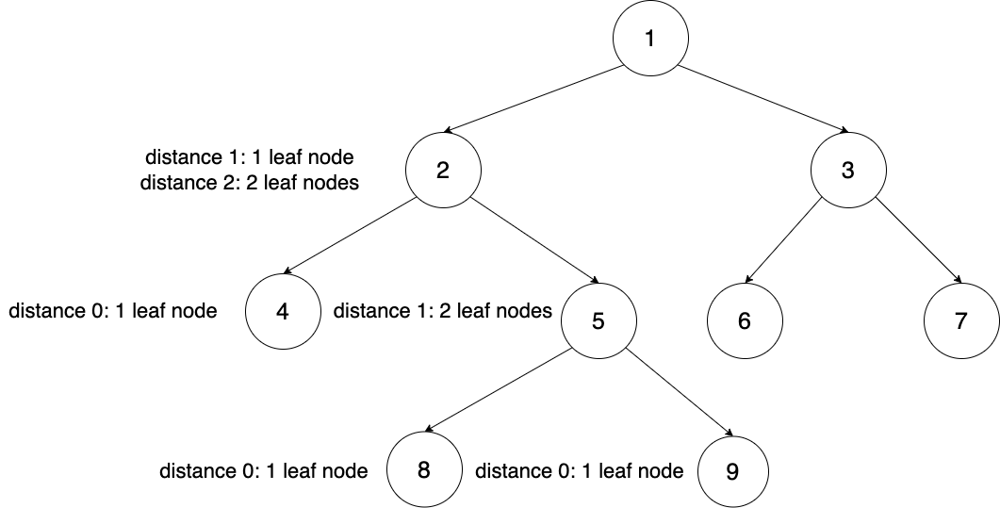
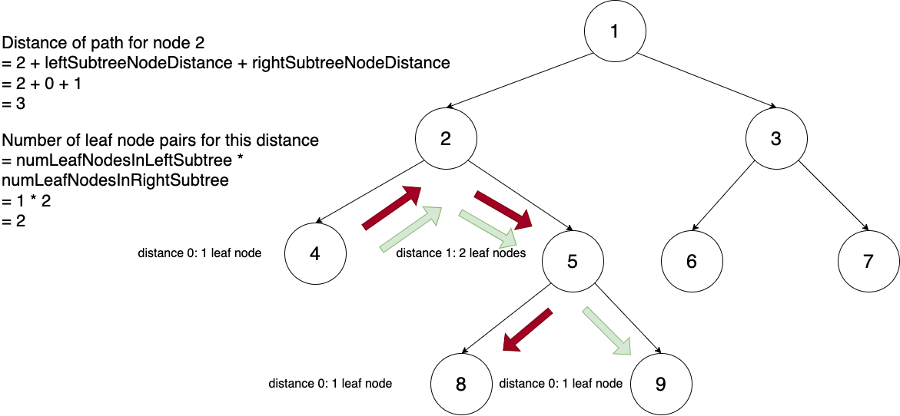

## Solution

---

### Overview

Given the root of a binary tree, we need to find the number of distinct pairs of leaf nodes whose shortest path distance is less than the given `distance`. The shortest path length between nodes is defined as the minimum number of edges traversed.

---

### Approach 1: Graph Conversion + BFS

### Intuition

Because we're interested only in the leaf nodes of the tree, we can start by using any tree traversal algorithm (pre-order, in-order, or post-order) to identify all the leaf nodes.

However, once we have a leaf node, traversing back up the tree to explore paths to other leaf nodes is challenging because we lack direct access to its parent/ancestor nodes. In a binary tree, each node references only its children. To overcome this, we can convert the binary tree into an undirected graph. This allows nodes to reference both their parents and children, simplifying traversal.

After converting the tree to a graph, we can apply graph traversal algorithms to find the shortest paths between leaf nodes. Breadth-first search (BFS) is particularly suitable for this task as it finds the shortest paths in graphs with unweighted edges. In our newly converted graph, all edges are considered unweighted since they all have equal cost. We can run BFS from each leaf node, and for each leaf node that BFS encounters within the given `distance`, we count it as a good leaf node pair.

### Algorithm

1. Initialize an adjacency list to convert the tree into a graph.
2. Initialize a set to store the leaf nodes of the tree.
3. Use a helper method `traverseTree` to traverse the tree to build the graph and find the leaf nodes. Maintain the current node as well as the parent node in the parameters.
* If the current node is a leaf node, add it to the set initialize in step 2.
* In the adjacency list, add the current node to the parent node's list of neighbors. Also, add the parent node to the current node's list of neighbors.
* Recursively call `traverseTree` for the current node's left child and right child.
4. Initialize an `ans` variable to count the number of good leaf node pairs.
5. Iterate through each leaf node in the set:
* Run BFS for the current leaf node. BFS can be terminated early once all nodes that are a `distance` away from the current leaf node are discovered. Increment `ans` for every leaf node encountered in each BFS run.
6. Return $ans / 2$. We count each pair twice so we need to divide by 2 to get the actual count.

### Implementation

```python
class Solution:
    def _traverse_tree(self, curr_node, prev_node, graph, leaf_nodes):
        if curr_node is None:
            return
        if curr_node.left is None and curr_node.right is None:
            leaf_nodes.add(curr_node)
        if prev_node is not None:
            if prev_node not in graph:
                graph[prev_node] = []
            graph[prev_node].append(curr_node)

            if curr_node not in graph:
                graph[curr_node] = []
            graph[curr_node].append(prev_node)

        self._traverse_tree(curr_node.left, curr_node, graph, leaf_nodes)
        self._traverse_tree(curr_node.right, curr_node, graph, leaf_nodes)

    def countPairs(self, root, distance):
        graph = {}
        leaf_nodes = set()

        self._traverse_tree(root, None, graph, leaf_nodes)

        ans = 0

        for leaf in leaf_nodes:
            bfs_queue = []
            seen = set()
            bfs_queue.append(leaf)
            seen.add(leaf)
            for i in range(distance + 1):
                # Clear all nodes in the queue (distance i away from leaf node)
                # Add the nodes' neighbors (distance i+1 away from leaf node)
                size = len(bfs_queue)
                for j in range(size):
                    curr_node = bfs_queue.pop(0)
                    if curr_node in leaf_nodes and curr_node != leaf:
                        ans += 1
                    if curr_node in graph:
                        for neighbor in graph.get(curr_node):
                            if neighbor not in seen:
                                bfs_queue.append(neighbor)
                                seen.add(neighbor)
        return ans // 2
```

### Complexity Analysis

Let $N$ be the size of the binary tree given by `root`.

* Time Complexity: $O(N^2)$

    Traversing the tree to build the graph and find the list of leaf nodes takes $O(N)$ time. This is because there are `N` total nodes to process and each node takes constant time to be processed (adding to the graph and set are constant time operations).

    BFS runs for each leaf node in the binary tree. The number of leaf nodes is linearly proportional to the total size of the tree. In the worst case, each BFS traversal covers the entire graph, which takes $O(N)$ time. Therefore, the overall time complexity is $O(N^2)$.

* Space Complexity: $O(N)$

    The adjacency list, set of leaf nodes, BFS queue, and BFS seen set all require $O(N)$ space individually. Therefore, the overall space complexity remains $O(N)$

### Approach 2: Post-Order Traversal

### Intuition

In a binary tree, the shortest path between any two nodes will always go through their lowest common ancestor (LCA). The LCA of two nodes `x` and `y` is the deepest node that is an ancestor to both `x` and `y`. Utilizing this insight, we can efficiently count the shortest paths between leaf nodes that traverse each node `n` in the tree. For every node `n`, we consider paths between all pairs of descendant leaf nodes under `n` and check if they are within the specified `distance`. Since `n` serves as the LCA for these leaf nodes, these paths are inherently the shortest.

To achieve this efficiently, we use a post-order traversal of the tree. In this traversal, calculations for each node `root` are performed after recursively processing its left and right subtrees. For our problem, this involves counting all shortest paths between leaf nodes passing through `root`. By leveraging results from recursive calls on the left and right subtrees, we can efficiently find the total count of such paths across the entire tree.

Suppose each recursive call returns the count of leaf nodes that are a distance `d` away for all possible values of `d`.



In this illustration, the recursive call to the left subtree rooted at `node 4` returns 1 leaf node at distance 0 from `node 4`. Similarly, the recursive call to the right subtree rooted at `node 5` returns 2 leaf nodes at distance 1 from `node 5`. This allows us to compute the number of optimal shortest paths through `node 2` by iterating over distance pairs. For instance, the distance of the shortest leaf node path that goes through `node 2` is computed as $2 + leftSubtreeLeafNodeDistance + rightSubtreeLeafNodeDistance = 2 + 0 + 1 = 3$. In this scenario, because there is 1 leaf node in the left subtree and 2 leaf nodes in the right subtree, the total number of pairs for this distance is $numberOfLeafNodesInLeftSubtree * numberOfLeafNodesInRightSubtree = 1 * 2 = 2$. We only count the pairs whose shortest path distance is less than or equal to `distance` for our final answer.



Finally, once these computations are completed, the next step is to return the counts of leaf nodes for all distances `d` from the current node. This is achieved by shifting all the counts returned from the left and right subtree by 1. For instance, 1 leaf node that is a distance 0 from `node 4` will translate to 1 leaf node that is a distance 1 from `node 2`.

### Algorithm

1. Define `postOrder(TreeNode currentNode, int distance)` helper function. This function will return an array that contains the count of leaf nodes for all possible distances from `currentNode` ($\text{currentNode}[0]$ to $\text{currentNode}[10]$), as well as the total number of good leaf nodes pairs rooted at `currentNode` ($\text{currentNode}[11]$).
* If `currentNode` is `null`, then return an empty array with all 0s.
* If `currentNode` is a leaf node, then return an array where the count for leaf nodes with distance 0 is set to 1.
* Recursively call `postOrder` on the left subtree and store the result in the `left` array.
* Recursively call `postOrder` on the right subtree and store the result in the `right` array.
* Initialize a `current` array.
* Shift the counts in `left` and `right` by 1 in `current`. Specifically, for each distance `d`:
* $current[d+1] = \text{left}[d] + \text{right}[d]$.
* Initialize $\text{current}[11]$ to $\text{left}[11] + \text{right}[11]$. This is the total number of good leaf nodes pairs under the left and right subtrees.
* For all distance pairs `(d1, d2)`:
* If $2 + d1 + d2 \le distance$, then $\text{current}[11] += \text{left}[d1] * \text{right}[d2]$.
* Return `current`.
2. Return `postOrder(root, distance)[11]`, the total number of good leaf nodes pairs rooted at `root`.

### Implementation

```python
class Solution:
    def _post_order(self, current_node, distance):
        if current_node is None:
            return [0] * 12
        elif current_node.left is None and current_node.right is None:
            current = [0] * 12
            # Leaf node's distance from itself is 0
            current[0] = 1
            return current

        # Leaf node count for a given distance i
        left = self._post_order(current_node.left, distance)
        right = self._post_order(current_node.right, distance)

        current = [0] * 12

        # Combine the counts from the left and right subtree and shift by
        # +1 distance
        for i in range(10):
            current[i + 1] += left[i] + right[i]

        # Initialize to total number of good leaf nodes pairs from left and right subtrees.
        current[11] = left[11] + right[11]

        # Iterate through possible leaf node distance pairs
        for d1 in range(distance + 1):
            for d2 in range(distance + 1):
                if 2 + d1 + d2 <= distance:
                    # If the total path distance is less than the given distance limit,
                    # then add to he total number of good pairs
                    current[11] += left[d1] * right[d2]

        return current

    def countPairs(self, root: TreeNode, distance: int) -> int:
        return self._post_order(root, distance)[11]
```

### Complexity Analysis

Let $N$ be the size of the binary tree rooted at `root`, $D$ be the maximum distance given by `distance`, and $H$ be the height of the binary tree.

* Time Complexity: $O(N \cdot D^2)$

    The post-order traversal visits each node, which will take $O(N)$ linear time. At each node, constructing the `current` array involves iterating through the `left` and `right` arrays, and checking distance pairs to find paths within `distance`. Given the constant size (12), constructing `current` is $O(1)$.

    Checking distance pairs takes $O(D^2)$ time. Therefore, the total time complexity is $O(N \cdot D^2)$.

* Space Complexity: $O(H)$

    The recursion call stack, `current` array, `left` array, and `right` array all contribute to the space complexity. The maximum depth of the call stack will be proportional to the height of the tree. The arrays (`current`, `left`, `right`) have constant space (12 elements), $O(1)$. Thus, the overall space complexity is $O(H)$.

### Approach 3: Post-Order Traversal With Prefix Sum Counting

### Intuition

In the previous approach, evaluating all possible leaf node distance pairs involves an expensive $O(N^2)$ operation. This is because for each leaf node, we need to compare its distance with every other leaf node, leading to a quadratic time complexity.

However, we can optimize this process by recognizing that only specific pairs $(d1, d2)$ need to be considered. Specifically, we are interested in pairs where $2 + d1 + d2 \leq \text{distance}$. This condition ensures that the combined distance does not exceed the given threshold.

To count these pairs more efficiently, we iterate over possible values of `d2`. For each `d2`, we count all valid `d1` values that satisfy $0 \leq d1 \leq \text{distance} - d2 - 2$. This constraint helps us focus only on pairs that meet the distance requirement.

The total number of good pairs for a specific `d2` can be calculated as $(\text{left}[0] \times \text{right}[d2]) + (\text{left}[1] \times \text{right}[d2]) + \ldots + (\text{left}[\text{distance} - d2 - 2] \times \text{right}[d2])$. This expression sums the products of corresponding counts of distances from the left and right subtrees.

To simplify, we can rewrite this sum as $\text{right}[d2] \times (\text{left}[0] + \text{left}[1] + \ldots + \text{left}[\text{distance} - d2 - 2])$. The term inside the parentheses is a prefix sum of the left subtree distances, which we can compute efficiently.

### Algorithm

1. Define the `postOrder(TreeNode currentNode, int distance)` helper function. This function will return an array that contains the count of leaf nodes for all possible distances from `currentNode` ($\text{currentNode}[0]$ to $\text{currentNode}[10]$), as well as the total number of good leaf node pairs rooted at `currentNode` ($\text{currentNode}[11]$).
* If `currentNode` is `null`, then return an empty array with all 0s.
* If `currentNode` is a leaf node, then return an array where the count for leaf nodes with distance 0 is set to 1.
* Recursively call `postOrder` on the left subtree and store the result in the `left` array.
* Recursively call `postOrder` on the right subtree and store the result in the `right` array.
* Initialize a `current` array.
* Shift the counts in `left` and `right` by 1 in `current`. Specifically, for each distance `d`:
* $current[d+1] = \text{left}[d] + \text{right}[d]$.
* Initialize $\text{current}[11]$ to $\text{left}[11] + \text{right}[11]$. This is the total number of good leaf node pairs under the left and right subtrees.
* Initialize `prefixSum` and `i` to 0
* For all `d2` from $distance - 2$ to `1`:
* `prefixSum += left[i++]`
* $\text{current}[11] += prefixSum * \text{right}[d2]$
* Return `current`.
2. Return `postOrder(root, distance)[11]`, the total number of good leaf nodes pairs rooted at `root`.

### Implementation

```python
class Solution:
    def _post_order(self, current_node, distance):
        if current_node is None:
            return [0] * 12
        elif current_node.left is None and current_node.right is None:
            current = [0] * 12
            # Leaf node's distance from itself is 0
            current[0] = 1
            return current

        # Leaf node count for a given distance i
        left = self._post_order(current_node.left, distance)
        right = self._post_order(current_node.right, distance)

        current = [0] * 12

        # Combine the counts from the left and right subtree and shift by
        # +1 distance
        for i in range(10):
            current[i + 1] += left[i] + right[i]

        # Initialize to total number of good leaf nodes pairs from left and right subtrees.
        current[11] = left[11] + right[11]

        # Count all good leaf node distance pairs
        prefix_sum = 0
        i = 0
        for d2 in range(distance - 2, -1, -1):
            prefix_sum += left[i]
            current[11] += prefix_sum * right[d2]
            i += 1

        return current

    def countPairs(self, root: TreeNode, distance: int) -> int:
        return self._post_order(root, distance)[11]
```

### Complexity Analysis

Let $N$ be the size of the binary tree rooted at `root`, $D$ be the maximum distance given by `distance`, and $H$ be the height of the binary tree.

* Time Complexity: $O(N \cdot D)$

    Similar to the previous approach, the post-order traversal which will take $O(N)$ time, where constructing `current` for a given node is $O(1)$.

    Counting all the good leaf node distance pairs will take $O(D)$ time. Therefore, the total time complexity is $O(N \cdot D)$.

* Space Complexity: $O(H)$

    Just like before, the maximum depth of the call stack will be proportional to the height of the tree. The arrays (`current`, `left`, `right`) have constant space (12 elements), $O(1)$. Thus, the overall space complexity is $O(H)$.