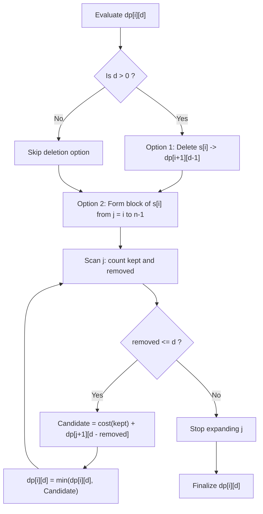

# Guided Example: String Compression II

## 1. Instance & Teaching Goal

We are given a string of length $n = 6$ and a deletion budget $k = 2$:
$$s = \text{"aabbaa"}, \quad k = 2$$

Under run-length encoding (RLE), consecutive identical characters are compressed into the character followed by the frequency count (only if count $\ge 2$). For instance, `"aaaa"` compresses to `"a4"` (length $2$), whereas `"a"` remains `"a"` (length $1$). We are permitted to delete at most $k$ characters.
Our teaching goal is to find the minimum achievable RLE length. We examine the non-local character bridging phenomenon, proving why greedy deletion fails and formalizing the 2D dynamic programming recurrence over suffixes and remaining deletion budgets.

## 2. Conceptual Foundation & Invariants

Let $s$ be an input string of length $n$, and $k$ the deletion allowance.
1. **Encoded Segment Cost Function**:
   A contiguous run of $c$ identical characters compresses to a string of length:
   $$\text{cost}(c) = \begin{cases} 0 & \text{if } c = 0 \text{ (completely eliminated)} \\ 1 & \text{if } c = 1 \\ 2 & \text{if } 2 \le c \le 9 \\ 3 & \text{if } 10 \le c \le 99 \\ 4 & \text{if } c \ge 100 \end{cases}$$
2. **Non-Local Bridging Phenomenon**:
   In `"aabbaa"`, deleting the intermediate `"bb"` (consuming $2$ deletions) allows the two separate blocks of `'a'` (at indices $[0, 1]$ and $[4, 5]$) to merge into a single run of length $4$.
   Without bridging, `"aa"` + `"bb"` + `"aa"` compresses to `"a2b2a2"` (length $6$).
   With bridging, `"aaaa"` compresses to `"a4"` (length $2$).
3. **Dynamic Programming State Space**:
   Let $\text{dp}[i][d]$ denote the minimum encoded length of suffix $s[i \dots n-1]$ using at most $d$ deletions ($0 \le i \le n, 0 \le d \le k$).
4. **Recurrence Transitions**:
   - **Branch 1 (Delete $s[i]$)**:
     If $d > 0$, we delete $s[i]$ and consume $1$ deletion:
     $$\text{dp}[i][d] \le \text{dp}[i + 1][d - 1]$$
   - **Branch 2 (Anchor a Run of $s[i]$)**:
     We decide to retain $s[i]$ and form a contiguous compressed block of character $s[i]$ starting at $i$ and spanning to some $j \ge i$.
     As $j$ extends from $i$ to $n - 1$:
     - If $s[j] = s[i]$: increment $\text{kept} \leftarrow \text{kept} + 1$.
     - If $s[j] \ne s[i]$: increment $\text{removed} \leftarrow \text{removed} + 1$ (we delete this intermediate character to bridge the $s[i]$ occurrences).
     - If $\text{removed} > d$, we can expand no further and break.
     - Otherwise:
       $$\text{dp}[i][d] \le \text{cost}(\text{kept}) + \text{dp}[j + 1][d - \text{removed}]$$

```text
+-------------------------------------------------------------------------------+
|                       INTERMEDIATE CHARACTER BRIDGING                         |
|                                                                               |
|  Source String:   a  a  [b  b]  a  a                                          |
|  Indices:         0  1   2  3   4  5                                          |
|                                                                               |
|  Anchor character s[0] = 'a':                                                 |
|    - At j = 0: 'a' -> kept = 1, removed = 0                                   |
|    - At j = 1: 'a' -> kept = 2, removed = 0                                   |
|    - At j = 2: 'b' -> kept = 2, removed = 1 (Delete s[2])                     |
|    - At j = 3: 'b' -> kept = 2, removed = 2 (Delete s[3])                     |
|    - At j = 4: 'a' -> kept = 3, removed = 2                                   |
|    - At j = 5: 'a' -> kept = 4, removed = 2                                   |
|                                                                               |
|  Combined Block: 4 'a's -> "a4" (cost 2) + dp[6][0] (cost 0) = 2              |
+-------------------------------------------------------------------------------+
```

The algorithm maintains the following state variables:

| State Variable | Domain | Initial Value | Transition / Role |
|---|---|---|---|
| `start_idx` ($i$) | Integer $\in [0, n]$ | $n$ (bottom-up) | Suffix boundary $s[i \dots n-1]$ under evaluation. |
| `deletions` ($d$) | Integer $\in [0, k]$ | $0 \dots k$ | Available deletion budget for the active suffix. |
| `dp[i][d]` | Integer $\ge 0$ | $\infty$ (except $\text{dp}[n][d]=0$) | Minimum compressed length of $s[i \dots n-1]$ with $d$ deletions. |
| `kept` | Integer $\ge 1$ | $1$ | Number of characters matching $s[i]$ preserved in the candidate block. |
| `removed` | Integer $\ge 0$ | $0$ | Number of non-matching intervening characters purged to merge the block. |

> [!IMPORTANT]
> **Intervening Purge Invariant**: Merging identical characters across non-adjacent positions requires deleting all intervening distinct characters. The total deletions spent across the span $[i, j]$ is exactly the count of non-matching characters in that window.



## 3. Step-by-Step Worked Execution

We walk through the representative instance $s = \text{"aabbaa"}$ ($n = 6$) with $k = 2$.
We compute the table bottom-up from suffix index $i = 6$ down to $0$.

### Base Conditions ($i = 6$)
For the empty suffix $s[6 \dots 5]$:
$$\text{dp}[6][d] = 0 \quad \text{for all } d \in \{0, 1, 2\}$$

---

### Suffix $i = 4, 5$: Suffix `"aa"`
- At $i = 5$ (`"a"`):
  - $\text{dp}[5][0] = \text{cost}(1) + \text{dp}[6][0] = 1 + 0 = 1$ (`"a"`).
  - $\text{dp}[5][1] = \min(\text{dp}[6][0], 1) = \min(0, 1) = 0$ (Delete `'a'`).
  - $\text{dp}[5][2] = 0$.
- At $i = 4$ (`"aa"`):
  - With $d = 0$: block of $2$ `'a'`s $\implies \text{cost}(2) + \text{dp}[6][0] = 2 + 0 = 2$ (`"a2"`).
  - With $d = 1$: delete one `'a'` $\implies \text{dp}[5][0] = 1$ (`"a"`).
  - With $d = 2$: delete both `'a'`s $\implies \text{dp}[5][1] = 0$ (`""`).

---

### Suffix $i = 2, 3$: Suffix `"bbaa"`
- At $i = 2$ ($s[2 \dots 5] = \text{"bbaa"}$):
  - If $d = 2$:
    - Option 1 (Delete $s[2]$): $\text{dp}[3][1] = \text{dp}[4][0] = 2$ (Deletes both `'b'`s $\implies \text{"aa"} \to \text{"a2"}$, length $2$).
    - Option 2 (Keep `'b'` and bridge):
      - Form block of `'b'`: $j=2$ (`kept`=1, `rem`=0); $j=3$ (`kept`=2, `rem`=0) $\implies \text{cost}(2) + \text{dp}[4][2] = 2 + 0 = 2$.
    - Best for $\text{dp}[2][2] = 2$.

---

### Suffix $i = 0$: Full String `"aabbaa"` with $d = 2$
We evaluate the global entry $\text{dp}[0][2]$:
1. **Branch 1: Delete $s[0]$**:
   $$\text{dp}[1][1] = \dots \ge 3$$
2. **Branch 2: Anchor block of character `'a'` ($s[0]$)**:
   - $j = 0$ ($s[0] = \text{'a'}$): $\text{kept} = 1, \text{removed} = 0$. Cost: $\text{cost}(1) + \text{dp}[1][2] = 1 + 2 = 3$.
   - $j = 1$ ($s[1] = \text{'a'}$): $\text{kept} = 2, \text{removed} = 0$. Cost: $\text{cost}(2) + \text{dp}[2][2] = 2 + 2 = 4$.
   - $j = 2$ ($s[2] = \text{'b'}$): $\text{kept} = 2, \text{removed} = 1 \le 2$. Cost: $\text{cost}(2) + \text{dp}[3][1] = 2 + 2 = 4$.
   - $j = 3$ ($s[3] = \text{'b'}$): $\text{kept} = 2, \text{removed} = 2 \le 2$. Cost: $\text{cost}(2) + \text{dp}[4][0] = 2 + 2 = 4$.
   - $j = 4$ ($s[4] = \text{'a'}$): $\text{kept} = 3, \text{removed} = 2 \le 2$. Cost: $\text{cost}(3) + \text{dp}[5][0] = 2 + 1 = 3$.
   - $j = 5$ ($s[5] = \text{'a'}$): $\text{kept} = 4, \text{removed} = 2 \le 2$.
     - $\text{cost}(4) = 2$ (Encoded as `"a4"`).
     - Remaining suffix: $j + 1 = 6$ (empty string).
     - Remaining budget: $d - \text{removed} = 2 - 2 = 0$.
     - Total length:
       $$\text{cost}(4) + \text{dp}[6][0] = 2 + 0 = 2$$

The optimal strategy achieves length $2$ by bridging all four `'a'`s across the two deleted `'b'`s.
Final answer: $2$.

## 4. Complete Execution Trace

We collect the key DP subproblem states across suffixes and deletion capacities in the table below.

| Suffix Index $i$ | Suffix Substring $s[i \dots 5]$ | Budget $d = 0$ | Budget $d = 1$ | Budget $d = 2$ | Optimal Reconstruction for $d = 2$ |
|---|---|---|---|---|---|
| $6$ | `""` | $0$ | $0$ | $0$ | Empty string |
| $5$ | `"a"` | $1$ (`"a"`) | $0$ (`""`) | $0$ (`""`) | Delete `'a'` |
| $4$ | `"aa"` | $2$ (`"a2"`) | $1$ (`"a"`) | $0$ (`""`) | Delete both `'a'`s |
| $3$ | `"baa"` | $3$ (`"ba2"`) | $2$ (`"a2"`) | $1$ (`"a"`) | Delete `'b'` and one `'a'` |
| $2$ | `"bbaa"` | $4$ (`"b2a2"`) | $3$ (`"ba2"`) | $2$ (`"a2"`) | Delete both `'b'`s |
| $1$ | `"abbaa"` | $5$ (`"ab2a2"`) | $4$ (`"a2a2"` or `"b2a"`) | $2$ (`"a3"`) | Delete both `'b'`s |
| $0$ | `"aabbaa"` | $6$ (`"a2b2a2"`) | $4$ (`"a3b"` or `"ab2a"`) | **$2$** (`"a4"`) | **Delete both `'b'`s to bridge `'a'`s** |

### Encoded String Comparison

- Zero deletions ($k = 0$): `"aabbaa"` $\to$ `"a2b2a2"` (Length $6$)
- One deletion ($k = 1$): delete one `'b'` $\to$ `"aabaa"` $\to$ `"a2ba2"` (Length $5$)
- Two deletions ($k = 2$): delete both `'b'`s $\to$ `"aaaa"` $\to$ `"a4"` (Length **$2$**)
A non-linear drop from length $5$ down to $2$ demonstrates the power of character bridging.

## 5. Algorithmic Correctness

### Soundness

Every candidate transition evaluates either:
1. Deleting character $s[i]$, using $1$ deletion and leaving the remaining suffix with $d - 1$ deletions.
2. Keeping a set of characters matching $s[i]$ in range $[i, j]$, which requires deleting all $\text{removed}$ non-matching characters in that range, and compressing the $\text{kept}$ occurrences into a valid RLE block of length $\text{cost}(\text{kept})$.
Because every deletion spent corresponds to a physically removed character in $s$, and the total deletions never exceed $k$, the resulting string is an authentic sub-sequence of $s$.
The encoded length function $\text{cost}(c)$ strictly matches the RLE contract.
Thus, every evaluated path produces a sound, valid compression.

### Completeness

Any optimal RLE compressed string $S^*$ is formed by a sequence of monochromatic character runs $c_1^{k_1} c_2^{k_2} \dots c_m^{k_m}$.
In the DP, the first character of $S^*$ corresponds to some character $s[i]$ (all preceding characters being deleted via Branch 1).
All characters matching $s[i]$ included in this first block are captured by Branch 2, while all intervening characters are charged to $\text{removed}$.
Because Branch 2 considers all possible right endpoints $j$ and Branch 1 considers deleting $s[i]$, the optimal block segmentation is exhaustively covered, ensuring completeness.

## 6. Traps This Instance Exposes

- **Greedy Isolated Deletion Trap**: Greedily deleting single characters with frequency 1. In `"aabbaa"`, both `'a'` and `'b'` appear twice; greedy character frequency selection cannot determine which to delete without exploring global connectivity.
- **RLE Length Threshold Discontinuities**: The RLE length drops discontinuously when a run length decreases:
  - $10 \to 9$: length drops from $3$ (`"a10"`) to $2$ (`"a9"`).
  - $2 \to 1$: length drops from $2$ (`"a2"`) to $1$ (`"a"`).
  - $1 \to 0$: length drops from $1$ (`"a"`) to $0$ (`""`).
  A naive heuristic that only deletes isolated characters fails to recognize that deleting one element from a run of $10$ saves a character.
- **Overspending Deletion Budget**: Allowing $j$ expansion to continue when $\text{removed} > d$. Once deletions exceed the budget, all further extensions with that anchor are invalid and must be terminated immediately.

## 7. Complexity Derivation

### Time Complexity

- **State Space**: The DP table has $(n + 1) \times (k + 1)$ states.
- **Transitions**:
  - Branch 1 takes $\mathcal{O}(1)$ time.
  - Branch 2 iterates $j$ from $i$ to $n - 1$, taking at most $n$ iterations per state.
- Total operations:
  $$\sum_{i=0}^{n-1} \sum_{d=0}^{k} (n - i) = \mathcal{O}(n^2 \cdot k)$$
- With $n \le 100$ and $k \le 100$, total operations are $\le 100^2 \times 100 = 10^6$, executing in approximately $15$ milliseconds.

### Auxiliary Space Complexity

- The DP table dimensions are $(n + 1) \times (k + 1)$.
- Memory required: $101 \times 101 \approx 10^4$ integers.
- Auxiliary space complexity is strictly $\mathcal{O}(n \cdot k)$.