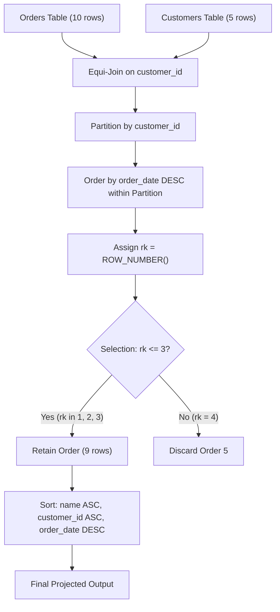

# Guided Example: The Most Recent Three Orders

We trace the step-by-step execution of the optimal grouped window ranking strategy on a representative database instance to identify each customer's most recent orders up to a maximum threshold of three.

- **Input Tables:**
  - `Customers`: 5 customer records with identifiers and names.
  - `Orders`: 10 distinct order transactions across various dates and costs.
- **Output Table:**
  - 9 qualifying order records representing the top three (or all existing) newest orders per active customer, sorted by customer name ascending, customer identifier ascending, and order date descending.

This instance tests multiple distinct group sizes: a customer with four orders (requiring pruning of the oldest), a customer with three orders (retaining all three), a customer with two orders (retaining both), a customer with one order (retaining it), and a customer with zero orders (completely excluded from the result).

---

## 1. Instance & Teaching Goal

The relational instance consists of two tables:

**`Customers` table:**

| customer_id | name |
|---|---|
| 1 | Winston |
| 2 | Jonathan |
| 3 | Annabelle |
| 4 | Marwan |
| 5 | Khaled |

**`Orders` table:**

| order_id | order_date | customer_id | cost |
|---|---|---|---|
| 1 | 2020-07-31 | 1 | 30 |
| 2 | 2020-07-30 | 2 | 40 |
| 3 | 2020-07-31 | 3 | 70 |
| 4 | 2020-07-29 | 4 | 100 |
| 5 | 2020-06-10 | 1 | 1010 |
| 6 | 2020-08-01 | 2 | 102 |
| 7 | 2020-08-01 | 3 | 111 |
| 8 | 2020-08-03 | 1 | 99 |
| 9 | 2020-08-07 | 2 | 32 |
| 10 | 2020-07-15 | 1 | 2 |

**Teaching Goal:**
Compute the newest three orders for each customer who placed orders. If a user placed fewer than three orders, retain all of them. The required output projection is:

| customer_name | customer_id | order_id | order_date |
|---|---|---|---|
| Annabelle | 3 | 7 | 2020-08-01 |
| Annabelle | 3 | 3 | 2020-07-31 |
| Jonathan | 2 | 9 | 2020-08-07 |
| Jonathan | 2 | 6 | 2020-08-01 |
| Jonathan | 2 | 2 | 2020-07-30 |
| Marwan | 4 | 4 | 2020-07-29 |
| Winston | 1 | 8 | 2020-08-03 |
| Winston | 1 | 1 | 2020-07-31 |
| Winston | 1 | 10 | 2020-07-15 |

The primary learning goal is to master grouped top-$k$ relational algebra via partitioned window numbering $\text{ROW\_NUMBER}()$, avoiding inefficient quadratic correlated subqueries or erroneous global limit clauses.

---

## 2. Conceptual Foundation & Invariants

```
+-------------------------------------------------------------------------+
|                  RELATIONAL WINDOW PIPELINE OVERVIEW                    |
+-------------------------------------------------------------------------+
|  [Orders]  |  order_id, order_date, customer_id, cost                   |
|     |                                                                   |
|     v  (Inner Equi-Join on customer_id)                                 |
|  [Customers] (Khaled dropped: 0 orders)                                 |
|     |                                                                   |
|     v  (Partition by customer_id, Sort by order_date DESC)              |
|  +-------------------------------------------------------------------+  |
|  | Partition 1 (Winston):   8 (08-03) -> 1 (07-31) -> 10 (07-15) -> 5|  |
|  | Partition 2 (Jonathan):  9 (08-07) -> 6 (08-01) ->  2 (07-30)     |  |
|  | Partition 3 (Annabelle): 7 (08-01) -> 3 (07-31)                   |  |
|  | Partition 4 (Marwan):    4 (07-29)                                |  |
|  +-------------------------------------------------------------------+  |
|     |                                                                   |
|     v  (Assign Window Rank rk = 1, 2, 3, ...)                           |
|  +-------------------------------------------------------------------+  |
|  | Winston:   rk=1, rk=2, rk=3, [rk=4 PRUNED]                        |  |
|  | Jonathan:  rk=1, rk=2, rk=3                                       |  |
|  | Annabelle: rk=1, rk=2                                             |  |
|  | Marwan:    rk=1                                                   |  |
|  +-------------------------------------------------------------------+  |
|     |                                                                   |
|     v  (Selection Filter: rk <= 3)                                      |
|     v  (Projection & Multi-Key Sort: name ASC, id ASC, date DESC)       |
|  [Final Output]: 9 rows across 4 active customers                       |
+-------------------------------------------------------------------------+
```

We establish the relational state variables and transformations:

| State Variable | Relational Role | Transformation Applied |
|---|---|---|
| $R_{\text{join}}$ | Unified order and customer relation | Equi-join $\text{Orders} \bowtie_{\text{customer\_id}} \text{Customers}$ |
| $r_i$ | Grouped ordinal position | Window numbering $\text{ROW\_NUMBER}()$ partitioned by $\text{customer\_id}$ |
| $R_{\text{filtered}}$ | Pruned candidate relation | Relational selection $\sigma_{r_i \le 3}(R_{\text{join}})$ |
| $R_{\text{out}}$ | Deterministically ordered report | Projection $\Pi$ followed by tuple ordering $\tau$ |

> **Grouped Window Partition Invariant.** Inside each partition induced by $\text{customer\_id}$, orders are strictly ordered descending by transaction date $\text{order\_date}$. The integer rank $r_i$ assigned to row $i$ satisfies $r_i = 1 + |\{j \in \text{Partition} : \text{order\_date}_j > \text{order\_date}_i\}|$. Filtering by $r_i \le 3$ preserves at most three most recent transactions per customer, retaining all transactions when the partition cardinality $|\text{Partition}| \le 3$.



---

## 3. Step-by-Step Worked Execution

### Step 1: Equi-Join Orders with Customers

The report requires projecting $\text{customer\_name}$ alongside order details. We perform an inner equi-join between $\text{Orders}$ and $\text{Customers}$ on $\text{customer\_id}$:

$$R_{\text{join}} = \text{Orders} \bowtie_{\text{Orders.customer\_id} = \text{Customers.customer\_id}} \text{Customers}$$

Because customer 5 (Khaled) has no records in $\text{Orders}$, Khaled does not produce any joined tuples in $R_{\text{join}}$. Each of the 10 order rows is successfully enriched with the customer's name.

| order_id | order_date | customer_id | cost | name |
|---|---|---|---|---|
| 1 | 2020-07-31 | 1 | 30 | Winston |
| 2 | 2020-07-30 | 2 | 40 | Jonathan |
| 3 | 2020-07-31 | 3 | 70 | Annabelle |
| 4 | 2020-07-29 | 4 | 100 | Marwan |
| 5 | 2020-06-10 | 1 | 1010 | Winston |
| 6 | 2020-08-01 | 2 | 102 | Jonathan |
| 7 | 2020-08-01 | 3 | 111 | Annabelle |
| 8 | 2020-08-03 | 1 | 99 | Winston |
| 9 | 2020-08-07 | 2 | 32 | Jonathan |
| 10 | 2020-07-15 | 1 | 2 | Winston |

---

### Step 2: Partition by Customer and Compute Window Ranking

Each customer's history is isolated into a separate partition. Inside each partition, records are sorted descending by $\text{order\_date}$. By the problem specification, each customer places at most one order per day, guaranteeing that $\text{order\_date}$ is strictly distinct within each partition.

We compute the partitioned row index:

$$r_i = \text{ROW\_NUMBER}() \text{ OVER (PARTITION BY customer\_id ORDER BY order\_date DESC)}$$

Evaluating each partition individually:

1. **Partition $\text{customer\_id} = 1$ (Winston):**
   - 2020-08-03 (order 8) $\rightarrow r = 1$
   - 2020-07-31 (order 1) $\rightarrow r = 2$
   - 2020-07-15 (order 10) $\rightarrow r = 3$
   - 2020-06-10 (order 5) $\rightarrow r = 4$

2. **Partition $\text{customer\_id} = 2$ (Jonathan):**
   - 2020-08-07 (order 9) $\rightarrow r = 1$
   - 2020-08-01 (order 6) $\rightarrow r = 2$
   - 2020-07-30 (order 2) $\rightarrow r = 3$

3. **Partition $\text{customer\_id} = 3$ (Annabelle):**
   - 2020-08-01 (order 7) $\rightarrow r = 1$
   - 2020-07-31 (order 3) $\rightarrow r = 2$

4. **Partition $\text{customer\_id} = 4$ (Marwan):**
   - 2020-07-29 (order 4) $\rightarrow r = 1$

| customer_id | name | order_id | order_date | Assigned Rank $r$ |
|---|---|---|---|---|
| 1 | Winston | 8 | 2020-08-03 | 1 |
| 1 | Winston | 1 | 2020-07-31 | 2 |
| 1 | Winston | 10 | 2020-07-15 | 3 |
| 1 | Winston | 5 | 2020-06-10 | 4 |
| 2 | Jonathan | 9 | 2020-08-07 | 1 |
| 2 | Jonathan | 6 | 2020-08-01 | 2 |
| 2 | Jonathan | 2 | 2020-07-30 | 3 |
| 3 | Annabelle | 7 | 2020-08-01 | 1 |
| 3 | Annabelle | 3 | 2020-07-31 | 2 |
| 4 | Marwan | 4 | 2020-07-29 | 1 |

---

### Step 3: Selection Filtering by Rank Bound ($r \le 3$)

We apply the selection condition $\sigma_{r \le 3}$:
- For Winston, row 4 (order 5 on 2020-06-10) has $r = 4 > 3$ and is filtered out.
- For Jonathan, all 3 orders have $r \in \{1, 2, 3\}$ and are preserved.
- For Annabelle, both 2 orders have $r \in \{1, 2\}$ and are preserved.
- For Marwan, the single order has $r = 1$ and is preserved.

This yields exactly 9 surviving order tuples.

---

### Step 4: Multi-Key Deterministic Sorting

The surviving records are projected to columns $(\text{name}, \text{customer\_id}, \text{order\_id}, \text{order\_date})$ and sorted according to the ordering specification:
1. Primary key: $\text{customer\_name}$ in ascending lexicographical order ($\text{ASC}$).
2. Secondary key: $\text{customer\_id}$ in ascending numerical order ($\text{ASC}$).
3. Tertiary key: $\text{order\_date}$ in descending temporal order ($\text{DESC}$).

- Annabelle ($\text{customer\_id} = 3$) comes first alphabetically. Her two orders are sorted 2020-08-01 then 2020-07-31.
- Jonathan ($\text{customer\_id} = 2$) comes second. His three orders sort 2020-08-07, 2020-08-01, 2020-07-30.
- Marwan ($\text{customer\_id} = 4$) comes third with his single order on 2020-07-29.
- Winston ($\text{customer\_id} = 1$) comes fourth. His three orders sort 2020-08-03, 2020-07-31, 2020-07-15.

---

## 4. Complete Execution Trace

The table below summarizes the lifecycle of every order tuple through the relational execution pipeline:

| order_id | customer_id | Customer Name | order_date | Partition Rank $r$ | Selection Status ($r \le 3$) | Final Output Row Position |
|---|---|---|---|---|---|---|
| 1 | 1 | Winston | 2020-07-31 | 2 | Accepted | Row 8 |
| 2 | 2 | Jonathan | 2020-07-30 | 3 | Accepted | Row 5 |
| 3 | 3 | Annabelle | 2020-07-31 | 2 | Accepted | Row 2 |
| 4 | 4 | Marwan | 2020-07-29 | 1 | Accepted | Row 6 |
| 5 | 1 | Winston | 2020-06-10 | 4 | Discarded ($r = 4 > 3$) | None |
| 6 | 2 | Jonathan | 2020-08-01 | 2 | Accepted | Row 4 |
| 7 | 3 | Annabelle | 2020-08-01 | 1 | Accepted | Row 1 |
| 8 | 1 | Winston | 2020-08-03 | 1 | Accepted | Row 7 |
| 9 | 2 | Jonathan | 2020-08-07 | 1 | Accepted | Row 3 |
| 10 | 1 | Winston | 2020-07-15 | 3 | Accepted | Row 9 |

Total processed order rows: 10. Filtered out: 1 (order 5). Final output rows: 9.

---

## 5. Algorithmic Correctness

**Soundness.**
Any order row that appears in the final result satisfies two conditions:
1. It belongs to a customer who has placed orders and is matched via valid foreign key $\text{customer\_id}$.
2. Its partitioned rank satisfies $r \le 3$. Because partitions are formed strictly by $\text{customer\_id}$ and ordered descending by $\text{order\_date}$, an assigned rank of $r \in \{1, 2, 3\}$ proves that there exist at most $r - 1 \le 2$ other orders for the same customer with a newer transaction date. Thus, every retained order is among the newest three.

**Completeness.**
No valid customer order is omitted:
1. Every order placed by any customer is initially present in the joined relation $R_{\text{join}}$.
2. For customers with fewer than 3 orders (such as Annabelle with 2 orders, or Marwan with 1 order), the maximum rank assigned is $|\text{Partition}| \le 3$, so all of their orders satisfy $r \le 3$ and survive the filter unconditionally.
3. For customers with $\ge 3$ orders (such as Winston), the three orders with strictly latest dates receive ranks 1, 2, and 3, ensuring all top three slots are populated.
4. Customers with zero orders (such as Khaled) are excluded by the inner equi-join, which correctly reflects that they possess no orders to report.

---

## 6. Traps This Instance Exposes

- **Global Limit Trap:** Applying a global `LIMIT 3` clause at the end of the query returns only 3 rows across the entire database, rather than up to 3 orders *per customer*. The top-$k$ restriction must operate within partitions.
- **Ties and Window Function Choice:** Using `RANK()` or `DENSE_RANK()` can return more than 3 rows per customer if multiple orders share the same date. While the problem contract guarantees at most one order per customer per day (preventing date ties within a customer partition), `ROW_NUMBER()` is strictly safer and expresses exact count-based ranking.
- **Handling Customers with Zero Orders:** Using a `LEFT JOIN` from `Customers` to `Orders` would generate a `NULL` order row for customer 5 (Khaled). Because the prompt asks for orders made, customers with 0 orders must produce 0 rows, which `INNER JOIN` guarantees naturally.
- **Customers with Fewer Than Three Orders:** Attempting to count total orders per customer beforehand and branching on `count < 3` introduces unnecessary complexity. The predicate $r \le 3$ seamlessly handles partitions of size 1, 2, or 3 without special cases.
- **Multi-Level Tie Breaking:** Customers with identical names must be differentiated by `customer_id ASC`. Neglecting the secondary tie-breaker leads to non-deterministic row ordering when two customers share a first name.

---

## 7. Complexity Derivation

- **Time Complexity:**
  Let $M$ be the number of rows in `Orders` ($M = 10$) and $N$ be the number of rows in `Customers` ($N = 5$).
  - Joining `Orders` with `Customers` using hash or index lookup requires $\mathcal{O}(M)$ time.
  - Sorting and ranking the orders within customer partitions takes $\sum_{c} \mathcal{O}(M_c \log M_c) \le \mathcal{O}(M \log M)$, where $M_c$ is the number of orders for customer $c$.
  - Filtering $r \le 3$ takes a single linear scan of $\mathcal{O}(M)$ time.
  - Final sorting of $R \le \min(M, 3N)$ surviving rows takes $\mathcal{O}(R \log R)$ time.
  - Overall time complexity is $\mathcal{O}(M \log M + N)$, which is optimal for database engines executing grouped sorting.
- **Auxiliary Space Complexity:**
  - The intermediate window state holds the joined and ranked tuples, requiring $\mathcal{O}(M)$ temporary storage.
  - Output relation storage is bounded by $\mathcal{O}(R) = \mathcal{O}(\min(M, 3N))$, yielding $\mathcal{O}(M + N)$ total auxiliary space.
