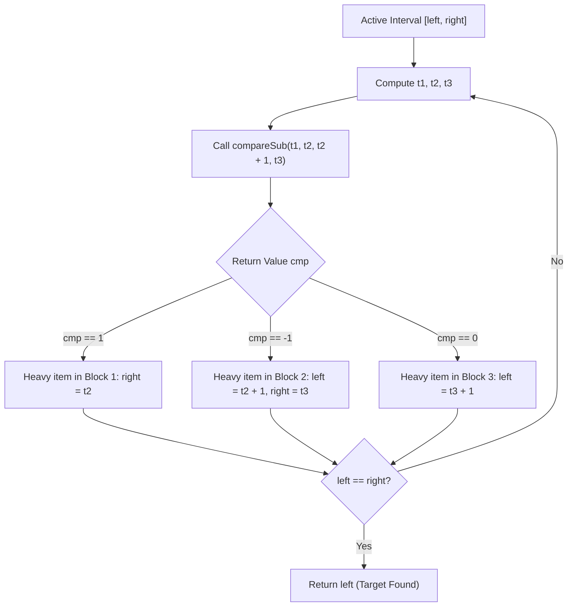

# Guided Example: Find the Index of the Large Integer

We trace the step-by-step execution of the optimal trisection search on a representative hidden array instance to locate the unique larger integer within the strict 20-query limit.

- **Input:** Hidden array $A = [7, 7, 7, 7, 10, 7, 7, 7]$ of length $N = 8$, accessible only via `ArrayReader` API with query ceiling 20.
- **Output:** `4` (the 0-based index of the unique element $10 > 7$).

This instance tests partition arithmetic on even array lengths, non-trivial internal sub-interval targeting, and multi-element block comparison where the target resides inside the queried segment rather than the unqueried remainder.

---

## 1. Instance & Teaching Goal

We are given a hidden array $A$ of length $N = 8$, indexed from $0$ to $7$:

$$A = [7, 7, 7, 7, 10, 7, 7, 7]$$

Every baseline element has value $v = 7$. Exactly one anomalous element has value $V = 10 > 7$, located at target index $4$. Individual elements cannot be inspected directly. We can only call:

$$\text{compareSub}(l, r, x, y) = \begin{cases} 1 & \text{if } \sum_{i=l}^r A[i] > \sum_{j=x}^y A[j] \\ 0 & \text{if } \sum_{i=l}^r A[i] = \sum_{j=x}^y A[j] \\ -1 & \text{if } \sum_{i=l}^r A[i] < \sum_{j=x}^y A[j] \end{cases}$$

subject to $r - l = y - x \ge 0$ (the compared subarrays must be non-empty and of equal length).

**Teaching Goal:**
Understand how trisection (dividing the active search interval into three segments) achieves $\mathcal{O}(\log_3 N)$ convergence, using at most $\lceil \log_3(5 \cdot 10^5) \rceil \le 13$ queries, well below the maximum allowed 20 queries. We trace the exact coordinate calculations and decision branches that isolate the unique heavy index.

---

## 2. Conceptual Foundation & Invariants

```
+-------------------------------------------------------------------------+
|                  TRISECTION SEARCH PARTITION SCHEME                     |
+-------------------------------------------------------------------------+
|  Active Interval: [left, right], Span = right - left                    |
|  Step size: k = (right - left) // 3                                     |
|                                                                         |
|  [left .......... t2]  [t2 + 1 ...... t3]  [t3 + 1 ............. right] |
|  <-- Block 1 (k+1) ->  <-- Block 2 (k+1) ->  <------- Block 3 --------> |
|                                                                         |
|  Query: compareSub(left, t2, t2 + 1, t3)                                |
|  - If cmp == 1:  Target in Block 1  --> right = t2                      |
|  - If cmp == -1: Target in Block 2  --> left = t2 + 1, right = t3       |
|  - If cmp == 0:  Target in Block 3  --> left = t3 + 1                   |
+-------------------------------------------------------------------------+
```

We define the primary state variables for each bisection / trisection step:

| State Variable | Definition & Role | Initial Value |
|---|---|---|
| $\text{left}$ | Lower bound index of the active search range | $0$ |
| $\text{right}$ | Upper bound index of the active search range | $N - 1 = 7$ |
| $t_1$ | Start index of first comparison block: $\text{left}$ | $0$ |
| $t_2$ | End index of first comparison block: $\text{left} + \lfloor (\text{right} - \text{left}) / 3 \rfloor$ | $2$ |
| $t_3$ | End index of second comparison block: $\text{left} + 2 \lfloor (\text{right} - \text{left}) / 3 \rfloor + 1$ | $5$ |
| $\text{cmp}$ | Result returned by $\text{compareSub}(t_1, t_2, t_2 + 1, t_3)$ | Evaluated at runtime |

> **Trisection Invariant.** At the beginning of each iteration, the unique heavy element $V > v$ is guaranteed to reside within the inclusive index range $[\text{left}, \text{right}]$. Furthermore, the two probed blocks $[t_1, t_2]$ and $[t_2 + 1, t_3]$ have identical length $k + 1$, ensuring that equal sums imply neither block contains the heavy element.



---

## 3. Step-by-Step Worked Execution

### Iteration 1: Pruning the Full Array $[0, 7]$

- Current bounds: $\text{left} = 0$, $\text{right} = 7$. Span is $7 - 0 = 7$.
- Calculate interval division step:
  $$k = \lfloor 7 / 3 \rfloor = 2$$
- Compute partition indices:
  $$t_1 = 0$$
  $$t_2 = 0 + 2 = 2$$
  $$t_3 = 0 + 2 \times 2 + 1 = 5$$
- Subarray blocks:
  - Block 1: $[t_1, t_2] = [0, 2]$, length $2 - 0 + 1 = 3$. Elements are $A[0..2] = [7, 7, 7]$, sum $= 21$.
  - Block 2: $[t_2 + 1, t_3] = [3, 5]$, length $5 - 3 + 1 = 3$. Elements are $A[3..5] = [7, 10, 7]$, sum $= 24$.
  - Block 3: $[t_3 + 1, \text{right}] = [6, 7]$, length $7 - 6 + 1 = 2$. Elements are $A[6..7] = [7, 7]$, sum $= 14$.
- We invoke the reader query:
  $$\text{compareSub}(0, 2, 3, 5)$$
  Because $\sum A[0..2] = 21 < 24 = \sum A[3..5]$, the reader returns $\text{cmp} = -1$.
- Decision:
  Block 2 contains the heavy element. We contract the active interval to $[t_2 + 1, t_3] = [3, 5]$.
  $$\text{left} \leftarrow 3, \quad \text{right} \leftarrow 5$$

| Step Parameter | Value Before Query | Decision / Operation | Value After Query |
|---|---|---|---|
| Active Interval | $[0, 7]$ (length 8) | Trisection into sizes 3, 3, 2 | $[3, 5]$ (length 3) |
| Block 1 $[0, 2]$ | Sum = 21 (all 7s) | Compared against Block 2 | Discarded |
| Block 2 $[3, 5]$ | Sum = 24 (contains 10) | Heavier block identified ($\text{cmp} = -1$) | Preserved as new interval |
| Block 3 $[6, 7]$ | Uninspected | Inferred baseline by transitivity | Discarded |
| Cumulative Queries | 0 | Query 1 executed | 1 |

---

### Iteration 2: Pruning the Sub-interval $[3, 5]$

- Current bounds: $\text{left} = 3$, $\text{right} = 5$. Span is $5 - 3 = 2$.
- Calculate interval division step:
  $$k = \lfloor 2 / 3 \rfloor = 0$$
- Compute partition indices:
  $$t_1 = 3$$
  $$t_2 = 3 + 0 = 3$$
  $$t_3 = 3 + 2 \times 0 + 1 = 4$$
- Subarray blocks:
  - Block 1: $[t_1, t_2] = [3, 3]$, length $3 - 3 + 1 = 1$. Element is $A[3] = 7$, sum $= 7$.
  - Block 2: $[t_2 + 1, t_3] = [4, 4]$, length $4 - 4 + 1 = 1$. Element is $A[4] = 10$, sum $= 10$.
  - Block 3: $[t_3 + 1, \text{right}] = [5, 5]$, length $5 - 5 + 1 = 1$. Element is $A[5] = 7$, sum $= 7$.
- We invoke the reader query:
  $$\text{compareSub}(3, 3, 4, 4)$$
  Because $A[3] = 7 < 10 = A[4]$, the reader returns $\text{cmp} = -1$.
- Decision:
  Block 2 contains the heavy element. We contract the interval to $[t_2 + 1, t_3] = [4, 4]$.
  $$\text{left} \leftarrow 4, \quad \text{right} \leftarrow 4$$

| Step Parameter | Value Before Query | Decision / Operation | Value After Query |
|---|---|---|---|
| Active Interval | $[3, 5]$ (length 3) | Trisection into singleton elements | $[4, 4]$ (length 1) |
| Block 1 $[3, 3]$ | $A[3] = 7$ | Compared against Block 2 | Discarded |
| Block 2 $[4, 4]$ | $A[4] = 10$ | Heavier element confirmed ($\text{cmp} = -1$) | Preserved |
| Block 3 $[5, 5]$ | $A[5] = 7$ | Not queried directly | Discarded |
| Cumulative Queries | 1 | Query 2 executed | 2 |

---

### Step 3: Termination and Result Extraction

Now $\text{left} = 4$ and $\text{right} = 4$.
The condition $\text{left} < \text{right}$ is no longer satisfied ($4 < 4$ is false).
The loop terminates, and we return the isolated index:

$$\text{result} = 4$$

Total queries performed: 2 (allowance: 20).

---

## 4. Complete Execution Trace

The complete execution history from initial bounds to single-element convergence is tabulated below:

| Iteration | Active Range $[\text{left}, \text{right}]$ | Span | $k$ | Block 1 $[t_1, t_2]$ | Block 2 $[t_2 + 1, t_3]$ | Block 3 $[t_3 + 1, \text{right}]$ | Query Parameters | $\text{cmp}$ | Next Interval | Queries Used |
|---|---|---|---|---|---|---|---|---|---|---|
| 1 | $[0, 7]$ | 7 | 2 | $[0, 2]$ (len 3) | $[3, 5]$ (len 3) | $[6, 7]$ (len 2) | $\text{compareSub}(0, 2, 3, 5)$ | $-1$ | $[3, 5]$ | 1 / 20 |
| 2 | $[3, 5]$ | 2 | 0 | $[3, 3]$ (len 1) | $[4, 4]$ (len 1) | $[5, 5]$ (len 1) | $\text{compareSub}(3, 3, 4, 4)$ | $-1$ | $[4, 4]$ | 2 / 20 |
| Final | $[4, 4]$ | 0 | - | - | - | - | Terminate: $\text{left} = \text{right}$ | - | Return 4 | 2 / 20 |

---

## 5. Algorithmic Correctness

**Soundness.**
Because exactly one element in the entire array satisfies $A[i] = V > v$ while all other $N - 1$ elements equal baseline $v$, comparing two blocks of equal length $m = t_2 - t_1 + 1 = t_3 - t_2$ yields:
- If both blocks contain only baseline elements, their sums are identically $m \cdot v$, producing $\text{cmp} = 0$. Since the heavy element exists and is within $[\text{left}, \text{right}]$, it must reside in Block 3 ($[t_3 + 1, \text{right}]$).
- If Block 1 contains the heavy element, its sum is $(m - 1)v + V > m \cdot v$, producing $\text{cmp} = 1$.
- If Block 2 contains the heavy element, its sum is $(m - 1)v + V > m \cdot v$, producing $\text{cmp} = -1$.
In all cases, discarding the other two blocks preserves the heavy element with 100% mathematical certainty.

**Completeness.**
The search interval length $L_{t+1}$ decreases from $L_t$ by at least a factor of:
$$L_{t+1} \le \max(k + 1, L_t - 2(k + 1)) \le \left\lceil \frac{L_t}{3} \right\rceil$$
Because $L_t \ge 2$ implies $L_{t+1} < L_t$, the length strictly decreases at each step until $L = 1$ ($\text{left} = \text{right}$). The algorithm never enters an infinite loop and always terminates at the exact index of the larger integer.

---

## 6. Traps This Instance Exposes

- **Unequal Subarray Length Trap:** Passing subarrays of unequal lengths to `compareSub` produces invalid comparisons. For example, comparing a block of length 3 with a block of length 2 would yield a larger sum for the first block even if both contain only baseline 7s ($21 > 14$). The trisection partition formulas ensure $t_2 - t_1 + 1 = t_3 - (t_2 + 1) + 1 = k + 1$ always.
- **Off-By-One in Block Boundaries:** Defining $t_3 = \text{left} + 2k$ instead of $\text{left} + 2k + 1$ causes Block 2 to have length $k$ instead of $k + 1$, violating the equal-length requirement.
- **Query Budget Exhaustion with Binary Search:** A standard binary search on odd lengths requires testing $k$ elements against $k$ elements, discarding the middle element when equal. While binary search also succeeds ($\lceil \log_2 500000 \rceil = 19 \le 20$), trisection needs at most 13 queries, leaving a large safety margin against query limit penalties.
- **Loop Termination Condition:** Looping while $\text{left} \le \text{right}$ without an internal break when $\text{left} == \text{right}$ causes an invalid zero-length query attempt. The loop must terminate when $\text{left} == \text{right}$.

---

## 7. Complexity Derivation

- **Query & Time Complexity:**
  At each iteration, one `compareSub` query eliminates approximately two-thirds of the candidate search space. The recurrence relation is:
  $$T(N) = T\left(\left\lceil \frac{N}{3} \right\rceil\right) + \mathcal{O}(1)$$
  Solving via the Master Theorem yields $T(N) = \mathcal{O}(\log_3 N)$ queries and arithmetic operations.
  For the maximum problem constraint $N = 5 \cdot 10^5$:
  $$\text{Max Queries} \le \lceil \log_3(500000) \rceil = \left\lceil \frac{\ln 500000}{\ln 3} \right\rceil = \lceil 11.93 \rceil = 12 \text{ or } 13 \ll 20$$
  This strictly satisfies the problem limit of 20 queries.
- **Auxiliary Space Complexity:**
  The algorithm only tracks scalar index pointers ($\text{left}, \text{right}, t_1, t_2, t_3, \text{cmp}$), requiring $\mathcal{O}(1)$ auxiliary space.
