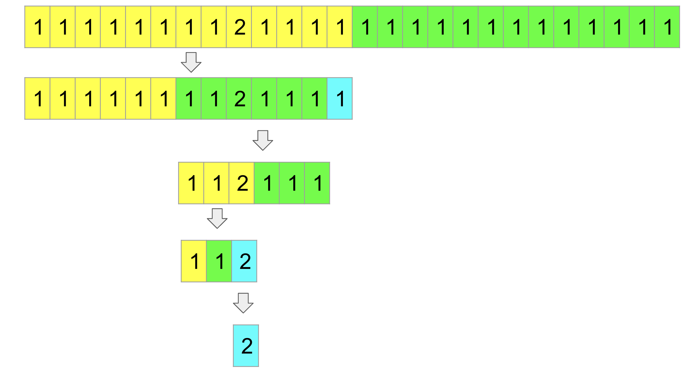

[TOC]

## Solution
---
### Approach 1: Binary Search

#### Intuition

Basically, we want to eliminate the duplicated values and find the larger number. We cannot get each element out but the given API allows us to compare the sum of all the elements in 2 subarrays.

If our array is broken into two equally sized halves and all the elements in the array were equal, the sum of the two halves would also have an equal sum, but if one element is larger in either of the halves then that respective half will have a larger sum. Then we could discard the other half because we know it doesn't hold the answer, and continue searching on the remaining array.

It will work great if there are an even number of elements in the array, but if the array has odd elements then if we break it into two parts then one part will have more elements, thus we can't guarantee where the large element is after comparing their sum. Instead, we can keep one element separate, then the remaining arrays will become even.

If the current search space has an odd length, we can break the array into 3 parts.
Let's call the 2 parts `left` and `right`, and one separate element $\text{extra}_{element}$. Now we have three possibilities:

* The sum of all the elements in `left` is larger than the sum of all the elements in `right`. The larger element is in the `left`, we can eliminate all elements in `right` and that $\text{extra}_{element}$.
* The sum of all the elements in `left` is smaller than the sum of all the elements in `right`. The larger element is in the `right`, we can eliminate all elements in `left` and that $\text{extra}_{element}$.
* The sum of all the elements in `left` equals the sum of all the elements in `right`, the larger element is not in either, we can eliminate all elements in both. The larger element is the $\text{extra}_{element}$.

So with each comparison, we are eliminating at least half of the number of elements of the search space. Thus, we are using a modified version of binary search.

Here is how the algorithm works in details.
<center>

</center>
<br>

Suppose the array contains 26 elements. All its elements are 1 except one is 2.

* At the very beginning, the sum of all the elements in the left subarray (in yellow) is larger than the sum of all the elements in the right subarray (in green). We eliminate the right subarray.
* Now, the sum of all the elements in the left subarray (in yellow) is smaller than the sum of all the elements in the right subarray (in green). We eliminate the left subarray and the leftover element (in cyan) since the total number of elements is odd (13).
* Checking again, the sum of all the elements in the left subarray (in yellow) is larger than the sum of all the elements in the right subarray (in green). We eliminate the left subarray.
* Finally, the sum of all the elements in the left subarray (in yellow) equals to the sum of all the elements in the right subarray (in green). We eliminate both and the leftover element (in cyan) is the answer.

#### Algorithm

* Set $left = 0$ and $length = \text{reader.length}$. `left` is the leftmost index of our search space and `length` is the size of our search space. The larger integer's index should always be in [`left`, `left` + `length`)
* While `length > 1`
* Update `length` to `length` / 2.
* Set `cmp` to $\text{reader.compareSub}(left, left + length - 1, left + length, left + length + length - 1)$
   * If `cmp` is `0`, return $left + length + length$, the leftover element is the larger integer. Note that this is only possible if the current search space has an odd length, so if we have an even length we don't need to worry about this case.
   * If `cmp` is `-1`, increase `left` by `length`.
   * If `cmp` is `1`, we don't need to do anything because we already our `left` bound stays the same and we already divided `length` by `2`.
* Return `left`. This is standard with binary search where if the search ends without returning, the `left` bound is pointing to the answer.

#### Implementation

```python
class Solution(object):
    def getIndex(self, reader):
        left = 0
        length = reader.length()
        while (length > 1):
            length //= 2;
            cmp = reader.compareSub(left, left + length - 1, left + length,
                                              left + length + length - 1)
            if cmp == 0:
                return left + length + length
            if cmp < 0:
                left += length
        return left
```

#### Complexity Analysis

Here, $N$ is the length of the internal array.

* Time Complexity:  $O(\log N)$
  After every check we reduce our array size by half, thus we will make at most $\log N$ calls to the API, where each API call takes constant time.

* Space Complexity: $O(1)$
  We are not using any additional space other than a few integer variables.

----