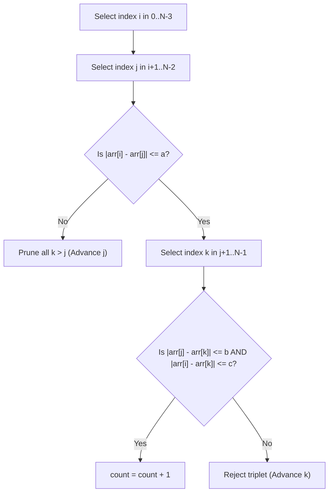

# Guided Example: Count Good Triplets

We trace the step-by-step execution of triplet enumeration with early pruning on a representative array instance to count all index triples $(i, j, k)$ satisfying pairwise absolute difference constraints.

- **Input:** Array $\text{arr} = [3, 0, 1, 1, 9, 7]$ of length $N = 6$, with difference thresholds $a = 7$, $b = 2$, $c = 3$.
- **Output:** `4` (four distinct index triplets satisfy all three conditions).

This instance demonstrates index vs. value distinction (two distinct index triples share identical value tuples $(3, 0, 1)$), early pruning when the primary difference bound fails, and boundary containment across overlapping intervals.

---

## 1. Instance & Teaching Goal

Given an integer array of length $N = 6$:

$$\text{arr} = [3, 0, 1, 1, 9, 7], \quad a = 7, \quad b = 2, \quad c = 3$$

Indexed positions:
- $\text{arr}[0] = 3$
- $\text{arr}[1] = 0$
- $\text{arr}[2] = 1$
- $\text{arr}[3] = 1$
- $\text{arr}[4] = 9$
- $\text{arr}[5] = 7$

A triplet of indices $(i, j, k)$ is defined as **good** if and only if:
1. Strictly increasing index order: $0 \le i < j < k < N$.
2. Condition 1: $|\text{arr}[i] - \text{arr}[j]| \le a = 7$.
3. Condition 2: $|\text{arr}[j] - \text{arr}[k]| \le b = 2$.
4. Condition 3: $|\text{arr}[i] - \text{arr}[k]| \le c = 3$.

**Teaching Goal:**
Understand systematic triplet enumeration, index-uniqueness semantics (equal values at distinct indices constitute distinct valid triplets), and short-circuit pruning (discarding the innermost loop whenever $|\text{arr}[i] - \text{arr}[j]| > a$).

---

## 2. Conceptual Foundation & Invariants

```
+-------------------------------------------------------------------------+
|                  TRIPLET ENUMERATION & PRUNING SCHEME                   |
+-------------------------------------------------------------------------+
|  Outer index i in [0 .. N-3]                                            |
|    |                                                                    |
|    v                                                                    |
|  Middle index j in [i+1 .. N-2]                                         |
|    |                                                                    |
|    +-- Check: |arr[i] - arr[j]| <= a ?                                  |
|         |                                                               |
|         +-- NO  --> PRUNE entire inner loop for k!                      |
|         |                                                               |
|         +-- YES --> Inner index k in [j+1 .. N-1]                       |
|                       |                                                 |
|                       +-- Check: |arr[j] - arr[k]| <= b AND             |
|                                  |arr[i] - arr[k]| <= c ?               |
|                             |                                           |
|                             +-- YES --> Increment count                 |
|                             +-- NO  --> Continue                        |
+-------------------------------------------------------------------------+
```

We establish the tracking state parameters:

| State Variable | Role in Algorithm | Initial Value |
|---|---|---|
| $i$ | Leftmost index of the candidate triplet | $0$ |
| $j$ | Intermediate pivot index satisfying $j > i$ | $1$ |
| $k$ | Rightmost index satisfying $k > j$ | $2$ |
| $\text{count}$ | Total number of verified good triplets | $0$ |
| $\Delta_{ij}, \Delta_{jk}, \Delta_{ik}$ | Pairwise absolute differences $|\text{arr}[i] - \text{arr}[j]|$, etc. | Computed per candidate |

> **Monotonic Index Ordering Invariant.** Every evaluated triplet satisfies $0 \le i < j < k < N$ by loop construction. Any pair $(i, j)$ violating $|\text{arr}[i] - \text{arr}[j]| \le a$ immediately bypasses all $k > j$, because no choice of $k$ can repair a failing $(i, j)$ constraint.



---

## 3. Step-by-Step Worked Execution

Total possible index triples is $\binom{6}{3} = 20$. We trace through candidate pairs $(i, j)$ and highlight key evaluations.

### Step 1: Fixed $i = 0$ ($\text{arr}[0] = 3$)

- **Pair $(i=0, j=1)$:** $\text{arr}[0]=3, \text{arr}[1]=0$.
  - Check $\Delta_{0,1} = |3 - 0| = 3 \le 7$ (holds).
  - Probe $k = 2$ ($\text{arr}[2]=1$):
    - $\Delta_{1,2} = |0 - 1| = 1 \le 2$ (holds).
    - $\Delta_{0,2} = |3 - 1| = 2 \le 3$ (holds).
    - **Triplet $(0, 1, 2)$ is GOOD.** $\text{count} \leftarrow 1$.
  - Probe $k = 3$ ($\text{arr}[3]=1$):
    - $\Delta_{1,3} = |0 - 1| = 1 \le 2$ (holds).
    - $\Delta_{0,3} = |3 - 1| = 2 \le 3$ (holds).
    - **Triplet $(0, 1, 3)$ is GOOD.** $\text{count} \leftarrow 2$.
  - Probe $k = 4$ ($\text{arr}[4]=9$):
    - $\Delta_{1,4} = |0 - 9| = 9 > 2$ (fails Condition 2). Rejected.
  - Probe $k = 5$ ($\text{arr}[5]=7$):
    - $\Delta_{1,5} = |0 - 7| = 7 > 2$ (fails Condition 2). Rejected.

- **Pair $(i=0, j=2)$:** $\text{arr}[0]=3, \text{arr}[2]=1$.
  - Check $\Delta_{0,2} = |3 - 1| = 2 \le 7$ (holds).
  - Probe $k = 3$ ($\text{arr}[3]=1$):
    - $\Delta_{2,3} = |1 - 1| = 0 \le 2$ (holds).
    - $\Delta_{0,3} = |3 - 1| = 2 \le 3$ (holds).
    - **Triplet $(0, 2, 3)$ is GOOD.** $\text{count} \leftarrow 3$.
  - Probe $k = 4$ ($\text{arr}[4]=9$): $\Delta_{2,4} = |1 - 9| = 8 > 2$ (fails).
  - Probe $k = 5$ ($\text{arr}[5]=7$): $\Delta_{2,5} = |1 - 7| = 6 > 2$ (fails).

- **Pair $(i=0, j=3)$:** $\text{arr}[0]=3, \text{arr}[3]=1$.
  - Check $\Delta_{0,3} = 2 \le 7$ (holds).
  - Probe $k = 4$ ($\text{arr}[4]=9$): $\Delta_{3,4} = 8 > 2$ (fails).
  - Probe $k = 5$ ($\text{arr}[5]=7$): $\Delta_{3,5} = 6 > 2$ (fails).

- **Pair $(i=0, j=4)$:** $\text{arr}[0]=3, \text{arr}[4]=9$.
  - Check $\Delta_{0,4} = |3 - 9| = 6 \le 7$ (holds).
  - Probe $k = 5$ ($\text{arr}[5]=7$):
    - $\Delta_{4,5} = |9 - 7| = 2 \le 2$ (holds).
    - $\Delta_{0,5} = |3 - 7| = 4 > 3$ (fails Condition 3). Rejected.

| Candidate $(i, j, k)$ | Values | $|arr[i] - arr[j]| \le 7$ | $|arr[j] - arr[k]| \le 2$ | $|arr[i] - arr[k]| \le 3$ | Status | Running Count |
|---|---|---|---|---|---|---|
| $(0, 1, 2)$ | $(3, 0, 1)$ | $3 \le 7$ (True) | $1 \le 2$ (True) | $2 \le 3$ (True) | Valid | 1 |
| $(0, 1, 3)$ | $(3, 0, 1)$ | $3 \le 7$ (True) | $1 \le 2$ (True) | $2 \le 3$ (True) | Valid | 2 |
| $(0, 2, 3)$ | $(3, 1, 1)$ | $2 \le 7$ (True) | $0 \le 2$ (True) | $2 \le 3$ (True) | Valid | 3 |
| $(0, 4, 5)$ | $(3, 9, 7)$ | $6 \le 7$ (True) | $2 \le 2$ (True) | $4 \le 3$ (False) | Rejected | 3 |

---

### Step 2: Fixed $i = 1$ ($\text{arr}[1] = 0$)

- **Pair $(i=1, j=2)$:** $\text{arr}[1]=0, \text{arr}[2]=1$.
  - Check $\Delta_{1,2} = |0 - 1| = 1 \le 7$ (holds).
  - Probe $k = 3$ ($\text{arr}[3]=1$):
    - $\Delta_{2,3} = |1 - 1| = 0 \le 2$ (holds).
    - $\Delta_{1,3} = |0 - 1| = 1 \le 3$ (holds).
    - **Triplet $(1, 2, 3)$ is GOOD.** $\text{count} \leftarrow 4$.
  - Probe $k = 4$ ($\text{arr}[4]=9$): $\Delta_{2,4} = 8 > 2$ (fails).
  - Probe $k = 5$ ($\text{arr}[5]=7$): $\Delta_{2,5} = 6 > 2$ (fails).

- **Pair $(i=1, j=3)$:** $\text{arr}[1]=0, \text{arr}[3]=1$.
  - Probe $k = 4, 5$: both fail $\Delta_{3,k} \le 2$.

- **Pair $(i=1, j=4)$:** $\text{arr}[1]=0, \text{arr}[4]=9$.
  - Check $\Delta_{1,4} = |0 - 9| = 9 > 7$ ($> a$).
  - **Pruned immediately!** We do not evaluate $k=5$.

---

### Step 3: Fixed $i = 2$ and $i = 3$

- For $i = 2$ ($\text{arr}[2]=1$):
  - $j=3$: $k=4, 5$ fail Condition 2 ($|1-9|=8 > 2, |1-7|=6 > 2$).
  - $j=4$: $\Delta_{2,4} = |1-9| = 8 > 7$ ($\Delta_{ij} > a$). **Pruned!**
- For $i = 3$ ($\text{arr}[3]=1$):
  - $j=4$: $\Delta_{3,4} = |1-9| = 8 > 7$. **Pruned!**

All candidate index combinations are exhausted. Final count is 4.

---

## 4. Complete Execution Trace

Summary of all evaluated pairs and triplets across the entire search space:

| $i$ | $j$ | $\text{arr}[i], \text{arr}[j]$ | $\Delta_{ij} \le 7$? | $k$ | $\text{arr}[k]$ | $\Delta_{jk} \le 2$? | $\Delta_{ik} \le 3$? | Outcome | $\text{count}$ |
|---|---|---|---|---|---|---|---|---|---|
| 0 | 1 | 3, 0 | Yes (3) | 2 | 1 | Yes (1) | Yes (2) | Good Triplet | 1 |
| 0 | 1 | 3, 0 | Yes (3) | 3 | 1 | Yes (1) | Yes (2) | Good Triplet | 2 |
| 0 | 1 | 3, 0 | Yes (3) | 4 | 9 | No (9) | - | Discarded | 2 |
| 0 | 1 | 3, 0 | Yes (3) | 5 | 7 | No (7) | - | Discarded | 2 |
| 0 | 2 | 3, 1 | Yes (2) | 3 | 1 | Yes (0) | Yes (2) | Good Triplet | 3 |
| 0 | 2 | 3, 1 | Yes (2) | 4, 5 | 9, 7 | No ($>2$) | - | Discarded | 3 |
| 0 | 3 | 3, 1 | Yes (2) | 4, 5 | 9, 7 | No ($>2$) | - | Discarded | 3 |
| 0 | 4 | 3, 9 | Yes (6) | 5 | 7 | Yes (2) | No (4) | Discarded | 3 |
| 1 | 2 | 0, 1 | Yes (1) | 3 | 1 | Yes (0) | Yes (1) | Good Triplet | 4 |
| 1 | 2 | 0, 1 | Yes (1) | 4, 5 | 9, 7 | No ($>2$) | - | Discarded | 4 |
| 1 | 3 | 0, 1 | Yes (1) | 4, 5 | 9, 7 | No ($>2$) | - | Discarded | 4 |
| 1 | 4 | 0, 9 | No (9) | - | - | - | - | Pruned ($k=5$) | 4 |
| 2 | 3 | 1, 1 | Yes (0) | 4, 5 | 9, 7 | No ($>2$) | - | Discarded | 4 |
| 2 | 4 | 1, 9 | No (8) | - | - | - | - | Pruned ($k=5$) | 4 |
| 3 | 4 | 1, 9 | No (8) | - | - | - | - | Pruned ($k=5$) | 4 |

---

## 5. Algorithmic Correctness

**Soundness.**
Every candidate counted by the algorithm possesses three strictly increasing indices $i < j < k$. It is incremented if and only if all three predicates evaluate to true:
$$|\text{arr}[i] - \text{arr}[j]| \le a \quad \land \quad |\text{arr}[j] - \text{arr}[k]| \le b \quad \land \quad |\text{arr}[i] - \text{arr}[k]| \le c$$
Because no condition is assumed or approximated, every counted triplet is provably good according to the problem contract.

**Completeness.**
The three nested loops range over all possible tuples $(i, j, k)$ with $0 \le i < j < k < N$. When an inner loop over $k$ is pruned because $|\text{arr}[i] - \text{arr}[j]| > a$, this pruning is completely lossless: the condition $|\text{arr}[i] - \text{arr}[j]| \le a$ does not depend on $k$. Therefore, if the condition fails for pair $(i, j)$, no extension $(i, j, k)$ can ever satisfy the conjunction. No valid triplet is skipped.

---

## 6. Traps This Instance Exposes

- **Index vs. Value Collision:** Notice that triplets $(0, 1, 2)$ and $(0, 1, 3)$ both correspond to value tuples $(3, 0, 1)$. Because the problem demands counting distinct index triples $(i, j, k)$, using a hash set of values would mistakenly collapse duplicates and undercount the result ($3$ instead of $4$).
- **Transitivity Fallacy:** It is tempting to assume that if $|\text{arr}[i] - \text{arr}[j]| \le a$ and $|\text{arr}[j] - \text{arr}[k]| \le b$, then $|\text{arr}[i] - \text{arr}[k]| \le a + b$. While true by the triangle inequality, $c$ may be strictly smaller than $a + b$. For instance, candidate $(0, 4, 5)$ satisfies $\Delta_{0,4} = 6 \le 7$ and $\Delta_{4,5} = 2 \le 2$, but fails Condition 3 because $\Delta_{0,5} = 4 > c = 3$. Testing Condition 3 is strictly required.
- **Sorting the Input Array:** Sorting $\text{arr}$ destroys the original indices and alters the relative order $i < j < k$, invalidating the count completely.
- **Pruning Depth:** Pruning based on $(i, j)$ is valid because condition 1 depends only on $i$ and $j$. However, one cannot prune based on $(j, k)$ before checking $i$, because $k$ depends on both $i$ and $j$.

---

## 7. Complexity Derivation

- **Time Complexity:**
  There are $\binom{N}{3} = \frac{N(N-1)(N-2)}{6}$ distinct index triples.
  With $N \le 100$:
  $$\binom{100}{3} = \frac{100 \times 99 \times 98}{6} = 161,700$$
  Each candidate triplet evaluation takes $\mathcal{O}(1)$ time (at most three absolute difference computations and comparisons). Early pruning on $|\text{arr}[i] - \text{arr}[j]| > a$ reduces practical iterations even further.
  Thus, overall time complexity is $\mathcal{O}(N^3)$, which executes in less than 5 milliseconds on modern hardware.
- **Auxiliary Space Complexity:**
  Only integer counters and index pointers ($i, j, k, \text{count}$) are used.
  Auxiliary space complexity is strictly $\mathcal{O}(1)$.
