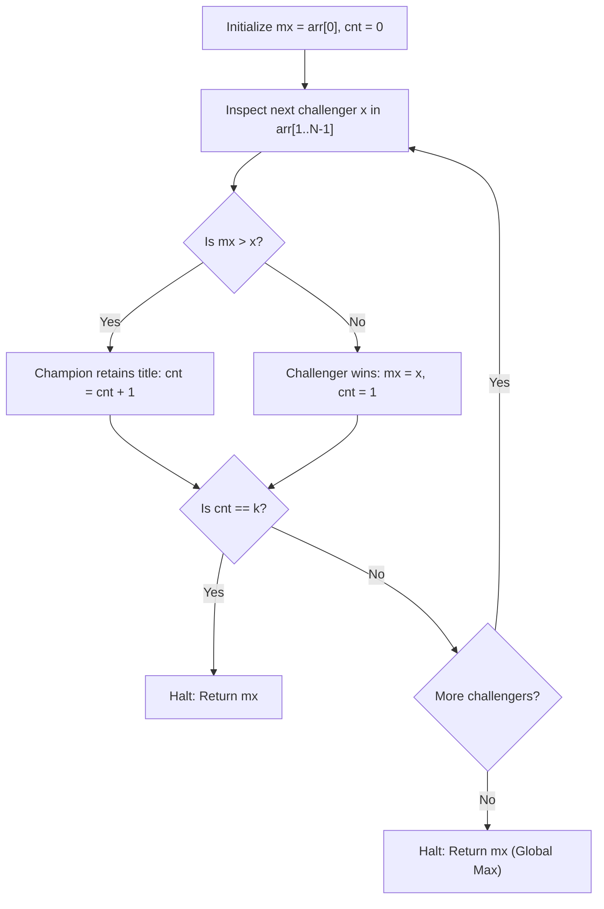

# Guided Example: Find the Winner of an Array Game

We trace the step-by-step execution of single-pass champion tracking on a representative game instance to determine which distinct array value achieves $k$ consecutive duel victories first.

- **Input:** Array $\text{arr} = [2, 1, 3, 5, 4, 6, 7]$ of length $N = 7$, with victory threshold $k = 2$.
- **Output:** `5` (value 5 defeats value 3 to claim champion status, then defeats value 4 to secure its 2nd consecutive win).

This instance demonstrates champion succession, streak resets upon defeat, and early stopping before reaching the global array maximum or simulating circular queue rotations.

---

## 1. Instance & Teaching Goal

We are given an array of $N = 7$ distinct integers:

$$\text{arr} = [2, 1, 3, 5, 4, 6, 7], \quad k = 2$$

Game rules:
1. In round 1, $\text{arr}[0] = 2$ and $\text{arr}[1] = 1$ compete.
2. The larger value stays at the front as champion; the smaller value is sent to the end of the array.
3. In subsequent rounds, the standing champion at the front competes against the next challenger.
4. The first element to accumulate $k = 2$ consecutive wins wins the game.

**Teaching Goal:**
Understand why a literal circular queue or double-ended queue simulation is redundant. By recognizing that any element pushed to the back cannot re-emerge until all original elements are faced, and that the global maximum never loses once established, we can solve the problem in a single forward pass with $\mathcal{O}(N)$ time and $\mathcal{O}(1)$ auxiliary space.

---

## 2. Conceptual Foundation & Invariants

```
+-------------------------------------------------------------------------+
|                  SINGLE-PASS CHAMPION STREAMING MODEL                   |
+-------------------------------------------------------------------------+
|  Initialize: Champion mx = arr[0], Streak cnt = 0                       |
|                                                                         |
|  Stream challengers x from arr[1] to arr[N-1]:                          |
|                                                                         |
|  +--------------------+                                                 |
|  | Challenger x       |                                                 |
|  +--------------------+                                                 |
|            |                                                            |
|     (Compare mx, x)                                                     |
|            |                                                            |
|     +------+------+                                                     |
|     |             |                                                     |
|  [mx > x]      [mx < x]                                                 |
|     |             |                                                     |
|  Champion wins  Challenger usurps                                       |
|  cnt += 1       mx = x, cnt = 1 (won current duel)                      |
|     |             |                                                     |
|     +------+------+                                                     |
|            |                                                            |
|     (Check cnt == k?)                                                   |
|            |                                                            |
|     +------+------+                                                     |
|     |             |                                                     |
|   [YES]          [NO]                                                   |
|  Return mx     Continue scan                                            |
|                                                                         |
|  If loop finishes without cnt == k: Return mx (Global Maximum)          |
+-------------------------------------------------------------------------+
```

We define the state tracking variables:

| State Variable | Definition & Role | Initial Value |
|---|---|---|
| $\text{mx}$ | Standing champion value at the front of the queue | $\text{arr}[0] = 2$ |
| $\text{cnt}$ | Number of consecutive rounds won by current champion $\text{mx}$ | $0$ |
| $i$ | Index of next challenger in the original array | $1$ |
| $x$ | Challenger value $\text{arr}[i]$ | $\text{arr}[1] = 1$ |

> **Champion Dominance Invariant.** At any challenger index $i$, $\text{mx} = \max(\text{arr}[0..i])$. The current champion $\text{mx}$ has defeated all preceding elements in their respective duels, and $\text{cnt}$ accurately records consecutive victories since $\text{mx}$ took the lead. If the scan finishes, $\text{mx} = \max(\text{arr})$ and can never be defeated.



---

## 3. Step-by-Step Worked Execution

### Round 1: Challenger $x = \text{arr}[1] = 1$
- Standing champion: $\text{mx} = 2$, streak $\text{cnt} = 0$.
- Duel comparison: $\text{mx} = 2 > 1 = x$.
- Outcome: Champion 2 wins!
- Streak update: $\text{cnt} \leftarrow \text{cnt} + 1 = 1$.
- Victory check: $\text{cnt} = 1 \neq k = 2$.
- Status: The game continues with champion $\text{mx} = 2$.

| Round | Champion $\text{mx}$ | Challenger $x$ | Comparison | Winner | New $\text{mx}$ | New $\text{cnt}$ | Goal Check ($\text{cnt} = 2$) |
|---|---|---|---|---|---|---|---|
| 1 | 2 | 1 | $2 > 1$ | Champion 2 | 2 | 1 | $1 \neq 2$ (Continue) |

---

### Round 2: Challenger $x = \text{arr}[2] = 3$
- Standing champion: $\text{mx} = 2$, streak $\text{cnt} = 1$.
- Duel comparison: $\text{mx} = 2 < 3 = x$.
- Outcome: Challenger 3 defeats champion 2!
- Championship update: 3 becomes the new champion ($\text{mx} \leftarrow 3$).
- Streak reset: Since 3 just won this round, its initial consecutive streak is $\text{cnt} \leftarrow 1$.
- Victory check: $\text{cnt} = 1 \neq k = 2$.
- Status: The game continues with champion $\text{mx} = 3$.

| Round | Champion $\text{mx}$ | Challenger $x$ | Comparison | Winner | New $\text{mx}$ | New $\text{cnt}$ | Goal Check ($\text{cnt} = 2$) |
|---|---|---|---|---|---|---|---|
| 2 | 2 | 3 | $2 < 3$ | Challenger 3 | 3 | 1 | $1 \neq 2$ (Continue) |

---

### Round 3: Challenger $x = \text{arr}[3] = 5$
- Standing champion: $\text{mx} = 3$, streak $\text{cnt} = 1$.
- Duel comparison: $\text{mx} = 3 < 5 = x$.
- Outcome: Challenger 5 defeats champion 3!
- Championship update: 5 becomes the new champion ($\text{mx} \leftarrow 5$).
- Streak reset: Challenger 5 has won 1 round, so $\text{cnt} \leftarrow 1$.
- Victory check: $\text{cnt} = 1 \neq k = 2$.
- Status: The game continues with champion $\text{mx} = 5$.

| Round | Champion $\text{mx}$ | Challenger $x$ | Comparison | Winner | New $\text{mx}$ | New $\text{cnt}$ | Goal Check ($\text{cnt} = 2$) |
|---|---|---|---|---|---|---|---|
| 3 | 3 | 5 | $3 < 5$ | Challenger 5 | 5 | 1 | $1 \neq 2$ (Continue) |

---

### Round 4: Challenger $x = \text{arr}[4] = 4$
- Standing champion: $\text{mx} = 5$, streak $\text{cnt} = 1$.
- Duel comparison: $\text{mx} = 5 > 4 = x$.
- Outcome: Champion 5 defeats challenger 4!
- Streak update: $\text{cnt} \leftarrow \text{cnt} + 1 = 2$.
- Victory check: $\text{cnt} = 2 == k = 2$.
- **Termination condition satisfied!** The game halts immediately.

Winner returned: **`5`**.

---

## 4. Complete Execution Trace

The full state transition sequence across all evaluated rounds is summarized below:

| Round | Challenger Index $i$ | Incoming $\text{mx}$ | Incoming $\text{cnt}$ | Challenger $\text{arr}[i]$ | Duel Rule Applied | Outgoing $\text{mx}$ | Outgoing $\text{cnt}$ | Action Taken |
|---|---|---|---|---|---|---|---|---|
| 0 | - | - | - | - | Initialization | 2 | 0 | Initialize champion from $\text{arr}[0]$ |
| 1 | 1 | 2 | 0 | 1 | $2 > 1 \implies \text{cnt} \leftarrow 1$ | 2 | 1 | Advance to next challenger |
| 2 | 2 | 2 | 1 | 3 | $2 < 3 \implies \text{mx} \leftarrow 3, \text{cnt} \leftarrow 1$ | 3 | 1 | New champion crowned, advance |
| 3 | 3 | 3 | 1 | 5 | $3 < 5 \implies \text{mx} \leftarrow 5, \text{cnt} \leftarrow 1$ | 5 | 1 | New champion crowned, advance |
| 4 | 4 | 5 | 1 | 4 | $5 > 4 \implies \text{cnt} \leftarrow 2$ | 5 | 2 | Consecutive win target $k=2$ met! |
| - | - | - | - | - | Early Exit | 5 | 2 | **Return 5** |

Note that challengers at indices 5 and 6 ($\text{arr}[5]=6, \text{arr}[6]=7$) were never evaluated because the required condition was met early.

---

## 5. Algorithmic Correctness

**Soundness.**
Whenever $\text{cnt} == k$ is reached, the current champion $\text{mx}$ has defeated $k$ consecutive distinct challengers without losing:
- If $\text{mx}$ defeated the previous champion, that duel counted as win 1.
- Each subsequent challenger smaller than $\text{mx}$ incremented $\text{cnt}$ by 1.
Because no intervening challenger defeated $\text{mx}$, these $k$ wins are strictly consecutive. Returning $\text{mx}$ satisfies the win requirement.

**Completeness.**
Suppose no element achieves $k$ wins during the single pass of $N - 1$ duels.
- By the Champion Dominance Invariant, the champion at the end of the pass is $\text{mx} = \max(\text{arr})$.
- All other $N - 1$ elements have moved to the back of the queue.
- In all subsequent rounds, $\text{mx}$ faces elements it is strictly greater than.
- Thus, $\text{mx}$ will win every subsequent duel indefinitely and will inevitably achieve $k$ consecutive wins, regardless of how large $k$ is (e.g. $k = 10^9$).
- Therefore, returning $\text{mx}$ at the end of the array pass is guaranteed to be correct.

---

## 6. Traps This Instance Exposes

- **Literal Queue Simulation with Huge $k$:** When $k = 10^9$ and $N = 10^5$, rotating elements in a deque until $\text{cnt} == 10^9$ leads to $10^9$ iterations, resulting in Time Limit Exceeded. Recognizing that the global maximum can never lose caps the simulation to at most $N - 1$ steps.
- **Initial Streak Count for a New Champion:** When a challenger $x$ defeats the standing champion $\text{mx}$, its streak must be set to $\text{cnt} = 1$, not $0$. Defeating the current champion counts as the challenger's first victory. Setting $\text{cnt} = 0$ results in an off-by-one error requiring an extra unnecessary win.
- **Handling $k \ge N$:** When $k \ge N$, no element other than the global maximum can possibly win $k$ rounds, because there are only $N - 1$ opponents available before facing the maximum. The single-pass approach naturally yields the maximum when the loop terminates.
- **Array Mutation Overhead:** Physically removing the front element and appending it to the end of a dynamic array in languages like Python or Java costs $\mathcal{O}(N)$ per round, leading to $\mathcal{O}(N^2)$ time. Streaming through an index pointer operates in $\mathcal{O}(1)$ per round.

---

## 7. Complexity Derivation

- **Time Complexity:**
  The loop inspects at most $N - 1$ challengers from index $1$ to $N - 1$.
  In each iteration, exactly one integer comparison, at most one assignment, and one counter increment are performed, all costing $\mathcal{O}(1)$ time.
  If $\text{cnt} == k$ occurs early, the algorithm terminates in $m \le N - 1$ steps.
  In the worst case (e.g. $k \ge N$), the loop scans all $N - 1$ elements.
  Total time complexity is $\mathcal{O}(N)$, which processes $10^5$ elements in a few milliseconds.
- **Auxiliary Space Complexity:**
  Only two scalar state variables ($\text{mx}$ and $\text{cnt}$) are maintained during traversal.
  Auxiliary space complexity is strictly $\mathcal{O}(1)$.
