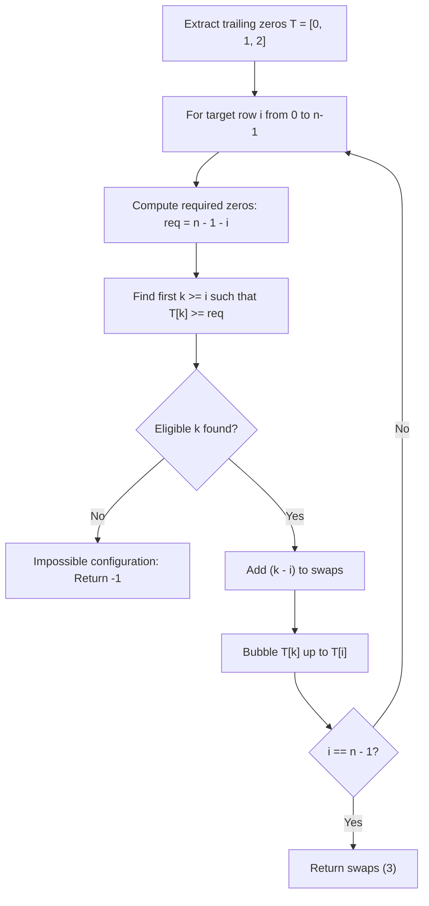

# Guided Example: Minimum Swaps to Arrange a Binary Grid

We trace the step-by-step execution of the optimal greedy bubble-selection algorithm on a representative $3 \times 3$ binary grid to achieve a lower-triangular form with minimum adjacent-row swaps.

- **Input Grid:** $\begin{pmatrix} 0 & 0 & 1 \\ 1 & 1 & 0 \\ 1 & 0 & 0 \end{pmatrix}$ of dimension $n = 3$.
- **Output:** `3` (three adjacent row swaps transform the grid into a valid configuration where all cells above the main diagonal are zero).

This instance demonstrates row qualification abstraction via trailing zero counts, greedy nearest-candidate selection, and simulated adjacent-swap displacement without modifying the original two-dimensional grid.

---

## 1. Instance & Teaching Goal

We are given an $n \times n$ binary grid with $n = 3$:

$$\text{grid} = \begin{bmatrix} 0 & 0 & 1 \\ 1 & 1 & 0 \\ 1 & 0 & 0 \end{bmatrix}$$

A configuration is **valid** if every cell strictly above the main diagonal is zero, meaning $\text{grid}[i][j] = 0$ for all $j > i$.

Equivalently, row $i$ must end with at least $n - 1 - i$ trailing zeros:
- Row $i = 0$ requires at least $3 - 1 - 0 = 2$ trailing zeros (columns 1 and 2 must be 0).
- Row $i = 1$ requires at least $3 - 1 - 1 = 1$ trailing zero (column 2 must be 0).
- Row $i = 2$ requires at least $3 - 1 - 2 = 0$ trailing zeros (no constraint).

In one operation, we can swap any two adjacent rows.

**Teaching Goal:**
Understand how to abstract two-dimensional grid requirements into a one-dimensional array of trailing zero counts, and prove that greedily picking the closest eligible row from the remaining suffix minimizes total adjacent swaps.

---

## 2. Conceptual Foundation & Invariants

```
+-------------------------------------------------------------------------+
|                  TRAILING ZERO & BUBBLE SELECTION MODEL                 |
+-------------------------------------------------------------------------+
|  Initial Grid:                                                          |
|  Row 0: [0, 0, 1]  --> Trailing Zeros = 0 (rightmost 1 at col 2)        |
|  Row 1: [1, 1, 0]  --> Trailing Zeros = 1 (rightmost 1 at col 1)        |
|  Row 2: [1, 0, 0]  --> Trailing Zeros = 2 (rightmost 1 at col 0)        |
|                                                                         |
|  Array of Trailing Zeros: T = [0, 1, 2]                                 |
|                                                                         |
|  Target Row i = 0 (Requires >= 2 zeros):                                |
|    Scan T from index 0: T[0]=0 (No), T[1]=1 (No), T[2]=2 (Yes!)         |
|    Bubble index 2 up to index 0: Cost = 2 - 0 = 2 swaps                 |
|    State of T becomes: [2, 0, 1]                                        |
|                                                                         |
|  Target Row i = 1 (Requires >= 1 zero):                                 |
|    Scan T from index 1: T[1]=0 (No), T[2]=1 (Yes!)                      |
|    Bubble index 2 up to index 1: Cost = 2 - 1 = 1 swap                  |
|    State of T becomes: [2, 1, 0]                                        |
|                                                                         |
|  Target Row i = 2 (Requires >= 0 zeros):                                |
|    Scan T from index 2: T[2]=0 (Yes!)                                   |
|    Bubble cost = 0 swaps                                                |
|                                                                         |
|  Total Adjacent Swaps = 2 + 1 + 0 = 3                                   |
+-------------------------------------------------------------------------+
```

We establish the core state parameters:

| State Variable | Definition & Role | Initial Value |
|---|---|---|
| $T$ | Array of trailing zero counts for current rows | $[0, 1, 2]$ |
| $i$ | Current target row index being satisfied | $0$ |
| $\text{req}_i$ | Minimum trailing zeros needed at row $i$: $n - 1 - i$ | $\text{req}_0 = 2$ |
| $k$ | Index of the first row at or below $i$ satisfying $T[k] \ge \text{req}_i$ | Located during scan |
| $\text{swaps}$ | Cumulative count of adjacent row swaps executed | $0$ |

> **Greedy Nearest Candidate Invariant.** At target row $i$, any candidate row $k \ge i$ with $T[k] \ge n - 1 - i$ can satisfy the requirement. Selecting the minimal index $k$ minimizes the immediate swap cost $k - i$ while preserving the relative order of all other remaining rows. If no $k \ge i$ satisfies $T[k] \ge n - 1 - i$, the grid cannot be transformed into valid form and the algorithm emits $-1$.



---

## 3. Step-by-Step Worked Execution

### Preprocessing: Trailing Zero Extraction

For each row in $\text{grid}$, we count consecutive zeros from the right:
- Row 0: `[0, 0, 1]` has rightmost 1 at index 2 $\implies 3 - 1 - 2 = 0$ trailing zeros.
- Row 1: `[1, 1, 0]` has rightmost 1 at index 1 $\implies 3 - 1 - 1 = 1$ trailing zero.
- Row 2: `[1, 0, 0]` has rightmost 1 at index 0 $\implies 3 - 1 - 0 = 2$ trailing zeros.

Initial array: $T = [0, 1, 2]$.

---

### Step 1: Satisfying Target Row $i = 0$
- Required trailing zeros: $\text{req}_0 = n - 1 - 0 = 2$.
- Search $k \ge 0$ for $T[k] \ge 2$:
  - $k = 0$: $T[0] = 0 < 2$ (insufficient).
  - $k = 1$: $T[1] = 1 < 2$ (insufficient).
  - $k = 2$: $T[2] = 2 \ge 2$ (candidate found!).
- Cost to bubble row 2 up to position 0:
  $$\Delta \text{swaps} = k - i = 2 - 0 = 2$$
  $\text{swaps} \leftarrow 0 + 2 = 2$.
- Update $T$ by shifting elements between index 0 and 2:
  - Element $T[2] = 2$ moves to position 0.
  - Intermediate elements $T[0]$ and $T[1]$ shift right to positions 1 and 2.
  - New array: $T = [2, 0, 1]$.

| Step | Target $i$ | Required Zeros | Found Index $k$ | Swap Cost $k - i$ | Array $T$ After Bubble | Cumulative Swaps |
|---|---|---|---|---|---|---|
| Pre | - | - | - | - | $[0, 1, 2]$ | 0 |
| 1 | 0 | 2 | 2 | 2 | $[2, 0, 1]$ | 2 |

---

### Step 2: Satisfying Target Row $i = 1$
- Required trailing zeros: $\text{req}_1 = n - 1 - 1 = 1$.
- Search $k \ge 1$ in $T = [2, 0, 1]$:
  - $k = 1$: $T[1] = 0 < 1$ (insufficient).
  - $k = 2$: $T[2] = 1 \ge 1$ (candidate found!).
- Cost to bubble row 2 up to position 1:
  $$\Delta \text{swaps} = k - i = 2 - 1 = 1$$
  $\text{swaps} \leftarrow 2 + 1 = 3$.
- Update $T$:
  - Element $T[2] = 1$ moves to position 1.
  - Element $T[1] = 0$ shifts right to position 2.
  - New array: $T = [2, 1, 0]$.

| Step | Target $i$ | Required Zeros | Found Index $k$ | Swap Cost $k - i$ | Array $T$ After Bubble | Cumulative Swaps |
|---|---|---|---|---|---|---|
| 2 | 1 | 1 | 2 | 1 | $[2, 1, 0]$ | 3 |

---

### Step 3: Satisfying Target Row $i = 2$
- Required trailing zeros: $\text{req}_2 = n - 1 - 2 = 0$.
- Search $k \ge 2$ in $T = [2, 1, 0]$:
  - $k = 2$: $T[2] = 0 \ge 0$ (candidate found!).
- Cost to bubble row 2 to position 2:
  $$\Delta \text{swaps} = 2 - 2 = 0$$
- Array remains: $T = [2, 1, 0]$.

All $n = 3$ rows are now valid. Final swap count is **`3`**.

---

## 4. Complete Execution Trace

The full transition sequence across all target row positions is summarized below:

| Target Row $i$ | Requirement $\text{req}_i$ | Pre-Step $T$ | Scan Traversal | Chosen $k$ | Inversion Distance $k - i$ | Post-Step $T$ | Running Swaps |
|---|---|---|---|---|---|---|---|
| 0 | $\ge 2$ | $[0, 1, 2]$ | Check $k=0$ (0), $k=1$ (1), $k=2$ (2) | 2 | $2 - 0 = 2$ | $[2, 0, 1]$ | 2 |
| 1 | $\ge 1$ | $[2, 0, 1]$ | Check $k=1$ (0), $k=2$ (1) | 2 | $2 - 1 = 1$ | $[2, 1, 0]$ | 3 |
| 2 | $\ge 0$ | $[2, 1, 0]$ | Check $k=2$ (0) | 2 | $2 - 2 = 0$ | $[2, 1, 0]$ | 3 |
| End | - | $[2, 1, 0]$ | All constraints satisfied | - | - | Complete | **3** |

---

## 5. Algorithmic Correctness

**Soundness.**
- An adjacent swap between rows $r$ and $r+1$ changes only their relative order, leaving all other rows unchanged.
- Moving a row from index $k$ to $i$ ($k > i$) by successive adjacent swaps requires exactly $k - i$ operations, which is the minimum possible distance in the transposition graph.
- When $T[k] \ge n - 1 - i$, placing row $k$ at index $i$ guarantees that columns $j \in [i+1, n-1]$ in row $i$ are all zeros, directly satisfying the upper-triangular requirement.

**Completeness.**
- Requirement monotonicity: The requirements $\text{req}_i = n - 1 - i$ are strictly decreasing with $i$ ($\text{req}_0 > \text{req}_1 > \dots > \text{req}_{n-1}$).
- Any row qualifying for target $i$ also qualifies for any subsequent target $i' > i$.
- By selecting the smallest index $k \ge i$ that satisfies $\text{req}_i$, we leave more qualified rows with larger trailing zero counts intact for lower indices where possible, and avoid unnecessary inversions.
- If at any step $i$ no remaining row has $\ge \text{req}_i$ trailing zeros, then by the pigeonhole principle no valid assignment of the remaining rows can ever satisfy position $i$, proving that valid rearrangement is impossible and returning $-1$ is correct.

---

## 6. Traps This Instance Exposes

- **Full Grid Swapping Overhead:** Physically swapping $n$-element arrays in the 2D matrix during every bubble step takes $\mathcal{O}(n)$ per adjacent swap, inflating total time to $\mathcal{O}(n^3)$. Operating exclusively on the 1D trailing zeros array $T$ reduces each swap to $\mathcal{O}(1)$.
- **Choosing the Maximally Qualified Row:** Greedily picking the row with the largest trailing zero count instead of the nearest eligible row is incorrect. It may pull a row from deep in the array at huge swap cost when a nearby row with just enough zeros would suffice.
- **Handling Impossible Grids:** When multiple rows lack sufficient trailing zeros (e.g. four rows of `[0, 1, 1, 0]` where none has 3 trailing zeros), the search for $k$ fails. The algorithm must safely detect this condition and emit $-1$ without entering an infinite loop.
- **Off-by-One in Trailing Zero Computation:** For an all-zero row, the rightmost 1 does not exist, giving $n$ trailing zeros. Handled properly, $n \ge n - 1 - i$ is always satisfied, correctly identifying all-zero rows as universally eligible.

---

## 7. Complexity Derivation

- **Time Complexity:**
  - Precomputing trailing zero counts across all $n$ rows of length $n$ takes $\mathcal{O}(n^2)$ time.
  - For each target position $i \in [0, n-1]$:
    - Scanning for the first eligible row $k \in [i, n-1]$ takes at most $n - i$ steps.
    - Shifting elements in array $T$ from $k$ down to $i$ takes $k - i \le n$ operations.
    - Summing over all $n$ positions yields $\sum_{i=0}^{n-1} \mathcal{O}(n) = \mathcal{O}(n^2)$ time.
  - Overall time complexity is $\mathcal{O}(n^2)$. For $n \le 200$, $n^2 \le 40,000$ operations, which executes in a few milliseconds.
- **Auxiliary Space Complexity:**
  - The array $T$ of trailing zero counts requires $\mathcal{O}(n)$ auxiliary memory.
  - All shifts and updates are performed in-place within $T$, yielding $\mathcal{O}(n)$ total auxiliary space.
