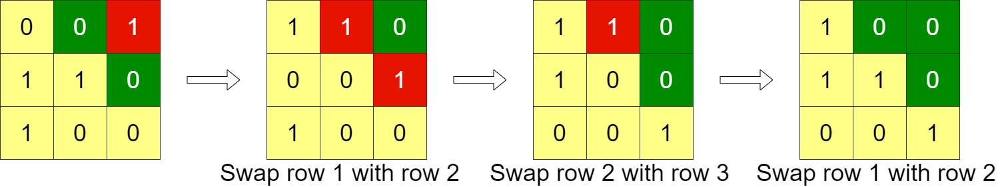
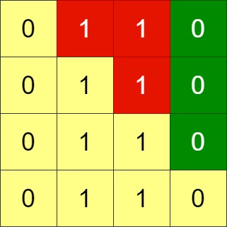
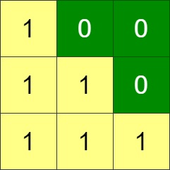

### 1. Description

Given an `n x n` binary `grid`, in one step you can choose two **adjacent rows** of the grid and swap them.

A grid is said to be **valid** if all the cells above the main diagonal are **zeros**.

Return *the minimum number of steps* needed to make the grid valid, or **-1** if the grid cannot be valid.

The main diagonal of a grid is the diagonal that starts at cell `(1, 1)` and ends at cell `(n, n)`.

### 2. Function Contract

**Inputs**

- `grid`: Input parameter (`List[List[int]]`).

**Return value**

- Returns `int`.

### 3. Examples

#### Example 1

- **Input:** `grid = [[0,0,1],[1,1,0],[1,0,0]]`
- **Output:** `3`

#### Example 2

- **Input:** `grid = [[0,1,1,0],[0,1,1,0],[0,1,1,0],[0,1,1,0]]`
- **Output:** `-1`
- **Explanation:** All rows are similar, swaps have no effect on the grid.

#### Example 3

- **Input:** `grid = [[1,0,0],[1,1,0],[1,1,1]]`
- **Output:** `0`

### 4. Constraints

- $n = \text{grid.length}$ $= \text{grid}[i].length$

- $1 \le n \le 200$

- $\text{grid}[i][j]$ is either `0` or `1`
