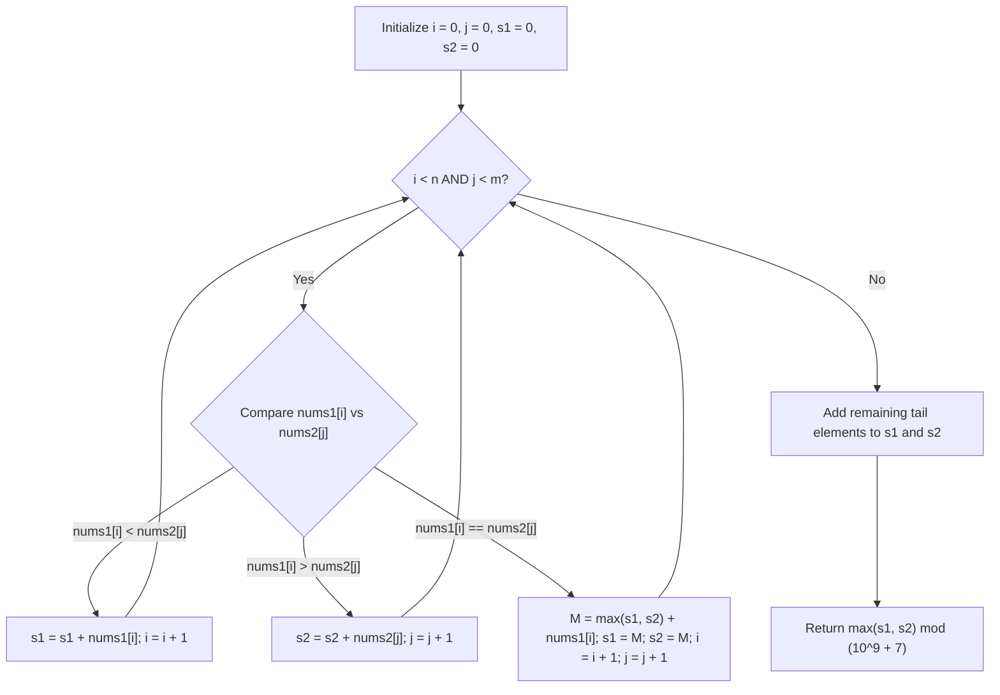

# Guided Example: Get the Maximum Score

We trace the step-by-step execution of the optimal two-pointer dynamic programming algorithm on a representative dual-array instance to compute the maximum score achievable through valid switching paths.

- **Input:** Two strictly increasing arrays $\text{nums1} = [2, 4, 5, 8, 10]$ and $\text{nums2} = [4, 6, 8, 9]$.
- **Output:** `30` (the optimal path traverses $2 \rightarrow 4 \rightarrow 6 \rightarrow 8 \rightarrow 10$ with cumulative score 30).

This instance demonstrates segment partitioning around shared intersection nodes ($4$ and $8$), dynamic route synchronization, and the necessity of deferring modular reduction until the final maximum score is determined.

---

## 1. Instance & Teaching Goal

We are given two strictly increasing arrays of distinct positive integers:

$$\text{nums1} = [2, 4, 5, 8, 10], \quad \text{nums2} = [4, 6, 8, 9]$$

Lengths: $n = 5$, $m = 4$.

Rules of the game:
1. A valid path begins at index $0$ of either $\text{nums1}$ or $\text{nums2}$ and proceeds strictly left-to-right.
2. At any value appearing in both arrays (intersection node), the path may continue along its current array or switch to the other array.
3. The shared value is counted exactly once at the junction.
4. The score is the sum of all visited elements.
5. Return the maximum possible score modulo $10^9 + 7$.

**Teaching Goal:**
Understand how the problem decomposes into independent sub-paths separated by intersection values. By maintaining two running accumulators via a two-pointer merge scan, we synchronize decisions at each common node in $\mathcal{O}(n + m)$ time and $\mathcal{O}(1)$ space.

---

## 2. Conceptual Foundation & Invariants

```
+-------------------------------------------------------------------------+
|                  INTERSECTION SEGMENT RECOMBINATION                     |
+-------------------------------------------------------------------------+
|  nums1:  [2] -----> (4) -----> [5] -----> (8) -----> [10]               |
|                      ^                     ^                            |
|                      |  (Switch Allowed)   |  (Switch Allowed)          |
|                      v                     v                            |
|  nums2:  []  -----> (4) -----> [6] -----> (8) -----> [9]                |
|                                                                         |
|  Segment 0 (before 4):  nums1 sum = 2, nums2 sum = 0  --> Pick max: 2   |
|  At intersection 4:     Synchronized base = 2 + 4 = 6                   |
|                                                                         |
|  Segment 1 (4 to 8):    nums1 sum = 5, nums2 sum = 6  --> Pick max: 6   |
|  At intersection 8:     Synchronized base = 6 + 6 + 8 = 20              |
|                                                                         |
|  Segment 2 (after 8):   nums1 sum = 10, nums2 sum = 9 --> Pick max: 10  |
|                                                                         |
|  Final Optimal Score = 20 + 10 = 30                                     |
+-------------------------------------------------------------------------+
```

We establish the running state variables:

| State Variable | Definition & Role | Initial Value |
|---|---|---|
| $i$ | Pointer to the current unconsumed element in $\text{nums1}$ | $0$ |
| $j$ | Pointer to the current unconsumed element in $\text{nums2}$ | $0$ |
| $s_1$ | Best cumulative score for a path currently situated on $\text{nums1}$ | $0$ |
| $s_2$ | Best cumulative score for a path currently situated on $\text{nums2}$ | $0$ |
| $\text{MOD}$ | Modulo arithmetic base: $10^9 + 7$ | $10^9 + 7$ |

> **Segment Optimality Invariant.** Between any two consecutive intersection values (or the boundary ends), paths on $\text{nums1}$ and $\text{nums2}$ cannot cross. When both pointers reach a common value $v = \text{nums1}[i] = \text{nums2}[j]$, the maximum score up to and including $v$ is identically $M = \max(s_1, s_2) + v$. Setting $s_1 \leftarrow M$ and $s_2 \leftarrow M$ preserves the optimal decision boundary for all subsequent segments.



---

## 3. Step-by-Step Worked Execution

### Step 1: Processing Segment 0 (Values below first intersection 4)
- Current pointers: $i = 0$ ($\text{nums1}[0] = 2$), $j = 0$ ($\text{nums2}[0] = 4$).
- Comparison: $\text{nums1}[0] = 2 < 4 = \text{nums2}[0]$.
- Advance $i$: $s_1 \leftarrow s_1 + 2 = 2$, $i \leftarrow 1$.

| Pointer $i$ | Pointer $j$ | $\text{nums1}[i]$ | $\text{nums2}[j]$ | Action | $s_1$ | $s_2$ |
|---|---|---|---|---|---|---|
| 0 | 0 | 2 | 4 | $\text{nums1}[0] < \text{nums2}[0] \implies s_1 += 2, i += 1$ | 2 | 0 |

---

### Step 2: First Intersection at Value 4
- Current pointers: $i = 1$ ($\text{nums1}[1] = 4$), $j = 0$ ($\text{nums2}[0] = 4$).
- Comparison: $\text{nums1}[1] == \text{nums2}[0] == 4$.
- Intersection reached! We evaluate optimal incoming route:
  $$M = \max(s_1, s_2) + 4 = \max(2, 0) + 4 = 2 + 4 = 6$$
- Synchronize: $s_1 \leftarrow 6$, $s_2 \leftarrow 6$.
- Advance both: $i \leftarrow 2$, $j \leftarrow 1$.

| Pointer $i$ | Pointer $j$ | $\text{nums1}[i]$ | $\text{nums2}[j]$ | Action | $s_1$ | $s_2$ |
|---|---|---|---|---|---|---|
| 1 | 0 | 4 | 4 | Common node: $M = \max(2, 0) + 4 = 6$ | 6 | 6 |

---

### Step 3: Processing Segment 1 (Between 4 and 8)
- $i = 2$ ($\text{nums1}[2] = 5$), $j = 1$ ($\text{nums2}[1] = 6$).
  - $\text{nums1}[2] = 5 < 6 = \text{nums2}[1] \implies s_1 \leftarrow s_1 + 5 = 6 + 5 = 11, i \leftarrow 3$.
- $i = 3$ ($\text{nums1}[3] = 8$), $j = 1$ ($\text{nums2}[1] = 6$).
  - $\text{nums1}[3] = 8 > 6 = \text{nums2}[1] \implies s_2 \leftarrow s_2 + 6 = 6 + 6 = 12, j \leftarrow 2$.

| Pointer $i$ | Pointer $j$ | $\text{nums1}[i]$ | $\text{nums2}[j]$ | Action | $s_1$ | $s_2$ |
|---|---|---|---|---|---|---|
| 2 | 1 | 5 | 6 | $\text{nums1}[2] < \text{nums2}[1] \implies s_1 += 5$ | 11 | 6 |
| 3 | 1 | 8 | 6 | $\text{nums1}[3] > \text{nums2}[1] \implies s_2 += 6$ | 11 | 12 |

---

### Step 4: Second Intersection at Value 8
- Current pointers: $i = 3$ ($\text{nums1}[3] = 8$), $j = 2$ ($\text{nums2}[2] = 8$).
- Comparison: $\text{nums1}[3] == \text{nums2}[2] == 8$.
- Intersection reached! Evaluate incoming routes:
  - Arriving via $\text{nums1}$ gives score 11.
  - Arriving via $\text{nums2}$ gives score 12 (taking path $4 \rightarrow 6$).
  - Optimal choice: $\max(11, 12) = 12$.
- Add intersection value:
  $$M = \max(11, 12) + 8 = 12 + 8 = 20$$
- Synchronize: $s_1 \leftarrow 20$, $s_2 \leftarrow 20$.
- Advance both: $i \leftarrow 4$, $j \leftarrow 3$.

| Pointer $i$ | Pointer $j$ | $\text{nums1}[i]$ | $\text{nums2}[j]$ | Action | $s_1$ | $s_2$ |
|---|---|---|---|---|---|---|
| 3 | 2 | 8 | 8 | Common node: $M = \max(11, 12) + 8 = 20$ | 20 | 20 |

---

### Step 5: Processing Segment 2 (Values after 8) and Tail Flush
- $i = 4$ ($\text{nums1}[4] = 10$), $j = 3$ ($\text{nums2}[3] = 9$).
  - $\text{nums1}[4] = 10 > 9 = \text{nums2}[3] \implies s_2 \leftarrow s_2 + 9 = 20 + 9 = 29, j \leftarrow 4$.
- Now $j = 4 = m$, so $\text{nums2}$ is fully consumed.
- Flush remaining tail in $\text{nums1}$:
  - Remaining element is $\text{nums1}[4] = 10$.
  - $s_1 \leftarrow s_1 + 10 = 20 + 10 = 30, i \leftarrow 5 = n$.
- Final candidate scores:
  - $s_1 = 30$ (path: $2 \rightarrow 4 \rightarrow 6 \rightarrow 8 \rightarrow 10$).
  - $s_2 = 29$ (path: $2 \rightarrow 4 \rightarrow 6 \rightarrow 8 \rightarrow 9$).
- Maximum score: $\max(30, 29) = 30$.
- Apply modulo: $30 \pmod{10^9 + 7} = 30$.

---

## 4. Complete Execution Trace

The full state evolution across all pointer movements is tabulated below:

| Step | $(i, j)$ | $\text{nums1}[i]$ | $\text{nums2}[j]$ | Dominant Condition | Operation Performed | Running $s_1$ | Running $s_2$ |
|---|---|---|---|---|---|---|---|
| 0 | $(0, 0)$ | 2 | 4 | $2 < 4$ | $s_1 += 2, i += 1$ | 2 | 0 |
| 1 | $(1, 0)$ | 4 | 4 | $4 == 4$ | $M = \max(2, 0) + 4 = 6; s_1=6, s_2=6$ | 6 | 6 |
| 2 | $(2, 1)$ | 5 | 6 | $5 < 6$ | $s_1 += 5, i += 1$ | 11 | 6 |
| 3 | $(3, 1)$ | 8 | 6 | $8 > 6$ | $s_2 += 6, j += 1$ | 11 | 12 |
| 4 | $(3, 2)$ | 8 | 8 | $8 == 8$ | $M = \max(11, 12) + 8 = 20; s_1=20, s_2=20$ | 20 | 20 |
| 5 | $(4, 3)$ | 10 | 9 | $10 > 9$ | $s_2 += 9, j += 1$ | 20 | 29 |
| 6 | $(4, 4)$ | 10 | - | $j == m$ | Tail flush: $s_1 += 10, i += 1$ | 30 | 29 |
| End | $(5, 4)$ | - | - | Complete | Output $\max(s_1, s_2) \pmod{10^9 + 7}$ | **30** | 29 |

---

## 5. Algorithmic Correctness

**Soundness.**
- Switching between arrays is permitted only at shared numerical values.
- Because both arrays are strictly increasing and all elements are positive, every element along a chosen segment between two consecutive intersections $[v_k, v_{k+1}]$ must be visited to maximize the sum.
- At any intersection $v_{k+1}$, any path reaching $v_{k+1}$ must arrive either via the $\text{nums1}$ segment or the $\text{nums2}$ segment originating from $v_k$.
- The optimal substructure property holds: the maximum total score reaching $v_{k+1}$ is $\max(s_1, s_2) + v_{k+1}$.
- By setting both $s_1$ and $s_2$ to this maximum, future path segments can legally branch off $v_{k+1}$ into either array without loss of optimality.

**Completeness.**
- The two-pointer merge visits every element of $\text{nums1}$ and $\text{nums2}$ exactly once in strictly increasing order.
- No intersection value can be skipped because both arrays are sorted and duplicate-free.
- Every possible legal path consists of a sequence of choices at the intersection nodes plus the initial and final tails. The dynamic programming recurrence evaluates all segment combinations implicitly, guaranteeing that the global maximum is found.

---

## 6. Traps This Instance Exposes

- **Premature Modulo Trap:** Applying modulo $10^9 + 7$ inside the DP transition (e.g. $s_1 = (s_1 + x) \pmod{\text{MOD}}$) is mathematically fatal. Because modular equivalence destroys order ($10^9 + 8 \equiv 1 < 500$), comparing modular residues can select an inferior path. Modulo must be applied strictly once to the final total.
- **Integer Overflow in Fixed-Width Languages:** Path sums can reach $10^5 \times 10^7 = 10^{12}$, which exceeds 32-bit signed integer limits ($2^{31} - 1 \approx 2 \times 10^9$). 64-bit integers (`long long` in C++, `long` in Java, arbitrary precision in Python) must be used for accumulator calculations.
- **Double Counting Intersection Values:** When synchronizing at an intersection, adding the common value twice (once for each array) violates the rule that shared values are counted once. Computing $M = \max(s_1, s_2) + v$ adds $v$ exactly once.
- **Unconsumed Tails:** When one array finishes before the other, the remaining elements of the unexhausted array must still be added to its respective accumulator before computing the final maximum.

---

## 7. Complexity Derivation

- **Time Complexity:**
  At each step of the two-pointer loop, at least one of $i$ or $j$ advances by 1.
  Since $i$ advances at most $n$ times and $j$ advances at most $m$ times, the loop executes at most $n + m$ iterations.
  Each iteration performs constant-time arithmetic operations, comparisons, and pointer increments.
  Thus, overall time complexity is $\mathcal{O}(n + m)$. For $n, m \le 10^5$, this requires at most $2 \cdot 10^5$ operations, taking a few milliseconds.
- **Auxiliary Space Complexity:**
  Only pointers ($i, j$) and running sum accumulators ($s_1, s_2$) are allocated.
  Auxiliary space complexity is strictly $\mathcal{O}(1)$.
