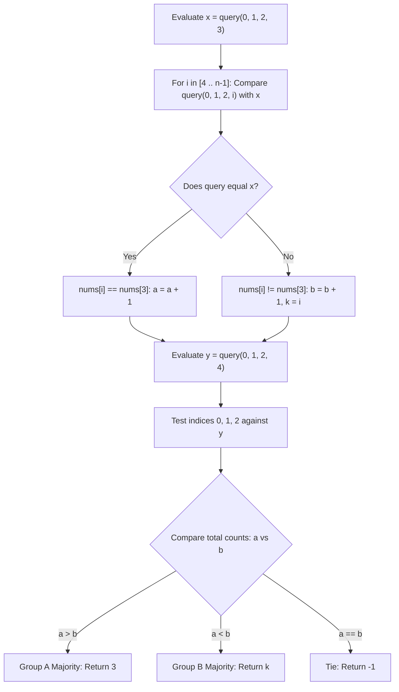

# Guided Example: Guess the Majority in a Hidden Array

We trace the step-by-step execution of differential query parity analysis on an 8-element hidden binary array to locate an index holding the majority bit within $n + 1 \le 2n$ interactive queries.

- **Input:** Hidden binary array $\text{nums} = [0, 0, 1, 0, 1, 1, 1, 1]$ of length $n = 8$, accessible only via `ArrayReader.query(a, b, c, d)`.
- **Output:** `2` (or any index in $\{2, 4, 5, 6, 7\}$ holding the majority bit $1$).

This instance demonstrates bit equivalence testing without decoding absolute values, anchoring on index 3, and partitioning all $n$ indices into two complementary equivalence classes.

---

## 1. Instance & Teaching Goal

We are given an inaccessible binary array of length $n = 8$:

$$\text{nums} = [0, 0, 1, 0, 1, 1, 1, 1]$$

Ground truth distribution:
- Value $0$: at indices $\{0, 1, 3\}$ (count = 3).
- Value $1$: at indices $\{2, 4, 5, 6, 7\}$ (count = 5).
- Majority bit is $1$, and any index holding $1$ is an acceptable answer.

The `ArrayReader.query(a, b, c, d)` API requires $a < b < c < d$ and returns:
- $4$ if all four elements are identical ($4$ zeros or $4$ ones).
- $2$ if three elements match and one differs ($3$ zeros and $1$ one, or $1$ zero and $3$ ones).
- $0$ if two elements are zero and two are one.

Allowed queries: at most $2n = 16$.

**Teaching Goal:**
Understand the **Single-Substitution Invariant**: comparing two 4-element queries that differ by exactly one index reveals whether the two swapped elements have the same or opposite bit values. By anchoring on index 3, we classify every element in $\mathcal{O}(n)$ queries.

---

## 2. Conceptual Foundation & Invariants

```
+-------------------------------------------------------------------------+
|                  DIFFERENTIAL SUBSTITUTION MECHANISM                    |
+-------------------------------------------------------------------------+
|  Reference Query: x = query(0, 1, 2, 3)                                 |
|  Target Query:        query(0, 1, 2, i)   for any i >= 4                |
|                                                                         |
|  Shared context: indices {0, 1, 2}, sum = S in {0, 1, 2, 3}             |
|  - If nums[i] == nums[3]: Distribution of 4 bits is identical           |
|    ==> query(0, 1, 2, i) == query(0, 1, 2, 3)                           |
|  - If nums[i] != nums[3]: Sum changes by +/- 1, shifting return category|
|    ==> query(0, 1, 2, i) != query(0, 1, 2, 3)                           |
|                                                                         |
|  CONCLUSION:                                                            |
|    query(0, 1, 2, i) == x  <===>  nums[i] == nums[3]                    |
|                                                                         |
|  Two Equivalence Classes:                                               |
|  - Group A (Same as nums[3]):       Count a, representative = 3         |
|  - Group B (Different from nums[3]): Count b, representative = k         |
+-------------------------------------------------------------------------+
```

We establish the classification state variables:

| State Variable | Definition & Role | Initial Value |
|---|---|---|
| $x$ | Baseline reference query: $\text{query}(0, 1, 2, 3)$ | Evaluated at start |
| $y$ | Pivot reference query: $\text{query}(0, 1, 2, 4)$ | Evaluated for prefix resolution |
| $a$ | Count of elements equal to $\text{nums}[3]$ | $1$ (includes index 3) |
| $b$ | Count of elements different from $\text{nums}[3]$ | $0$ |
| $k$ | Known representative index of Group B | $0$ |

> **Single-Substitution Invariant.** Let $Q(S \cup \{u\})$ and $Q(S \cup \{v\})$ be two queries sharing a common 3-element base $S$. Because the query response is uniquely determined by the multi-set of bits, $Q(S \cup \{u\}) = Q(S \cup \{v\})$ holds if and only if $\text{nums}[u] = \text{nums}[v]$. This allows classifying every element relative to $\text{nums}[3]$ using exactly one query.



---

## 3. Step-by-Step Worked Execution

### Step 1: Base Reference Query and Initialization
- We probe the first four positions:
  $$\text{indices} = \{0, 1, 2, 3\}, \quad \text{values} = \{0, 0, 1, 0\}$$
  This set contains three $0$s and one $1$, so the API returns $2$:
  $$x = \text{query}(0, 1, 2, 3) = 2$$
- Initialize partition counters relative to anchor index 3:
  - $a = 1$ (index 3 matches itself).
  - $b = 0$ (no differing elements recorded yet).
  - Representative $k = 0$.

| Query Evaluated | Queried Indices | Hidden Values | API Output | State Variables |
|---|---|---|---|---|
| Initial Anchor | $\{0, 1, 2, 3\}$ | $\{0, 0, 1, 0\}$ | $x = 2$ | $a = 1, b = 0, k = 0$ |

---

### Step 2: Classifying Suffix Indices $i \in [4, 7]$

We substitute index $i$ for index 3, comparing $\text{query}(0, 1, 2, i)$ with $x = 2$:

- **Probe $i = 4$:** $\text{query}(0, 1, 2, 4)$ has values $\{0, 0, 1, 1\}$ (two $0$s, two $1$s) $\implies \text{returns } 0$.
  - $0 \neq x = 2 \implies \text{nums}[4] \neq \text{nums}[3]$.
  - Update: $b \leftarrow 0 + 1 = 1, k \leftarrow 4$.
- **Probe $i = 5$:** $\text{query}(0, 1, 2, 5)$ has values $\{0, 0, 1, 1\} \implies \text{returns } 0$.
  - $0 \neq x = 2 \implies \text{nums}[5] \neq \text{nums}[3]$.
  - Update: $b \leftarrow 1 + 1 = 2, k \leftarrow 5$.
- **Probe $i = 6$:** $\text{query}(0, 1, 2, 6)$ has values $\{0, 0, 1, 1\} \implies \text{returns } 0$.
  - $0 \neq x = 2 \implies \text{nums}[6] \neq \text{nums}[3]$.
  - Update: $b \leftarrow 2 + 1 = 3, k \leftarrow 6$.
- **Probe $i = 7$:** $\text{query}(0, 1, 2, 7)$ has values $\{0, 0, 1, 1\} \implies \text{returns } 0$.
  - $0 \neq x = 2 \implies \text{nums}[7] \neq \text{nums}[3]$.
  - Update: $b \leftarrow 3 + 1 = 4, k \leftarrow 7$.

| Index $i$ | Queried Indices | Hidden Values | Return | Comparison vs $x=2$ | Group Assignment | $(a, b, k)$ |
|---|---|---|---|---|---|---|
| 4 | $\{0, 1, 2, 4\}$ | $\{0, 0, 1, 1\}$ | $0$ | $0 \neq 2$ | Group B ($\neq \text{nums}[3]$) | $(1, 1, 4)$ |
| 5 | $\{0, 1, 2, 5\}$ | $\{0, 0, 1, 1\}$ | $0$ | $0 \neq 2$ | Group B ($\neq \text{nums}[3]$) | $(1, 2, 5)$ |
| 6 | $\{0, 1, 2, 6\}$ | $\{0, 0, 1, 1\}$ | $0$ | $0 \neq 2$ | Group B ($\neq \text{nums}[3]$) | $(1, 3, 6)$ |
| 7 | $\{0, 1, 2, 7\}$ | $\{0, 0, 1, 1\}$ | $0$ | $0 \neq 2$ | Group B ($\neq \text{nums}[3]$) | $(1, 4, 7)$ |

---

### Step 3: Classifying Prefix Indices $\{0, 1, 2\}$

To classify indices $0, 1, 2$, we compare against $y = \text{query}(0, 1, 2, 4) = 0$:

- **Index 0:** Compare $\text{query}(1, 2, 3, 4)$ against $y$.
  - $\text{query}(1, 2, 3, 4)$ replaces index 0 with index 3. Values are $\{0, 1, 0, 1\}$ (two $0$s, two $1$s) $\implies \text{returns } 0$.
  - Result matches $y = 0 \implies \text{nums}[0] == \text{nums}[3]$.
  - Update: $a \leftarrow a + 1 = 2$.
- **Index 1:** Compare $\text{query}(0, 2, 3, 4)$ against $y$.
  - Replaces index 1 with index 3. Values are $\{0, 1, 0, 1\}$ (two $0$s, two $1$s) $\implies \text{returns } 0$.
  - Result matches $y = 0 \implies \text{nums}[1] == \text{nums}[3]$.
  - Update: $a \leftarrow a + 1 = 3$.
- **Index 2:** Compare $\text{query}(0, 1, 3, 4)$ against $y$.
  - Replaces index 2 with index 3. Values are $\{0, 0, 0, 1\}$ (three $0$s, one $1$s) $\implies \text{returns } 2$.
  - Result $2 \neq y = 0 \implies \text{nums}[2] \neq \text{nums}[3]$.
  - Update: $b \leftarrow b + 1 = 5, k \leftarrow 2$.

---

### Step 4: Majority Evaluation

Final counts across all 8 elements:
- Group A (elements equal to $\text{nums}[3] = 0$): $a = 3$, indices $\{0, 1, 3\}$.
- Group B (elements different from $\text{nums}[3]$, i.e. $1$): $b = 5$, indices $\{2, 4, 5, 6, 7\}$.

Since $b = 5 > 3 = a$, Group B holds the strict majority.
We return representative index $k = 2$.
Total queries executed: $1 + 4 + 1 + 3 = 9 \le 16$.

---

## 4. Complete Execution Trace

The entire interactive query trace and classification progression is summarized below:

| Query # | Indices Passed $(a, b, c, d)$ | Returned Value | Target Evaluated | Inferred Relationship | Running $a$ | Running $b$ | Active $k$ |
|---|---|---|---|---|---|---|---|
| 1 | $(0, 1, 2, 3)$ | 2 | Baseline $x$ | Anchor established at index 3 | 1 | 0 | 0 |
| 2 | $(0, 1, 2, 4)$ | 0 | Index 4 | $\text{nums}[4] \neq \text{nums}[3]$ | 1 | 1 | 4 |
| 3 | $(0, 1, 2, 5)$ | 0 | Index 5 | $\text{nums}[5] \neq \text{nums}[3]$ | 1 | 2 | 5 |
| 4 | $(0, 1, 2, 6)$ | 0 | Index 6 | $\text{nums}[6] \neq \text{nums}[3]$ | 1 | 3 | 6 |
| 5 | $(0, 1, 2, 7)$ | 0 | Index 7 | $\text{nums}[7] \neq \text{nums}[3]$ | 1 | 4 | 7 |
| 6 | $(0, 1, 2, 4)$ | 0 | Reference $y$ | Pivot established for prefix | 1 | 4 | 7 |
| 7 | $(1, 2, 3, 4)$ | 0 | Index 0 | $\text{nums}[0] == \text{nums}[3]$ | 2 | 4 | 7 |
| 8 | $(0, 2, 3, 4)$ | 0 | Index 1 | $\text{nums}[1] == \text{nums}[3]$ | 3 | 4 | 7 |
| 9 | $(0, 1, 3, 4)$ | 2 | Index 2 | $\text{nums}[2] \neq \text{nums}[3]$ | 3 | 5 | 2 |
| Result | - | - | Complete | Group B Majority ($b > a$) | 3 | 5 | **Return 2** |

---

## 5. Algorithmic Correctness

**Soundness.**
Let $S$ be any fixed set of 3 indices, and let its sum of bits be $\Sigma \in \{0, 1, 2, 3\}$.
For any index $u \notin S$, the 4-element sum is $\Sigma + \text{nums}[u] \in [0, 4]$.
The API maps the 4-bit sum as follows:
- $\text{Sum} \in \{0, 4\} \implies 4$
- $\text{Sum} \in \{1, 3\} \implies 2$
- $\text{Sum} = 2 \implies 0$

For every possible integer $\Sigma \in \{0, 1, 2, 3\}$, the query output for bit value $0$ ($\text{Sum} = \Sigma$) is strictly distinct from the query output for bit value $1$ ($\text{Sum} = \Sigma + 1$):
- If $\Sigma = 0$: bit $0 \implies 4$, bit $1 \implies 2$ (unequal).
- If $\Sigma = 1$: bit $0 \implies 2$, bit $1 \implies 0$ (unequal).
- If $\Sigma = 2$: bit $0 \implies 0$, bit $1 \implies 2$ (unequal).
- If $\Sigma = 3$: bit $0 \implies 2$, bit $1 \implies 4$ (unequal).

Thus, $Q(S \cup \{u\}) = Q(S \cup \{v\}) \iff \text{nums}[u] = \text{nums}[v]$ is an exact mathematical isomorphism. Every element is categorized into the correct equivalence class without error.

**Completeness.**
All $n$ indices are classified:
- Suffix indices $4 \le i < n$ are tested against index 3 via base $S = \{0, 1, 2\}$.
- Prefix indices $0, 1, 2$ are tested against index 3 via base $S \setminus \{i\} \cup \{4\}$.
- Index 3 is in Group A by definition.
Because all $n$ indices are partitioned into Group A and Group B, $a + b = n$. If $a > b$, Group A contains the strict majority; if $b > a$, Group B contains the strict majority; if $a = b$, no majority exists and $-1$ is returned.

---

## 6. Traps This Instance Exposes

- **Attempting to Deduce Absolute Bit Values:** Trying to determine whether $\text{nums}[3]$ is $0$ or $1$ is impossible when $n$ is symmetric, and entirely unnecessary. The problem only asks for an index holding the majority bit, which is fully determined by relative equivalence class sizes.
- **Illegal Query Arguments:** Calling `query` with non-distinct or non-increasing indices (e.g. $a \ge b$) triggers API validation errors. Queries must always preserve strict ascending order $a < b < c < d$.
- **Equal Frequency Tie Handling:** If $a == b$, neither bit achieves a strict majority. The algorithm must return $-1$ rather than arbitrarily picking index 3 or $k$.
- **Representative Validity:** When Group B is the majority, variable $k$ must hold a valid index assigned during a mismatch step. Since $b > a \ge 1$, at least one mismatch has occurred, ensuring $k$ is always a legitimate index in Group B.

---

## 7. Complexity Derivation

- **Query & Time Complexity:**
  - One anchor query $\text{query}(0, 1, 2, 3)$ at the start.
  - $n - 4$ queries for the suffix loop $i \in [4, n-1]$.
  - One pivot query $\text{query}(0, 1, 2, 4)$.
  - Three prefix queries for indices $0, 1, 2$.
  - Total queries: $1 + (n - 4) + 1 + 3 = n + 1$.
  - For any $n \ge 5$, $n + 1 \le 2n$, easily meeting the budget of $2n$ queries.
  - Each query is $\mathcal{O}(1)$, yielding $\mathcal{O}(n)$ total time.
- **Auxiliary Space Complexity:**
  - Only scalar counters and integer registers ($a, b, k, x, y$) are stored.
  - Auxiliary space complexity is strictly $\mathcal{O}(1)$.
