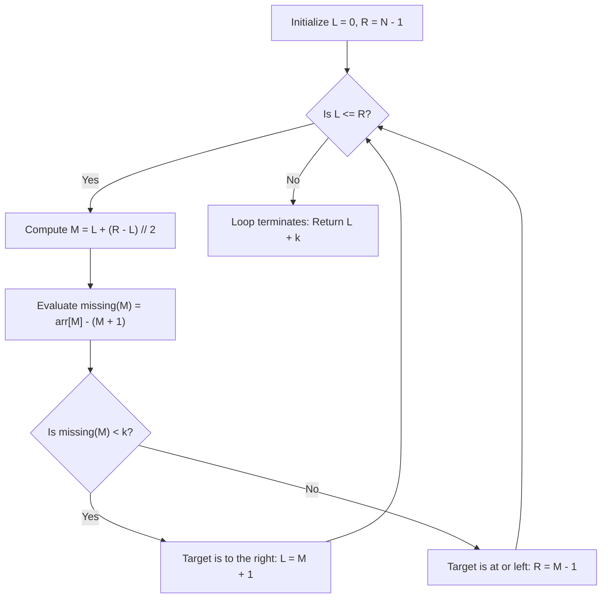

# Guided Example: Kth Missing Positive Number

We trace the step-by-step execution of the optimal logarithmic binary search on a representative strictly increasing array to find the $k$-th missing positive integer.

- **Input:** Array $\text{arr} = [2, 3, 4, 7, 11]$ of length $N = 5$, with missing rank $k = 5$.
- **Output:** `9` (the missing sequence is $1, 5, 6, 8, 9, 10, \dots$, whose 5th element is 9).

This instance demonstrates the missing count function $\text{missing}(m) = \text{arr}[m] - (m + 1)$, monotonic bisection, and the closed-form boundary cancellation identity $\text{Ans} = L + k$.

---

## 1. Instance & Teaching Goal

Given a strictly increasing array of positive integers:

$$\text{arr} = [2, 3, 4, 7, 11], \quad k = 5$$

The positive integers absent from $\text{arr}$ form an infinite increasing sequence:

$$\text{Missing Sequence} = [1, 5, 6, 8, \mathbf{9}, 10, 12, \dots]$$

Indices and values:
- 1st missing: $1$ (before $\text{arr}[0] = 2$)
- 2nd missing: $5$ (between $\text{arr}[2] = 4$ and $\text{arr}[3] = 7$)
- 3rd missing: $6$ (between $\text{arr}[2] = 4$ and $\text{arr}[3] = 7$)
- 4th missing: $8$ (between $\text{arr}[3] = 7$ and $\text{arr}[4] = 11$)
- 5th missing: $9$ (between $\text{arr}[3] = 7$ and $\text{arr}[4] = 11$)

**Teaching Goal:**
Understand how to avoid linear scanning $\mathcal{O}(N)$ or set simulation by formulating a monotonic deficiency function $\text{missing}(m) = \text{arr}[m] - (m + 1)$, bisecting the insertion point $L$ in $\mathcal{O}(\log N)$ time, and applying the algebraic cancellation $\text{Ans} = L + k$.

---

## 2. Conceptual Foundation & Invariants

```
+-------------------------------------------------------------------------+
|                  MISSING DEFICIENCY BISECTION MODEL                     |
+-------------------------------------------------------------------------+
|  Index m:              0     1     2     3     4                        |
|  arr[m]:               2     3     4     7    11                        |
|  Ideal (no missing):   1     2     3     4     5  (expected = m + 1)   |
|                                                                         |
|  missing(m) = arr[m] - (m + 1):                                         |
|                        1     1     1     3     6  (Monotonically rises) |
|                                                                         |
|  We seek the first index L where missing(L) >= k = 5:                   |
|  - missing(2) = 1 < 5  --> Target is to the right                       |
|  - missing(3) = 3 < 5  --> Target is to the right                       |
|  - missing(4) = 6 >= 5 --> Target is at or before index 4               |
|                                                                         |
|  Boundary Convergence: L = 4.                                           |
|  The k-th missing value is:                                             |
|    arr[L - 1] + (k - missing(L - 1))                                    |
|    = arr[3] + (5 - (arr[3] - 4))                                        |
|    = 7 + (5 - 3) = 7 + 2 = 9                                            |
|    ALGEBRAIC CANCELLATION: arr[L-1] cancels, leaving L + k = 4 + 5 = 9! |
+-------------------------------------------------------------------------+
```

We establish the search state parameters:

| State Variable | Definition & Role | Initial Value |
|---|---|---|
| $L$ | Lower bound index of the binary search | $0$ |
| $R$ | Upper bound index of the binary search | $N - 1 = 4$ |
| $M$ | Midpoint probe index: $\lfloor (L + R) / 2 \rfloor$ | $2$ |
| $\text{missing}(M)$ | Count of missing positive integers strictly before index $M$ | $\text{arr}[M] - (M + 1)$ |
| $k$ | Target ordinal rank of the missing integer | $5$ |

> **Monotonic Deficiency Invariant.** Because $\text{arr}[i]$ is strictly increasing ($\text{arr}[i+1] \ge \text{arr}[i] + 1$), the quantity $\text{missing}(m) = \text{arr}[m] - m - 1$ is non-decreasing ($\text{missing}(m+1) \ge \text{missing}(m)$). Thus, binary search correctly bisects the partition where $\text{missing}(m) < k$ versus $\text{missing}(m) \ge k$.



---

## 3. Step-by-Step Worked Execution

### Iteration 1: Initial Midpoint Probe
- Bounds: $L = 0, R = 4$.
- Midpoint: $M = 0 + \lfloor (4 - 0) / 2 \rfloor = 2$.
- Array value: $\text{arr}[2] = 4$.
- Missing count before index 2:
  $$\text{missing}(2) = \text{arr}[2] - (2 + 1) = 4 - 3 = 1$$
  (Only positive integer $1$ is missing before $\text{arr}[2]$).
- Comparison: $\text{missing}(2) = 1 < 5 = k$.
- Decision:
  There are only 1 missing positive integer up to index 2, which is fewer than $k = 5$. The 5th missing number must appear strictly after index 2.
  $$L \leftarrow M + 1 = 3$$

| Iteration | $L$ | $R$ | Probe $M$ | $\text{arr}[M]$ | $\text{missing}(M)$ | Predicate ($\text{missing} < k$) | Updated Bounds |
|---|---|---|---|---|---|---|---|
| 1 | 0 | 4 | 2 | 4 | $4 - 3 = 1$ | $1 < 5$ (True) | $L = 3, R = 4$ |

---

### Iteration 2: Narrowing to Suffix
- Bounds: $L = 3, R = 4$.
- Midpoint: $M = 3 + \lfloor (4 - 3) / 2 \rfloor = 3$.
- Array value: $\text{arr}[3] = 7$.
- Missing count before index 3:
  $$\text{missing}(3) = \text{arr}[3] - (3 + 1) = 7 - 4 = 3$$
  (Missing integers before index 3 are $1, 5, 6$, total 3).
- Comparison: $\text{missing}(3) = 3 < 5 = k$.
- Decision:
  Only 3 missing integers exist up to index 3. The 5th missing integer must appear strictly after index 3.
  $$L \leftarrow M + 1 = 4$$

| Iteration | $L$ | $R$ | Probe $M$ | $\text{arr}[M]$ | $\text{missing}(M)$ | Predicate ($\text{missing} < k$) | Updated Bounds |
|---|---|---|---|---|---|---|---|
| 2 | 3 | 4 | 3 | 7 | $7 - 4 = 3$ | $3 < 5$ (True) | $L = 4, R = 4$ |

---

### Iteration 3: Final Boundary Test
- Bounds: $L = 4, R = 4$.
- Midpoint: $M = 4$.
- Array value: $\text{arr}[4] = 11$.
- Missing count before index 4:
  $$\text{missing}(4) = \text{arr}[4] - (4 + 1) = 11 - 5 = 6$$
  (Missing integers before index 4 are $1, 5, 6, 8, 9, 10$, total 6).
- Comparison: $\text{missing}(4) = 6 \ge 5 = k$.
- Decision:
  There are 6 missing integers before index 4, which is at least $k = 5$. Thus, the 5th missing integer lies strictly before $\text{arr}[4] = 11$.
  $$R \leftarrow M - 1 = 3$$

| Iteration | $L$ | $R$ | Probe $M$ | $\text{arr}[M]$ | $\text{missing}(M)$ | Predicate ($\text{missing} < k$) | Updated Bounds |
|---|---|---|---|---|---|---|---|
| 3 | 4 | 4 | 4 | 11 | $11 - 5 = 6$ | $6 < 5$ (False) | $L = 4, R = 3$ |

---

### Step 4: Convergence and Closed-Form Evaluation

The search halts because $L = 4 > 3 = R$.
At this boundary:
- $L = 4$ is the smallest index such that $\text{missing}(L) \ge k$.
- The preceding index is $L - 1 = 3$, with $\text{arr}[3] = 7$ and $\text{missing}(3) = 3$.
- To reach the 5th missing number, we need $k - \text{missing}(3) = 5 - 3 = 2$ additional missing numbers beyond $\text{arr}[3] = 7$:
  $$\text{Ans} = \text{arr}[3] + (k - \text{missing}(3)) = 7 + (5 - 3) = 7 + 2 = 9$$
- Notice that algebraically:
  $$\text{Ans} = \text{arr}[L-1] + k - (\text{arr}[L-1] - L) = L + k = 4 + 5 = 9$$

Final result: **`9`**.

---

## 4. Complete Execution Trace

The entire progression across all binary search steps is summarized below:

| Iteration | Active Range $[L, R]$ | Probe $M$ | $\text{arr}[M]$ | Ideal $M+1$ | $\text{missing}(M)$ | Branch Selected | Action Taken | Next Range |
|---|---|---|---|---|---|---|---|---|
| 1 | $[0, 4]$ | 2 | 4 | 3 | 1 | $\text{missing} < k$ ($1 < 5$) | $L = M + 1$ | $[3, 4]$ |
| 2 | $[3, 4]$ | 3 | 7 | 4 | 3 | $\text{missing} < k$ ($3 < 5$) | $L = M + 1$ | $[4, 4]$ |
| 3 | $[4, 4]$ | 4 | 11 | 5 | 6 | $\text{missing} \ge k$ ($6 \ge 5$) | $R = M - 1$ | $[4, 3]$ (Halt) |
| Terminate | $L = 4, R = 3$ | - | - | - | - | Converged | Compute $L + k$ | **Return 9** |

---

## 5. Algorithmic Correctness

**Soundness.**
- Let $L$ be the index where binary search converges.
- By definition of binary search, for all indices $i < L$, $\text{missing}(i) < k$.
- For all indices $j \ge L$, $\text{missing}(j) \ge k$.
- If $L = 0$: all missing numbers occur before $\text{arr}[0]$. The $k$-th missing number is simply $k$, which equals $L + k = 0 + k$.
- If $L > 0$: $\text{arr}[L-1]$ is the largest array element strictly preceding the $k$-th missing number.
- The number of missing integers strictly before $\text{arr}[L-1]$ is $\text{missing}(L-1) = \text{arr}[L-1] - L$.
- The remaining missing numbers needed to reach rank $k$ is $\Delta = k - \text{missing}(L-1)$.
- Because no array elements exist in the gap immediately following $\text{arr}[L-1]$ until the target rank is reached, the $k$-th missing number is:
  $$\text{Ans} = \text{arr}[L-1] + \Delta = \text{arr}[L-1] + (k - (\text{arr}[L-1] - L)) = L + k$$
- The array value $\text{arr}[L-1]$ cancels completely, leaving $L + k$ as an exact, invariant solution.

**Completeness.**
The search interval length $R - L + 1$ strictly decreases by at least half in every step. Binary search is guaranteed to terminate in $\lfloor \log_2 N \rfloor + 1$ iterations, always finding the correct partition index $L \in [0, N]$.

---

## 6. Traps This Instance Exposes

- **Linear Simulation Trap:** Simulating the missing numbers by counting upward $1, 2, 3, \dots$ until $k$ missing numbers are found takes $\mathcal{O}(N + k)$ time. While feasible for small inputs ($N, k \le 1000$), it is suboptimal compared to $\mathcal{O}(\log N)$.
- **Index Out of Bounds with $\text{arr}[L-1]$:** Trying to evaluate $\text{arr}[L-1]$ when $L = 0$ results in a negative index / index out of bounds error. The algebraic simplification $\text{Ans} = L + k$ elegantly bypasses the need to access $\text{arr}[L-1]$ altogether.
- **Handling Answers Beyond the Array:** When $k$ exceeds the total missing numbers in the entire array (e.g. $k = 100$), $L$ converges to $N$. The formula $L + k = N + k$ correctly gives the answer without requiring special conditional branches.
- **Strict Monotonicity Requirement:** The formula $\text{missing}(m) = \text{arr}[m] - m - 1$ relies on elements being strictly increasing. If duplicates were allowed, $\text{missing}(m)$ would decrease; however, the problem guarantees strictly increasing positive integers.

---

## 7. Complexity Derivation

- **Time Complexity:**
  Binary search halves the active candidate interval at each step:
  $$T(N) = T(\lfloor N/2 \rfloor) + \mathcal{O}(1) \implies \mathcal{O}(\log N)$$
  For $N \le 1000$, $\lceil \log_2 1000 \rceil \le 10$ iterations, executing in microseconds.
- **Auxiliary Space Complexity:**
  Only three scalar pointers ($L, R, M$) are maintained.
  Auxiliary space complexity is strictly $\mathcal{O}(1)$.
