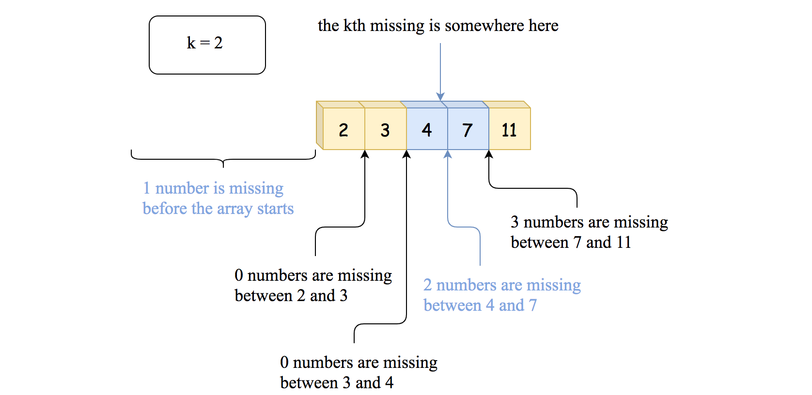
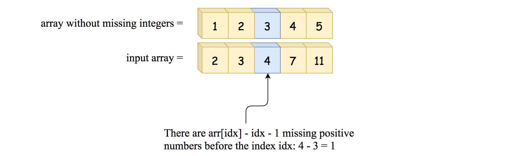

## Solution

---

### Approach 1: Brute Force, $\mathcal{O}(N)$ time

The first idea is to solve the problem in a linear time by parsing all array elements. We iterate through the given array `arr`, which contains sorted positive integers. For each element `num` in the array, if it is less than or equal to `k`, it means one less number is missing, so we increment `k`. If `num` is greater than `k`, we stop because the missing number lies outside the range of the current numbers in `arr`. By the end of the loop, we return the `k`-th missing number.


*Figure 1. Approach 1. Iterate over the array and compute the number of missing numbers in-between the elements.*

**Algorithm**

- Iterate through each number `num` in the array `arr`:
  - If the current `num` is less than or equal to `k`, increment `k`.
- This step accounts for the missing positive integers. If the number is less than or equal to `k`, it means we've encountered an actual element of the sequence, so the `k`-th missing positive integer is pushed further by one.
  - If the current `num` is greater than `k`, break out of the loop.
- This happens because there’s no need to continue iterating once we’ve passed the range where the `k`-th missing integer could exist.

- Return the updated value of `k` as the final result, which represents the `k`-th missing positive integer.

**Implementation**

```python
class Solution:
    def findKthPositive(self, arr: List[int], k: int) -> int:
        for num in arr:
            if num <= k:
                k += 1
            elif num > k:
                break
        return k
```

**Complexity Analysis**

* Time complexity: $\mathcal{O}(N)$ because in the worst case, we have to parse all array elements.

* Space complexity: $\mathcal{O}(1)$, we don't allocate any additional data structures.
<br />
<br />

___
### Approach 2: Binary Search, $\mathcal{O}(\log N)$ time

Approach 1 doesn't profit from the fact that the input array is sorted. And the sorted input should ring the bell: "let's try to solve it in a logarithmic time using [binary search](https://leetcode.com/problems/binary-search/solution/)".

We need a way to check on how many positive integers are missing before the given array element to use binary search. To do that, let's compare the input array
`[2, 3, 4, 7, 11]` with an array with no missing integers: `[1, 2, 3, 4, 5]`. The number of missing integers is a simple difference between the corresponding elements of these two arrays:

- Before `2`, there is $2 - 1 = 1$ missing integer.

- Before `3`, there is $3 - 2 = 1$ missing integer.

- Before `4`, there is $4 - 3 = 1$ missing integer.

- Before `7`, there are $7 - 4 = 3$ missing integers.

- Before `11`, there are $11 - 5 = 6$ missing integers.

> The number of positive integers which are missing before the $\text{arr}[idx]$ is equal to $\text{arr}[idx] - idx - 1$.


*Figure 2. The number of missing positive integers before the index `idx`.*

Now we have everything to proceed with the [classical binary search algorithm](https://leetcode.com/problems/binary-search/solution/):

- Choose the pivot index in the middle of the array.

- If the number of positive integers which are missing before $\text{arr}[pivot]$ is less than k - continue to search on the right side of the array.

- Otherwise, continue to search on the left side.

**Algorithm**

- Initialize search boundaries: $left = 0$, $right = \text{arr.length} - 1$.

- While $left \le right$:

- Choose the pivot index in the middle: $pivot = left + (right - left) / 2$. Note that in Java we couldn't use straightforward $pivot = (left + right) / 2$
    to avoid the possible overflow. In Python, the integers are not limited, and we're fine to do that.

- If the number of positive integers which are missing before is less than k $\text{arr}[pivot] - pivot - 1 < k$ - continue to search on the right side of the array: $left = pivot + 1$.

- Otherwise, continue to search on the left: $right = pivot - 1$.

- At the end of the loop, $left = right + 1$, and the k*th* missing number is in-between $\text{arr}[right]$ and $\text{arr}[left]$. The number of integers missing before $\text{arr}[right]$ is $\text{arr}[right] - right - 1$. Hence, the number to return is $\text{arr}[right] + k - (\text{arr}[right] - right - 1) = k + left$.

**Implementation**

```python
class Solution:
    def findKthPositive(self, arr: List[int], k: int) -> int:
        left, right = 0, len(arr) - 1
        while left <= right:
            pivot = (left + right) // 2
            # If number of positive integers
            # which are missing before arr[pivot]
            # is less than k -->
            # continue to search on the right.
            if arr[pivot] - pivot - 1 < k:
                left = pivot + 1
            # Otherwise, go left.
            else:
                right = pivot - 1

        # At the end of the loop, left = right + 1,
        # and the kth missing is in-between arr[right] and arr[left].
        # The number of integers missing before arr[right] is
        # arr[right] - right - 1 -->
        # the number to return is
        # arr[right] + k - (arr[right] - right - 1) = k + left
        return left + k
```

**Complexity Analysis**

* Time complexity: $\mathcal{O}(\log N)$, where $N$ is a number of elements in the input array.

    Let's compute the time complexity of the binary search with the help of [master theorem](https://en.wikipedia.org/wiki/Master_theorem_(analysis_of_algorithms)) $T(N) = aT\left(\frac{N}{b}\right) + \Theta(N^d)$. The equation represents dividing the problem up into $a$ subproblems of size $\frac{N}{b}$ in $\Theta(N^d)$ time. Here, at each step, there is only one subproblem $a = 1$, its size is half of the initial problem $b = 2$, and all this happens in a constant time $d = 0$. That means that $\log_b{a} = d$ and hence we're dealing with [case 2](https://en.wikipedia.org/wiki/Master_theorem_(analysis_of_algorithms)#Case_2_example) that results in $\mathcal{O}(N^{\log_b{a}} \log^{d + 1} N)$ = $\mathcal{O}(\log N)$ time complexity.

* Space complexity: $\mathcal{O}(1)$, we don't allocate any additional data structures.
<br />
<br />

___