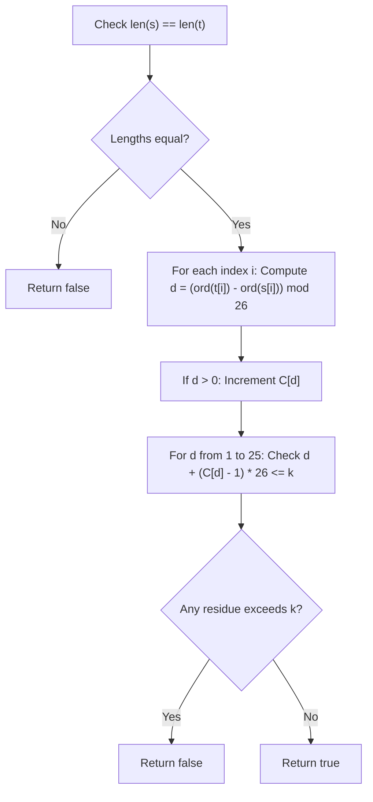

# Guided Example: Can Convert String in K Moves

We trace the step-by-step execution of modular residue frequency analysis on a representative string transformation instance to determine if $s$ can be converted into $t$ within $k$ moves.

- **Input Strings:** $s = \text{"input"}$, $t = \text{"ouput"}$, with maximum move budget $k = 9$.
- **Output:** `true` (shift requirements are $d = 6$ at index 0 and $d = 7$ at index 1, accommodated by moves 6 and 7 within budget $k = 9$).

This instance demonstrates cyclic distance computation modulo 26, move assignment arithmetic $(c_d - 1) \times 26 + d$, and validation across non-conflicting modular classes.

---

## 1. Instance & Teaching Goal

We are given two lowercase strings of length $N = 5$ and an integer $k = 9$:

$$s = \text{"input"}, \quad t = \text{"ouput"}, \quad k = 9$$

Conversion rules:
1. In the $m$-th move ($1 \le m \le k$), we may advance one previously untouched character of $s$ by exactly $m$ alphabet positions forward (with cyclic wrap-around $z \rightarrow a$).
2. Alternatively, move $m$ may be skipped.
3. Each index in $s$ may be chosen at most once across all moves.
4. Each move number $m \in [1, k]$ may be used at most once.

**Teaching Goal:**
Understand why position-by-position character shifts decompose into 25 independent residue classes modulo 26. Since multiple indices requiring the same cyclic shift $d$ must use distinct moves $d, d + 26, d + 52, \dots$, we compute the maximum required move $\max_d (d + (c_d - 1) \times 26)$ in $\mathcal{O}(N)$ time and $\mathcal{O}(1)$ space, without simulating individual moves up to $k = 10^9$.

---

## 2. Conceptual Foundation & Invariants

```
+-------------------------------------------------------------------------+
|                  MODULAR RESIDUE CAPACITY SCHEME                        |
+-------------------------------------------------------------------------+
|  Pairwise Shift: d = (ord(t[i]) - ord(s[i])) mod 26                     |
|                                                                         |
|  - If d == 0: Character already matches; no move needed                 |
|  - If d > 0:  Requires a move m congruent to d (mod 26)                 |
|                                                                         |
|  Shift Residue Bucket d in {1, 2, ..., 25}:                             |
|    1st occurrence needs move:  d                                        |
|    2nd occurrence needs move:  d + 26                                   |
|    3rd occurrence needs move:  d + 2 * 26                               |
|    ...                                                                  |
|    c_d-th occurrence needs:    d + (c_d - 1) * 26                       |
|                                                                         |
|  FEASIBILITY CONDITION:                                                 |
|    For all d in [1 .. 25]:  d + (c_d - 1) * 26 <= k                     |
+-------------------------------------------------------------------------+
```

We establish the core state parameters:

| State Variable | Definition & Role | Initial Value |
|---|---|---|
| $N$ | Length of string $s$ (must equal length of $t$) | $5$ |
| $d_i$ | Cyclic forward distance from $s[i]$ to $t[i]$ | Computed per index |
| $C$ | Frequency array of size 26 tracking counts $c_d$ | $C[0..25] = 0$ |
| $\text{max\_move}(d)$ | Highest move number demanded by residue $d$: $d + (c_d - 1) \cdot 26$ | Evaluated during check |
| $k$ | Maximum allowable move index | $9$ |

> **Congruence Exclusivity Invariant.** Two indices requiring the same cyclic shift $d \in [1, 25]$ cannot share the same move number $m$. Because $m_1 \equiv m_2 \equiv d \pmod{26}$, the difference $|m_1 - m_2|$ must be a positive multiple of 26. Thus, $c_d$ occurrences of shift $d$ strictly require the $c_d$ smallest positive integers congruent to $d \pmod{26}$, the largest being $d + (c_d - 1) \cdot 26$.



---

## 3. Step-by-Step Worked Execution

### Step 1: Length Validation
We compare the lengths of $s$ and $t$:
$$\text{len}(s) = 5, \quad \text{len}(t) = 5$$
Since lengths are equal, character-by-character mapping is feasible.

---

### Step 2: Character Pair Difference Extraction

For each index $i \in [0, 4]$, calculate forward distance $d_i = (\text{ord}(t[i]) - \text{ord}(s[i])) \bmod 26$:

- **Index 0:** $s[0] = \text{'i'}, t[0] = \text{'o'}$.
  - Alphabet indices: $\text{'i'} \rightarrow 8, \text{'o'} \rightarrow 14$.
  - Distance: $(14 - 8) \bmod 26 = 6$.
  - Action: $C[6] \leftarrow C[6] + 1 = 1$.
- **Index 1:** $s[1] = \text{'n'}, t[1] = \text{'u'}$.
  - Alphabet indices: $\text{'n'} \rightarrow 13, \text{'u'} \rightarrow 20$.
  - Distance: $(20 - 13) \bmod 26 = 7$.
  - Action: $C[7] \leftarrow C[7] + 1 = 1$.
- **Index 2:** $s[2] = \text{'p'}, t[2] = \text{'p'}$.
  - Distance: $(15 - 15) \bmod 26 = 0$.
  - Action: $d = 0$, no move needed.
- **Index 3:** $s[3] = \text{'u'}, t[3] = \text{'u'}$.
  - Distance: $(20 - 20) \bmod 26 = 0$.
  - Action: $d = 0$, no move needed.
- **Index 4:** $s[4] = \text{'t'}, t[4] = \text{'t'}$.
  - Distance: $(19 - 19) \bmod 26 = 0$.
  - Action: $d = 0$, no move needed.

| Index $i$ | $s[i]$ | $t[i]$ | $\text{ord}(t[i]) - \text{ord}(s[i])$ | Shift Residue $d$ | Move Required | Updated Bucket $C[d]$ |
|---|---|---|---|---|---|---|
| 0 | 'i' | 'o' | $14 - 8 = 6$ | 6 | Yes (Move 6) | $C[6] = 1$ |
| 1 | 'n' | 'u' | $20 - 13 = 7$ | 7 | Yes (Move 7) | $C[7] = 1$ |
| 2 | 'p' | 'p' | $15 - 15 = 0$ | 0 | None | $C[0] = 1$ |
| 3 | 'u' | 'u' | $20 - 20 = 0$ | 0 | None | $C[0] = 2$ |
| 4 | 't' | 't' | $19 - 19 = 0$ | 0 | None | $C[0] = 3$ |

---

### Step 3: Shift Capacity Verification Against Budget $k = 9$

We evaluate the maximum move required across all nonzero residues $d \in [1, 25]$:

- For residue $d = 6$:
  - Frequency count: $c_6 = 1$.
  - Maximum move formula:
    $$\text{max\_move}(6) = 6 + (1 - 1) \times 26 = 6$$
  - Capacity check: $6 \le k = 9$ (Satisfied).
- For residue $d = 7$:
  - Frequency count: $c_7 = 1$.
  - Maximum move formula:
    $$\text{max\_move}(7) = 7 + (1 - 1) \times 26 = 7$$
  - Capacity check: $7 \le k = 9$ (Satisfied).
- All other residues $d \in [1, 25] \setminus \{6, 7\}$ have $c_d = 0$ and require 0 moves.

Every required move satisfies $\text{max\_move}(d) \le k$.
Therefore, conversion is possible, and the algorithm emits **`true`**.

---

## 4. Complete Execution Trace

The global residue summary and capacity check are tabulated below:

| Residue Class $d$ | Count $c_d$ | Move Sequence Allocated | Peak Move Needed | Budget Bound $k$ | Feasibility Status |
|---|---|---|---|---|---|
| 0 (Identity) | 3 | None (Skipped) | 0 | 9 | Trivial Pass |
| 6 | 1 | $\{6\}$ | 6 | 9 | Pass ($6 \le 9$) |
| 7 | 1 | $\{7\}$ | 7 | 9 | Pass ($7 \le 9$) |
| All other $d$ | 0 | $\emptyset$ | 0 | 9 | Trivial Pass |
| Global Maximum | - | - | **7** | **9** | **Overall Valid (`true`)** |

---

## 5. Algorithmic Correctness

**Soundness.**
- If the algorithm returns `true`, then for every residue $d \in [1, 25]$ with count $c_d > 0$, the $c_d$ integers $\{d, d + 26, d + 52, \dots, d + (c_d - 1) \cdot 26\}$ are all $\le k$.
- By modular arithmetic, each of these numbers is strictly positive and distinct, and $m \equiv d \pmod{26}$.
- Numbers belonging to different residue classes $d_1 \neq d_2$ are mutually disjoint because their remainders modulo 26 differ.
- Thus, every position requiring a shift is assigned a distinct move $m \in [1, k]$ that delivers the exact required alphabet advancement.

**Completeness.**
- Any valid schedule of moves must assign each position needing shift $d$ a distinct move $m \in [1, k]$ with $m \equiv d \pmod{26}$.
- The set of available positive integers congruent to $d \pmod{26}$ in ascending order is $d, d + 26, d + 52, \dots$.
- To accommodate $c_d$ such positions, at least $c_d$ integers from this arithmetic progression must be $\le k$.
- The $c_d$-th term is $d + (c_d - 1) \cdot 26$. If this term exceeds $k$, then fewer than $c_d$ integers are available in $[1, k]$, rendering conversion mathematically impossible. Hence, the condition is necessary and sufficient.

---

## 6. Traps This Instance Exposes

- **Move Simulation Trap:** Iterating through $m = 1, 2, \dots, k$ with a simulation loop fails when $k = 10^9$, causing Time Limit Exceeded. Formulating the closed-form threshold $d + (c_d - 1) \cdot 26$ allows $\mathcal{O}(1)$ verification per residue.
- **Negative Differences in Cyclic Subtraction:** Computing $\text{ord}(t[i]) - \text{ord}(s[i])$ directly can produce negative numbers (e.g. 'a' to 'z' yields $0 - 25 = -25$). Adding 26 before taking modulo ($(\Delta + 26) \bmod 26$) ensures correct forward cyclic distance.
- **Unequal Lengths:** When $\text{len}(s) \neq \text{len}(t)$, strings can never be made equal because moves only modify characters in-place and cannot insert or delete. This must be checked immediately.
- **Identity Shifts ($d = 0$):** Characters that already match require 0 shifts. Including $d = 0$ in the move allocation formula would erroneously demand moves $0, 26, 52$, causing false rejections. $d = 0$ must be explicitly ignored.

---

## 7. Complexity Derivation

- **Time Complexity:**
  - Length check: $\mathcal{O}(1)$.
  - Single pass over strings $s$ and $t$ of length $N$ to compute shift residues and populate frequency array $C$: $\mathcal{O}(N)$ operations.
  - Verification loop over fixed 25 nonzero residue buckets: exactly 25 constant-time arithmetic checks, costing $\mathcal{O}(1)$.
  - Total time complexity is $\mathcal{O}(N)$, processing $10^5$ characters in less than 5 milliseconds.
- **Auxiliary Space Complexity:**
  - The frequency table $C$ has fixed size 26.
  - Auxiliary space complexity is strictly $\mathcal{O}(1)$.
