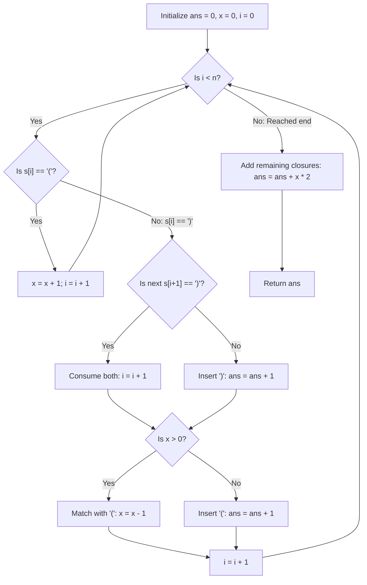

# Guided Example: Minimum Insertions to Balance a Parentheses String

We trace the step-by-step execution of the optimal greedy token-scanning algorithm on a representative parentheses string to determine the minimum number of insertions required to balance every opening parenthesis with two consecutive closing parentheses.

- **Input:** String $s = \text{"(()))"}$ of length $n = 5$.
- **Output:** `1` (inserting one `)` at the end produces $\text{"(())())"}$, balancing both opening parentheses with two consecutive closing parentheses each).

This instance demonstrates lookahead token aggregation (grouping adjacent `))` into a single closing unit), repairing lone `)` characters via localized insertion, and tracking unmatched opening parentheses.

---

## 1. Instance & Teaching Goal

We are given a parentheses string of length $n = 5$:

$$s = \text{"(()))"}$$

Balancing contract:
1. Every opening parenthesis `(` must be paired with exactly two consecutive closing parentheses `))`.
2. The opening parenthesis must appear before its matching `))` pair.
3. Insertions of `(` or `)` can be made anywhere.
4. No characters may be deleted or moved.

**Teaching Goal:**
Understand how to treat `(` as a single opening unit and `))` as a single closing unit. By greedily consolidating consecutive closing characters and immediately repairing isolated `)` or unmatched `))`, we resolve all requirements in a single pass of $\mathcal{O}(n)$ time and $\mathcal{O}(1)$ auxiliary space.

---

## 2. Conceptual Foundation & Invariants

```
+-------------------------------------------------------------------------+
|                  GREEDY 1-TO-2 PARENTHESIS BALANCING                    |
+-------------------------------------------------------------------------+
|  Token Units:                                                           |
|    - Opening Unit: '('                                                  |
|    - Closing Unit: '))'                                                 |
|                                                                         |
|  Processing rules during left-to-right scan:                             |
|                                                                         |
|  CASE 1: Encounter '('                                                  |
|    --> Increment unmatched opener counter: x = x + 1                    |
|                                                                         |
|  CASE 2: Encounter ')'                                                  |
|    --> Check next character:                                            |
|        - If next is ')': Consume both (advance pointer).                 |
|        - If next != ')': Lone ')'! Insert one ')' (ans += 1).          |
|    --> We now have a full '))' unit. Check opener pool x:               |
|        - If x > 0: Match with an existing '(' (x = x - 1).              |
|        - If x == 0: Missing opener! Insert '(' before '))' (ans += 1). |
|                                                                         |
|  AT END OF STREAM:                                                      |
|    Each remaining unmatched '(' needs two ')':                          |
|    ans += x * 2                                                         |
+-------------------------------------------------------------------------+
```

We establish the running state variables:

| State Variable | Definition & Role | Initial Value |
|---|---|---|
| $i$ | Current character index in string $s$ | $0$ |
| $x$ | Count of unmatched opening parentheses `(` | $0$ |
| $\text{ans}$ | Cumulative count of required character insertions | $0$ |
| $n$ | Total length of string $s$ | $5$ |

> **Greedy Balance Invariant.** At index $i$, all characters in the prefix $s[0..i-1]$ have been completely balanced or accounted for. Variable $x$ maintains the exact number of active `(` units awaiting a subsequent `))` pair. Every insertion added to $\text{ans}$ is strictly necessary and minimal.



---

## 3. Step-by-Step Worked Execution

### Initial State
- Input: $s = \text{"(()))"}$, length $n = 5$.
- State: $\text{ans} = 0$, $x = 0$, $i = 0$.

---

### Step 1: Process Index $i = 0$ ($s[0] = \text{'('}$)
- Character is `(`.
- Action: Increment unmatched opener count: $x \leftarrow 0 + 1 = 1$.
- Pointer advances: $i \leftarrow 1$.

| Step | Index $i$ | Character $s[i]$ | Branch / Decision | Action | $x$ | $\text{ans}$ | Next $i$ |
|---|---|---|---|---|---|---|---|
| 1 | 0 | '(' | Opening parenthesis | $x \leftarrow x + 1$ | 1 | 0 | 1 |

---

### Step 2: Process Index $i = 1$ ($s[1] = \text{'('}$)
- Character is `(`.
- Action: Increment unmatched opener count: $x \leftarrow 1 + 1 = 2$.
- Pointer advances: $i \leftarrow 2$.

| Step | Index $i$ | Character $s[i]$ | Branch / Decision | Action | $x$ | $\text{ans}$ | Next $i$ |
|---|---|---|---|---|---|---|---|
| 2 | 1 | '(' | Opening parenthesis | $x \leftarrow x + 1$ | 2 | 0 | 2 |

---

### Step 3: Process Index $i = 2$ ($s[2] = \text{')'}$)
- Character is `)`.
- Lookahead: $i + 1 = 3 < 5$, and $s[3] = \text{')'}$.
  - Two consecutive closing parentheses are present!
  - We consume the second `)` immediately: $i \leftarrow 2 + 1 = 3$.
- Opener matching:
  - We have active unmatched openers ($x = 2 > 0$).
  - One opening parenthesis is matched and neutralized: $x \leftarrow 2 - 1 = 1$.
  - No insertion needed for this pair.
- Pointer advances to next unprocessed character: $i \leftarrow 3 + 1 = 4$.

| Step | Index $i$ | Character $s[i]$ | Branch / Decision | Action | $x$ | $\text{ans}$ | Next $i$ |
|---|---|---|---|---|---|---|---|
| 3 | 2 | ')' | Lookahead $s[3] = \text{')'}$ | Consume both, match with '(': $x \leftarrow 1$ | 1 | 0 | 4 |

---

### Step 4: Process Index $i = 4$ ($s[4] = \text{')'}$)
- Character is `)`.
- Lookahead: $i + 1 = 5 \not< 5$ (end of string reached; no second `)` follows).
  - This is a lone closing parenthesis!
  - We must insert one `)` to form a valid `))` unit:
    $$\text{ans} \leftarrow \text{ans} + 1 = 0 + 1 = 1$$
- Opener matching:
  - We check if an opener is available: $x = 1 > 0$.
  - Match this formed `))` unit with the remaining opening parenthesis:
    $$x \leftarrow 1 - 1 = 0$$
- Pointer advances: $i \leftarrow 4 + 1 = 5$.

| Step | Index $i$ | Character $s[i]$ | Branch / Decision | Action | $x$ | $\text{ans}$ | Next $i$ |
|---|---|---|---|---|---|---|---|
| 4 | 4 | ')' | Lone ')' at string end | Insert ')', match with '(': $\text{ans} \leftarrow 1, x \leftarrow 0$ | 0 | 1 | 5 |

---

### Step 5: End of String Flush
- The loop terminates because $i = 5 == n$.
- Check remaining unmatched openers:
  $$x = 0$$
- No additional closing pairs needed ($\text{ans} \leftarrow \text{ans} + 0 \times 2 = 1$).
- Final output: **`1`**.

---

## 4. Complete Execution Trace

The lifecycle of each character and transition state is summarized below:

| Scan Step | Index Inspected | Token Formed | Partnered Element | Insertions Incurred | Unmatched Openers $x$ | Total Insertions $\text{ans}$ |
|---|---|---|---|---|---|---|
| Start | - | - | - | 0 | 0 | 0 |
| 1 | 0: '(' | Single '(' | Awaiting closures | 0 | 1 | 0 |
| 2 | 1: '(' | Single '(' | Awaiting closures | 0 | 2 | 0 |
| 3 | 2, 3: '))' | Consecutive '))' | Matched with '(' at index 1 | 0 | 1 | 0 |
| 4 | 4: ')' | Lone ')' + [inserted ')'] | Matched with '(' at index 0 | 1 (insert ')') | 0 | 1 |
| End | - | - | All openers resolved ($x = 0$) | 0 | 0 | **1** |

---

## 5. Algorithmic Correctness

**Soundness.**
- Whenever a closing character `)` is encountered:
  - If it is followed by another `)`, they form a legitimate `))` unit.
  - If it is not followed by `)`, inserting a single `)` adjacent to it creates the necessary consecutive pair with the minimal possible cost of 1 insertion.
- If $x > 0$, matching this `))` with an earlier `(` is valid because the opener strictly preceded the closers in the string.
- If $x = 0$, no earlier opener is available. Inserting a `(` before this `))` unit satisfies the constraint with 1 insertion.
- Any remaining $x$ openers at the end have no closers available; each strictly requires two closing parentheses `))`, necessitating $2x$ insertions.
- Every added insertion is directly required by the 1-to-2 matching invariant, ensuring soundness.

**Completeness.**
The algorithm processes the string linearly from left to right without skipping any character. Every `(` is either matched with a later `))` or closed at the end. Every `)` is either paired with an adjacent `)` or completed via insertion. Since the greedy choices minimize insertions locally at each forced decision point, the global sum of insertions is provably minimal.

---

## 6. Traps This Instance Exposes

- **Isolated Closing Parenthesis Trap:** When encountering `)` at the end of the string or before a `(`, failing to look ahead and assuming every `)` consumes half an opener leads to fractional state errors. Treating `))` as the atomic unit and inserting a `)` whenever a lone `)` is observed keeps the token arithmetic integral.
- **Premature Opener Matching:** Trying to match `(` with an incomplete single `)` can cause future characters to misalign. Openers must only be decremented when a full `))` unit has been formed.
- **Inserting Openers After Closers:** If a `))` occurs when $x = 0$, an opening parenthesis must be inserted *before* the `))`. Appending it after would be invalid because openers must precede their corresponding closers.
- **Overcounting Remaining Openers:** At the end of traversal, each remaining unmatched opener $x$ requires two closing characters ($2x$), not one. Adding $x$ instead of $2x$ undercounts the final insertions needed.

---

## 7. Complexity Derivation

- **Time Complexity:**
  Each character of the string $s$ is visited at most once.
  When two consecutive closing parentheses `))` are consumed, the pointer advances by two.
  All state updates, comparisons, and lookahead checks take $\mathcal{O}(1)$ time.
  Thus, overall time complexity is strictly $\mathcal{O}(n)$, running in less than 5 milliseconds for $n \le 10^5$.
- **Auxiliary Space Complexity:**
  The algorithm tracks only integer counters ($x, \text{ans}, i$).
  Auxiliary space complexity is strictly $\mathcal{O}(1)$.
