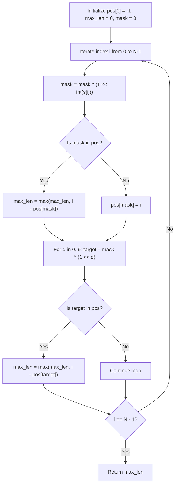

# Guided Example: Find Longest Awesome Substring

We trace the step-by-step execution of prefix bitmask parity hashing on a representative decimal digit string to find the longest substring that can be rearranged into a palindrome.

- **Input:** String $s = \text{"3242415"}$ of length $N = 7$.
- **Output:** `5` (the substring $s[1..5] = \text{"24241"}$ can be permuted into the palindrome $\text{"24142"}$).

This instance demonstrates 10-bit parity compression, prefix difference cancellation via XOR, and parallel evaluation of exact matches ($\text{popcount} = 0$) and 1-bit differences ($\text{popcount} = 1$).

---

## 1. Instance & Teaching Goal

We are given a digit string of length $N = 7$:

$$s = \text{"3242415"}$$

Indices and characters:
- $s[0] = \text{'3'}$
- $s[1] = \text{'2'}$
- $s[2] = \text{'4'}$
- $s[3] = \text{'2'}$
- $s[4] = \text{'4'}$
- $s[5] = \text{'1'}$
- $s[6] = \text{'5'}$

A substring is **awesome** if its characters can be rearranged to form a palindrome.
Mathematical criterion:
A multi-set of characters can form a palindrome if and only if **at most one character has an odd frequency**.

**Teaching Goal:**
Understand how to compress character count parities into a 10-bit integer mask $\text{mask} \in [0, 1023]$. By querying the earliest prefix holding either the identical mask or any of the 10 masks differing by exactly 1 bit, we compute the maximum length in $\mathcal{O}(10 \cdot N)$ time.

---

## 2. Conceptual Foundation & Invariants

```
+-------------------------------------------------------------------------+
|                  PREFIX PARITY BITMASK SEARCH MODEL                     |
+-------------------------------------------------------------------------+
|  10-Bit Mask: Bit d is 1 if digit d has appeared an ODD number of times |
|               Bit d is 0 if digit d has appeared an EVEN number of times|
|                                                                         |
|  Prefix Mask Update: mask = mask ^ (1 << digit)                         |
|                                                                         |
|  Substring Parity: parity(s[l..r]) = mask[r] ^ mask[l - 1]              |
|                                                                         |
|  Awesome Substring Condition:                                           |
|    popcount(mask[r] ^ mask[l - 1]) <= 1                                 |
|                                                                         |
|  Two Viable Lookup Cases for mask[r]:                                   |
|    Case 0 (All even counts):      Target mask = mask[r]                 |
|    Case 1 (Exactly one odd count): Target mask = mask[r] ^ (1 << d)     |
|                                    for each digit d in [0 .. 9]         |
|                                                                         |
|  Earliest Occurrence Storage:                                           |
|    pos[mask] stores the FIRST index where mask was produced.            |
|    Base: pos[0] = -1 (empty prefix before index 0).                     |
|    Length = r - pos[target_mask].                                       |
+-------------------------------------------------------------------------+
```

We establish the running state variables:

| State Variable | Definition & Role | Initial Value |
|---|---|---|
| $\text{mask}$ | Current 10-bit parity mask for prefix $s[0..i]$ | $0$ |
| $\text{pos}$ | Lookup table storing earliest prefix index for each mask | $\text{pos}[0] = -1$, others $\infty$ |
| $\text{max\_len}$ | Maximum awesome substring length discovered so far | $0$ |
| $d$ | Digit bit toggled at current step | Extracted from $s[i]$ |

> **Parity Cancellation Invariant.** For any two prefix indices $p < i$, the bitwise XOR $\text{mask}_i \oplus \text{mask}_p$ equals $0$ if and only if all digits in $s[p+1..i]$ appear an even number of times, and equals $2^d$ if and only if digit $d$ appears an odd number of times while all other 9 digits appear an even number of times. Retaining the minimum index for each mask maximizes the span $i - p$.



---

## 3. Step-by-Step Worked Execution

### Initialization
- String $s = \text{"3242415"}$, length $N = 7$.
- Initialize map: $\text{pos}[0] = -1$ (representing empty prefix).
- Current $\text{mask} = 0$, $\text{max\_len} = 0$.

---

### Step 1: Index $i = 0$ ($s[0] = \text{'3'}$)
- Digit: $3$. Toggle bit 3: $\text{mask} = 0 \oplus 2^3 = 8$ (binary `0000001000`).
- Case 0 (exact match): $\text{mask} = 8$ not in $\text{pos}$.
- Case 1 (1-bit differences):
  - Toggle bit 3: $8 \oplus 2^3 = 0$. $\text{pos}[0] = -1$ exists!
  - Candidate length: $0 - (-1) = 1$ (substring `"3"`).
  - $\text{max\_len} = \max(0, 1) = 1$.
- Record earliest: $\text{pos}[8] = 0$.

| Index $i$ | $s[i]$ | Parity Mask (Binary) | Mask (Decimal) | Best Match Mask | Earliest Position $p$ | Substring Length $i - p$ | $\text{max\_len}$ |
|---|---|---|---|---|---|---|---|
| 0 | '3' | `0000001000` | 8 | 0 | -1 | $0 - (-1) = 1$ | 1 |

---

### Step 2: Index $i = 1$ ($s[1] = \text{'2'}$)
- Digit: $2$. Toggle bit 2: $\text{mask} = 8 \oplus 2^2 = 8 \oplus 4 = 12$ (binary `0000001100`).
- Case 0: $12$ not in $\text{pos}$.
- Case 1:
  - Toggle bit 2: $12 \oplus 4 = 8$. $\text{pos}[8] = 0$ exists. Length $1 - 0 = 1$ (substring `"2"`).
- Record earliest: $\text{pos}[12] = 1$.

| Index $i$ | $s[i]$ | Parity Mask (Binary) | Mask (Decimal) | Best Match Mask | Earliest Position $p$ | Substring Length $i - p$ | $\text{max\_len}$ |
|---|---|---|---|---|---|---|---|
| 1 | '2' | `0000001100` | 12 | 8 | 0 | $1 - 0 = 1$ | 1 |

---

### Step 3: Index $i = 2$ ($s[2] = \text{'4'}$)
- Digit: $4$. Toggle bit 4: $\text{mask} = 12 \oplus 2^4 = 12 \oplus 16 = 28$ (binary `0000011100`).
- Case 0: $28$ not in $\text{pos}$.
- Case 1: Toggle bit 4 yields $12$, length $2 - 1 = 1$.
- Record earliest: $\text{pos}[28] = 2$.

| Index $i$ | $s[i]$ | Parity Mask (Binary) | Mask (Decimal) | Best Match Mask | Earliest Position $p$ | Substring Length $i - p$ | $\text{max\_len}$ |
|---|---|---|---|---|---|---|---|
| 2 | '4' | `0000011100` | 28 | 12 | 1 | $2 - 1 = 1$ | 1 |

---

### Step 4: Index $i = 3$ ($s[3] = \text{'2'}$)
- Digit: $2$. Toggle bit 2: $\text{mask} = 28 \oplus 4 = 24$ (binary `0000011000`).
  (Digit 2 has now appeared twice, so bit 2 resets to 0).
- Case 0: $24$ not in $\text{pos}$.
- Case 1: Toggle bit 2 yields $28$, length $3 - 2 = 1$.
- Record earliest: $\text{pos}[24] = 3$.

| Index $i$ | $s[i]$ | Parity Mask (Binary) | Mask (Decimal) | Best Match Mask | Earliest Position $p$ | Substring Length $i - p$ | $\text{max\_len}$ |
|---|---|---|---|---|---|---|---|
| 3 | '2' | `0000011000` | 24 | 28 | 2 | $3 - 2 = 1$ | 1 |

---

### Step 5: Index $i = 4$ ($s[4] = \text{'4'}$)
- Digit: $4$. Toggle bit 4: $\text{mask} = 24 \oplus 16 = 8$ (binary `0000001000`).
  (Digit 4 has now appeared twice, so bit 4 resets to 0. Remaining odd digit: 3).
- **Case 0 (Exact Match!):**
  - $\text{mask} = 8$ is ALREADY present in $\text{pos}$ at $p = 0$!
  - Substring $s[0+1..4] = s[1..4] = \text{"2424"}$.
  - Length: $4 - \text{pos}[8] = 4 - 0 = 4$.
  - In `"2424"`, count(2) = 2, count(4) = 2. All counts even $\implies$ valid palindrome `"2442"`.
  - $\text{max\_len} \leftarrow \max(1, 4) = 4$.
- Do not overwrite $\text{pos}[8]$: keep earliest occurrence $\text{pos}[8] = 0$.

| Index $i$ | $s[i]$ | Parity Mask (Binary) | Mask (Decimal) | Best Match Mask | Earliest Position $p$ | Substring Length $i - p$ | $\text{max\_len}$ |
|---|---|---|---|---|---|---|---|
| 4 | '4' | `0000001000` | 8 | 8 (Exact) | 0 | $4 - 0 = 4$ | 4 |

---

### Step 6: Index $i = 5$ ($s[5] = \text{'1'}$)
- Digit: $1$. Toggle bit 1: $\text{mask} = 8 \oplus 2^1 = 8 \oplus 2 = 10$ (binary `0000001010`).
- Case 0: $10$ not in $\text{pos}$.
- **Case 1 (1-bit mutation!):**
  - Test digit $d = 1$:
    $$\text{target} = 10 \oplus 2^1 = 8$$
  - Target mask $8$ exists in $\text{pos}$ with earliest position $p = 0$!
  - Substring $s[0+1..5] = s[1..5] = \text{"24241"}$.
  - Length: $5 - \text{pos}[8] = 5 - 0 = 5$.
  - Parity check for `"24241"`: digit 2 count = 2, digit 4 count = 2, digit 1 count = 1.
  - Exactly one digit has odd count $\implies$ can form palindrome `"24142"`.
  - $\text{max\_len} \leftarrow \max(4, 5) = 5$.
- Record earliest: $\text{pos}[10] = 5$.

| Index $i$ | $s[i]$ | Parity Mask (Binary) | Mask (Decimal) | Best Match Mask | Earliest Position $p$ | Substring Length $i - p$ | $\text{max\_len}$ |
|---|---|---|---|---|---|---|---|
| 5 | '1' | `0000001010` | 10 | 8 ($10 \oplus 2^1$) | 0 | $5 - 0 = 5$ | 5 |

---

### Step 7: Index $i = 6$ ($s[6] = \text{'5'}$)
- Digit: $5$. Toggle bit 5: $\text{mask} = 10 \oplus 2^5 = 10 \oplus 32 = 42$ (binary `0000101010`).
- Lookups produce no length greater than 5.

Loop terminates. Final maximum length: **`5`**.

---

## 4. Complete Execution Trace

The global progression across all 7 prefix evaluations is summarized below:

| $i$ | Character | Active Mask | Popcount | Optimal Target Found | Earliest Index $p$ | Discovered Substring | Length | Global Best $\text{max\_len}$ |
|---|---|---|---|---|---|---|---|---|
| Pre | - | 0 | 0 | - | -1 | Empty | 0 | 0 |
| 0 | '3' | 8 | 1 | 0 ($8 \oplus 2^3$) | -1 | $s[0..0] = \text{"3"}$ | 1 | 1 |
| 1 | '2' | 12 | 2 | 8 ($12 \oplus 2^2$) | 0 | $s[1..1] = \text{"2"}$ | 1 | 1 |
| 2 | '4' | 28 | 3 | 12 ($28 \oplus 2^4$) | 1 | $s[2..2] = \text{"4"}$ | 1 | 1 |
| 3 | '2' | 24 | 2 | 28 ($24 \oplus 2^2$) | 2 | $s[3..3] = \text{"2"}$ | 1 | 1 |
| 4 | '4' | 8 | 1 | 8 (Exact match) | 0 | $s[1..4] = \text{"2424"}$ | 4 | 4 |
| 5 | '1' | 10 | 2 | 8 ($10 \oplus 2^1$) | 0 | $s[1..5] = \text{"24241"}$ | 5 | **5** |
| 6 | '5' | 42 | 3 | 10 ($42 \oplus 2^5$) | 5 | $s[6..6] = \text{"5"}$ | 1 | 5 |

---

## 5. Algorithmic Correctness

**Soundness.**
- A string can be rearranged into a palindrome if and only if at most one character occurs an odd number of times.
- For substring $s[p+1..i]$, the parity of occurrences of digit $d$ is given by the $d$-th bit of $\text{mask}_i \oplus \text{mask}_p$.
- If $\text{mask}_i \oplus \text{mask}_p = 0$, every digit occurs an even number of times in $s[p+1..i]$, so it forms an even-length palindrome.
- If $\text{mask}_i \oplus \text{mask}_p = 2^d$, digit $d$ occurs an odd number of times and all other digits occur an even number of times, so it forms an odd-length palindrome with digit $d$ at the center.
- In both cases, the substring is provably awesome.

**Completeness.**
- Every possible awesome substring corresponds to some pair of indices $(p, i)$ where $\text{popcount}(\text{mask}_i \oplus \text{mask}_p) \le 1$.
- At each index $i$, the algorithm checks the exact mask $\text{mask}_i$ and all 10 possible single-bit variations $\text{mask}_i \oplus 2^d$.
- Because $\text{pos}$ stores the minimal (earliest) prefix index where each mask was seen, $i - \text{pos}[\text{target}]$ yields the maximum possible length for that target mask.
- By exhausting all 11 possible target masks for each right endpoint $i \in [0, N-1]$, no longer awesome substring can exist.

---

## 6. Traps This Instance Exposes

- **Overwriting Earlier Seen Masks:** When a mask is seen again, updating $\text{pos}[\text{mask}] = i$ shrinks the window for future queries. Only the *earliest* occurrence $\min p$ must be retained.
- **Neglecting the Empty Prefix ($p = -1$):** Omitting $\text{pos}[0] = -1$ makes it impossible to detect awesome substrings that start at the very beginning of the string ($s[0..i]$).
- **Checking Only Exact Matches:** Looking only for $\text{mask}_i == \text{mask}_p$ finds only even-length palindromes (where all digit counts are even). An awesome substring of odd length (such as `"24241"`) has exactly one odd count and requires checking $\text{mask} \oplus 2^d$.
- **Full Frequency Array vs Bitmask:** Storing full frequency counts would require $\mathcal{O}(10)$ space per prefix and cannot be mapped to a compact array. Because parity alone determines palindromic feasibility, a 10-bit integer mask provides instant $\mathcal{O}(1)$ updates and lookups.

---

## 7. Complexity Derivation

- **Time Complexity:**
  - Processing each character involves:
    - 1 bitwise XOR to update $\text{mask}$: $\mathcal{O}(1)$.
    - 1 table lookup for exact match: $\mathcal{O}(1)$.
    - 10 table lookups for single-bit mutations ($d \in [0, 9]$): $\mathcal{O}(10)$.
  - Across $N$ characters, total operations are $11 \times N = \mathcal{O}(10 \cdot N) = \mathcal{O}(N)$.
  - For $N = 10^5$, $1.1 \cdot 10^6$ operations complete in under 20 milliseconds.
- **Auxiliary Space Complexity:**
  - A lookup array of size $2^{10} = 1024$ integers stores the earliest position of each possible mask.
  - Auxiliary space complexity is strictly $\mathcal{O}(2^{10}) = \mathcal{O}(1)$ constant space.
