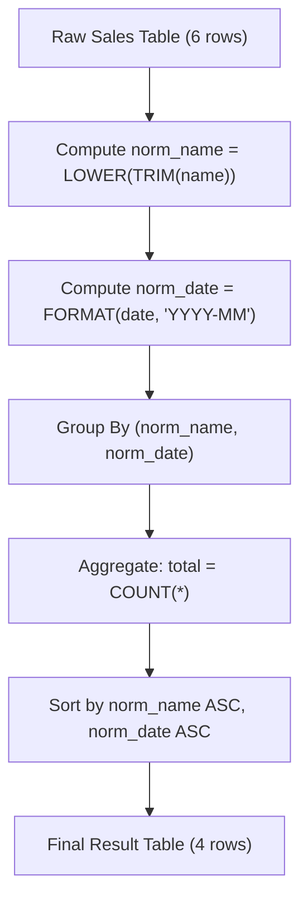

# Guided Example: Fix Product Name Format

We trace the step-by-step execution of relational projection, string normalization, temporal formatting, and grouped aggregation on a representative sales transaction table to report monthly sales volume per standardized product.

- **Input Table:** `Sales` containing 6 transactions with noisy case variations and outer whitespaces recorded in year 2000.
- **Output Table:** 4 aggregated summary records reporting trimmed lowercase product names, `YYYY-MM` month identifiers, and total transaction counts, sorted ascending by product name and month.

This instance demonstrates pre-aggregation normalization (trimming outer whitespace and folding to lowercase), date-to-month truncating projection, composite-key equivalence partitioning, and multi-key deterministic tuple ordering.

---

## 1. Instance & Teaching Goal

We are given a transaction table `Sales`:

| sale_id | product_name | sale_date |
|---|---|---|
| 1 | LCPHONE | 2000-01-16 |
| 2 | LCPhone | 2000-01-17 |
| 3 | LcPhOnE | 2000-02-18 |
| 4 | LCKeyCHAiN | 2000-02-19 |
| 5 | LCKeyChain | 2000-02-28 |
| 6 | Matryoshka | 2000-03-31 |

Transformation requirements:
1. Normalize `product_name`: strip leading and trailing whitespace characters, and convert all letters to lowercase.
2. Normalize `sale_date`: extract and format the year-month prefix as `YYYY-MM`.
3. Compute `total`: count the occurrences of transactions for each distinct pair of normalized product name and month.
4. Sort output: primary key $\text{product\_name}$ ascending, secondary key $\text{sale\_date}$ ascending.

**Teaching Goal:**
Understand why normalization must precede grouped aggregation. Grouping on raw attributes fragments identical entities across different casing and spacing variants; by projecting canonical attributes prior to grouping ($\Pi \rightarrow \gamma \rightarrow \tau$), we achieve deterministic and lossless aggregation.

---

## 2. Conceptual Foundation & Invariants

```
+-------------------------------------------------------------------------+
|                  RELATIONAL NORMALIZATION & GROUPING                    |
+-------------------------------------------------------------------------+
|  Raw Relation: Sales (sale_id, product_name, sale_date)                 |
|     |                                                                   |
|     v  (Projection & Normalization Pi)                                  |
|  +-------------------------------------------------------------------+  |
|  | norm_name = LOWER(TRIM(product_name))                             |  |
|  | norm_date = DATE_FORMAT(sale_date, 'YYYY-MM')                     |  |
|  +-------------------------------------------------------------------+  |
|     |                                                                   |
|     v  (Partition by Composite Key (norm_name, norm_date))              |
|  +-------------------------------------------------------------------+  |
|  | Group 1: ("lcphone",    "2000-01") -> {Row 1, Row 2}  (count = 2) |  |
|  | Group 2: ("lcphone",    "2000-02") -> {Row 3}         (count = 1) |  |
|  | Group 3: ("lckeychain", "2000-02") -> {Row 4, Row 5}  (count = 2) |  |
|  | Group 4: ("matryoshka", "2000-03") -> {Row 6}         (count = 1) |  |
|  +-------------------------------------------------------------------+  |
|     |                                                                   |
|     v  (Grouped Aggregation gamma: COUNT(*) -> total)                   |
|     v  (Tuple Sort tau: norm_name ASC, norm_date ASC)                   |
|  Final Report: 4 summary rows                                           |
+-------------------------------------------------------------------------+
```

We define the formal relational operators:

| Relational State | Operator Definition | Description |
|---|---|---|
| $R_{\text{norm}}$ | $\Pi_{\text{sale\_id}, \text{LOWER}(\text{TRIM}(\text{product\_name})) \to p, \text{FORMAT}(\text{sale\_date}) \to m}(\text{Sales})$ | Canonical entity projection |
| $R_{\text{agg}}$ | $\gamma_{p, m; \text{COUNT}(*) \to \text{total}}(R_{\text{norm}})$ | Grouped volume aggregation |
| $R_{\text{out}}$ | $\tau_{p \uparrow, m \uparrow}(R_{\text{agg}})$ | Deterministic multi-key sorting |

> **Pre-Aggregation Normalization Invariant.** For any two records $r_1, r_2 \in \text{Sales}$, if their raw strings differ only by case or outer whitespace, they map to the identical normalized entity: $\text{LOWER}(\text{TRIM}(r_1.\text{product\_name})) = \text{LOWER}(\text{TRIM}(r_2.\text{product\_name}))$. Grouping over normalized keys guarantees that all variations coalesce into the exact canonical product category.



---

## 3. Step-by-Step Worked Execution

### Step 1: Normalization of Raw Records

Every record in `Sales` is transformed independently:
- Trimming removes leading and trailing spaces: $\text{TRIM}(\text{"  LCPHONE  "}) = \text{"LCPHONE"}$.
- Lowercasing maps uppercase and mixed-case letters to standard lowercase: $\text{LOWER}(\text{"LCPHONE"}) = \text{"lcphone"}$.
- Date truncation isolates the year and month components: $\text{FORMAT}(\text{"2000-01-16"}, \text{'YYYY-MM'}) = \text{"2000-01"}$.

| sale_id | Raw `product_name` | Raw `sale_date` | Normalized `product_name` | Normalized `sale_date` |
|---|---|---|---|---|
| 1 | LCPHONE | 2000-01-16 | lcphone | 2000-01 |
| 2 | LCPhone | 2000-01-17 | lcphone | 2000-01 |
| 3 | LcPhOnE | 2000-02-18 | lcphone | 2000-02 |
| 4 | LCKeyCHAiN | 2000-02-19 | lckeychain | 2000-02 |
| 5 | LCKeyChain | 2000-02-28 | lckeychain | 2000-02 |
| 6 | Matryoshka | 2000-03-31 | matryoshka | 2000-03 |

---

### Step 2: Composite Grouping and Counting

The normalized records are partitioned by composite key $(\text{product\_name}, \text{sale\_date})$:

1. **Partition `("lcphone", "2000-01")`:**
   - Members: sale_id 1 and sale_id 2.
   - Aggregate count: $\text{COUNT}(*) = 2$.
2. **Partition `("lcphone", "2000-02")`:**
   - Members: sale_id 3.
   - Aggregate count: $\text{COUNT}(*) = 1$.
3. **Partition `("lckeychain", "2000-02")`:**
   - Members: sale_id 4 and sale_id 5.
   - Aggregate count: $\text{COUNT}(*) = 2$.
4. **Partition `("matryoshka", "2000-03")`:**
   - Members: sale_id 6.
   - Aggregate count: $\text{COUNT}(*) = 1$.

| Normalized Composite Key | Participating Sale IDs | Group Cardinality (`total`) |
|---|---|---|
| ("lcphone", "2000-01") | {1, 2} | 2 |
| ("lcphone", "2000-02") | {3} | 1 |
| ("lckeychain", "2000-02") | {4, 5} | 2 |
| ("matryoshka", "2000-03") | {6} | 1 |

---

### Step 3: Multi-Key Deterministic Sorting

The resulting groups are sorted:
1. Primary criterion: $\text{product\_name}$ ascending (lexicographical order).
2. Secondary criterion: $\text{sale\_date}$ ascending (chronological order).

- `"lckeychain"` precedes `"lcphone"` alphabetically.
  - Row 1: `("lckeychain", "2000-02", 2)`
- For `"lcphone"`, `"2000-01"` precedes `"2000-02"` chronologically:
  - Row 2: `("lcphone", "2000-01", 2)`
  - Row 3: `("lcphone", "2000-02", 1)`
- `"matryoshka"` comes last:
  - Row 4: `("matryoshka", "2000-03", 1)`

---

## 4. Complete Execution Trace

The full relational transformation from raw inputs to final projected output is summarized below:

| Sequence | Output `product_name` | Output `sale_date` | Aggregated `total` | Contributing Raw Entries | Justification |
|---|---|---|---|---|---|
| 1 | lckeychain | 2000-02 | 2 | "LCKeyCHAiN" (Feb 19), "LCKeyChain" (Feb 28) | Case normalized to single product; same month |
| 2 | lcphone | 2000-01 | 2 | "LCPHONE" (Jan 16), "LCPhone" (Jan 17) | Casing and spacing trimmed; January sales combined |
| 3 | lcphone | 2000-02 | 1 | "LcPhOnE" (Feb 18) | Same product as above, but distinct month bucket |
| 4 | matryoshka | 2000-03 | 1 | "Matryoshka" (Mar 31) | Single transaction in March |

Total input rows: 6. Total output rows: 4.

---

## 5. Algorithmic Correctness

**Soundness.**
- Trimming removes outer noise while preserving legitimate internal tokens.
- Lowercasing maps all case permutations of the Latin alphabet to identical ASCII codes, establishing a bijection between raw variants and canonical product entities.
- Date formatting maps all 28–31 days of a month to the uniform key `YYYY-MM`.
- Grouping on $(\text{product\_name}, \text{sale\_date})$ strictly partitions the sales records such that every record is counted in exactly one aggregate bucket. The counts are exact and non-overlapping.

**Completeness.**
- Every row from `Sales` participates in the projection and belongs to one partition.
- No transaction is filtered or dropped because all rows possess valid dates and non-null identifiers.
- The multi-key sort is a total order over all distinct groups, ensuring complete and deterministic output presentation.

---

## 6. Traps This Instance Exposes

- **Grouping Before Normalization:** Grouping on the raw `product_name` creates separate groups for `"LCPHONE"`, `"LCPhone"`, and `"LcPhOnE"`, reporting three rows with counts 1, 1, 1 instead of combining them into `"lcphone"` with counts 2 and 1. Normalization must always precede aggregation.
- **Grouping by Month Only (Omitting Year):** Formatting dates as `MM` rather than `YYYY-MM` would merge sales from January 2000 and January 2001 into the same group. Year must be retained.
- **Trimming Internal Spaces:** The requirement specifies leading and trailing spaces only. Replacing all spaces or using global whitespace removal would corrupt products containing legitimate internal spaces (such as `"digital camera"`).
- **Incomplete String Sanitation:** Lowercasing without trimming leaves outer spaces intact, causing `" lcphone"` and `"lcphone"` to remain separate. Both `TRIM` and `LOWER` are mandatory.

---

## 7. Complexity Derivation

- **Time Complexity:**
  Let $R$ be the number of rows in `Sales` ($R = 6$).
  - Evaluating string trimming, lowercasing, and date formatting takes $\mathcal{O}(R \cdot L)$ time, where $L$ is the string length ($L \le 50$).
  - Grouping and counting via hash-aggregation takes $\mathcal{O}(R)$ average time.
  - Sorting the $G \le R$ aggregated groups takes $\mathcal{O}(G \log G)$ time.
  - Overall time complexity is $\mathcal{O}(R \cdot L + G \log G)$, which executes in milliseconds for enterprise relational databases.
- **Auxiliary Space Complexity:**
  - Intermediate normalized relations and hash grouping tables store at most $R$ tuples.
  - Final grouped output contains $G$ rows.
  - Total auxiliary space is $\mathcal{O}(R)$.
