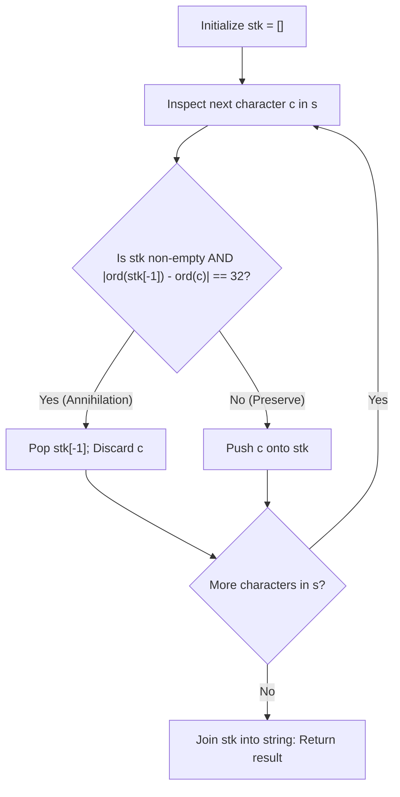

# Guided Example: Make The String Great

We trace the step-by-step execution of stack-based adjacent pair annihilation on a representative mixed-case string to eliminate all adjacent opposite-case identical letters in linear time.

- **Input:** String $s = \text{"leEeetcode"}$ of length $N = 10$.
- **Output:** `"leetcode"` (the adjacent pair $\text{"eE"}$ at indices 1 and 2 annihilates, leaving an irreducible string with no opposite-case identical neighbors).

This instance demonstrates ASCII case difference detection ($|\text{ord}(a) - \text{ord}(b)| = 32$), stack-based boundary resolution, and the preservation of adjacent identical characters in the same case.

---

## 1. Instance & Teaching Goal

We are given a string of length $N = 10$:

$$s = \text{"leEeetcode"}$$

Character sequence:
- $s[0] = \text{'l'}$
- $s[1] = \text{'e'}$
- $s[2] = \text{'E'}$
- $s[3] = \text{'e'}$
- $s[4] = \text{'e'}$
- $s[5] = \text{'t'}$
- $s[6] = \text{'c'}$
- $s[7] = \text{'o'}$
- $s[8] = \text{'d'}$
- $s[9] = \text{'e'}$

A pair of adjacent characters is **invalid** if they represent the same English letter in opposite cases:

$$c_1, c_2 \text{ invalid} \iff |\text{ord}(c_1) - \text{ord}(c_2)| = 32$$

When an invalid pair is removed, the remaining left and right substrings join, potentially creating new invalid adjacencies.

**Teaching Goal:**
Understand how a LIFO stack processes incoming stream characters, reducing deletions to $\mathcal{O}(1)$ localized comparisons against the stack top, avoiding quadratic $\mathcal{O}(N^2)$ string recreation or slice shifts.

---

## 2. Conceptual Foundation & Invariants

```
+-------------------------------------------------------------------------+
|                  STACK PAIR ANNIHILATION SCHEME                         |
+-------------------------------------------------------------------------+
|  Stream characters c from s[0 .. N-1]:                                  |
|                                                                         |
|  +--------------------+                                                 |
|  | Incoming char c    |                                                 |
|  +--------------------+                                                 |
|            |                                                            |
|     (Inspect stack top: stk[-1])                                        |
|            |                                                            |
|     +------+------+                                                     |
|     |             |                                                     |
|  [Stack empty     [|ord(stk[-1]) - ord(c)| == 32]                       |
|   OR diff != 32]  |                                                     |
|     |             v                                                     |
|     v          Opposite-Case Collision!                                 |
|  Push c onto   Pop stk[-1], discard incoming c                          |
|  stack         (Boundary restored to clean prefix)                      |
+-------------------------------------------------------------------------+
```

We establish the running state variables:

| State Variable | Definition & Role | Initial Value |
|---|---|---|
| $i$ | Index of incoming character in stream | $0$ |
| $c$ | Current character $s[i]$ | $s[0] = \text{'l'}$ |
| $\text{stk}$ | Array stack maintaining the irreducible clean prefix | `[]` |
| $\Delta$ | Absolute ASCII distance: $|\text{ord}(\text{top}) - \text{ord}(c)|$ | Computed per step |

> **Irreducible Prefix Invariant.** At every step, the stack $\text{stk}$ contains an irreducible "good" string: no two adjacent characters in $\text{stk}$ represent the same letter in opposite cases. When an incoming character $c$ collides with $\text{top}$, popping $\text{top}$ and discarding $c$ preserves the irreducibility of the remaining prefix.



---

## 3. Step-by-Step Worked Execution

### Steps 1–2: Ingesting `"le"`
- $i = 0, c = \text{'l'}$: Stack is empty. Push `'l'`. $\text{stk} = [\text{'l'}]$.
- $i = 1, c = \text{'e'}$: Top is `'l'`.
  $$\Delta = |\text{ord}(\text{'l'}) - \text{ord}(\text{'e'})| = |108 - 101| = 7 \neq 32$$
  Different letters. Push `'e'`. $\text{stk} = [\text{'l'}, \text{'e'}]$.

| Step | Index $i$ | Char $c$ | Top of Stack | Distance $\Delta$ | Action Taken | Stack After Step |
|---|---|---|---|---|---|---|
| 1 | 0 | 'l' | None | - | Push 'l' | `['l']` |
| 2 | 1 | 'e' | 'l' | 7 | Push 'e' | `['l', 'e']` |

---

### Step 3: Collision on $c = \text{'E'}$
- $i = 2, c = \text{'E'}$.
- Top of stack is `'e'`.
- Calculate ASCII distance:
  $$\Delta = |\text{ord}(\text{'e'}) - \text{ord}(\text{'E'})| = |101 - 69| = 32$$
- Collision detected! The characters `'e'` and `'E'` represent the same letter in opposite cases.
- Action: Pop `'e'` from $\text{stk}$ and discard incoming `'E'`.
- Stack becomes: $\text{stk} = [\text{'l'}]$.

| Step | Index $i$ | Char $c$ | Top of Stack | Distance $\Delta$ | Action Taken | Stack After Step |
|---|---|---|---|---|---|---|
| 3 | 2 | 'E' | 'e' | 32 | Annihilate: Pop 'e', discard 'E' | `['l']` |

---

### Steps 4–5: Ingesting Consecutive Identical Lowercase Letters `"ee"`
- $i = 3, c = \text{'e'}$: Top is `'l'`. $\Delta = 7 \neq 32$. Push `'e'`. $\text{stk} = [\text{'l'}, \text{'e'}]$.
- $i = 4, c = \text{'e'}$: Top is `'e'`.
  $$\Delta = |\text{ord}(\text{'e'}) - \text{ord}(\text{'e'})| = |101 - 101| = 0 \neq 32$$
  Same letter and same case! Not an invalid pair. Push `'e'`.
  Stack becomes: $\text{stk} = [\text{'l'}, \text{'e'}, \text{'e'}]$.

| Step | Index $i$ | Char $c$ | Top of Stack | Distance $\Delta$ | Action Taken | Stack After Step |
|---|---|---|---|---|---|---|
| 4 | 3 | 'e' | 'l' | 7 | Push 'e' | `['l', 'e']` |
| 5 | 4 | 'e' | 'e' | 0 | Push 'e' (identical case) | `['l', 'e', 'e']` |

---

### Steps 6–10: Ingesting Suffix `"tcode"`
- $i = 5, c = \text{'t'}$: Top `'e'`, $\Delta = |116 - 101| = 15 \neq 32$. Push `'t'`.
- $i = 6, c = \text{'c'}$: Top `'t'`, $\Delta = |99 - 116| = 17 \neq 32$. Push `'c'`.
- $i = 7, c = \text{'o'}$: Top `'c'`, $\Delta = |111 - 99| = 12 \neq 32$. Push `'o'`.
- $i = 8, c = \text{'d'}$: Top `'o'`, $\Delta = |100 - 111| = 11 \neq 32$. Push `'d'`.
- $i = 9, c = \text{'e'}$: Top `'d'`, $\Delta = |101 - 100| = 1 \neq 32$. Push `'e'`.

All input characters are processed.
Stack contents: `['l', 'e', 'e', 't', 'c', 'o', 'd', 'e']`.
Reconstructed string: **`"leetcode"`**.

---

## 4. Complete Execution Trace

The complete character ingestion and transition table is summarized below:

| Stream Index $i$ | Input Character $s[i]$ | Stack Top Before Step | $|\text{ord}(\text{top}) - \text{ord}(c)|$ | Operation | Stack Content After Step | Current String Form |
|---|---|---|---|---|---|---|
| 0 | 'l' | - | - | Push | `['l']` | `"l"` |
| 1 | 'e' | 'l' | 7 | Push | `['l', 'e']` | `"le"` |
| 2 | 'E' | 'e' | 32 | Pop Top | `['l']` | `"l"` |
| 3 | 'e' | 'l' | 7 | Push | `['l', 'e']` | `"le"` |
| 4 | 'e' | 'e' | 0 | Push | `['l', 'e', 'e']` | `"lee"` |
| 5 | 't' | 'e' | 15 | Push | `['l', 'e', 'e', 't']` | `"leet"` |
| 6 | 'c' | 't' | 17 | Push | `['l', 'e', 'e', 't', 'c']` | `"leetc"` |
| 7 | 'o' | 'c' | 12 | Push | `['l', 'e', 'e', 't', 'c', 'o']` | `"leetco"` |
| 8 | 'd' | 'o' | 11 | Push | `['l', 'e', 'e', 't', 'c', 'o', 'd']` | `"leetcod"` |
| 9 | 'e' | 'd' | 1 | Push | `['l', 'e', 'e', 't', 'c', 'o', 'd', 'e']` | `"leetcode"` |
| Final | - | - | - | Complete | - | **"leetcode"** |

---

## 5. Algorithmic Correctness

**Soundness.**
- An adjacent pair is removed if and only if $|\text{ord}(c_1) - \text{ord}(c_2)| = 32$.
- In the ASCII standard, lowercase letters occupy codes 97–122 ('a'–'z') and uppercase letters occupy codes 65–90 ('A'–'Z').
- The difference $\text{ord}(c) - \text{ord}(\text{uppercase}(c)) = 32$ holds universally for all 26 English letters, and no two different English letters have distance 32.
- Therefore, checking $\Delta = 32$ strictly and uniquely matches the bad pair condition.

**Completeness.**
- Church-Rosser (confluence) property of free group word reduction: in string rewriting where inverse adjacent pairs $x x^{-1}$ or $x^{-1} x$ are deleted, every reduction sequence leads to the unique normal form.
- The stack simulation performs leftmost redex reduction greedily.
- When an invalid pair is eliminated, any newly formed adjacency is tested immediately upon subsequent character arrival.
- Since all characters are processed and no invalid pair survives on the stack, the resulting string is irreducible and unique.

---

## 6. Traps This Instance Exposes

- **Same-Letter, Same-Case Trap:** In `"leEeetcode"`, indices 3 and 4 have identical characters `'e'` and `'e'`. Their ASCII difference is 0, not 32. The reduction must delete only opposite-case pairs; same-case duplicates must remain intact.
- **Cascading Deletions Across Multiple Levels:** In strings like `"abBAcC"`, removing `"bB"` leaves `'a'`, which then collides with `'A'`, leaving an empty stack before `'c'` arrives. A stack handles cascading cancellations naturally in $\mathcal{O}(1)$ amortized steps per element.
- **Repeated String Slicing Quadratic Overhead:** Implementing deletion via repeated string slicing ($s = s[:i] + s[i+2:]$) re-allocates and copies the entire string on each deletion, consuming $\mathcal{O}(N^2)$ time. The stack approach operates in $\mathcal{O}(N)$ time.
- **Empty String Termination:** When all characters annihilate (e.g. `"abBA"`), the stack becomes empty. The algorithm must safely return `""` without attempting illegal top-of-stack lookups on empty containers.

---

## 7. Complexity Derivation

- **Time Complexity:**
  Each character of string $s$ is pushed onto the stack at most once.
  Each character is popped from the stack at most once.
  Checking the condition $|\text{ord}(\text{top}) - \text{ord}(c)| = 32$ takes $\mathcal{O}(1)$ time.
  Across $N$ characters, total stack operations are at most $2N = \mathcal{O}(N)$.
  For $N \le 100$, execution takes under 1 millisecond.
- **Auxiliary Space Complexity:**
  The stack $\text{stk}$ stores at most $N$ characters in the worst case (when no deletions occur).
  Auxiliary space complexity is $\mathcal{O}(N)$.
