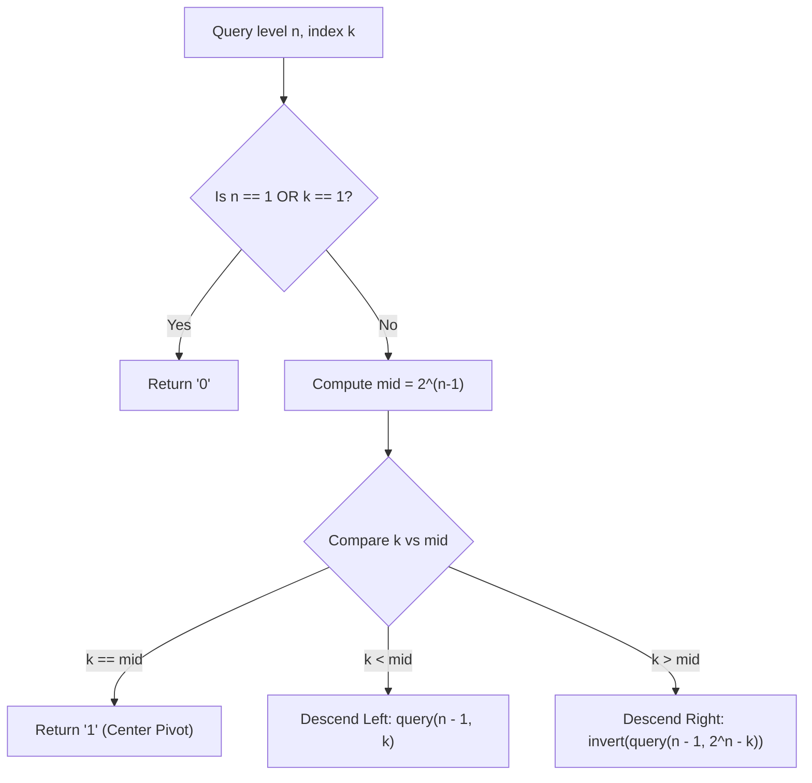

# Guided Example: Find Kth Bit in Nth Binary String

We trace the step-by-step execution of recursive divide-and-conquer reflection on a representative binary string instance to determine the $k$-th bit without constructing the exponentially large string.

- **Input:** String level $n = 4$, target 1-based index $k = 11$.
- **Output:** `"1"` (in $S_4 = \text{"011100110110001"}$, the 11th character is `"1"`).

This instance demonstrates recursive divide-and-conquer, central pivot detection at powers of two, index reflection across the midpoint ($k' = 2^n - k$), and cumulative parity inversion tracking.

---

## 1. Instance & Teaching Goal

We are given recursive generation level $n = 4$ and target position $k = 11$:

$$S_1 = \text{"0"}$$
$$S_i = S_{i-1} + \text{"1"} + \text{reverse}(\text{invert}(S_{i-1})) \quad \text{for } i > 1$$

Full sequence lengths:
- Length of $S_1 = 2^1 - 1 = 1$: `"0"`
- Length of $S_2 = 2^2 - 1 = 3$: `"011"`
- Length of $S_3 = 2^3 - 1 = 7$: `"0111001"`
- Length of $S_4 = 2^4 - 1 = 15$: `"011100110110001"`

Target index: $k = 11$ in $S_4$.
Characters of $S_4$ indexed 1 to 15:
`0, 1, 1, 1, 0, 0, 1, 1, 0, 1, 1, 0, 0, 0, 1`
At index 11, the bit is `'1'`.

**Teaching Goal:**
Understand how to query any bit in logarithmic time $\mathcal{O}(n)$ using reflection symmetry. Because generating $S_{20}$ requires string length $2^{20} - 1 \approx 10^6$, allocating memory is wasteful. We recursively determine whether $k$ falls in the left half, the exact middle, or the reflected inverted right half.

---

## 2. Conceptual Foundation & Invariants

```
+-------------------------------------------------------------------------+
|                  RECURSIVE STRING REFLECTION SCHEME                     |
+-------------------------------------------------------------------------+
|  Level n, Length = 2^n - 1, Midpoint = 2^(n-1)                          |
|                                                                         |
|  [ 1 ........... mid - 1 ]   [ mid ]   [ mid + 1 ............ 2^n - 1 ] |
|  <------ Left Half ------>   Center    <--------- Right Half ---------> |
|         S_(n-1)               "1"         reverse(invert(S_(n-1)))      |
|                                                                         |
|  THREE DISJUNCTIVE CASES FOR QUERY k:                                   |
|                                                                         |
|  CASE 1: k == mid                                                       |
|    --> Exact center bit is ALWAYS "1".                                  |
|                                                                         |
|  CASE 2: k < mid                                                        |
|    --> Lies in Left Half: bit(n, k) = bit(n - 1, k).                    |
|                                                                         |
|  CASE 3: k > mid                                                        |
|    --> Lies in Right Half: Mirrored index k' = 2^n - k.                 |
|    --> bit(n, k) = invert(bit(n - 1, k')) = 1 ^ bit(n - 1, k').        |
+-------------------------------------------------------------------------+
```

We establish the recursive state variables:

| State Variable | Definition & Role | Initial Value |
|---|---|---|
| $n$ | Current recursion depth / string level | $4$ |
| $k$ | Current 1-based target index | $11$ |
| $\text{mid}$ | Midpoint index: $2^{n-1}$ | $2^{4-1} = 8$ |
| $\text{inv\_count}$ | Total number of bit inversions accumulated | $0$ |

> **Recursive Reflection Invariant.** At any level $n$ and position $k > \text{mid} = 2^{n-1}$, the character at $k$ is the bitwise inverse of the character at reflected position $k' = 2^n - k$ in $S_{n-1}$. For $k < \text{mid}$, the character matches position $k$ in $S_{n-1}$ identically.



---

## 3. Step-by-Step Worked Execution

### Level $n = 4$, Target $k = 11$
- Total length: $2^4 - 1 = 15$.
- Midpoint: $\text{mid} = 2^{4-1} = 8$.
- Compare $k = 11$ with $\text{mid} = 8$:
  $$k = 11 > 8 \implies \text{Right Half!}$$
- Reflection formula:
  $$k' = 2^n - k = 2^4 - 11 = 16 - 11 = 5$$
- Transformation:
  $$\text{bit}(4, 11) = \text{invert}(\text{bit}(3, 5))$$
- Cumulative inversions: $1$. Next state: $(n = 3, k = 5)$.

| Level $n$ | Target $k$ | Length $2^n - 1$ | Midpoint $2^{n-1}$ | Branch Condition | Next Reflected $k'$ | Inversion Incurred? |
|---|---|---|---|---|---|---|
| 4 | 11 | 15 | 8 | $11 > 8$ (Right Half) | $16 - 11 = 5$ | Yes (+1) |

---

### Level $n = 3$, Target $k = 5$
- Total length: $2^3 - 1 = 7$.
- Midpoint: $\text{mid} = 2^{3-1} = 4$.
- Compare $k = 5$ with $\text{mid} = 4$:
  $$k = 5 > 4 \implies \text{Right Half!}$$
- Reflection formula:
  $$k' = 2^n - k = 2^3 - 5 = 8 - 5 = 3$$
- Transformation:
  $$\text{bit}(3, 5) = \text{invert}(\text{bit}(2, 3))$$
- Cumulative inversions: $1 + 1 = 2$. Next state: $(n = 2, k = 3)$.

| Level $n$ | Target $k$ | Length $2^n - 1$ | Midpoint $2^{n-1}$ | Branch Condition | Next Reflected $k'$ | Inversion Incurred? |
|---|---|---|---|---|---|---|
| 3 | 5 | 7 | 4 | $5 > 4$ (Right Half) | $8 - 5 = 3$ | Yes (+1) |

---

### Level $n = 2$, Target $k = 3$
- Total length: $2^2 - 1 = 3$.
- Midpoint: $\text{mid} = 2^{2-1} = 2$.
- Compare $k = 3$ with $\text{mid} = 2$:
  $$k = 3 > 2 \implies \text{Right Half!}$$
- Reflection formula:
  $$k' = 2^n - k = 2^2 - 3 = 4 - 3 = 1$$
- Transformation:
  $$\text{bit}(2, 3) = \text{invert}(\text{bit}(1, 1))$$
- Cumulative inversions: $2 + 1 = 3$. Next state: $(n = 1, k = 1)$.

| Level $n$ | Target $k$ | Length $2^n - 1$ | Midpoint $2^{n-1}$ | Branch Condition | Next Reflected $k'$ | Inversion Incurred? |
|---|---|---|---|---|---|---|
| 2 | 3 | 3 | 2 | $3 > 2$ (Right Half) | $4 - 3 = 1$ | Yes (+1) |

---

### Level $n = 1$, Target $k = 1$ (Base Case)
- At level $n = 1$, $S_1 = \text{"0"}$.
- Base value:
  $$\text{bit}(1, 1) = 0$$
- Unwind accumulated inversions:
  Total inversions $= 3$ (an odd number).
  $$\text{Final Bit} = 0 \oplus 1 \oplus 1 \oplus 1 = 1$$

Final character returned: **`"1"`**.

---

## 4. Complete Execution Trace

The complete recursive descent from $(n=4, k=11)$ to base case $(n=1, k=1)$ is summarized below:

| Depth | Level $n$ | Active $k$ | Midpoint | Partition Segment | Mathematical Identity Applied | Running Inversions |
|---|---|---|---|---|---|---|
| 0 | 4 | 11 | 8 | Right Half ($k > 8$) | $\text{bit}(4, 11) = \neg \text{bit}(3, 5)$ | 1 |
| 1 | 3 | 5 | 4 | Right Half ($k > 4$) | $\text{bit}(3, 5) = \neg \text{bit}(2, 3)$ | 2 |
| 2 | 2 | 3 | 2 | Right Half ($k > 2$) | $\text{bit}(2, 3) = \neg \text{bit}(1, 1)$ | 3 |
| 3 | 1 | 1 | 1 | Base Case ($n=1$) | Base bit $= 0$ | 3 |
| Return | - | - | - | Resolution | $\neg \neg \neg 0 = 1$ | **"1"** |

---

## 5. Algorithmic Correctness

**Soundness.**
- String definition: $S_n = S_{n-1} + \text{"1"} + \text{reverse}(\text{invert}(S_{n-1}))$.
- By string length induction: $|S_n| = 2 |S_{n-1}| + 1 = 2^n - 1$.
- The central index $|S_{n-1}| + 1 = 2^{n-1}$ holds the character `"1"`.
- For $k \le 2^{n-1} - 1$, $S_n[k]$ lies strictly in the left half and is identical to $S_{n-1}[k]$.
- For $k \ge 2^{n-1} + 1$, let the 1-based offset into the right half be $j = k - 2^{n-1}$.
  Because the right half is reversed and inverted, offset $j$ corresponds to $(|S_{n-1}| - j + 1)$-th character of $\text{invert}(S_{n-1})$.
  $$(2^{n-1} - 1) - (k - 2^{n-1}) + 1 = 2^n - k$$
  Thus, $S_n[k] = \text{invert}(S_{n-1}[2^n - k])$, proving exact algebraic soundness.

**Completeness.**
At every non-base step ($n > 1$), $k$ is either equal to $\text{mid}$ (terminating in $\mathcal{O}(1)$), less than $\text{mid}$ (reducing $n \rightarrow n-1$ with $k < 2^{n-1}$), or greater than $\text{mid}$ (reducing $n \rightarrow n-1$ with $k' = 2^n - k < 2^{n-1}$). In all paths, $n$ strictly decreases by 1, guaranteeing termination in at most $n$ steps.

---

## 6. Traps This Instance Exposes

- **String Materialization Overhead:** Concatenating strings up to $n = 20$ creates an object of length $2^{20} - 1 = 1,048,575$ characters. While feasible, it consumes megabytes of memory and millions of allocations, whereas recursive reflection uses zero heap allocations.
- **Reflection Index Arithmetic:** Reversing an array of length $L$ maps 1-based index $j$ to $L - j + 1$. For right-half offset $k - 2^{n-1}$, applying the formula yields $2^n - k$. Forgetting the $+1$ offset results in off-by-one errors.
- **Power of Two vs. Center Bit:** The midpoint $2^{n-1}$ is always a power of two. While every center bit at level $m$ is `'1'`, position $k = 1$ is also a power of two ($2^0$) but holds base bit `'0'`. Checking $k = 1$ before assuming powers of two are `'1'` is essential.
- **Inversion Odd/Even Tracking:** Each right-half reflection inverts the resulting bit. An even number of reflections cancels out, while an odd number flips `'0'` to `'1'`. Tracking parity via bitwise XOR ($\text{inv} \oplus 1$) avoids conditional branches.

---

## 7. Complexity Derivation

- **Time Complexity:**
  Each recursive step reduces $n$ by $1$ using constant-time arithmetic operations ($2^n$, subtraction, bitwise XOR).
  The maximum recursion depth is $n$.
  With $n \le 20$, the algorithm executes at most $20$ iterations/calls, taking less than a microsecond.
  Total time complexity is $\mathcal{O}(n)$.
- **Auxiliary Space Complexity:**
  The call stack depth is at most $n$ frames (or $\mathcal{O}(1)$ if implemented as an iterative loop).
  Auxiliary space complexity is $\mathcal{O}(n)$ (or $\mathcal{O}(1)$ iterative).
