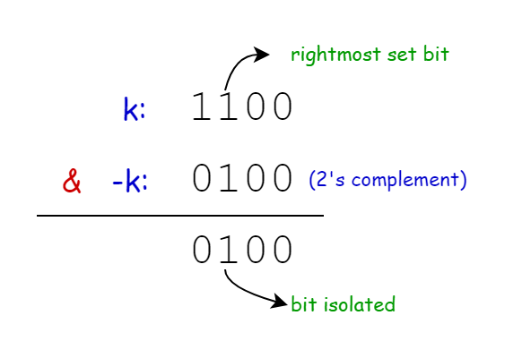

## Solution

---

### Approach 1: Brute Force

#### Intuition

Given that `n` is relatively small, we can solve this problem by simply simulating the operations. We'll maintain a string `sequence` as our binary string. Next, we run a loop until we reach the `n`th string or the length of the `sequence` exceeds `k` (in which case, we can terminate early since the required character is already created).

In each iteration, we start by appending `1` to `sequence`. Then, we take each bit of the original `sequence` in reverse, invert it, and append it to the end of `sequence`.

Finally, once the loop completes, we return the `k-1`th character (0-indexed) as the result.

#### Algorithm

- Initialize a string `sequence` with the initial sequence "0".
- Start a loop that continues until we reach the `n`th iteration or have generated enough characters:
  - Append '1' to the current sequence.
  - Start a nested loop to iterate through the existing sequence in reverse order:
- For each bit in the existing sequence (excluding the last '1'):
      - Invert the bit (change '0' to '1' or '1' to '0').
      - Append the inverted bit to the end of the sequence.
- Once the loop completes, return the `k-1`th (0-indexed) character of the sequence.

#### Implementation

```python
class Solution:
    def findKthBit(self, n: int, k: int) -> str:
        sequence = "0"

        # Generate sequence until we have enough elements or reach nth iteration
        for i in range(1, n):
            if k <= len(sequence):
                break
            sequence += "1"

            # Append the inverted and reversed part of the existing sequence
            inverted = "".join(
                "1" if bit == "0" else "0" for bit in sequence[:-1]
            )
            sequence += inverted[::-1]

        # Return the kth bit
        return sequence[k - 1]
```

#### Complexity Analysis

- Time complexity: $O(2^n)$

    In the worst case, we need to generate the entire `n`th string. The length of the string doubles (approximately) with each iteration: $S_1$ has length 1, $S_2$ has length 3 $($2^{2}$ - 1)$ ... $S_n$ has length $2^n - 1$. Thus, the total number of operations is proportional to the sum of $2^i$ for $i$ from $1$ to $n-1$, which is $O(2^n)$.

- Space complexity: $O(2^n)$

    We store the entire generated string in memory, where the length of the `n`th string is $2^n - 1$. Therefore, the space complexity of the algorithm is $O(2^n)$.

---

### Approach 2: Recursion

#### Intuition

Instead of building the string from the base condition, let’s work backward from the largest string, which is efficient for large values of `k`.

According to the problem, each string $S_n$ is formed from $S_{n-1}$. So, to find a specific bit in $S_n$, we can recursively break down $S_n$ to $S_{n-1}$ until reaching $S_1$. This suggests a recursive approach.

We can break down our recursive method into three parts:
1. If `k` is in the first half, it lies in $S_{n-1}$. We can recursively call our function with `n-1` and the same `k`.
2. If `k` is exactly in the middle, we know the value is `1` based on the string construction rules, so we return 1.
3. The latter half of $S_n$ is actually $S_{n-1}$, but flipped and reversed. To account for the reversal, we need to find the `k`th bit from the end. We can do so by calling the `findKthBit` function on $S_{n-1}$ but instead of `k`, we use the length of $S_n$ minus `k`. The answer we get will be the `k`th bit but flipped. We just need to flip it back before returning it as our final answer.

#### Algorithm

- If `n` equals 1, return '0' as the base case.
- Calculate the length of the `n`th string by left-shifting 1 by `n` positions.
- Compare `k` with half of the calculated length and return the result:
  - If `k` is less than half the length, recursively call the function with `n-1` and the same `k`.
  - If `k` is exactly half the length, return '1'.
  - If `k` is greater than half the length:
- Calculate the corresponding position in the first half of the string by subtracting `k` from the total length.
- Recursively call the function with `n-1` and this new position.
- Invert the bit returned from the recursive call (change '0' to '1' or '1' to '0').
- Return the inverted bit.

#### Implementation

```python
class Solution:
    def findKthBit(self, n: int, k: int) -> str:
        # Base case: for S1, return '0'
        if n == 1:
            return "0"

        # Calculate the length of Sn
        length = 1 << n  # Equivalent to 2^n

        # If k is in the first half of the string, recurse with n-1
        if k < length // 2:
            return self.findKthBit(n - 1, k)

        # If k is exactly in the middle, return '1'
        elif k == length // 2:
            return "1"

        # If k is in the second half of the string
        else:
            # Find the corresponding bit in the first half and invert it
            corresponding_bit = self.findKthBit(n - 1, length - k)
            return "1" if corresponding_bit == "0" else "0"
```

#### Complexity Analysis

* Time complexity: $O(n)$

    The recursion depth is at most `n`, as we decrease `n` by 1 in each call until we reach the base case where `n` is 1. Each recursive call performs constant-time operations. Thus, the time complexity of the algorithm is $O(n)$.

* Space complexity: $O(n)$

    The space complexity is determined by the maximum depth of the recursion stack, which is $O(n)$.

---

### Approach 3: Iterative Divide and Conquer

#### Intuition

We can convert the recursive approach to an iterative one to avoid the excess stack space taken by the recursion.

Our main idea stays the same: start with the largest string and repeatedly halve it until reaching the smallest string, $S_1$.

In the recursive approach, finding a bit in the second half of the string allowed us to immediately flip it due to the recursion handling any further inversions. Since that isn’t possible iteratively, we maintain an `invertCount` variable to track how many times we enter an inverted section. Once we find the `k`th bit, we check the parity of `invertCount` to determine if it needs to be flipped.

We begin with the largest string length $2^n - 1$ and loop while `k` is greater than 1. If `k` is in the middle, it represents the `1` added during string construction, so we simply return the bit based on `invertCount`. If `k` is in the second half, we mirror `k` to the corresponding bit in the first half and increment `invertCount` to indicate the inversion. Then, we move to the previous string in the series by halving the length.

When the loop completes, `k` represents the first bit of the string (corresponding to $S_1$). We return this bit, flipping it if necessary based on `invertCount`.

#### Algorithm

- Initialize a variable `invertCount` to 0 to keep track of the number of inversions.
- Calculate the length of the `n`th string as $2^n - 1$ using bitwise left shift.
- Enter a loop that continues while `k` is greater than 1:
  - Check if `k` is exactly in the middle of the current string:
      - If true, return '1' if `invertCount` is even, otherwise return '0'.
  - If `k` is in the second half of the current string:
      - Update `k` to its mirrored position in the first half.
      - Increment the `invertCount`.
  - Halve the length of the string for the next iteration.
- After the loop ends (when `k` reaches 1):
   - Return '0' if `invertCount` is even, otherwise return '1'.

#### Implementation

```python
class Solution:
    def findKthBit(self, n: int, k: int) -> str:
        invert_count = 0
        length = (1 << n) - 1  # Length of Sn is 2^n - 1

        while k > 1:
            # If k is in the middle, return based on inversion count
            if k == length // 2 + 1:
                return "1" if invert_count % 2 == 0 else "0"

            # If k is in the second half, invert and mirror
            if k > length // 2:
                k = length + 1 - k  # Mirror position
                invert_count += 1  # Increment inversion count

            length //= 2  # Reduce length for next iteration

        # For the first position, return based on inversion count
        return "0" if invert_count % 2 == 0 else "1"
```

#### Complexity Analysis

* Time complexity: $O(n)$

    The algorithm uses a while loop that continues as long as `k > 1`. In the worst case, when `k` is always in the second half of the string, the algorithm will perform `n` iterations. Thus, the time complexity is $O(n)$.

* Space complexity: $O(1)$

    The algorithm does not use any additional space which scales with input size.

---

### Approach 4: Bit Manipulation

#### Intuition

> Note: This approach is quite challenging and requires a strong understanding of bit manipulation and pattern recognition. In most interviews, optimizing your solution using Approach 3 would be more than sufficient.

Instead of constructing the entire sequence, we focus on the binary representation of $k$. The position of $k$ helps us understand its relation to the sequence structure.

We begin by using the expression $k \& -k$ to find the rightmost set bit in $k$. This operation isolates the smallest power of 2 in $k$. Why is this important? The rightmost set bit indicates how deep we are in the sequence’s structure, guiding us to the appropriate section of the sequence, especially in relation to any inversions.

The following diagram illustrates how we isolate the rightmost set bit using $k \& -k$:



To clarify the above concept, let’s break down the binary representation of positions step by step.

Consider the following sequences:
- $S_1 = "0"$
- $S_2 = "0" + "1" + "1" = "011"$
- $S_3 = "011" + "1" + "001" = "0111001"$

Now, let’s analyze $S_3 = "0111001"$ in detail:

| Position | 1 | 2 | 3 | 4 | 5 | 6 | 7 |
|----------|---|---|---|---|---|---|---|
| $S_3$   | 0 | 1 | 1 | 1 | 0 | 0 | 1 |
| Binary   | 001 | 010 | 011 | 100 | 101 | 110 | 111 |

1. First Bit (Leftmost) of the Binary Representation:
   - If it’s 0, we are in the left half of the string (positions 1-3).
   - If it’s 1, we are either in the right half (positions 5-7) or the middle (position 4).

2. Second Bit of the Binary Representation:
   - In the left half (positions 1-3 represented as 001-011):
     - If it’s 0, we are in the left quarter (position 1).
     - If it’s 1, we are in the right quarter of the left half (positions 2-3).
   - In the right half (positions 5-7 represented as 101-111):
     - If it’s 0, we are in the left quarter of the right half (position 5).
     - If it’s 1, we are in the right quarter (positions 6-7).

3. Third Bit (Rightmost) of the Binary Representation:
   - This indicates whether we are at an odd or even position.

This pattern continues for larger strings. Each bit in the binary representation narrows down which section of the string we are examining.

For instance, consider position 6 (binary 110):
- The first bit is 1, indicating we are in the right half of the string.
- The second bit is 1, showing we are in the right quarter of the right half.
- The third bit is 0, indicating we are at an even position.

From this information, we can determine:
1. Whether we are in an inverted section (right half).
2. How many times the bit has been inverted, which depends on our depth in the sections.
3. What the original bit was based on the odd/even position.

This is how the binary representation of the position correlates with the string's structure. We know this approach might seem unconventional and is tougher than what you might have originally thought of. We recommend dry-running this approach a couple of times to digest it completely, simply reading this explanation is not enough.

So to determine if the bit at position $k$ has been inverted, we check the bits to the left of the rightmost set bit. We calculate $k$ divided by `positionInSection` (the result of $k \& -k$) and then shift the result right by one bit.

If the resulting bit is 1, it indicates we are in a section of the sequence that has been inverted. We then need to ascertain the original state of the bit, regardless of any inversions. If $k$ is even, the original bit is 1; if $k$ is odd, the original bit is 0. This check tells us the bit's state before any transformations occur.

Finally, we decide what to return based on whether $k$ is in an inverted section:
- If $k$ is in an inverted part, we flip the original bit (changing 0 to 1 or 1 to 0).
- If $k$ is not in an inverted part, we return the original bit as it is.

#### Algorithm

- Calculate the position within the current section by performing a bitwise AND operation between `k` and its two's complement (-`k`).
- Determine if the bit is in an inverted part of the sequence:
  - Divide `k` by the position in section.
  - Right shift the result by 1 bit.
  - Perform a bitwise AND with 1.
  - Check if the result equals 1.
- Determine if the original bit (before any inversions) is a 1:
   - Perform a bitwise AND between `k` and 1.
   - Check if the result equals 0.
- If the bit is in an inverted part of the sequence:
  - Return '0' if the original bit was 1, otherwise return '1'.
- If the bit is not in an inverted part:
  - Return '1' if the original bit was 1, otherwise return '0'.

#### Implementation

```python
class Solution:
    def findKthBit(self, n: int, k: int) -> str:
        # Find the position of the rightmost set bit in k
        # This helps determine which "section" of the string we're in
        position_in_section = k & -k

        # Determine if k is in the inverted part of the string
        # This checks if the bit to the left of the rightmost set bit is 1
        is_in_inverted_part = ((k // position_in_section) >> 1 & 1) == 1

        # Determine if the original bit (before any inversion) would be 1
        # This is true if k is even (i.e., its least significant bit is 0)
        original_bit_is_one = (k & 1) == 0

        if is_in_inverted_part:
            # If we're in the inverted part, we need to flip the bit
            return "0" if original_bit_is_one else "1"
        else:
            # If we're not in the inverted part, return the original bit
            return "1" if original_bit_is_one else "0"
```

#### Complexity Analysis

* Time complexity: $O(1)$

    The algorithm performs a constant number of bitwise operations and comparisons, regardless of the input values of `n` and `k`. Therefore, the time complexity is $O(1)$ or constant time.

* Space complexity: $O(1)$

    The algorithm does not use any data structures which is dependent on the input size. So, it's space complexity remains constant.

---