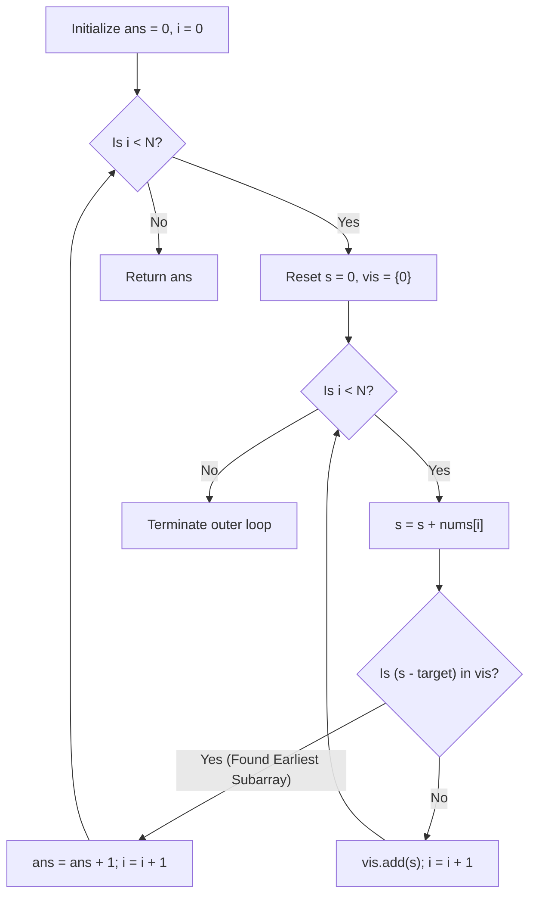

# Guided Example: Maximum Number of Non-Overlapping Subarrays With Sum Equals Target

We trace the step-by-step execution of prefix-sum hash set tracking combined with earliest-deadline interval scheduling on a representative array containing positive and negative integers.

- **Input:** Array $\text{nums} = [-1, 3, 5, 1, 4, 2, -9]$ of length $N = 7$, with target sum $\text{target} = 6$.
- **Output:** `2` (two disjoint subarrays $[5, 1]$ and $[4, 2]$ each sum to 6).

This instance demonstrates handling non-monotonic prefix sums with negative numbers, detecting zero-offset subarrays via initial set element $0$, and greedily committing to the earliest-ending valid subarray.

---

## 1. Instance & Teaching Goal

We are given an integer array and a target sum:

$$\text{nums} = [-1, 3, 5, 1, 4, 2, -9], \quad \text{target} = 6$$

Goal: Select the maximum number of contiguous, pairwise non-overlapping subarrays such that each selected subarray has an exact sum of $6$.

Candidate subarrays summing to 6:
- $\text{nums}[0..2] = [-1, 3, 5]$, sum $= 7 \neq 6$
- $\text{nums}[1..3] = [3, 5, 1]$, sum $= 9 \neq 6$
- $\text{nums}[2..3] = [5, 1]$, sum $= 6$ (ends at index 3)
- $\text{nums}[4..5] = [4, 2]$, sum $= 6$ (ends at index 5)
- $\text{nums}[1..5] = [3, 5, 1, 4, 2]$, sum $= 15 \neq 6$

Subarrays $[5, 1]$ (indices $2..3$) and $[4, 2]$ (indices $4..5$) are completely disjoint.

**Teaching Goal:**
Understand why sliding window fails when negative numbers break sum monotonicity, and why greedy interval scheduling (choosing the subarray that finishes as early as possible) is mathematically optimal. Resetting prefix tracking upon discovery guarantees disjointness in $\mathcal{O}(N)$ time.

---

## 2. Conceptual Foundation & Invariants

```
+-------------------------------------------------------------------------+
|                  EARLIEST-FINISH GREEDY PREFIX MODEL                    |
+-------------------------------------------------------------------------+
|  Running Segment: Track prefix sum s, Set vis = {0}                     |
|                                                                         |
|  At index i:                                                            |
|    s = s + nums[i]                                                      |
|    Check if (s - target) in vis:                                        |
|      - YES: Subarray with sum == target ends at index i!                |
|             Increment ans += 1.                                         |
|             Clear vis and reset s = 0 (Start disjoint search at i + 1). |
|      - NO:  Insert s into vis; advance i.                               |
|                                                                         |
|  INTERVAL SCHEDULING THEOREM:                                           |
|    Choosing the subarray with the earliest completion index R leaves    |
|    the largest possible unprocessed suffix [R+1 .. N-1] for future picks|
+-------------------------------------------------------------------------+
```

We define the tracking parameters:

| State Variable | Definition & Role | Initial Value |
|---|---|---|
| $i$ | Scan pointer across array $\text{nums}$ | $0$ |
| $s$ | Running prefix sum of current segment | $0$ |
| $\text{vis}$ | Hash set of prefix sums observed since last segment reset | $\{0\}$ |
| $\text{ans}$ | Count of non-overlapping target-sum subarrays found | $0$ |
| $\text{target}$ | Desired subarray sum | $6$ |

> **Earliest Completion Invariant.** Committing to the first subarray that achieves the target sum minimizes the right boundary index $R$. By the interval scheduling theorem, no other choice of valid subarray in the active prefix can leave a larger unconsumed suffix for subsequent disjoint selections.



---

## 3. Step-by-Step Worked Execution

### Segment 1: Scanning from Index $i = 0$
Initialize: $s = 0, \text{vis} = \{0\}$.

- **Index $i = 0$ ($\text{nums}[0] = -1$):**
  - $s \leftarrow 0 + (-1) = -1$.
  - Check $s - \text{target} = -1 - 6 = -7 \in \text{vis}$: False.
  - Add to set: $\text{vis} = \{0, -1\}$.
  - Advance: $i \leftarrow 1$.
- **Index $i = 1$ ($\text{nums}[1] = 3$):**
  - $s \leftarrow -1 + 3 = 2$.
  - Check $s - \text{target} = 2 - 6 = -4 \in \text{vis}$: False.
  - Add to set: $\text{vis} = \{0, -1, 2\}$.
  - Advance: $i \leftarrow 2$.
- **Index $i = 2$ ($\text{nums}[2] = 5$):**
  - $s \leftarrow 2 + 5 = 7$.
  - Check $s - \text{target} = 7 - 6 = 1 \in \text{vis}$: False.
  - Add to set: $\text{vis} = \{0, -1, 2, 7\}$.
  - Advance: $i \leftarrow 3$.
- **Index $i = 3$ ($\text{nums}[3] = 1$):**
  - $s \leftarrow 7 + 1 = 8$.
  - Check $s - \text{target} = 8 - 6 = 2 \in \text{vis}$: **TRUE!**
  - A prefix sum of 2 was recorded at index 1.
  - Subarray spans indices $2..3$: $\text{nums}[2..3] = [5, 1]$, sum $= 5 + 1 = 6$.
  - Action: Record selection $\text{ans} \leftarrow 0 + 1 = 1$.
  - Discard segment state to prevent overlap; break inner loop.
  - Outer pointer advances to $i = 4$.

| Step | Index $i$ | $\text{nums}[i]$ | Running Sum $s$ | Target Difference $s - 6$ | In $\text{vis}$? | State of $\text{vis}$ | Action |
|---|---|---|---|---|---|---|---|
| 1 | 0 | -1 | -1 | -7 | No | $\{0, -1\}$ | Continue |
| 2 | 1 | 3 | 2 | -4 | No | $\{0, -1, 2\}$ | Continue |
| 3 | 2 | 5 | 7 | 1 | No | $\{0, -1, 2, 7\}$ | Continue |
| 4 | 3 | 1 | 8 | 2 | **Yes** | $\{0, -1, 2, 7\}$ | Match $[5, 1]$! $\text{ans} = 1$, Reset |

---

### Segment 2: Scanning from Index $i = 4$
Initialize fresh segment: $s = 0, \text{vis} = \{0\}$.

- **Index $i = 4$ ($\text{nums}[4] = 4$):**
  - $s \leftarrow 0 + 4 = 4$.
  - Check $s - \text{target} = 4 - 6 = -2 \in \text{vis}$: False.
  - Add to set: $\text{vis} = \{0, 4\}$.
  - Advance: $i \leftarrow 5$.
- **Index $i = 5$ ($\text{nums}[5] = 2$):**
  - $s \leftarrow 4 + 2 = 6$.
  - Check $s - \text{target} = 6 - 6 = 0 \in \text{vis}$: **TRUE!**
  - Prefix sum 0 is present (the empty prefix at segment start).
  - Subarray spans indices $4..5$: $\text{nums}[4..5] = [4, 2]$, sum $= 4 + 2 = 6$.
  - Action: Record selection $\text{ans} \leftarrow 1 + 1 = 2$.
  - Discard segment state; break inner loop.
  - Outer pointer advances to $i = 6$.

| Step | Index $i$ | $\text{nums}[i]$ | Running Sum $s$ | Target Difference $s - 6$ | In $\text{vis}$? | State of $\text{vis}$ | Action |
|---|---|---|---|---|---|---|---|
| 5 | 4 | 4 | 4 | -2 | No | $\{0, 4\}$ | Continue |
| 6 | 5 | 2 | 6 | 0 | **Yes** | $\{0, 4\}$ | Match $[4, 2]$! $\text{ans} = 2$, Reset |

---

### Segment 3: Scanning Suffix from Index $i = 6$
Initialize fresh segment: $s = 0, \text{vis} = \{0\}$.

- **Index $i = 6$ ($\text{nums}[6] = -9$):**
  - $s \leftarrow 0 + (-9) = -9$.
  - Check $s - \text{target} = -9 - 6 = -15 \in \text{vis}$: False.
  - Add to set: $\text{vis} = \{0, -9\}$.
  - Advance: $i \leftarrow 7$.
- Index $i = 7 == N$. Scan finishes.

Total non-overlapping subarrays: **`2`**.

---

## 4. Complete Execution Trace

The trace below summarizes all index evaluations and segment partitions:

| Segment | Index $i$ | Element | Running Sum | Check $s - 6$ in Set | Outcome | Active Set $\text{vis}$ | Cumulative $\text{ans}$ |
|---|---|---|---|---|---|---|---|
| 1 | 0 | -1 | -1 | $-7 \notin \text{vis}$ | Insert -1 | $\{0, -1\}$ | 0 |
| 1 | 1 | 3 | 2 | $-4 \notin \text{vis}$ | Insert 2 | $\{0, -1, 2\}$ | 0 |
| 1 | 2 | 5 | 7 | $1 \notin \text{vis}$ | Insert 7 | $\{0, -1, 2, 7\}$ | 0 |
| 1 | 3 | 1 | 8 | $2 \in \text{vis}$ | Select $[2..3] = [5, 1]$ | Closed | 1 |
| 2 | 4 | 4 | 4 | $-2 \notin \text{vis}$ | Insert 4 | $\{0, 4\}$ | 1 |
| 2 | 5 | 2 | 6 | $0 \in \text{vis}$ | Select $[4..5] = [4, 2]$ | Closed | 2 |
| 3 | 6 | -9 | -9 | $-15 \notin \text{vis}$ | Insert -9 | $\{0, -9\}$ | 2 |
| End | 7 | - | - | Array exhausted | Complete | - | **2** |

---

## 5. Algorithmic Correctness

**Soundness.**
- For any segment starting at index $L$, if $s_R - s_{L'} = \text{target}$ for some $L \le L' < R$, the contiguous slice $\text{nums}[L'..R-1]$ sums to $\text{target}$.
- Because the algorithm halts the segment at index $R-1$ and initiates the next search strictly at index $R$, no two selected subarrays can share any index.
- Every selected subarray has sum equal to $\text{target}$ by prefix sum difference.

**Completeness.**
- This problem reduces to Interval Scheduling on candidate subarrays summing to $\text{target}$.
- By the classical greedy exchange argument, selecting the interval that finishes earliest (smallest right endpoint $R$) is always globally optimal: any other valid choice finishes at or after $R$ and can leave at most as much space for subsequent non-overlapping intervals.
- The prefix sum lookup identifies the first possible ending index $R$ encountered during the linear scan.
- Resetting the set discards only intervals that would overlap with the chosen optimal subarray, ensuring no feasible non-overlapping choice is lost.

---

## 6. Traps This Instance Exposes

- **Sliding Window Failure on Negative Values:** When array values can be negative, expanding a window does not guarantee that the sum increases, and shrinking does not guarantee that the sum decreases. A sliding window is mathematically invalid here.
- **Forgetting to Reset Prefix History:** Failing to clear $\text{vis}$ and reset $s = 0$ allows future queries to match against prefixes from prior segments, resulting in overlapping subarray selections.
- **Omitting 0 from Initial Prefix Set:** If $\{0\}$ is omitted, a target-sum subarray that begins at the very start of a segment (e.g. $[4, 2]$ summing to $6$ from the segment start) cannot be detected because $s - \text{target} = 6 - 6 = 0$ would not be found.
- **Dynamic Programming Quadratic Blowup:** Computing all candidate pairs $(l, r)$ and sorting them takes $\mathcal{O}(N^2)$ time. The streaming prefix search achieves linear time $\mathcal{O}(N)$ by finding the earliest finish on-the-fly.

---

## 7. Complexity Derivation

- **Time Complexity:**
  Each index $i \in [0, N-1]$ is visited exactly once by the pointer.
  At each position, one running sum addition, one hash set membership check, and at most one hash set insertion are performed, all costing $\mathcal{O}(1)$ average time.
  Total time complexity is $\mathcal{O}(N)$. For $N = 10^5$, this requires $10^5$ hash operations, completing in under 25 milliseconds.
- **Auxiliary Space Complexity:**
  The hash set $\text{vis}$ stores prefix sums for the current segment. In the worst case (no target sum found), it holds at most $N + 1$ integers.
  Auxiliary space complexity is $\mathcal{O}(N)$.
