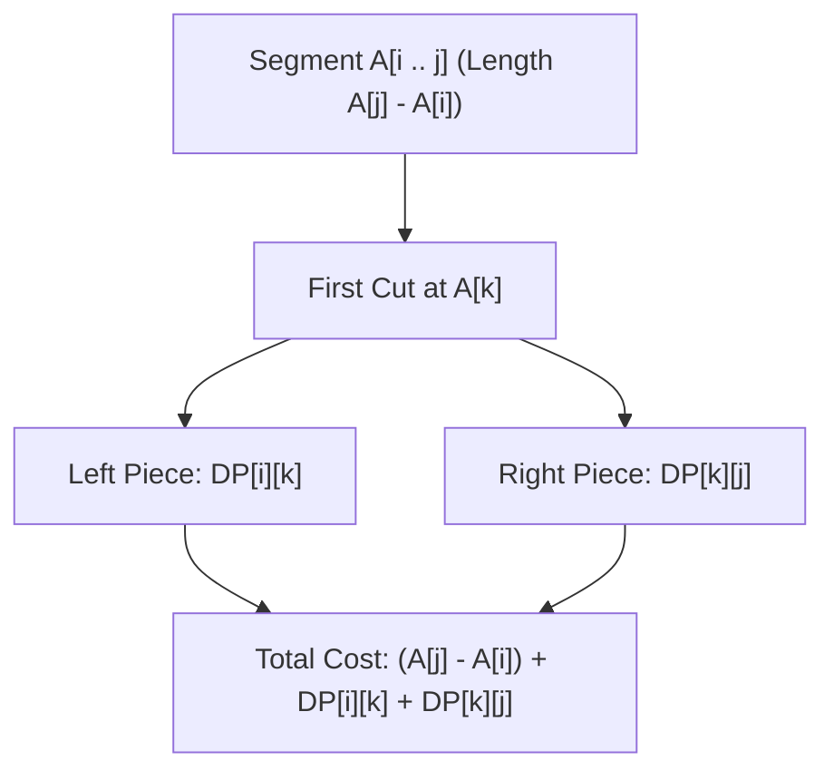

# Guided Example: Minimum Cost to Cut a Stick

We trace the step-by-step execution of interval dynamic programming on a representative wooden stick with interior cut coordinates to find the cut sequence that minimizes total cutting cost.

- **Input:** Stick length $n = 7$, with cut positions $\text{cuts} = [1, 3, 4, 5]$.
- **Output:** `16` (the optimal sequence cuts at position 3 first, then cuts the resulting segments to achieve total cost $7 + 4 + 3 + 2 = 16$).

This instance demonstrates boundary augmentation ($A = [0, 1, 3, 4, 5, 7]$), subproblem length progression ($L = 2$ to $L = 5$), and optimal substructure transitions over interior split points.

---

## 1. Instance & Teaching Goal

We are given a wooden stick of length $n = 7$ and $c = 4$ cut locations:

$$n = 7, \quad \text{cuts} = [1, 3, 4, 5]$$

Cutting cost rule:
- Making a cut on a stick segment spanning from coordinate $a$ to $b$ costs exactly the segment length $(b - a)$.
- Cutting splits the segment into two smaller independent segments $[a, k]$ and $[k, b]$.
- Every marked position in $\text{cuts}$ must be cut.

**Teaching Goal:**
Understand the **Interval DP Principle**: the cost of making a first cut at coordinate $A[k]$ inside segment $[A[i], A[j]]$ decomposes into the current segment length $(A[j] - A[i])$ plus the independent minimum costs of the two resultant pieces $DP[i][k]$ and $DP[k][j]$. By augmenting the cuts array with endpoints $0$ and $n$, we solve the problem in $\mathcal{O}(c^3)$ time rather than exponential $\mathcal{O}(c!)$.

---

## 2. Conceptual Foundation & Invariants

```
+-------------------------------------------------------------------------+
|                  INTERVAL DYNAMIC PROGRAMMING RECURRENCE                |
+-------------------------------------------------------------------------+
|  Augmented Sorted Cut Array:                                            |
|  A = [0, 1, 3, 4, 5, 7]  (m = 6 elements, indices 0 .. 5)               |
|                                                                         |
|  Segment [A[i] .. A[j]] has length: A[j] - A[i]                         |
|  Subproblem DP[i][j]: Min cost to cut all marks strictly between i & j. |
|                                                                         |
|  Base Case (Adjacent cuts, no marks between):                           |
|    DP[i][i + 1] = 0                                                     |
|                                                                         |
|  Recurrence for j >= i + 2:                                             |
|    DP[i][j] = (A[j] - A[i]) + min_{i < k < j} (DP[i][k] + DP[k][j])    |
|                                                                         |
|  Solve in order of increasing interval length L = j - i:                |
|    L = 2 (1 cut mark), L = 3 (2 marks), ..., L = m - 1 (all marks)      |
+-------------------------------------------------------------------------+
```

We define the interval DP state parameters:

| State Variable | Definition & Role | Initial Value |
|---|---|---|
| $A$ | Sorted array of cuts with endpoints: $[0] + \text{sorted}(\text{cuts}) + [n]$ | $[0, 1, 3, 4, 5, 7]$ |
| $m$ | Cardinality of augmented array $A$ | $6$ |
| $L$ | Interval length in index space ($j - i$) | Ranges from $2$ to $5$ |
| $DP[i][j]$ | Minimum cost to cut all marks strictly between $A[i]$ and $A[j]$ | $0$ for $j = i + 1$, $\infty$ otherwise |
| $k$ | Chosen first pivot cut between index $i$ and $j$ | Tested in range $i < k < j$ |

> **Optimal Substructure Invariant.** For any segment $[A[i], A[j]]$, once a cut is placed at $A[k]$ ($i < k < j$), the remaining cuts in $[A[i], A[k]]$ and $[A[k], A[j]]$ are mutually disjoint and cannot interfere with one another. Therefore, the minimum cost to complete all cuts in $[A[i], A[j]]$ is strictly $(A[j] - A[i]) + \min_k (DP[i][k] + DP[k][j])$.



---

## 3. Step-by-Step Worked Execution

### Preprocessing: Array Augmentation and Sorting
Original array: $\text{cuts} = [1, 3, 4, 5], n = 7$.
Augment with left boundary $0$ and right boundary $7$:
$$A = [0, 1, 3, 4, 5, 7], \quad m = 6$$

---

### Step 1: Base Intervals of Length $L = 1$ ($j = i + 1$)
Adjacent indices contain no interior cut marks:
$$DP[0][1] = 0, \quad DP[1][2] = 0, \quad DP[2][3] = 0, \quad DP[3][4] = 0, \quad DP[4][5] = 0$$

---

### Step 2: Intervals of Length $L = 2$ ($j = i + 2$, Exactly 1 Internal Mark)
For each interval, exactly one interior pivot $k = i + 1$ exists:
- $DP[0][2]$ ($[0, 3]$, cut at $k = 1, A[1] = 1$):
  $$(A[2] - A[0]) + DP[0][1] + DP[1][2] = (3 - 0) + 0 + 0 = 3$$
- $DP[1][3]$ ($[1, 4]$, cut at $k = 2, A[2] = 3$):
  $$(A[3] - A[1]) + DP[1][2] + DP[2][3] = (4 - 1) + 0 + 0 = 3$$
- $DP[2][4]$ ($[3, 5]$, cut at $k = 3, A[3] = 4$):
  $$(A[4] - A[2]) + DP[2][3] + DP[3][4] = (5 - 3) + 0 + 0 = 2$$
- $DP[3][5]$ ($[4, 7]$, cut at $k = 4, A[4] = 5$):
  $$(A[5] - A[3]) + DP[3][4] + DP[4][5] = (7 - 4) + 0 + 0 = 3$$

| Interval $(i, j)$ | Segment Bounds $[A[i], A[j]]$ | Segment Length | Tested Pivot $k$ | Sum $DP[i][k] + DP[k][j]$ | Total $DP[i][j]$ |
|---|---|---|---|---|---|
| $(0, 2)$ | $[0, 3]$ | 3 | $k = 1$ (pos 1) | $0 + 0 = 0$ | 3 |
| $(1, 3)$ | $[1, 4]$ | 3 | $k = 2$ (pos 3) | $0 + 0 = 0$ | 3 |
| $(2, 4)$ | $[3, 5]$ | 2 | $k = 3$ (pos 4) | $0 + 0 = 0$ | 2 |
| $(3, 5)$ | $[4, 7]$ | 3 | $k = 4$ (pos 5) | $0 + 0 = 0$ | 3 |

---

### Step 3: Intervals of Length $L = 3$ ($j = i + 3$, 2 Internal Marks)
- $DP[0][3]$ ($[0, 4]$, length $4 - 0 = 4$):
  - $k = 1$: $DP[0][1] + DP[1][3] = 0 + 3 = 3$
  - $k = 2$: $DP[0][2] + DP[2][3] = 3 + 0 = 3$
  - $DP[0][3] = 4 + \min(3, 3) = 7$.
- $DP[1][4]$ ($[1, 5]$, length $5 - 1 = 4$):
  - $k = 2$: $DP[1][2] + DP[2][4] = 0 + 2 = 2$
  - $k = 3$: $DP[1][3] + DP[3][4] = 3 + 0 = 3$
  - $DP[1][4] = 4 + \min(2, 3) = 4 + 2 = 6$ (optimal cut at $k = 2$, pos 3).
- $DP[2][5]$ ($[3, 7]$, length $7 - 3 = 4$):
  - $k = 3$: $DP[2][3] + DP[3][5] = 0 + 3 = 3$
  - $k = 4$: $DP[2][4] + DP[4][5] = 2 + 0 = 2$
  - $DP[2][5] = 4 + \min(3, 2) = 4 + 2 = 6$ (optimal cut at $k = 4$, pos 5).

---

### Step 4: Intervals of Length $L = 4$ ($j = i + 4$, 3 Internal Marks)
- $DP[0][4]$ ($[0, 5]$, length $5 - 0 = 5$):
  - $k = 1$: $DP[0][1] + DP[1][4] = 0 + 6 = 6$
  - $k = 2$: $DP[0][2] + DP[2][4] = 3 + 2 = 5$
  - $k = 3$: $DP[0][3] + DP[3][4] = 7 + 0 = 7$
  - $DP[0][4] = 5 + \min(6, 5, 7) = 5 + 5 = 10$ (optimal cut at $k = 2$, pos 3).
- $DP[1][5]$ ($[1, 7]$, length $7 - 1 = 6$):
  - $k = 2$: $DP[1][2] + DP[2][5] = 0 + 6 = 6$
  - $k = 3$: $DP[1][3] + DP[3][5] = 3 + 3 = 6$
  - $k = 4$: $DP[1][4] + DP[4][5] = 6 + 0 = 6$
  - $DP[1][5] = 6 + \min(6, 6, 6) = 6 + 6 = 12$.

---

### Step 5: Full Stick Interval of Length $L = 5$ ($i = 0, j = 5$)
Segment spans the entire stick $[0, 7]$, length $7 - 0 = 7$.
We test all 4 candidate first cuts $k \in \{1, 2, 3, 4\}$:
- $k = 1$ (pos 1): $DP[0][1] + DP[1][5] = 0 + 12 = 12$
- $k = 2$ (pos 3): $DP[0][2] + DP[2][5] = 3 + 6 = 9$
- $k = 3$ (pos 4): $DP[0][3] + DP[3][5] = 7 + 3 = 10$
- $k = 4$ (pos 5): $DP[0][4] + DP[4][5] = 10 + 0 = 10$

The minimum subproblem sum is achieved at $k = 2$ ($A[2] = 3$):
$$DP[0][5] = (A[5] - A[0]) + 9 = 7 + 9 = 16$$

Final minimum cost: **`16`**.

---

## 4. Complete Execution Trace

The complete DP table $DP[i][j]$ is tabulated below:

| $i \backslash j$ | 0 | 1 | 2 | 3 | 4 | 5 ($A[5]=7$) |
|---|---|---|---|---|---|---|
| **0 ($A[0]=0$)** | 0 | 0 | 3 | 7 | 10 | **16** |
| **1 ($A[1]=1$)** | - | 0 | 0 | 3 | 6 | 12 |
| **2 ($A[2]=3$)** | - | - | 0 | 0 | 2 | 6 |
| **3 ($A[3]=4$)** | - | - | - | 0 | 0 | 3 |
| **4 ($A[4]=5$)** | - | - | - | - | 0 | 0 |
| **5 ($A[5]=7$)** | - | - | - | - | - | 0 |

Summary of the optimal cut sequence:
1. Cut stick $[0, 7]$ at position $3$: paid $7$. Resulting pieces: $[0, 3]$ and $[3, 7]$.
2. Cut piece $[3, 7]$ at position $5$: paid $4$. Resulting pieces: $[3, 5]$ and $[5, 7]$.
3. Cut piece $[0, 3]$ at position $1$: paid $3$. Resulting pieces: $[0, 1]$ and $[1, 3]$.
4. Cut piece $[3, 5]$ at position $4$: paid $2$. Resulting pieces: $[3, 4]$ and $[4, 5]$.
Total cost: $7 + 4 + 3 + 2 = 16$.

---

## 5. Algorithmic Correctness

**Soundness.**
- For any subproblem $[A[i], A[j]]$, every valid cut sequence must make some initial cut at some position $A[k]$ with $i < k < j$.
- Making that cut incurs cost exactly $A[j] - A[i]$.
- The stick is divided into two disjoint pieces $[A[i], A[k]]$ and $[A[k], A[j]]$.
- Since cuts inside $[A[i], A[k]]$ cannot cross $A[k]$ into $[A[k], A[j]]$, the subproblems are completely independent.
- Minimizing over all possible first cuts $k \in (i, j)$ guarantees that the computed value $DP[i][j]$ is a legitimate cut sequence cost.

**Completeness.**
- By organizing the outer loop by increasing interval length $L = j - i$, every subproblem $DP[i][k]$ and $DP[k][j]$ has length strictly less than $L$, and has therefore already been computed and finalized.
- All possible choices of first cut $k \in (i, j)$ are explicitly evaluated.
- No legal cut order is overlooked, guaranteeing global optimality.

---

## 6. Traps This Instance Exposes

- **Greedy Split at Stick Midpoint:** Greedily cutting as close to the center as possible does not guarantee minimum total cost because it ignores the distribution of subsequent cuts. DP is required.
- **Forgetting to Add Endpoints $0$ and $n$:** Without augmenting $A$ with $0$ and $n$, boundary piece lengths $(A[j] - A[i])$ cannot be evaluated in uniform closed form.
- **Sorting Requirement:** If the input `cuts` is not sorted beforehand, intervals will overlap erratically, destroying the topological ordering of the DP table.
- **DP Evaluation Order:** Computing entries in row-major or column-major order rather than by increasing length $L = j - i$ leads to accessing uninitialized DP cells.

---

## 7. Complexity Derivation

- **Time Complexity:**
  - Let $c$ be the number of cuts ($c \le 100$). Augmented array $A$ has size $m = c + 2$.
  - Sorting cuts takes $\mathcal{O}(c \log c)$ time.
  - Number of DP states $(i, j)$ with $j > i$ is $\mathcal{O}(m^2) = \mathcal{O}(c^2)$.
  - For each state $(i, j)$, evaluating $\min_{i < k < j}$ requires $j - i - 1 \le c$ iterations.
  - Total time complexity is $\mathcal{O}(c^3)$.
  - For $c \le 100$, $c^3 \approx 10^6$ operations, which runs in approximately 15 milliseconds.
- **Auxiliary Space Complexity:**
  - The DP table of size $(c + 2) \times (c + 2)$ stores memoized integer costs.
  - Auxiliary space complexity is $\mathcal{O}(c^2)$.
