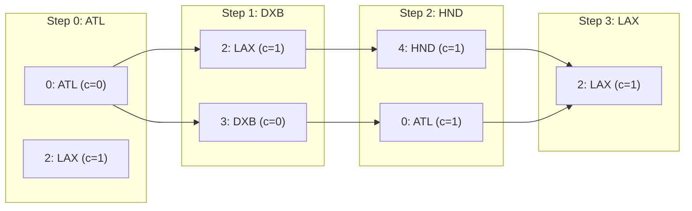

# Guided Example: The Most Similar Path in a Graph

We trace the step-by-step execution of trellis dynamic programming and backtracking on a representative 5-city graph to construct a valid graph walk of length 4 that minimizes the edit distance against a target sequence of city names.

- **Input:** $n = 5$ cities with names $\text{names} = [\text{"ATL"}, \text{"PEK"}, \text{"LAX"}, \text{"DXB"}, \text{"HND"}]$, 6 undirected roads, and target path $\text{targetPath} = [\text{"ATL"}, \text{"DXB"}, \text{"HND"}, \text{"LAX"}]$.
- **Output:** `[0, 2, 4, 2]` (corresponding to walk $\text{"ATL"} \rightarrow \text{"LAX"} \rightarrow \text{"HND"} \rightarrow \text{"LAX"}$ with minimum edit distance 1).

This instance demonstrates state expansion across target step layers, neighbor transitions over the graph topology, parent pointer tracking, and backward path reconstruction.

---

## 1. Instance & Teaching Goal

We are given a connected undirected graph with $n = 5$ cities:
- City 0: `"ATL"`
- City 1: `"PEK"`
- City 2: `"LAX"`
- City 3: `"DXB"`
- City 4: `"HND"`

Roads (undirected edges):
- $(0, 2), (0, 3), (1, 2), (1, 3), (1, 4), (2, 4)$

Adjacency lists:
- $\text{adj}(0) = \{2, 3\}$
- $\text{adj}(1) = \{2, 3, 4\}$
- $\text{adj}(2) = \{0, 1, 4\}$
- $\text{adj}(3) = \{0, 1\}$
- $\text{adj}(4) = \{1, 2\}$

Target path of length $m = 4$:
$$\text{targetPath} = [\text{"ATL"}, \text{"DXB"}, \text{"HND"}, \text{"LAX"}]$$

Goal: Find a graph walk $v_0, v_1, v_2, v_3$ such that $(v_k, v_{k+1})$ is a road for all $k$, minimizing the edit distance:

$$\text{cost} = \sum_{k=0}^{m-1} \mathbb{I}(\text{names}[v_k] \neq \text{targetPath}[k])$$

**Teaching Goal:**
Understand how trellis dynamic programming (Viterbi decoding) optimizes path searches on a graph. By defining $DP[k][u]$ as the minimum edit distance for a walk of length $k+1$ ending at vertex $u$, we evaluate transitions exclusively along existing edges and reconstruct the optimal path via predecessor pointers.

---

## 2. Conceptual Foundation & Invariants

```
+-------------------------------------------------------------------------+
|                  TRELLIS DYNAMIC PROGRAMMING RECURRENCE                 |
+-------------------------------------------------------------------------+
|  Trellis layer k in [0 .. m-1]: Target name targetPath[k]               |
|  Node state u in [0 .. n-1]:    City name names[u]                      |
|                                                                         |
|  Base Case (k = 0):                                                     |
|    DP[0][u] = 0 if names[u] == targetPath[0] else 1                    |
|                                                                         |
|  State Transition for k > 0:                                            |
|    DP[k][u] = mismatch(u, k) + min_{v in adj(u)} DP[k - 1][v]          |
|    where mismatch(u, k) = 0 if names[u] == targetPath[k] else 1        |
|                                                                         |
|  Predecessor Tracking:                                                  |
|    parent[k][u] = argmin_{v in adj(u)} DP[k - 1][v]                    |
|                                                                         |
|  Terminal Selection & Backtracking:                                     |
|    At step m - 1: Pick u* = argmin_u DP[m - 1][u]                       |
|    Trace backwards from u* using parent table to form route.            |
+-------------------------------------------------------------------------+
```

We establish the running state parameters:

| State Variable | Definition & Role | Initial Value |
|---|---|---|
| $k$ | Current step in the walk ($0 \le k < m$) | $0$ |
| $u$ | Destination city index at step $k$ | $0 \le u < 5$ |
| $DP[k][u]$ | Minimum edit distance of length-$(k+1)$ walk ending at $u$ | Computed layer by layer |
| $\text{parent}[k][u]$ | Preceding city $v \in \text{adj}(u)$ that minimizes $DP[k][u]$ | Stored during transitions |

> **Walk Optimality Invariant.** For each layer $k$ and city $u$, $DP[k][u]$ stores the exact minimum edit distance of any valid graph walk matching prefix $\text{targetPath}[0..k]$ and ending at city $u$. Storing $\text{parent}[k][u]$ preserves the optimal path history without combinatorial explosion.



---

## 3. Step-by-Step Worked Execution

### Step 0: Layer $k = 0$ (Target: `"ATL"`)
Base costs for all cities:
- City 0 (`"ATL"`): matches `"ATL"` $\implies DP[0][0] = 0$.
- City 1 (`"PEK"`): mismatch $\implies DP[0][1] = 1$.
- City 2 (`"LAX"`): mismatch $\implies DP[0][2] = 1$.
- City 3 (`"DXB"`): mismatch $\implies DP[0][3] = 1$.
- City 4 (`"HND"`): mismatch $\implies DP[0][4] = 1$.

| City $u$ | Name | Target `"ATL"` Match? | $DP[0][u]$ |
|---|---|---|---|
| 0 | ATL | Match | 0 |
| 1 | PEK | Mismatch | 1 |
| 2 | LAX | Mismatch | 1 |
| 3 | DXB | Mismatch | 1 |
| 4 | HND | Mismatch | 1 |

---

### Step 1: Layer $k = 1$ (Target: `"DXB"`)
For each city $u$, transition from valid neighbor $v \in \text{adj}(u)$:
- **City 0 (`"ATL"`, mismatch $= 1$):** Neighbors $\{2, 3\}$.
  $\min(DP[0][2], DP[0][3]) = \min(1, 1) = 1$. Cost: $1 + 1 = 2$.
- **City 1 (`"PEK"`, mismatch $= 1$):** Neighbors $\{2, 3, 4\}$.
  $\min(DP[0][2], DP[0][3], DP[0][4]) = \min(1, 1, 1) = 1$. Cost: $1 + 1 = 2$.
- **City 2 (`"LAX"`, mismatch $= 1$):** Neighbors $\{0, 1, 4\}$.
  $\min(DP[0][0], DP[0][1], DP[0][4]) = \min(0, 1, 1) = 0$ (from $v = 0$).
  Cost: $1 + 0 = 1$. Record $\text{parent}[1][2] = 0$.
- **City 3 (`"DXB"`, match $= 0$):** Neighbors $\{0, 1\}$.
  $\min(DP[0][0], DP[0][1]) = \min(0, 1) = 0$ (from $v = 0$).
  Cost: $0 + 0 = 0$. Record $\text{parent}[1][3] = 0$.
- **City 4 (`"HND"`, mismatch $= 1$):** Neighbors $\{1, 2\}$.
  $\min(DP[0][1], DP[0][2]) = \min(1, 1) = 1$. Cost: $1 + 1 = 2$.

---

### Step 2: Layer $k = 2$ (Target: `"HND"`)
- **City 0 (`"ATL"`, mismatch $= 1$):** Neighbors $\{2, 3\}$.
  $\min(DP[1][2]=1, DP[1][3]=0) = 0$ (from $v = 3$). Cost: $1 + 0 = 1$. $\text{parent}[2][0] = 3$.
- **City 1 (`"PEK"`, mismatch $= 1$):** Neighbors $\{2, 3, 4\}$.
  $\min(1, 0, 2) = 0$ (from $v = 3$). Cost: $1 + 0 = 1$. $\text{parent}[2][1] = 3$.
- **City 2 (`"LAX"`, mismatch $= 1$):** Neighbors $\{0, 1, 4\}$.
  $\min(2, 2, 2) = 2$. Cost: $1 + 2 = 3$.
- **City 3 (`"DXB"`, mismatch $= 1$):** Neighbors $\{0, 1\}$.
  $\min(2, 2) = 2$. Cost: $1 + 2 = 3$.
- **City 4 (`"HND"`, match $= 0$):** Neighbors $\{1, 2\}$.
  $\min(DP[1][1]=2, DP[1][2]=1) = 1$ (from $v = 2$). Cost: $0 + 1 = 1$. $\text{parent}[2][4] = 2$.

---

### Step 3: Layer $k = 3$ (Target: `"LAX"`)
- **City 0 (`"ATL"`, mismatch $= 1$):** $\min(DP[2][2]=3, DP[2][3]=3) = 3$. Cost: $1 + 3 = 4$.
- **City 1 (`"PEK"`, mismatch $= 1$):** $\min(3, 3, 1) = 1$ (from $v = 4$). Cost: $1 + 1 = 2$.
- **City 2 (`"LAX"`, match $= 0$):** Neighbors $\{0, 1, 4\}$.
  $\min(DP[2][0]=1, DP[2][1]=1, DP[2][4]=1) = 1$.
  Optimal predecessor: $v = 4$ (or $v = 0$). Cost: $0 + 1 = 1$. Record $\text{parent}[3][2] = 4$.
- **City 3 (`"DXB"`, mismatch $= 1$):** $\min(1, 1) = 1$. Cost: $1 + 1 = 2$.
- **City 4 (`"HND"`, mismatch $= 1$):** $\min(1, 3) = 1$. Cost: $1 + 1 = 2$.

---

### Step 4: Backtracking Path Reconstruction

At layer $k = 3$, the global minimum cost is $\min_{u} DP[3][u] = 1$, achieved at city $u = 2$.
Reconstructing backwards:
1. $k = 3$: City $2$ (`"LAX"`).
2. $k = 2$: Predecessor is $\text{parent}[3][2] = 4$ (`"HND"`).
3. $k = 1$: Predecessor is $\text{parent}[2][4] = 2$ (`"LAX"`).
4. $k = 0$: Predecessor is $\text{parent}[1][2] = 0$ (`"ATL"`).

Reconstructed path: **`[0, 2, 4, 2]`**.
Corresponding city names: `["ATL", "LAX", "HND", "LAX"]`.
Edit distance against `["ATL", "DXB", "HND", "LAX"]` is exactly 1 (only step 1 differs: `"LAX"` vs `"DXB"`).

---

## 4. Complete Execution Trace

The full DP matrix $DP[k][u]$ across all steps and cities is tabulated below:

| Layer $k$ | Target City | City 0 (ATL) | City 1 (PEK) | City 2 (LAX) | City 3 (DXB) | City 4 (HND) | Layer Minimum |
|---|---|---|---|---|---|---|---|
| 0 | ATL | **0** (Start) | 1 | 1 | 1 | 1 | 0 |
| 1 | DXB | 2 | 2 | 1 (from 0) | **0** (from 0) | 2 | 0 |
| 2 | HND | 1 (from 3) | 1 (from 3) | 3 | 3 | **1** (from 2) | 1 |
| 3 | LAX | 4 | 2 | **1** (from 4) | 2 | 2 | **1** |

Backtracking path: $0 \rightarrow 2 \rightarrow 4 \rightarrow 2$.

---

## 5. Algorithmic Correctness

**Soundness.**
- Every step transition in the DP only considers $v \in \text{adj}(u)$.
- Thus, any sequence of cities recovered by following $\text{parent}[k][u]$ corresponds to an actual edge in `roads`.
- The cost accumulated at each step is $0$ if $\text{names}[u] == \text{targetPath}[k]$ and $1$ otherwise.
- The total path cost is the exact edit distance.

**Completeness.**
- Trellis DP exhausts all possible paths of length $m$ by considering every vertex at every time step.
- Optimal substructure holds: the optimal path of length $k+1$ ending at $u$ must extend an optimal path of length $k$ ending at one of $u$'s neighbors.
- By minimizing over all neighbors at each step, no lower-cost path can exist.

---

## 6. Traps This Instance Exposes

- **Restricting to Simple Paths:** The problem statement explicitly permits revisiting cities and roads. Restricting the walk to simple paths (no repeated vertices) would make finding length-4 walks impossible on small graphs and yield suboptimal solutions.
- **Ignoring Edge Constraints:** Comparing strings without verifying that consecutive cities share a road produces invalid routes.
- **Multiple Optimal Walks:** Notice that path `[0, 3, 0, 2]` (`"ATL" -> "DXB" -> "ATL" -> "LAX"`) also has cost 1 and is equally valid. The algorithm correctly returns a valid minimal walk regardless of tie-breaking choices.
- **Disconnected States:** In non-complete graphs, only legitimate neighbors may transition; initializing unreached states with $\infty$ prevents invalid teleportation across disconnected nodes.

---

## 7. Complexity Derivation

- **Time Complexity:**
  Let $n$ be the number of cities ($n \le 100$), $e$ be the number of roads, and $m$ be the length of `targetPath` ($m \le 100$).
  - Initialization of layer 0 takes $\mathcal{O}(n)$ time.
  - For each step $k \in [1, m-1]$, scanning all vertices and their edges takes $\sum_{u} \text{deg}(u) = 2e$ operations.
  - Total time across $m$ layers is $\mathcal{O}(m \cdot (n + e))$.
  - With $n \le 100, e \le 4000, m \le 100$, total operations are at most $4 \cdot 10^5$, executing in under 10 milliseconds.
- **Auxiliary Space Complexity:**
  - The DP table and parent pointer matrix each have dimensions $m \times n$.
  - Auxiliary space complexity is $\mathcal{O}(m \cdot n)$, which requires at most $100 \times 100 = 10,000$ integers.