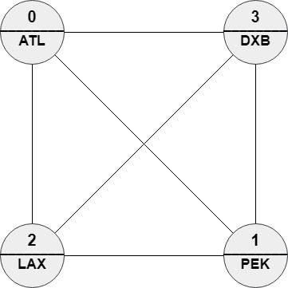

## Solution

---

### A Dynamic Programming Approach

>**Note.** For this approach, we assume that you already know the fundamentals of dynamic programming and are figuring out how to apply it to a wide range of problems, such as this one. If you are not yet at this stage, we recommend checking out our relevant [Explore Card content on dynamic programming](https://leetcode.com/explore/featured/card/dynamic-programming/) before coming back to this approach.

#### Intuition

Let's start by looking at an easier problem. Instead of trying to find the optimal path, let's try to find the minimum edit distance (an integer).

We use dynamic programming. Let `targetPath[0..i]` denote the prefix of `targetPath` ending at the `i`-th element.

Then, we can define $\text{dp}[i][v]$ as the minimum edit distance between `targetPath[0..i]` and a path ending at the vertex `v` (so this path must also have a length of $i + 1$ as well as end at vertex `v`).

While this DP definition might be confusing when you read it for the first time, the following example will help you to get a better understanding.

>
<br/>
Let $targetPath = ["LAX", "ABC", "LAX", "DEF", "HTU", "XYZ"]$ and $v = 1$. Consider the prefix $targetPath[0..3] = ["LAX", "ABC", "LAX", "DEF"]$. We want to find $\text{dp}[3][1]$. Here are some (not all) possible paths of length 4 ending at the vertex `1`.
<br/>
* `[2,0,3,1]` is equivalent to `["LAX", "ATL", "DXB", "PEK"]` which has edit distance = 3 with `targetPath[0..3]`.
* `[3,2,0,1]` is equivalent to `["DXB", "LAX", "ATL", "PEK"]` which has edit distance = 4 with `targetPath[0..3]`.
* `[2,0,2,1]` is equivalent to `["LAX", "ATL", "LAX", "PEK"]` which has edit distance = 2 with `targetPath[0..3]`.
* `[2,1,2,1]` is equivalent to `["LAX", "PEK", "LAX", "PEK"]` which has edit distance = 2 with `targetPath[0..3]`.
<br/>
The minimum edit distance is $2$, thus $\text{dp}[3][1]=2$.

The base case of the DP is when $i = 0$ (path of length `1`), for general `v`. How do we find $\text{dp}[0][v]$? The `[0]` part of the state `[0][v]` corresponds to `targetPath[0..0]`, i.e. the first element of the `targetPath`, and the `[v]` part corresponds to a vertex `v` in the graph. Since our path only has a length of `1`, the path must be `[v]`.

$\text{dp}[0][v]$ is then by definition equal to$editDistance([\text{targetPath}[0]], [v])$. Therefore:

$\text{dp}[0][v] = 0$ if $\text{names}[v] = \text{targetPath}[0]$

$\text{dp}[0][v] = 1$ if $\text{names}[v] \neq \text{targetPath}[0]$

for all `v` in the graph.

For `i > 0`, we want to calculate $\text{dp}[i][v]$ using the calculated values in $dp[i - 1]$. Let us recall the definition of our DP – $\text{dp}[i][v]$ is the minimum `editDistance(targetPath[0..i], path)` over all `path`s ending at the vertex `v`. The last vertex of the `path` is `v`, however we do not know its second last vertex. Fortunately, we know that this vertex must be a neighbor of `v`, since they are adjacent vertices in the `path`.

So we can iterate over all possible candidates `u` for the second last vertex of the `path` and update $\text{dp}[i][v]$ with $dp[i - 1][u]$. If $\text{names}[v] \neq \text{targetPath}[i]$, then the current vertex `v` is a mismatch and we will need to also add `1`.

One can imagine the transition from $dp[i - 1][u]$ to $\text{dp}[i][v]$ as appending an element $\text{targetPath}[i]$ to the target path and appending the vertex `v` to the current path.

This gives us our recurrence relation:

$\text{dp}[i][v] = mismatch + min(dp[i - 1][u])$, where `u` is a neighbor of `v` and $mismatch = 0$ if $\text{names}[v] = \text{targetPath}[i]$, or `1` otherwise.

Now, we have solved the problem of finding the minimum edit distance. However, the problem wants an actual path, not just an integer. To handle this, on top of $\text{dp}[i][v]$, we will also maintain an array $p[i][v]$ which represents the previous vertex before `v` in the optimal path. We can use this array `p` to reconstruct the path at the end.

#### Algorithm

Let `k` be the length of `targetPath`.

1. Declare arrays `dp` and `p` for dynamic programming. The sizes should be $\text{dp}[k][n]$ and $p[k][n]$.
2. For each vertex `v`, initialize $\text{dp}[0][v]$. Set $\text{dp}[0][v] = 0$ if the name of the vertex equals the first element of the target path, and $\text{dp}[0][v] = 1$ otherwise. For `i > 1`, initialize $\text{dp}[i][v]$ with some sufficiently large values (e.g. `k+1`).
3. For each `i` from `1` to `k-1` do the following.
* Iterate over all edges `(u, v)`. We consider the edges in both directions, so we will also consider `(v, u)`. For each edge:
* Calculate $\text{cur} = \text{dp}[i - 1][u] (+1 \quad \text{if names}[v] \ne R_i)$.
* If $cur < \text{dp}[i][v]$, update $\text{dp}[i][v]$ with `cur` and $p[i][v]$ with `u`.
4. Find the vertex `v` that minimizes `dp[k-1][v]`. It is the last vertex of the optimal path. Initialize an answer array with this vertex.
5. For each `i` from `k-1` to `1`, set `v` to $p[i][v]$ (the previous vertex in the path) and append `v` to the answer.
6. Reverse the answer since we appended the vertices in the reversed order. Return the answer.

#### Implementation

```python
class Solution:
    def mostSimilar(self, n: int, roads: List[List[int]], names: List[str],
                    targetPath: List[str]) -> List[int]:
        dp = [[len(targetPath) + 1] * n for i in range(len(targetPath))]
        p = [[None] * n for i in range(len(targetPath))]
        # initialize DP
        dp[0] = [names[i] != targetPath[0] for i in range(n)]
        # calculate DP
        for i in range(1, len(targetPath)):
            for road in roads:
                # consider both edges (u, v) and (v, u)
                for j in range(2):
                    u = road[j]
                    v = road[j ^ 1]
                    cur = dp[i - 1][u] + (names[v] != targetPath[i])
                    if cur < dp[i][v]:
                        dp[i][v] = cur
                        p[i][v] = u
        # the last vertex in the path
        v = dp[-1].index(min(dp[-1]))
        ans = [v]
        for i in range(len(targetPath) - 1, 0, -1):
            # the previous vertex in the path
            v = p[i][v]
            ans.append(v)
        return reversed(ans)
```

#### Complexity Analysis

* Time complexity: $O(m \cdot k)$.

We spend some time initializing the arrays and reconstructing the answer, but this is dominated by calculating the DP inside the nested for loops. The outer loop iterates from `1` to `k-1`, and the inner one iterates over $O(m)$ edges. Inside each iteration, we do $O(1)$ work. This gives us a time complexity of $O(m \cdot k)$.

* Space complexity: $O(n \cdot k)$.

We store arrays `dp` and `p` for dynamic programming. These arrays are both of size `[k][n]`.