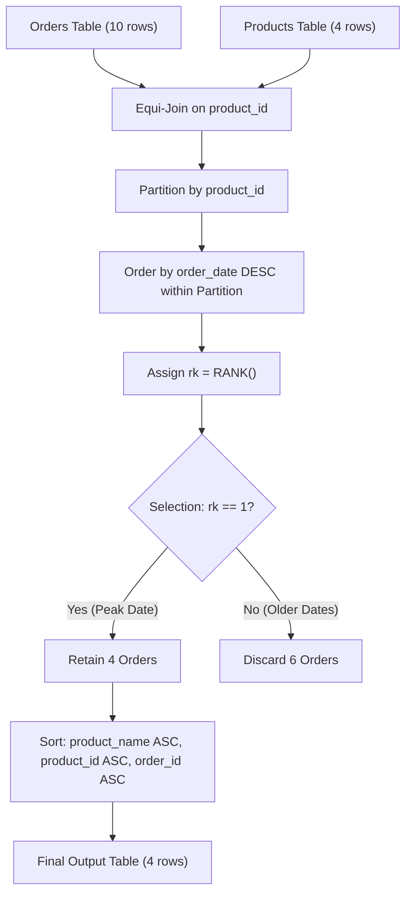

# Guided Example: The Most Recent Orders for Each Product

We trace the step-by-step execution of partitioned rank grouping on a representative database instance to retrieve all orders placed on the most recent order date for each product.

- **Input Tables:** `Orders` (10 records across 3 products), `Products` (4 inventory items), and `Customers` (5 records).
- **Output Table:** 4 qualifying order records corresponding to the peak date for each purchased product, including tied orders placed on the same latest date.

This instance demonstrates grouped maximum-date filtering, tie preservation via `RANK()` or maximum date equi-join, excluding unpurchased products via inner join, and multi-column ordering.

---

## 1. Instance & Teaching Goal

We are given two active tables (`Customers` is unused in the final projection):

**`Products` Table:**

| product_id | product_name | price |
|---|---|---|
| 1 | keyboard | 120 |
| 2 | mouse | 80 |
| 3 | screen | 600 |
| 4 | hard disk | 450 |

**`Orders` Table:**

| order_id | order_date | customer_id | product_id |
|---|---|---|---|
| 1 | 2020-07-31 | 1 | 1 |
| 2 | 2020-07-30 | 2 | 2 |
| 3 | 2020-08-29 | 3 | 3 |
| 4 | 2020-07-29 | 4 | 1 |
| 5 | 2020-06-10 | 1 | 2 |
| 6 | 2020-08-01 | 2 | 1 |
| 7 | 2020-08-01 | 3 | 1 |
| 8 | 2020-08-03 | 1 | 2 |
| 9 | 2020-08-07 | 2 | 3 |
| 10 | 2020-07-15 | 1 | 2 |

**Teaching Goal:**
Understand the crucial distinction between finding a fixed count of rows (which uses `ROW_NUMBER()`) versus finding all records tied at the latest date (which requires `RANK() = 1` or grouping on $\max(\text{order\_date})$). On 2020-08-01, both customer 2 and customer 3 purchased a keyboard (orders 6 and 7); both must be preserved.

---

## 2. Conceptual Foundation & Invariants

```
+-------------------------------------------------------------------------+
|                  PARTITIONED DATE RANKING PIPELINE                      |
+-------------------------------------------------------------------------+
|  [Orders]  |  order_id, order_date, customer_id, product_id             |
|     |                                                                   |
|     v  (Inner Equi-Join on product_id with Products)                    |
|  (Product 4 'hard disk' dropped: never ordered)                         |
|     |                                                                   |
|     v  (Partition by product_id, Order by order_date DESC)              |
|  +-------------------------------------------------------------------+  |
|  | Partition 1 (keyboard):                                           |  |
|  |   2020-08-01 (Order 6) -> rk = 1                                  |  |
|  |   2020-08-01 (Order 7) -> rk = 1  <-- TIE PRESERVED!              |  |
|  |   2020-07-31 (Order 1) -> rk = 3                                  |  |
|  |   2020-07-29 (Order 4) -> rk = 4                                  |  |
|  +-------------------------------------------------------------------+  |
|  | Partition 2 (mouse):                                              |  |
|  |   2020-08-03 (Order 8)  -> rk = 1                                 |  |
|  |   2020-07-30 (Order 2)  -> rk = 2                                 |  |
|  |   2020-07-15 (Order 10) -> rk = 3                                 |  |
|  |   2020-06-10 (Order 5)  -> rk = 4                                 |  |
|  +-------------------------------------------------------------------+  |
|  | Partition 3 (screen):                                             |  |
|  |   2020-08-29 (Order 3)  -> rk = 1                                 |  |
|  |   2020-08-07 (Order 9)  -> rk = 2                                 |  |
|  +-------------------------------------------------------------------+  |
|     |                                                                   |
|     v  (Filter rk == 1)                                                 |
|     v  (Project product_name, product_id, order_id, order_date)         |
|     v  (Sort product_name ASC, product_id ASC, order_id ASC)            |
|  [Final Output]: 4 order records                                        |
+-------------------------------------------------------------------------+
```

We establish the relational state operations:

| Relational State | Operator Definition | Description |
|---|---|---|
| $R_{\text{join}}$ | $\text{Orders} \bowtie_{\text{Orders.product\_id} = \text{Products.product\_id}} \text{Products}$ | Join orders with product descriptions |
| $r_i$ | $\text{RANK}() \text{ OVER (PARTITION BY product\_id ORDER BY order\_date DESC)}$ | Partitioned dense/sparse rank assignment |
| $R_{\text{filtered}}$ | $\sigma_{r_i = 1}(R_{\text{join}})$ | Selection of all orders sharing peak date |
| $R_{\text{out}}$ | $\tau_{\text{product\_name} \uparrow, \text{product\_id} \uparrow, \text{order\_id} \uparrow}(\Pi(R_{\text{filtered}}))$ | Final projected and sorted relation |

> **Peak Date Tie Preservation Invariant.** Within each product partition, $\text{RANK}()$ assigns identical rank $1$ to every order whose $\text{order\_date} = \max_{j \in \text{Partition}}(\text{order\_date}_j)$. Filtering on $r = 1$ ensures that if $k \ge 1$ orders were placed on the latest date, all $k$ orders are returned.



---

## 3. Step-by-Step Worked Execution

### Step 1: Equi-Join Orders with Products

We join $\text{Orders}$ and $\text{Products}$ on $\text{product\_id}$:
- Product 4 (`hard disk`) has zero entries in $\text{Orders}$ and is omitted.
- All 10 order records are enriched with their corresponding `product_name`.

| order_id | order_date | product_id | product_name |
|---|---|---|---|
| 1 | 2020-07-31 | 1 | keyboard |
| 2 | 2020-07-30 | 2 | mouse |
| 3 | 2020-08-29 | 3 | screen |
| 4 | 2020-07-29 | 1 | keyboard |
| 5 | 2020-06-10 | 2 | mouse |
| 6 | 2020-08-01 | 1 | keyboard |
| 7 | 2020-08-01 | 1 | keyboard |
| 8 | 2020-08-03 | 2 | mouse |
| 9 | 2020-08-07 | 3 | screen |
| 10 | 2020-07-15 | 2 | mouse |

---

### Step 2: Partition by Product and Evaluate Date Rank

Within each product partition, dates are ranked in descending order:

1. **Partition $\text{product\_id} = 1$ (`keyboard`):**
   - Dates present: 2020-08-01 (orders 6 and 7), 2020-07-31 (order 1), 2020-07-29 (order 4).
   - Orders 6 and 7 tie on the latest date (2020-08-01). Both receive $\text{RANK} = 1$.
   - Order 1 receives $\text{RANK} = 3$.
   - Order 4 receives $\text{RANK} = 4$.
2. **Partition $\text{product\_id} = 2$ (`mouse`):**
   - Dates present: 2020-08-03 (order 8), 2020-07-30 (order 2), 2020-07-15 (order 10), 2020-06-10 (order 5).
   - Order 8 is the newest date (2020-08-03) $\implies \text{RANK} = 1$.
   - Orders 2, 10, 5 receive ranks 2, 3, 4.
3. **Partition $\text{product\_id} = 3$ (`screen`):**
   - Dates present: 2020-08-29 (order 3), 2020-08-07 (order 9).
   - Order 3 is the newest date (2020-08-29) $\implies \text{RANK} = 1$.
   - Order 9 receives $\text{RANK} = 2$.

| product_name | product_id | order_id | order_date | Assigned $\text{RANK}$ | Status |
|---|---|---|---|---|---|
| keyboard | 1 | 6 | 2020-08-01 | 1 | Preserved |
| keyboard | 1 | 7 | 2020-08-01 | 1 | Preserved (Tie) |
| keyboard | 1 | 1 | 2020-07-31 | 3 | Discarded |
| keyboard | 1 | 4 | 2020-07-29 | 4 | Discarded |
| mouse | 2 | 8 | 2020-08-03 | 1 | Preserved |
| mouse | 2 | 2 | 2020-07-30 | 2 | Discarded |
| mouse | 2 | 10 | 2020-07-15 | 3 | Discarded |
| mouse | 2 | 5 | 2020-06-10 | 4 | Discarded |
| screen | 3 | 3 | 2020-08-29 | 1 | Preserved |
| screen | 3 | 9 | 2020-08-07 | 2 | Discarded |

---

### Step 3: Selection Filtering ($r = 1$) and Multi-Key Sorting

Filtering on $\text{RANK} = 1$ retains exactly 4 tuples:
- Order 6: (keyboard, 1, 6, 2020-08-01)
- Order 7: (keyboard, 1, 7, 2020-08-01)
- Order 8: (mouse, 2, 8, 2020-08-03)
- Order 3: (screen, 3, 3, 2020-08-29)

Sorting order:
1. `product_name` ascending: `keyboard` comes first, then `mouse`, then `screen`.
2. `product_id` ascending: ties broken by identifier.
3. `order_id` ascending: for `keyboard`, order 6 precedes order 7 ($6 < 7$).

---

## 4. Complete Execution Trace

The lifecycle of each order tuple is summarized below:

| order_id | product_id | product_name | order_date | Date Rank within Product | Qualification ($r = 1$) | Final Output Row |
|---|---|---|---|---|---|---|
| 1 | 1 | keyboard | 2020-07-31 | 3 | No | - |
| 2 | 2 | mouse | 2020-07-30 | 2 | No | - |
| 3 | 3 | screen | 2020-08-29 | 1 | **Yes** | Row 4 |
| 4 | 1 | keyboard | 2020-07-29 | 4 | No | - |
| 5 | 2 | mouse | 2020-06-10 | 4 | No | - |
| 6 | 1 | keyboard | 2020-08-01 | 1 | **Yes** | Row 1 |
| 7 | 1 | keyboard | 2020-08-01 | 1 | **Yes** | Row 2 |
| 8 | 2 | mouse | 2020-08-03 | 1 | **Yes** | Row 3 |
| 9 | 3 | screen | 2020-08-07 | 2 | No | - |
| 10 | 2 | mouse | 2020-07-15 | 3 | No | - |

Result cardinality: 4 rows across 3 ordered products.

---

## 5. Algorithmic Correctness

**Soundness.**
- An order appears in the output if and only if its date is equal to the maximum order date recorded for that product:
  $$\text{order\_date} = \max_{o \in \text{Orders}, o.\text{product\_id} = p} o.\text{order\_date}$$
- By definition of $\text{RANK}()$ with descending date ordering, a row receives rank 1 if and only if no other row in the partition has a strictly later date.
- Thus, every returned row is an authentic most recent order for that product.

**Completeness.**
- Every product that has at least one order produces at least one order row with rank 1.
- If multiple distinct orders were placed on the same peak date, all of them receive rank 1 and are included in the result.
- Products with zero orders produce zero joined rows and are correctly omitted.
- The sort specification provides a total ordering, ensuring complete and deterministic output.

---

## 6. Traps This Instance Exposes

- **Using `ROW_NUMBER()` Instead of `RANK()`:** `ROW_NUMBER()` arbitrarily breaks ties between orders placed on the same latest date, returning only one of orders 6 and 7. The prompt specifies finding "the most recent order(s)" in plural, making tie preservation mandatory.
- **Unpurchased Products Trap:** Using a `RIGHT JOIN` with `Products` would yield a `NULL` order row for product 4 (`hard disk`). Unordered products must be completely excluded, which an `INNER JOIN` ensures.
- **Unnecessary Join with `Customers`:** The output table does not contain customer details. Joining with `Customers` adds redundant join overhead without affecting the output.
- **Sorting on Order ID Before Date:** Sorting by `order_id` in the window clause rather than `order_date` ranks by insertion sequence rather than actual chronological order dates.

---

## 7. Complexity Derivation

- **Time Complexity:**
  Let $R$ be the number of rows in `Orders` ($R = 10$) and $P$ be the number of rows in `Products` ($P = 4$).
  - Joining `Orders` with `Products` via hash lookup takes $\mathcal{O}(R)$ time.
  - Sorting and ranking orders within product partitions takes $\sum_p \mathcal{O}(R_p \log R_p) \le \mathcal{O}(R \log R)$.
  - Filtering $r = 1$ takes a linear scan of $\mathcal{O}(R)$ time.
  - Sorting the $Q \le R$ qualifying rows takes $\mathcal{O}(Q \log Q)$ time.
  - Total time complexity is $\mathcal{O}(R \log R + P)$, which is optimal for database engines.
- **Auxiliary Space Complexity:**
  - The intermediate window state holds $R$ joined records.
  - Auxiliary space complexity is $\mathcal{O}(R)$.
