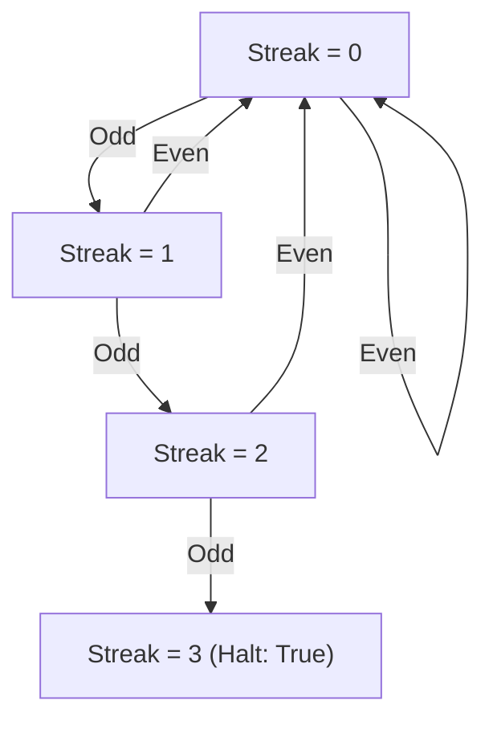

# Guided Example: Three Consecutive Odds

We trace the step-by-step execution of linear parity streak tracking on a representative integer array to detect whether three consecutive elements are all odd integers.

- **Input:** Array $\text{arr} = [1, 2, 34, 3, 4, 5, 7, 23, 12]$ of length $N = 9$.
- **Output:** `true` (elements at indices 5, 6, and 7 are $[5, 7, 23]$, forming three consecutive odd numbers).

This instance demonstrates bitwise parity extraction ($x \ \& \ 1$), streak accumulation, streak resets upon encountering even elements, and early exit upon reaching the target streak threshold of 3.

---

## 1. Instance & Teaching Goal

We are given an integer array of length $N = 9$:

$$\text{arr} = [1, 2, 34, 3, 4, 5, 7, 23, 12]$$

Goal: Determine if there exist three consecutive indices $(i, i+1, i+2)$ such that $\text{arr}[i], \text{arr}[i+1], \text{arr}[i+2]$ are all odd.

Parities along the array:
- Index 0: 1 (odd)
- Index 1: 2 (even)
- Index 2: 34 (even)
- Index 3: 3 (odd)
- Index 4: 4 (even)
- Index 5: 5 (odd)
- Index 6: 7 (odd)
- Index 7: 23 (odd) $\rightarrow$ Three consecutive odds!
- Index 8: 12 (even)

**Teaching Goal:**
Understand how a single integer counter tracking the current run of consecutive odd numbers eliminates redundant window comparisons and avoids allocations. If an even number is encountered, the run resets immediately to 0; if the run reaches 3, the algorithm halts early and returns `true`.

---

## 2. Conceptual Foundation & Invariants

```
+-------------------------------------------------------------------------+
|                  PARITY STREAK ACCUMULATOR MODEL                        |
+-------------------------------------------------------------------------+
|  Initialize: streak = 0                                                 |
|                                                                         |
|  Stream elements x from arr[0 .. N-1]:                                  |
|                                                                         |
|  +--------------------+                                                 |
|  | Element x          |                                                 |
|  +--------------------+                                                 |
|            |                                                            |
|     (Check x & 1)                                                       |
|            |                                                            |
|     +------+------+                                                     |
|     |             |                                                     |
|  [x & 1 == 1]  [x & 1 == 0]                                             |
|  (Odd Number)  (Even Number)                                            |
|     |             |                                                     |
|     v             v                                                     |
|  streak += 1   streak = 0  (Reset, even separates runs)                 |
|     |                                                                   |
|     +------+                                                            |
|            |                                                            |
|     (Check streak == 3?)                                                |
|            |                                                            |
|     +------+------+                                                     |
|     |             |                                                     |
|   [YES]          [NO]                                                   |
|  Return true   Continue to next element                                 |
|                                                                         |
|  If loop finishes without streak == 3: Return false                     |
+-------------------------------------------------------------------------+
```

We establish the running state parameters:

| State Variable | Definition & Role | Initial Value |
|---|---|---|
| $i$ | Current array scan index | $0$ |
| $x$ | Current array value: $\text{arr}[i]$ | $1$ |
| $\text{streak}$ | Count of consecutive odd numbers ending at index $i$ | $0$ |
| $\text{parity}$ | Parity bit: $x \ \& \ 1$ ($1$ for odd, $0$ for even) | Evaluated per element |

> **Contiguous Parity Invariant.** At any index $i$, $\text{streak}$ equals the length of the maximal suffix of odd numbers in $\text{arr}[0..i]$. If $\text{arr}[i]$ is even, the suffix of odd numbers has length 0. If $\text{streak} = 3$, three consecutive odd numbers have been confirmed.



---

## 3. Step-by-Step Worked Execution

### Steps 0–2: Prefix Elements
- **$i = 0, x = 1$:** $1 \ \& \ 1 = 1$ (odd). $\text{streak} \leftarrow 0 + 1 = 1$. $\text{streak} < 3$.
- **$i = 1, x = 2$:** $2 \ \& \ 1 = 0$ (even). An even number breaks the run. $\text{streak} \leftarrow 0$.
- **$i = 2, x = 34$:** $34 \ \& \ 1 = 0$ (even). $\text{streak} \leftarrow 0$.

| Step | Index $i$ | Value $\text{arr}[i]$ | Parity ($x \ \& \ 1$) | State Transition | New $\text{streak}$ | Goal Reached ($\text{streak} == 3$)? |
|---|---|---|---|---|---|---|
| 1 | 0 | 1 | 1 (Odd) | $\text{streak} \leftarrow \text{streak} + 1$ | 1 | No |
| 2 | 1 | 2 | 0 (Even) | $\text{streak} \leftarrow 0$ (Reset) | 0 | No |
| 3 | 2 | 34 | 0 (Even) | $\text{streak} \leftarrow 0$ (Reset) | 0 | No |

---

### Steps 3–4: Isolated Odd and Intervening Even
- **$i = 3, x = 3$:** $3 \ \& \ 1 = 1$ (odd). $\text{streak} \leftarrow 0 + 1 = 1$.
- **$i = 4, x = 4$:** $4 \ \& \ 1 = 0$ (even). Run broken again! $\text{streak} \leftarrow 0$.

| Step | Index $i$ | Value $\text{arr}[i]$ | Parity ($x \ \& \ 1$) | State Transition | New $\text{streak}$ | Goal Reached ($\text{streak} == 3$)? |
|---|---|---|---|---|---|---|
| 4 | 3 | 3 | 1 (Odd) | $\text{streak} \leftarrow \text{streak} + 1$ | 1 | No |
| 5 | 4 | 4 | 0 (Even) | $\text{streak} \leftarrow 0$ (Reset) | 0 | No |

---

### Steps 5–7: Consecutive Odd Triplet Discovery
- **$i = 5, x = 5$:** $5 \ \& \ 1 = 1$ (odd). $\text{streak} \leftarrow 0 + 1 = 1$.
- **$i = 6, x = 7$:** $7 \ \& \ 1 = 1$ (odd). $\text{streak} \leftarrow 1 + 1 = 2$.
- **$i = 7, x = 23$:** $23 \ \& \ 1 = 1$ (odd). $\text{streak} \leftarrow 2 + 1 = 3$.
  - Target condition met: $\text{streak} == 3$!
  - Early exit triggered: return **`true`** immediately.

| Step | Index $i$ | Value $\text{arr}[i]$ | Parity ($x \ \& \ 1$) | State Transition | New $\text{streak}$ | Goal Reached ($\text{streak} == 3$)? |
|---|---|---|---|---|---|---|
| 6 | 5 | 5 | 1 (Odd) | $\text{streak} \leftarrow 0 + 1 = 1$ | 1 | No |
| 7 | 6 | 7 | 1 (Odd) | $\text{streak} \leftarrow 1 + 1 = 2$ | 2 | No |
| 8 | 7 | 23 | 1 (Odd) | $\text{streak} \leftarrow 2 + 1 = 3$ | 3 | **Yes (Return true)** |

Note that element $\text{arr}[8] = 12$ is never examined because the algorithm terminated as soon as three consecutive odds were confirmed.

---

## 4. Complete Execution Trace

The full state transition sequence across all evaluated indices is summarized below:

| Index $i$ | Value $\text{arr}[i]$ | Binary Representation | Low Bit ($x \ \& \ 1$) | Classification | Action Taken | Streak Output | Status |
|---|---|---|---|---|---|---|---|
| 0 | 1 | `...0001` | 1 | Odd | Increment streak | 1 | Active Run |
| 1 | 2 | `...0010` | 0 | Even | Reset streak to 0 | 0 | Run Broken |
| 2 | 34 | `...0010` | 0 | Even | Retain streak 0 | 0 | Inactive |
| 3 | 3 | `...0011` | 1 | Odd | Increment streak | 1 | Active Run |
| 4 | 4 | `...0100` | 0 | Even | Reset streak to 0 | 0 | Run Broken |
| 5 | 5 | `...0101` | 1 | Odd | Increment streak | 1 | 1st of Triplet |
| 6 | 7 | `...0111` | 1 | Odd | Increment streak | 2 | 2nd of Triplet |
| 7 | 23 | `...0111` | 1 | Odd | Increment streak | **3** | **Triplet Complete!** |
| 8 | 12 | - | - | - | Unreached (Early Exit) | - | - |

---

## 5. Algorithmic Correctness

**Soundness.**
- Whenever $\text{streak} == 3$ is reached, the current element $\text{arr}[i]$ and its two immediate predecessors $\text{arr}[i-1]$ and $\text{arr}[i-2]$ were each tested and confirmed odd ($x \ \& \ 1 = 1$) without any intervening reset.
- Thus, the block $[\text{arr}[i-2], \text{arr}[i-1], \text{arr}[i]]$ consists of three strictly adjacent odd integers.
- Returning `true` is mathematically sound.

**Completeness.**
- Suppose there exists some triplet of consecutive odd numbers $[\text{arr}[j], \text{arr}[j+1], \text{arr}[j+2]]$.
- During the scan, at index $j$, $\text{streak} \ge 1$.
- At index $j+1$, $\text{streak} \ge 2$.
- At index $j+2$, $\text{streak} \ge 3$.
- The condition $\text{streak} == 3$ will be triggered at or before index $j+2$.
- If no three consecutive odd numbers exist, $\text{streak}$ never reaches 3, and the loop exhausts all elements, returning `false`.

---

## 6. Traps This Instance Exposes

- **Numerical Order Confusion:** The problem requires three *consecutive positions* in the array that are odd, not numbers that are consecutive integers (like $1, 3, 5$). Values $[5, 7, 23]$ are consecutive in the array and all odd, which satisfies the condition.
- **Neglecting the Even Reset:** Failing to reset $\text{streak} = 0$ upon encountering an even element would count total odd numbers across the entire array, erroneously returning `true` for arrays where odds are separated by evens (such as $[1, 2, 3, 4, 5]$).
- **Arrays with Fewer Than Three Elements:** When $N < 3$, the loop finishes with $\text{streak} \le N < 3$, naturally returning `false` without out-of-bounds errors.
- **Triple Window Redundant Parity Checks:** Checking every 3-element window separately ($(\text{arr}[i] \ \& \ 1) \ \land \ (\text{arr}[i+1] \ \& \ 1) \ \land \ (\text{arr}[i+2] \ \& \ 1)$) tests each element up to 3 times. The running streak counter checks each element exactly once.

---

## 7. Complexity Derivation

- **Time Complexity:**
  The algorithm inspects each element at most once.
  Each iteration performs one bitwise AND operation, one counter increment or assignment, and one equality comparison, all taking $\mathcal{O}(1)$ time.
  With early termination, it inspects at most $N$ elements.
  Total time complexity is $\mathcal{O}(N)$. For $N \le 1000$, execution takes under 5 microseconds.
- **Auxiliary Space Complexity:**
  Only a single integer accumulator $\text{streak}$ is maintained.
  Auxiliary space complexity is strictly $\mathcal{O}(1)$.
