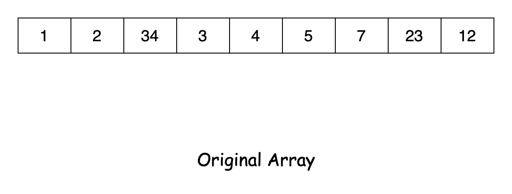
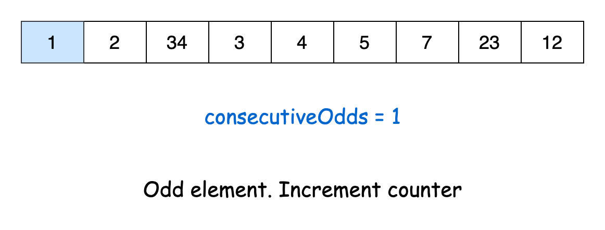
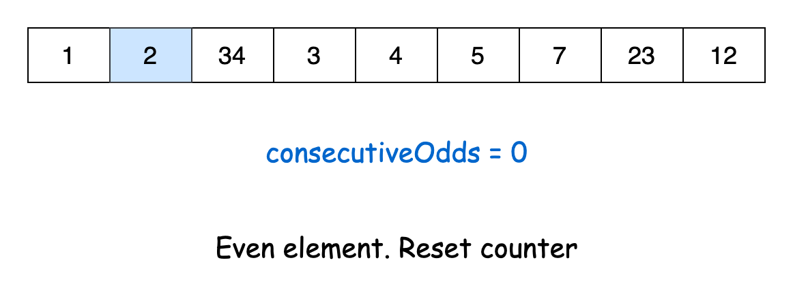
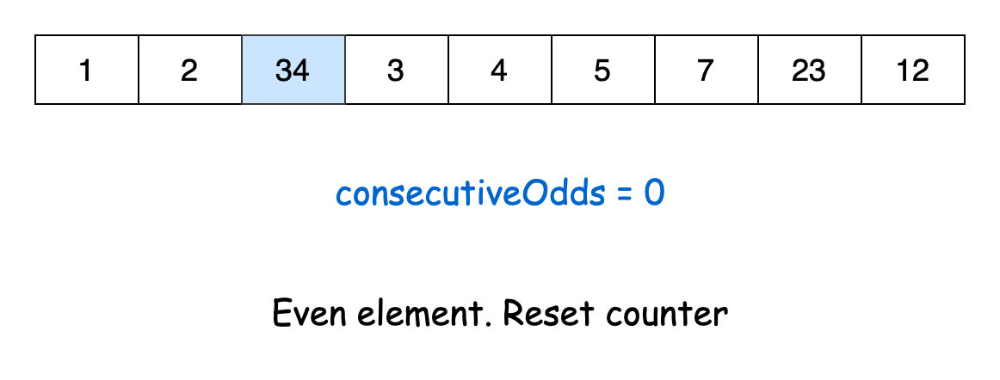
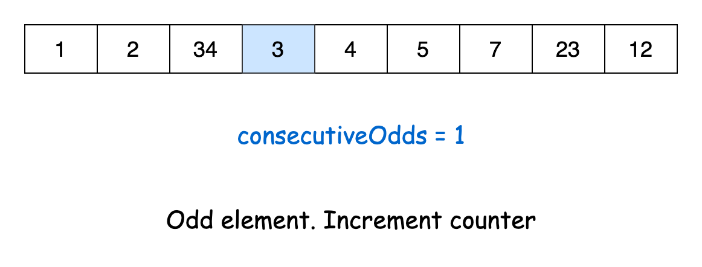
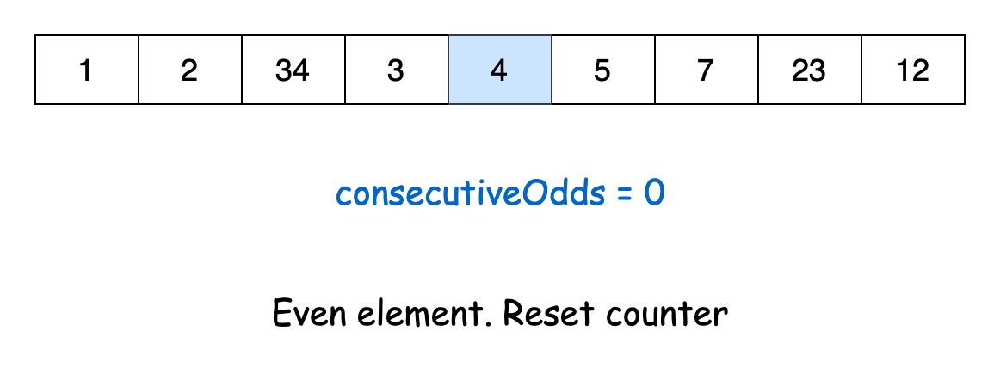
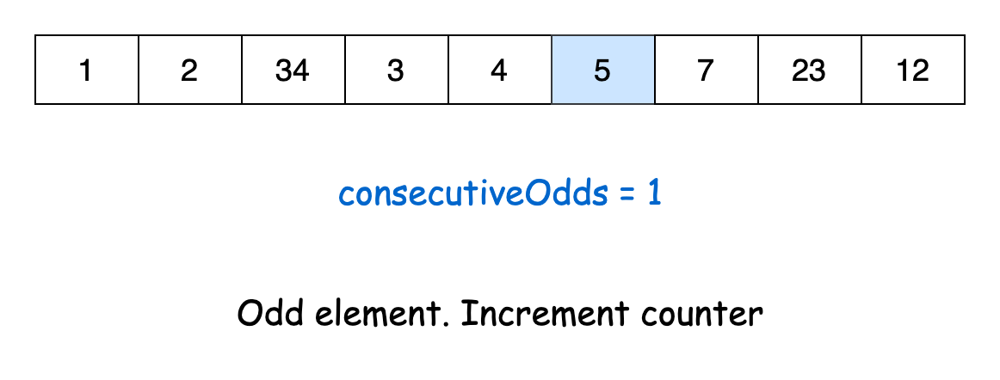
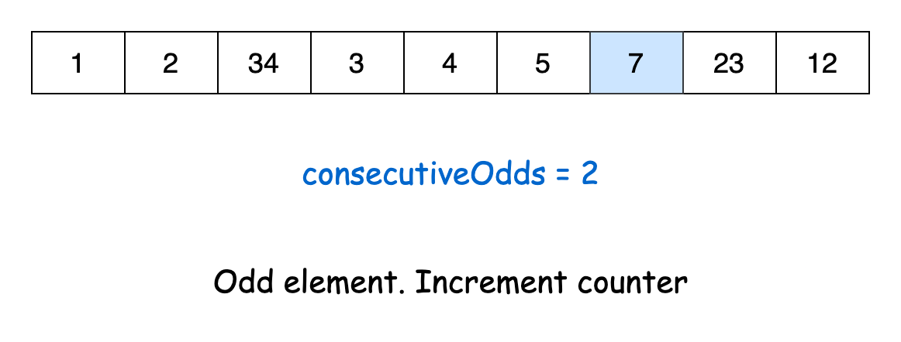
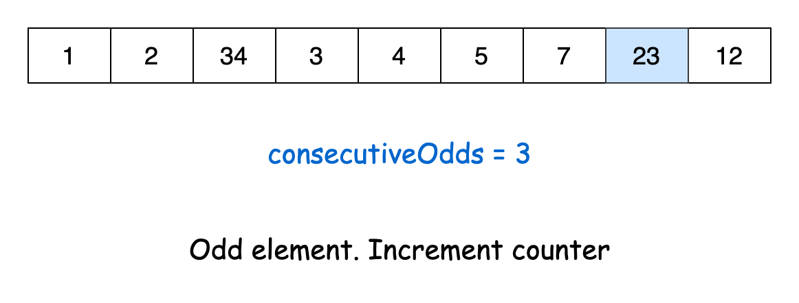
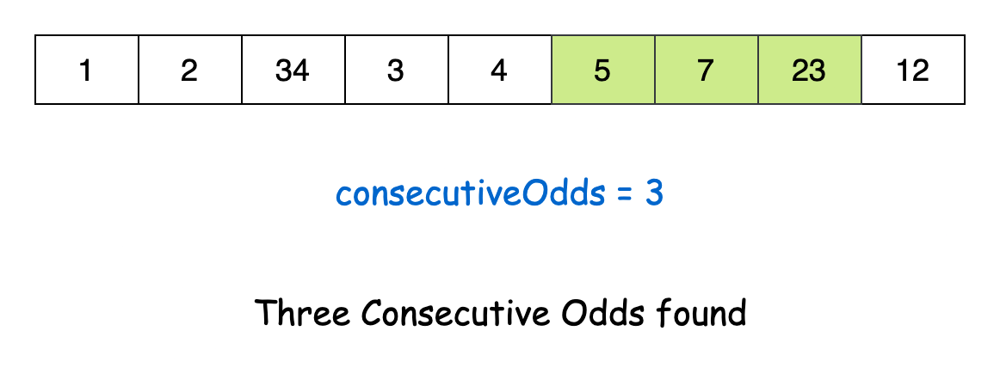

[TOC]

## Solution

---

### Approach 1: Brute Force

#### Intuition

Let's examine the brute force approach, which essentially replicates what the problem asks us to do.

We iterate through the array, examining each group of three consecutive elements. If all three numbers in a group are odd, we return true. If no such group is found, we return false.

> Note: We don't need to traverse the entire array. We stop two elements before the end. Why? Because each group we're checking consists of the current element plus the next two. Therefore, we must ensure those next two elements are within the array's bounds.

#### Algorithm

- Iterate over the array till the third last element. For each element:
  - Check if the current and next two elements are all odd
- If all three elements are odd, return `true`.
- Return `false` otherwise.

#### Implementation

```python
class Solution:
    def threeConsecutiveOdds(self, arr: List[int]) -> bool:
        # Loop through the array up to the third-to-last element
        for i in range(len(arr) - 2):
            # Check if the current element and the next two elements are all odd
            if arr[i] % 2 == 1 and arr[i + 1] % 2 == 1 and arr[i + 2] % 2 == 1:
                return True
        return False
```

#### Complexity Analysis

Let $n$ be the the length of the given array `arr`.

- Time complexity: $O(n)$

    The algorithm loops from $0$ to $n-2$, which has a time complexity of $O(n-2)$. This can be simplified to a time complexity of $O(n)$.

- Space complexity: $O(1)$

    The algorithm has a constant space complexity, as it does not use any additional space.

---

### Approach 2: Counting

#### Intuition

Essentially, we need to examine elements sequentially while using a counter to track the number of consecutive odd numbers. When we find an odd number, we increment our counter; otherwise, we reset it to zero. If the counter hits 3 at any point, it indicates we've found three consecutive odd numbers, allowing us to return `true`. However, if we traverse the entire array without the counter reaching 3, we return `false`.

Check out this slideshow to better understand this process:





















#### Algorithm

- Initialize a variable `consecutiveOdds` to store the number of consecutive odd numbers during the loop.
- Loop through the given array:
  - If the current element is odd, increment `consecutiveOdds`.
  - Otherwise, reset `consecutiveOdds` to 0.
  - If `consecutiveOdds` is equal to 3, return `true`.
- Return `false`, indicating no three consecutive odds were found.

#### Implementation

```python
class Solution:
    def threeConsecutiveOdds(self, arr: List[int]) -> bool:
        consecutive_odds = 0

        # Loop through each element in the array
        for num in arr:
            # Increment the counter if the number is odd,
            # else reset the counter
            if num % 2 == 1:
                consecutive_odds += 1
            else:
                consecutive_odds = 0

            # Check if there are three consecutive odd numbers
            if consecutive_odds == 3:
                return True

        return False
```

#### Complexity Analysis

Let $n$ be the length of the given array `arr`.

* Time complexity: $O(n)$

    The algorithm loops over `arr` only once. Thus, the time complexity remains $O(n)$.

* Space complexity: $O(1)$

    The space complexity remains constant since the algorithm does not use any additional space.

---

### Approach 3: Product of Three Numbers

#### Intuition

The solution can be simplified even further if we recognize a property of products: a product is only odd if all the numbers being multiplied are odd. So, if the product of three consecutive numbers is odd, then all three numbers are odd.

Similar to Approach 1, we'll go through the list and examine groups of three elements. If the product is odd, we have found three consecutive odd elements and can return `true`. If we complete the iteration without finding any odd products, we can return `false`.

> Note: Be cautious of overflow when you are taking the product of two or more elements. In our problem, the numbers are constrained to $10^3$, so the maximum product is $10^9$, which can fit in a 32-bit integer. However, if the constraints were larger, we would need to consider using a larger data type.

#### Algorithm

- Loop over the array `arr` till the third last element:
  - Calculate `product` as the product of the current and the next two elements.
  - If `product` is odd, return `true`.
- Return `false`.

#### Implementation

```python
class Solution:
    def threeConsecutiveOdds(self, arr: list[int]) -> bool:
        # Loop through the array up to the third-to-last element
        for i in range(len(arr) - 2):
            product = arr[i] * arr[i + 1] * arr[i + 2]
            # Check if the product is odd
            if product % 2 == 1:
                return True
        return False
```

#### Complexity Analysis

Let $n$ be the length of the array `arr`.

* Time complexity: $O(n)$

    The time complexity remains linear, as the loop traverses the array only once.

* Space complexity: $O(1)$

    We do not use any additional space, so the space complexity is constant.

---