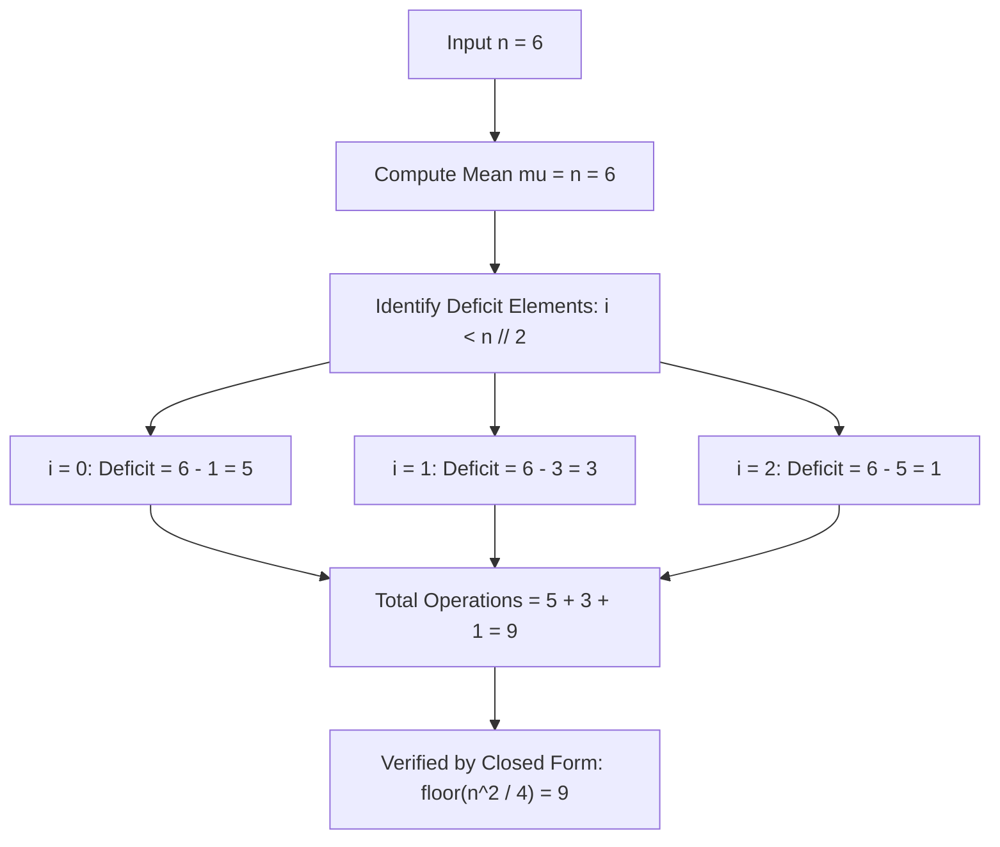

# Guided Example: Minimum Operations to Make Array Equal

We trace the step-by-step execution of symmetric deficit aggregation and arithmetic reduction on a representative array instance to determine the minimum number of operations required to equalize all elements.

- **Input:** Array size $n = 6$.
- **Output:** `9` (the array $\text{arr} = [1, 3, 5, 7, 9, 11]$ has mean $6$; transferring units between symmetric pairs requires $5 + 3 + 1 = 9$ paired decrement/increment operations).

This instance demonstrates arithmetic progression sum invariance ($\sum \text{arr}[i] = n^2$), mean convergence ($\mu = n$), deficit-surplus symmetry, and the closed-form identity $\lfloor n^2 / 4 \rfloor$.

---

## 1. Instance & Teaching Goal

We are given an array of length $n = 6$ defined by $\text{arr}[i] = 2i + 1$ for $i \in [0, 5]$:

$$\text{arr} = [1, 3, 5, 7, 9, 11]$$

Rules:
1. In one operation, choose two distinct indices $x$ and $y$, decrement $\text{arr}[x]$ by 1, and increment $\text{arr}[y]$ by 1.
2. The total sum of the array is conserved across every operation.
3. The goal is to make all array values equal using the minimum number of operations.

**Teaching Goal:**
Understand the **Conservation of Invariant Sum**: because each operation preserves the total sum $\sum \text{arr}[i] = n^2$, the only reachable equal value is the arithmetic mean $\mu = n^2 / n = n$. The minimum operations required equals the total deficit of all elements below $n$, derivable in $\mathcal{O}(1)$ closed form as $\lfloor n^2 / 4 \rfloor$.

---

## 2. Conceptual Foundation & Invariants

```
+-------------------------------------------------------------------------+
|                  CONSERVATION & SYMMETRIC TRANSFER MODEL                |
+-------------------------------------------------------------------------+
|  Array Elements:    1       3       5   |   7       9       11          |
|  Target Mean:       6       6       6   |   6       6       6           |
|                                         |                               |
|  Deficit / Surplus: -5     -3      -1   |  +1      +3      +5           |
|                     <-- Deficit Region -->  <-- Surplus Region -->      |
|                                                                         |
|  Symmetric Pairing Transfers:                                           |
|    Pair (0, 5): Transfer 5 units from 11 to 1  --> Cost = 5 operations  |
|    Pair (1, 4): Transfer 3 units from 9 to 3   --> Cost = 3 operations  |
|    Pair (2, 3): Transfer 1 unit  from 7 to 5   --> Cost = 1 operation   |
|                                                                         |
|  Total Minimum Operations = 5 + 3 + 1 = 9                               |
|  Closed Form Formula: floor(n^2 / 4) = floor(36 / 4) = 9                |
+-------------------------------------------------------------------------+
```

We establish the structural parameters:

| State Variable | Definition & Role | Value for $n = 6$ |
|---|---|---|
| $n$ | Array length | $6$ |
| $\text{arr}[i]$ | $i$-th odd integer: $2i + 1$ | $[1, 3, 5, 7, 9, 11]$ |
| $\text{Total Sum}$ | $\sum_{i=0}^{n-1} (2i + 1) = n^2$ | $36$ |
| $\mu$ | Required equal target value: $\text{Total Sum} / n = n$ | $6$ |
| $\text{Deficit}(i)$ | Distance to mean for elements below $n$: $n - (2i + 1)$ | Evaluated for $i < n/2$ |

> **Sum Invariance Invariant.** Because every operation simultaneously adds 1 to one element and subtracts 1 from another, $\sum_{i=0}^{n-1} \text{arr}[i]$ remains constant at $n^2$. For all $n$ elements to equal value $v$, $n \cdot v = n^2 \implies v = n$. Thus, every operation can reduce the total deviation $\sum |\text{arr}[i] - n|$ by at most 2, proving that $\sum_{i < n/2} (n - \text{arr}[i])$ is a strict mathematical lower bound.



---

## 3. Step-by-Step Worked Execution

### Step 1: Target Mean Derivation
The array contains the first $n = 6$ positive odd numbers:
$$\text{arr} = [1, 3, 5, 7, 9, 11]$$
Sum of the first $n$ odd numbers:
$$\sum_{i=0}^{5} (2i + 1) = 1 + 3 + 5 + 7 + 9 + 11 = 36 = 6^2$$
To equalize all 6 elements while preserving the total sum of 36, each element must end at:
$$\mu = \frac{36}{6} = 6$$

---

### Step 2: Evaluation of Deficits Below the Mean ($i < \lfloor n/2 \rfloor$)
Since $n = 6$, there are $\lfloor 6 / 2 \rfloor = 3$ elements below the mean (indices $0, 1, 2$):

- **Index $i = 0$ ($\text{arr}[0] = 1$):**
  $$\text{Deficit}(0) = \mu - \text{arr}[0] = 6 - 1 = 5$$
  Requires 5 increments.
- **Index $i = 1$ ($\text{arr}[1] = 3$):**
  $$\text{Deficit}(1) = \mu - \text{arr}[1] = 6 - 3 = 3$$
  Requires 3 increments.
- **Index $i = 2$ ($\text{arr}[2] = 5$):**
  $$\text{Deficit}(2) = \mu - \text{arr}[2] = 6 - 5 = 1$$
  Requires 1 increment.

| Index $i$ | Original $\text{arr}[i]$ | Target Mean $\mu$ | Individual Deficit $\mu - \text{arr}[i]$ | Symmetrically Paired Index $n - 1 - i$ | Available Surplus $\text{arr}[n-1-i] - \mu$ | Operations Needed |
|---|---|---|---|---|---|---|
| 0 | 1 | 6 | 5 | 5 ($\text{arr}[5] = 11$) | $11 - 6 = 5$ | 5 |
| 1 | 3 | 6 | 3 | 4 ($\text{arr}[4] = 9$) | $9 - 6 = 3$ | 3 |
| 2 | 5 | 6 | 1 | 3 ($\text{arr}[3] = 7$) | $7 - 6 = 1$ | 1 |

---

### Step 3: Total Operations Accumulation
Summing the required unit transfers across all deficient elements:
$$\text{Total Operations} = 5 + 3 + 1 = 9$$

Symmetric transfer execution:
1. Transfer 5 units from $\text{arr}[5]$ to $\text{arr}[0]$ in 5 operations: $\text{arr}[0] \rightarrow 6, \text{arr}[5] \rightarrow 6$.
2. Transfer 3 units from $\text{arr}[4]$ to $\text{arr}[1]$ in 3 operations: $\text{arr}[1] \rightarrow 6, \text{arr}[4] \rightarrow 6$.
3. Transfer 1 unit from $\text{arr}[3]$ to $\text{arr}[2]$ in 1 operation: $\text{arr}[2] \rightarrow 6, \text{arr}[3] \rightarrow 6$.

All elements are now equal to 6.
Total operations executed: **`9`**.

---

## 4. Complete Execution Trace

The full state transition table across all symmetric pairs is summarized below:

| Operation Phase | Target Pair $(i, n-1-i)$ | Initial Values | Deficit / Surplus | Operations Performed | Transformed Pair Values | Cumulative Operations |
|---|---|---|---|---|---|---|
| Phase 1 | $(0, 5)$ | $(1, 11)$ | $\pm 5$ | 5 | $(6, 6)$ | 5 |
| Phase 2 | $(1, 4)$ | $(3, 9)$ | $\pm 3$ | 3 | $(6, 6)$ | 8 |
| Phase 3 | $(2, 3)$ | $(5, 7)$ | $\pm 1$ | 1 | $(6, 6)$ | **9** |
| Complete | All 6 indices | - | $0$ | 0 | $[6, 6, 6, 6, 6, 6]$ | **9** |

---

## 5. Algorithmic Correctness

**Soundness.**
- Total sum conservation: Each valid operation transforms a pair $(a, b) \rightarrow (a+1, b-1)$, preserving $a + b$.
- Therefore, the sum of all elements after any number of operations is invariant: $\sum_{i=0}^{n-1} \text{arr}[i] = n^2$.
- For all elements to become equal to a constant $C$, we must have $n \cdot C = n^2 \implies C = n$.
- Each operation increases the sum of elements below $n$ by at most 1.
- Hence, the total operations required cannot be less than $\sum_{\text{arr}[i] < n} (n - \text{arr}[i])$.
- Because each deficit element $\text{arr}[i]$ can be paired directly with symmetric surplus element $\text{arr}[n-1-i]$ whose surplus $\text{arr}[n-1-i] - n = (2(n-1-i)+1) - n = n - 2i - 1$ exactly matches the deficit, the lower bound is achievable.

**Completeness.**
- Closed-form verification:
  - If $n$ is even ($n = 2k$):
    $$\sum_{i=0}^{k-1} (2k - (2i + 1)) = \sum_{j=1}^k (2j - 1) = k^2 = \left(\frac{n}{2}\right)^2 = \frac{n^2}{4}$$
  - If $n$ is odd ($n = 2k + 1$):
    $$\sum_{i=0}^{k-1} ((2k + 1) - (2i + 1)) = \sum_{j=1}^k 2j = k(k+1) = \frac{n-1}{2} \cdot \frac{n+1}{2} = \frac{n^2 - 1}{4} = \left\lfloor \frac{n^2}{4} \right\rfloor$$
- In both parities, the result is identically $\lfloor n^2 / 4 \rfloor$. The formula covers all positive integers $n \ge 1$ exhaustively.

---

## 6. Traps This Instance Exposes

- **Simulating Array Elements Iteratively:** Allocating an array of size $n$ and performing actual decrement/increment operations in a loop leads to $\mathcal{O}(n^2)$ time. The problem can be solved in pure arithmetic.
- **Parity Branching Omission:** While both even and odd $n$ evaluate to $\lfloor n^2 / 4 \rfloor$, integer division without floor semantics in languages with floating-point conversions can cause precision errors for large $n$. The integer arithmetic `n * n // 4` or `(n // 2) * ((n + 1) // 2)` is exact.
- **Non-Zero Base Case ($n = 1$):** When $n = 1$, the array is $[1]$, which is already equal. The formula gives $\lfloor 1 / 4 \rfloor = 0$, correctly handling the base case without special branching.

---

## 7. Complexity Derivation

- **Time Complexity:**
  - The closed-form expression $\lfloor n^2 / 4 \rfloor$ involves a single multiplication and integer division.
  - Or, summing over $i \in [0, \lfloor n/2 \rfloor - 1]$ takes $\mathcal{O}(n)$ arithmetic steps.
  - With the closed-form formula, time complexity is strictly $\mathcal{O}(1)$.
- **Auxiliary Space Complexity:**
  - No arrays, queues, or dynamic structures are allocated.
  - Auxiliary space complexity is strictly $\mathcal{O}(1)$.
