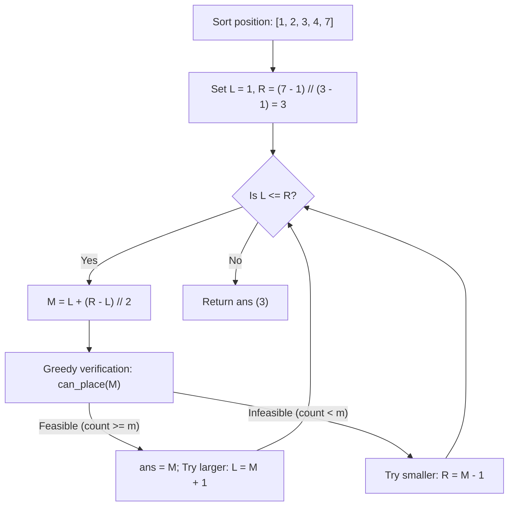

# Guided Example: Magnetic Force Between Two Balls

We trace the step-by-step execution of binary search on answer coupled with greedy basket placement on a representative coordinate instance to maximize the minimum magnetic force between $m$ balls.

- **Input:** Basket positions $\text{position} = [1, 2, 3, 4, 7]$ of length $N = 5$, with $m = 3$ balls.
- **Output:** `3` (placing balls at basket positions $1, 4, 7$ achieves pairwise distances $4 - 1 = 3$ and $7 - 4 = 3$, yielding maximum minimum force 3).

This instance demonstrates search space bounding, greedy ball assignment along a sorted coordinate line, and monotonic predicate bisection.

---

## 1. Instance & Teaching Goal

We are given $N = 5$ basket positions and $m = 3$ balls:

$$\text{position} = [1, 2, 3, 4, 7], \quad m = 3$$

Rules:
1. Each ball must be placed in a distinct basket.
2. The magnetic force between any two balls at positions $x$ and $y$ is $|x - y|$.
3. We seek to maximize the minimum force across all $\binom{m}{2}$ pairs of balls.

**Teaching Goal:**
Understand the **Predicate Monotonicity Principle**: while finding the optimal configuration directly is combinatorial, answering whether a specific distance threshold $d$ is achievable is simple and greedy. Because feasibility is monotonic in $d$ ($\text{can\_place}(d)$ transitions from `true` to `false`), binary search on the force domain isolates the global optimum in $\mathcal{O}(N \log(\text{range}))$ time.

---

## 2. Conceptual Foundation & Invariants

```
+-------------------------------------------------------------------------+
|                  BINARY SEARCH ON DISTANCE THRESHOLD                    |
+-------------------------------------------------------------------------+
|  Sorted Coordinates: [1, 2, 3, 4, 7]                                    |
|                                                                         |
|  Feasibility Predicate can_place(d):                                    |
|    Greedily place 1st ball at position[0].                              |
|    For each subsequent basket x:                                        |
|      If x - last_placed >= d:                                           |
|        Place next ball at x; update last_placed = x.                    |
|    Return (placed_count >= m).                                          |
|                                                                         |
|  Monotonicity:                                                          |
|    d = 1: [T]                                                           |
|    d = 2: [T]                                                           |
|    d = 3: [T] <-- Maximum Achievable Force                              |
|    d = 4: [F]                                                           |
|    d = 5: [F]                                                           |
|                                                                         |
|  Binary Search on range [1 .. (pos[-1] - pos[0]) // (m - 1)]:           |
|    L = 1, R = (7 - 1) // 2 = 3.                                         |
+-------------------------------------------------------------------------+
```

We establish the search state parameters:

| State Variable | Definition & Role | Initial Value |
|---|---|---|
| $L$ | Lower bound on achievable force | $1$ |
| $R$ | Upper bound on achievable force: $\lfloor (\max - \min) / (m - 1) \rfloor$ | $\lfloor 6 / 2 \rfloor = 3$ |
| $M$ | Candidate force probe: $L + \lfloor (R - L) / 2 \rfloor$ | Tested in $[1, 3]$ |
| $\text{count}$ | Number of balls greedily placed at threshold $M$ | Evaluated per probe |
| $\text{ans}$ | Best verified force threshold | $1$ |

> **Greedy Placement Invariant.** To maximize the chance of placing $m$ balls with minimum gap $d$, the first ball must always be placed at the smallest available coordinate $\text{position}[0]$. For each subsequent ball, selecting the earliest coordinate with gap $\ge d$ minimizes the occupied prefix, strictly maximizing the remaining available line for future balls.



---

## 3. Step-by-Step Worked Execution

### Preprocessing: Sorting Coordinates
Given $\text{position} = [1, 2, 3, 4, 7]$, elements are already in non-decreasing order.
Search boundaries:
- Lower bound: $L = 1$.
- Upper bound: $R = \lfloor (\text{position}[4] - \text{position}[0]) / (m - 1) \rfloor = \lfloor (7 - 1) / (3 - 1) \rfloor = 3$.

---

### Iteration 1: Testing Distance $M = 2$
- Candidate probe: $M = 1 + \lfloor (3 - 1) / 2 \rfloor = 2$.
- Execute greedy verification for minimum separation $d = 2$:
  - Ball 1: Place at $\text{position}[0] = 1$. $\text{last} = 1, \text{count} = 1$.
  - Basket 1 ($\text{pos} = 2$): Gap $2 - 1 = 1 < 2$. Cannot place.
  - Basket 2 ($\text{pos} = 3$): Gap $3 - 1 = 2 \ge 2$. Place Ball 2! $\text{last} = 3, \text{count} = 2$.
  - Basket 3 ($\text{pos} = 4$): Gap $4 - 3 = 1 < 2$. Cannot place.
  - Basket 4 ($\text{pos} = 7$): Gap $7 - 3 = 4 \ge 2$. Place Ball 3! $\text{last} = 7, \text{count} = 3$.
- Outcome: Placed 3 balls $\ge m = 3$. Feasible!
- Update: $\text{ans} \leftarrow 2$. Narrow search to higher range: $L \leftarrow M + 1 = 3$.

| Probe $M$ | Evaluated Baskets | Placed Ball Positions | Ball Count | Feasible ($\text{count} \ge 3$)? | Action | Next Range $[L, R]$ |
|---|---|---|---|---|---|---|
| 2 | 1, 2, 3, 4, 7 | $\{1, 3, 7\}$ | 3 | True | $\text{ans} = 2, L = M + 1$ | $[3, 3]$ |

---

### Iteration 2: Testing Distance $M = 3$
- Candidate probe: $M = 3 + \lfloor (3 - 3) / 2 \rfloor = 3$.
- Execute greedy verification for minimum separation $d = 3$:
  - Ball 1: Place at $\text{position}[0] = 1$. $\text{last} = 1, \text{count} = 1$.
  - Basket 1 ($\text{pos} = 2$): Gap $2 - 1 = 1 < 3$. Skip.
  - Basket 2 ($\text{pos} = 3$): Gap $3 - 1 = 2 < 3$. Skip.
  - Basket 3 ($\text{pos} = 4$): Gap $4 - 1 = 3 \ge 3$. Place Ball 2! $\text{last} = 4, \text{count} = 2$.
  - Basket 4 ($\text{pos} = 7$): Gap $7 - 4 = 3 \ge 3$. Place Ball 3! $\text{last} = 7, \text{count} = 3$.
- Outcome: Placed 3 balls $\ge m = 3$ at positions $\{1, 4, 7\}$. Feasible!
- Update: $\text{ans} \leftarrow 3$. Narrow search to higher range: $L \leftarrow M + 1 = 4$.

| Probe $M$ | Evaluated Baskets | Placed Ball Positions | Ball Count | Feasible ($\text{count} \ge 3$)? | Action | Next Range $[L, R]$ |
|---|---|---|---|---|---|---|
| 3 | 1, 2, 3, 4, 7 | $\{1, 4, 7\}$ | 3 | True | $\text{ans} = 3, L = M + 1$ | $[4, 3]$ |

---

### Termination
The search bounds invert: $L = 4 > 3 = R$.
The loop terminates, and the maximum valid distance confirmed is $\text{ans} = 3$.

Final answer: **`3`**.

---

## 4. Complete Execution Trace

The full predicate evaluation history across the binary search steps is summarized below:

| Search Step | Interval $[L, R]$ | Midpoint $M$ | Greedy Scan Placements | Placed Balls | Target $m$ | Predicate Result | Best So Far |
|---|---|---|---|---|---|---|---|
| 1 | $[1, 3]$ | 2 | 1 (pos 1), 3 (pos 3), 7 (pos 7) | 3 | 3 | Pass (True) | 2 |
| 2 | $[3, 3]$ | 3 | 1 (pos 1), 4 (pos 4), 7 (pos 7) | 3 | 3 | Pass (True) | **3** |
| Finish | $[4, 3]$ | - | Converged | - | - | Complete | **3** |

---

## 5. Algorithmic Correctness

**Soundness.**
- Whenever $\text{can\_place}(d)$ returns `true`, the greedy routine explicitly identifies $m$ baskets $p_1 < p_2 < \dots < p_m$ such that $p_{i+1} - p_i \ge d$ for all $i \in [1, m-1]$.
- Because the coordinates are strictly increasing, for any $j > i$, $p_j - p_i = \sum_{k=i}^{j-1} (p_{k+1} - p_k) \ge (j - i)d \ge d$.
- Thus, every pair of placed balls has distance at least $d$, proving that minimum force $d$ is fully achievable.

**Completeness.**
- Suppose there exists any valid placement of $m$ balls $q_1 < q_2 < \dots < q_m$ with pairwise distances $\ge d$.
- The greedy placement $p_1, p_2, \dots, p_m$ places $p_1 = \text{position}[0] \le q_1$.
- By induction, if $p_k \le q_k$, then $q_{k+1} \ge q_k + d \ge p_k + d$.
- Since $q_{k+1}$ is a valid basket coordinate $\ge p_k + d$, the greedy choice $p_{k+1}$ (which is the minimal coordinate $\ge p_k + d$) satisfies $p_{k+1} \le q_{k+1}$.
- Hence, the greedy choice can always place at least as many balls as any hypothetical optimal placement. If $d$ is feasible, greedy will discover it.

---

## 6. Traps This Instance Exposes

- **Searching Over Incomplete Subsets:** Trying all $\binom{N}{m}$ combinations yields exponential time $\mathcal{O}\left(\binom{10^5}{10^5}\right)$, which is impossible. Transforming the question into a decision problem enables logarithmic convergence.
- **Neglecting to Sort the Coordinates:** The greedy predicate assumes monotonic basket positions. If `position` is unsorted, comparisons $x - \text{last}$ lose geometric meaning.
- **Loose Upper Bound:** Setting $R = 10^9$ works but wastes iterations. Setting $R = \lfloor (\max - \min) / (m - 1) \rfloor$ uses the pigeonhole principle to establish the exact maximum possible gap.
- **Off-by-One in Search Update:** For max-bisection, when $M$ is feasible, we must record $\text{ans} = M$ and search $L = M + 1$; when infeasible, $R = M - 1$.

---

## 7. Complexity Derivation

- **Time Complexity:**
  - Sorting $N$ coordinates takes $\mathcal{O}(N \log N)$ time.
  - The binary search domain has size $W = \lfloor (\max - \min) / (m - 1) \rfloor \le 10^9$.
  - Number of binary search iterations is $\lceil \log_2 W \rceil \le 30$.
  - Each iteration runs the greedy check in a single pass of $\mathcal{O}(N)$ time.
  - Overall time complexity is $\mathcal{O}(N \log N + N \log W)$.
  - For $N = 10^5$, $30 \times 10^5 \approx 3 \cdot 10^6$ operations, executing in under 30 milliseconds.
- **Auxiliary Space Complexity:**
  - In-place sorting and scalar search variables ($L, R, M, \text{last}, \text{count}$).
  - Auxiliary space complexity is strictly $\mathcal{O}(1)$ (or $\mathcal{O}(\log N)$ for sorting recursion).