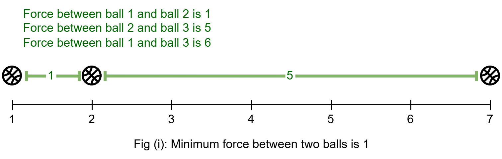
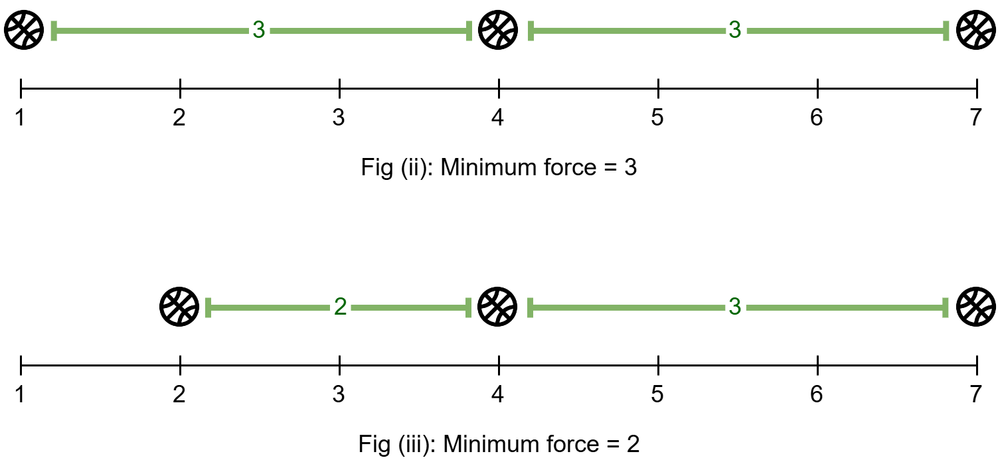
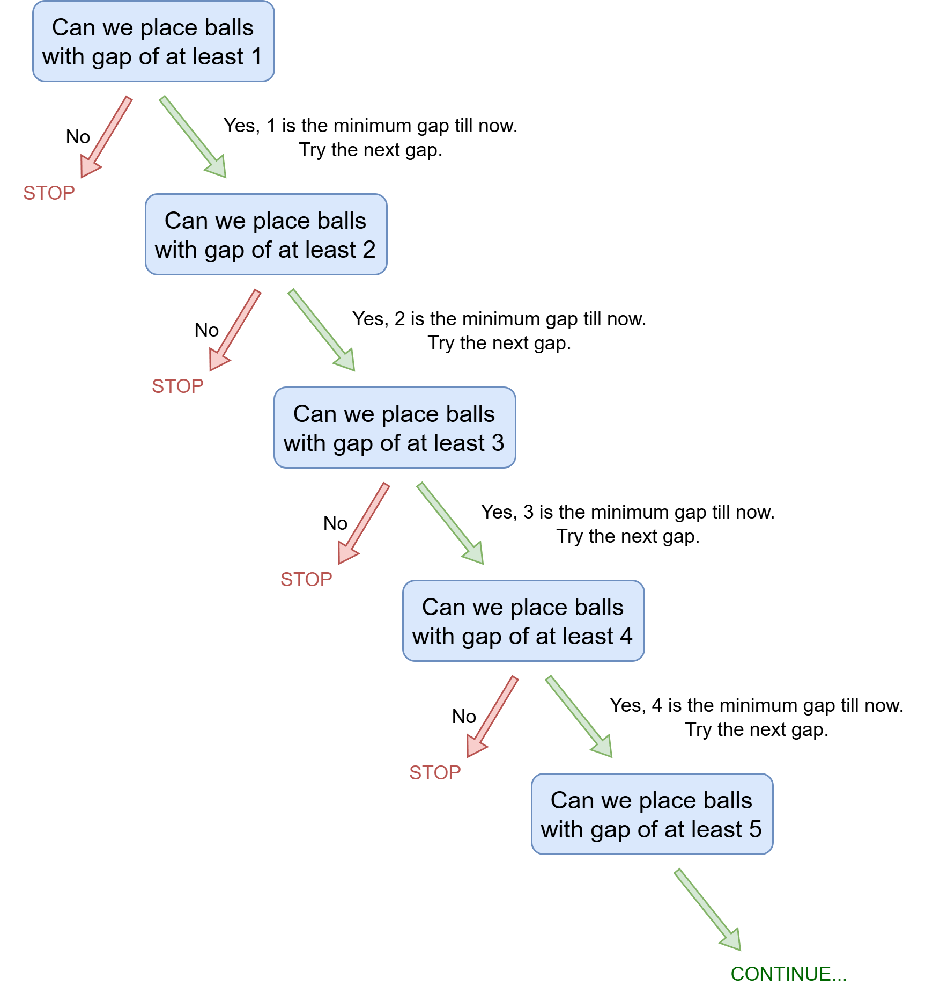
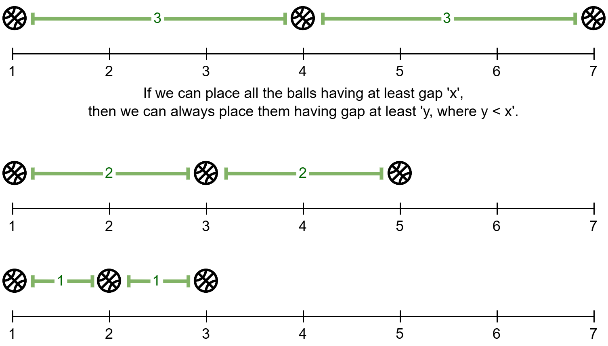
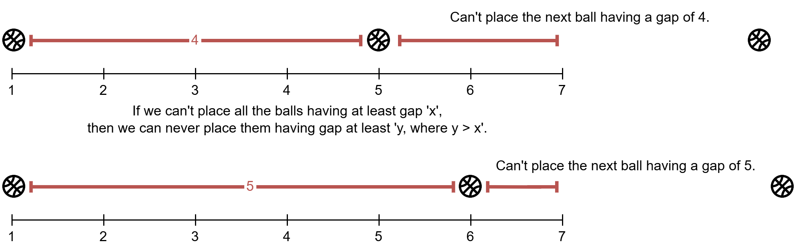
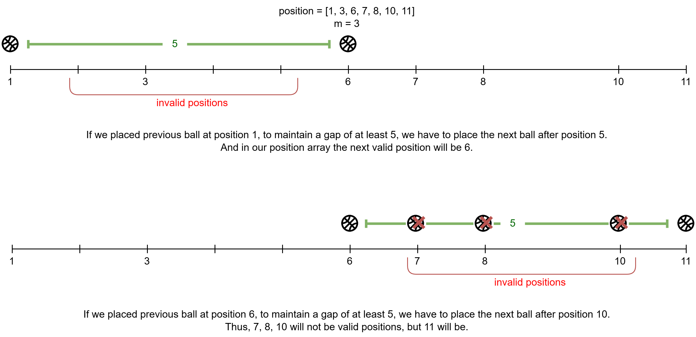
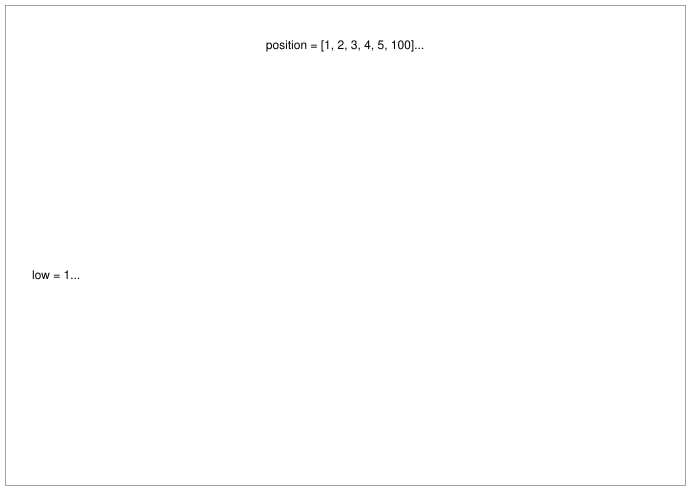
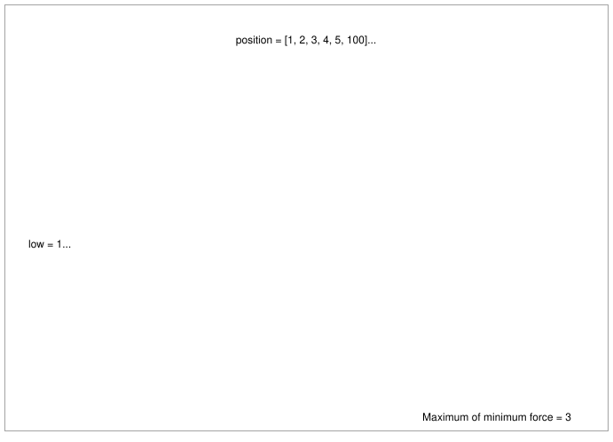
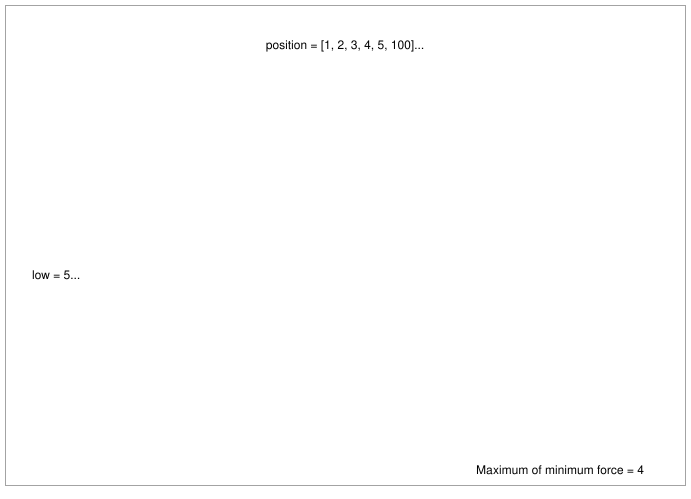
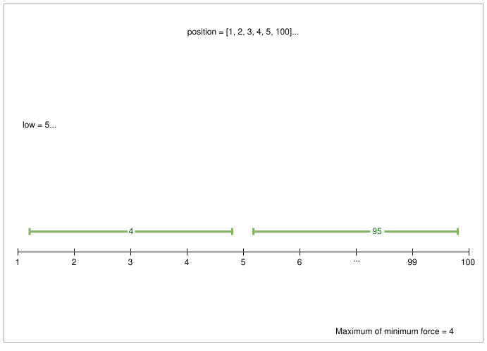

[TOC]

## Solution

---

### Overview

In this problem, our goal is to place $m$ balls in $n$ positions to maximize the minimum magnetic force between any two balls.

The magnetic force between two balls is calculated as $| x - y |$, where $x$ and $y$ are the positions of the two balls. Essentially, this means the magnetic force is the gap between the two respective balls.

What does it mean to maximize the minimum magnetic force between any two balls?
Consider the following three configurations for placing 3 balls:





The minimum magnetic forces for each configuration are $1$, $3$, and $2$, respectively. The optimal configuration, which maximizes the minimum magnetic force, is the second (ii) configuration.

We will start with a naive approach and progressively optimize it.

> **Note:** This article assumes you understand how binary search in sorted arrays works. If not we recommend you read our [explore card (click here)](https://leetcode.com/explore/featured/card/leetcodes-interview-crash-course-data-structures-and-algorithms/710/binary-search/) and try out some similar problems.

---

### Approach: Binary Search

#### Intuition

If we place all the balls with at least a gap of $x$ between any two consecutive balls, $x$ will be the minimum magnetic force.

To find the maximum possible value of $x$, we can start with the smallest possible value and attempt to place all the balls with at least this gap. If successful, we increase $x$ by $1$ and try again. This process continues until we reach a point where it is no longer possible to place all the balls with the current gap $x$. At this stage, it won't be feasible to place the balls with any larger gap than $x$ (we recommend you try to reason out it before reading the explanation provided later).



This method can be further optimized. When we try a given gap $x$, two outcomes are possible: (i) we can successfully place all the balls with at least a gap of $x$ between them, or (ii) we cannot place all the balls.

i) If we can place all the balls with at least a gap of $x$ between them, then trying smaller gaps is unnecessary, as it will always be possible to place the balls with a smaller gap.



ii) If we cannot place all the balls with at least a gap of $x$ between them, then trying gaps larger than $x$ is futile, as it would also be impossible to place the balls with a larger gap.



This suggests we can use a binary search-like algorithm, we can take the decision of discarding some part of the search space at each step.

Our search space for the gap values starts with $low = 1$, since there will be at least a gap of $1$ between any two adjacent balls, and extends to $high = \lceil \frac{maxPosition}{m - 1} \rceil$, the maximum gap between $m$ balls if all positions from $1$ to $position[n - 1]$ are available.

To determine if we can place the balls with a given gap $x = mid$ we will use another function `canPlaceBalls(x, positions, m)`, where $mid = low + \frac{(high - low)}{2}$.
If placing the balls is possible with this gap, we discard all gaps smaller than $mid$ from our search space. Conversely, if we cannot place the balls, we discard all gaps greater than $mid$. We repeat this process in the reduced search space until we find the maximum gap value.

In `canPlaceBalls(x, positions, m)` function, we check if we can place $m$ balls in the given $position$ array with at least $x$ gap between them. We iterate through the $position$ array, checking if each position is suitable for placing a ball by maintaining a gap of at least $x$from the previous ball's position. If the current position meets the requirement, we place the ball there and move to the next position. We stop once we either run out of positions or successfully place all $m$ balls.

Here's an example to illustrate ball placement:



It's important to note that for this approach to work, the $position$ array must be sorted. Thus, we will sort the array in the beginning.

<br />

To better understand how the binary search works in this context, refer to the following slideshow.











#### Algorithm

1. Create a helper function called `canPlaceBalls` which takes in the gap `x`, positions array `position`, and the number of balls `m` as parameters.
- Initialize, `prevBallPos` to $\text{position}[0]$, `ballsPlaced` count to `1`.
- Iterate on all positions from index $i = 0$ till $\text{position.size}() - 1$ or if we placed all `m` balls:
- Place the ball at the current position $\text{position}[i]$ if it maintains a gap of `x` with the previous ball.
- Update `prevBallPos` to $\text{position}[i]$.
- Increment `ballsPlaced` count by `1`.
- Return if `ballsPlaced` is equal to `m`.
2. Initialize `answer` to `0`, denoting maximum minimum magnetic force, and `n` to `position` array's size.
3. Sort the `position` array.
4. Initilize the initial search space for the gap:
- `low` to `1`.
- `high` to $ceil(position[n - 1] / (m - 1))$.
5. Start a while loop until the search space is exhausted, i.e. till $low \le high$, at each iteration:
- Calculate the $mid = low + (high - low) / 2$.
- If we can place all the balls at a gap of `mid`, then update $answer = mid$, and discard the left half search space, $left = mid + 1$.
- Otherwise, discard the right half search space, $right = mid - 1$.

#### Implementation

```python
class Solution:
    # Check if we can place 'm' balls at 'position'
    # with each ball having at least 'x' gap.
    def can_place_balls(self, x, position, m):
        # Place the first ball at the first position.
        prev_ball_pos = position[0]
        balls_placed = 1

        # Iterate on each 'position' and place a ball there if we can place it.
        for i in range(1, len(position)):
            curr_pos = position[i]
            # Check if we can place the ball at the current position.
            if curr_pos - prev_ball_pos >= x:
                balls_placed += 1
                prev_ball_pos = curr_pos
            # If all 'm' balls are placed, return 'True'.
            if balls_placed == m:
                return True
        return False

    def maxDistance(self, position: List[int], m: int) -> int:
        answer = 0
        n = len(position)
        position.sort()

        # Initial search space.
        low = 1
        high = int(position[-1] / (m - 1.0)) + 1
        while low <= high:
            mid = low + (high - low) // 2
            # If we can place all balls having a gap at least 'mid',
            if self.can_place_balls(mid, position, m):
                # then 'mid' can be our answer,
                answer = mid
                # and discard the left half search space.
                low = mid + 1
            else:
                # Discard the right half search space.
                high = mid - 1
        return answer
```

#### Complexity Analysis

Here, $n$ is the number of elements, and $k$ is the maximum position value in the `position` array.

* Time complexity: $O(n \log \frac{n * k}{m})$

    Sorting the `position` array takes $O(n \log n)$ time.

    Checking if we can place the balls in the position array takes $O(n)$ time. This operation is repeated until we reduce our search space to one element. The search space is halved in each step until only one element remains, resulting in $O(\log \frac{k}{m})$ steps.
    $a \rarr a/2 \rarr a/4 \rarr ... \rarr 1 \space (\text{b steps})$
    $a / 2^{(b - 1)} = 1 \implies b \approx \log a$

    Therefore, the overall time complexity is $O(n \log \frac{n * k}{m})$.

* Space complexity: $O( \log n )$ or $O(n)$

    Apart from sorting, we do not use any additional space.

    The space complexity of the sorting algorithm depends on the programming language.
- In Python, the sort method sorts a list using the Timsort algorithm which is a combination of Merge Sort and Insertion Sort and has $O(n)$ additional space.
- In Java, `Arrays.sort()` is implemented using a variant of the Quick Sort algorithm which has a space complexity of $O( \log n )$ for sorting two arrays.
- In C++, the `sort()` function is implemented as a hybrid of Quick Sort, Heap Sort, and Insertion Sort, with a worse-case space complexity of $O( \log n )$.