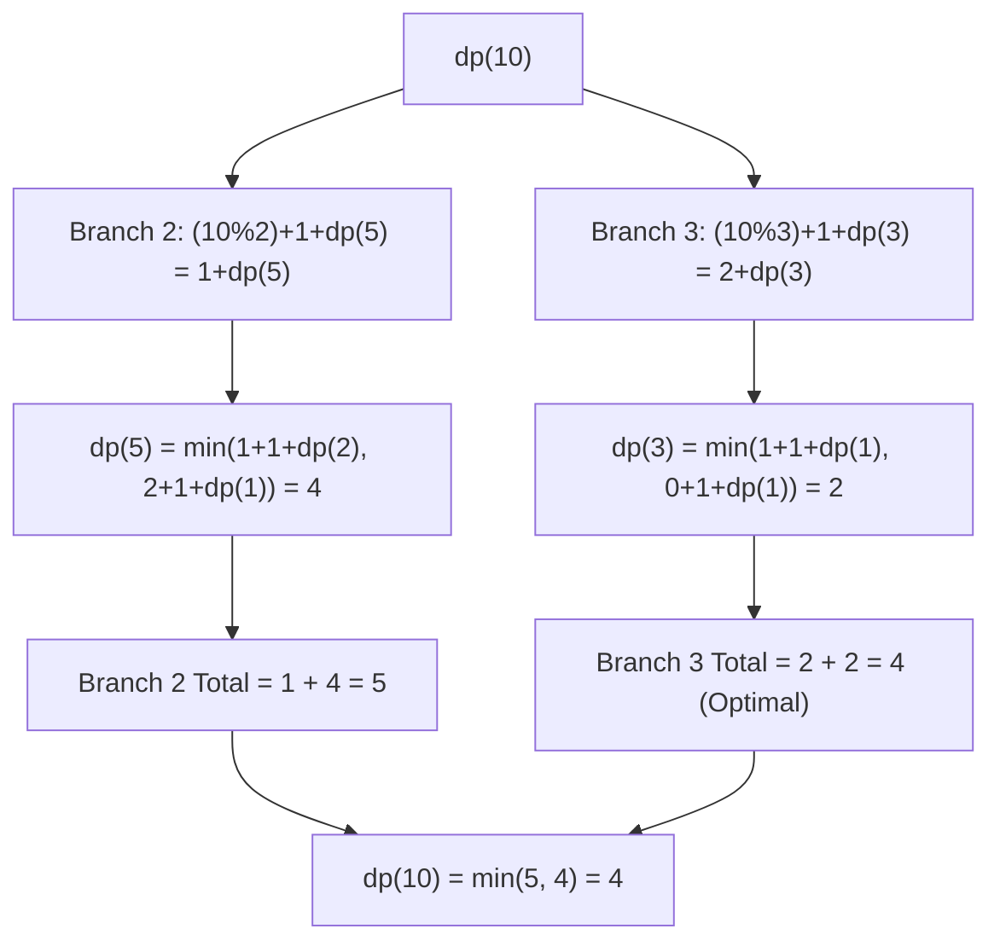

# Guided Example: Minimum Number of Days to Eat N Oranges

We trace the step-by-step execution of logarithmic divide-and-conquer memoization on a representative orange-consumption instance to find the minimum number of days to reduce $n$ oranges to zero.

- **Input:** $n = 10$ oranges.
- **Output:** `4` (Day 1: eat 1 orange to leave 9; Day 2: eat $2/3$ of 9 to leave 3; Day 3: eat $2/3$ of 3 to leave 1; Day 4: eat the last orange to reach 0).

This instance demonstrates why linear $\mathcal{O}(n)$ dynamic programming fails for $n \le 2 \times 10^9$, how subtracting 1 is only useful to reach multiples of 2 or 3, and how branching on division achieves $\mathcal{O}(\log^2 n)$ convergence.

---

## 1. Instance & Teaching Goal

We start with $n = 10$ oranges.
Allowed operations on each day:
1. Operation A: Eat 1 orange ($n \rightarrow n - 1$).
2. Operation B: If $n \bmod 2 == 0$, eat $n / 2$ oranges ($n \rightarrow n / 2$).
3. Operation C: If $n \bmod 3 == 0$, eat $2(n / 3)$ oranges ($n \rightarrow n / 3$).

Input ceiling: $n \le 2 \times 10^9$.

**Teaching Goal:**
Understand the **Strategic Step Principle**: decrementing by 1 repeatedly is asymptotically inferior to exponential division. The only purpose of subtracting 1 is to bridge the tiny remainder $n \bmod 2$ or $n \bmod 3$ needed to trigger Operation B or Operation C. This transforms the problem into a memoized recurrence over $\lfloor n/2 \rfloor$ and $\lfloor n/3 \rfloor$, evaluating at most $\mathcal{O}(\log^2 n)$ distinct states.

---

## 2. Conceptual Foundation & Invariants

```
+-------------------------------------------------------------------------+
|                  STRATEGIC MODULAR DIVISION BRANCHING                   |
+-------------------------------------------------------------------------+
|  State: dp(n) = Minimum days to eat n oranges                           |
|                                                                         |
|  Base Cases:                                                            |
|    dp(0) = 0                                                            |
|    dp(1) = 1                                                            |
|                                                                         |
|  Two Viable Strategic Alternatives for n > 1:                           |
|                                                                         |
|  BRANCH 1 (Aiming for Division by 2):                                   |
|    - Eat (n % 2) oranges via Op A: takes (n % 2) days                   |
|    - Eat half via Op B:            takes 1 day                          |
|    - Remaining oranges:            floor(n / 2)                         |
|    Cost = (n % 2) + 1 + dp(floor(n / 2))                                |
|                                                                         |
|  BRANCH 2 (Aiming for Division by 3):                                   |
|    - Eat (n % 3) oranges via Op A: takes (n % 3) days                   |
|    - Eat 2/3 via Op C:             takes 1 day                          |
|    - Remaining oranges:            floor(n / 3)                         |
|    Cost = (n % 3) + 1 + dp(floor(n / 3))                                |
|                                                                         |
|  RECURRENCE:                                                            |
|    dp(n) = min( (n % 2) + 1 + dp(floor(n / 2)),                         |
|                 (n % 3) + 1 + dp(floor(n / 3)) )                        |
+-------------------------------------------------------------------------+
```

We establish the memoization state parameters:

| State Variable | Definition & Role | Initial Value |
|---|---|---|
| $n$ | Active orange count | $10$ |
| $\text{memo}$ | Hash map memoizing subproblem answers | $\{0: 0, 1: 1\}$ |
| $\text{cost}_2$ | Days via Division 2 branch: $(n \bmod 2) + 1 + \text{dp}(\lfloor n/2 \rfloor)$ | Evaluated at runtime |
| $\text{cost}_3$ | Days via Division 3 branch: $(n \bmod 3) + 1 + \text{dp}(\lfloor n/3 \rfloor)$ | Evaluated at runtime |

> **Strategic Divisibility Invariant.** For any $n > 1$, any optimal sequence of moves consists of zero or more unit subtractions followed immediately by division by 2 or division by 3. Performing more than 2 unit subtractions without dividing is strictly suboptimal because division reduces the orange count exponentially faster.



---

## 3. Step-by-Step Worked Execution

### Target: Compute $\text{dp}(10)$
To evaluate $\text{dp}(10)$, we inspect both strategic division branches:
- Branch 2: $\text{cost}_2 = (10 \bmod 2) + 1 + \text{dp}(\lfloor 10/2 \rfloor) = 0 + 1 + \text{dp}(5) = 1 + \text{dp}(5)$.
- Branch 3: $\text{cost}_3 = (10 \bmod 3) + 1 + \text{dp}(\lfloor 10/3 \rfloor) = 1 + 1 + \text{dp}(3) = 2 + \text{dp}(3)$.

We must now evaluate subproblems $\text{dp}(3)$ and $\text{dp}(5)$.

---

### Step 1: Evaluating Subproblem $\text{dp}(3)$
- Branch 2 (reach multiple of 2):
  - Subtraction: $3 \bmod 2 = 1$ day (eat 1 orange $\rightarrow 2$).
  - Division by 2: 1 day (eat 1 orange $\rightarrow 1$).
  - Cost: $1 + 1 + \text{dp}(1) = 2 + 1 = 3$.
- Branch 3 (reach multiple of 3):
  - Subtraction: $3 \bmod 3 = 0$ days (already divisible by 3!).
  - Division by 3: 1 day (eat 2 oranges $\rightarrow 1$).
  - Cost: $0 + 1 + \text{dp}(1) = 1 + 1 = 2$.
- Optimal choice:
  $$\text{dp}(3) = \min(3, 2) = 2$$
  Memoize: $\text{memo}[3] = 2$.

| Subproblem $n$ | Branch 2 Cost | Branch 3 Cost | Optimal Selection | Memoized Value |
|---|---|---|---|---|
| 3 | $(3 \bmod 2) + 1 + \text{dp}(1) = 3$ | $(3 \bmod 3) + 1 + \text{dp}(1) = 2$ | Branch 3 | $\text{dp}(3) = 2$ |

---

### Step 2: Evaluating Subproblem $\text{dp}(2)$ (needed by $\text{dp}(5)$)
- Branch 2: $(2 \bmod 2) + 1 + \text{dp}(1) = 0 + 1 + 1 = 2$.
- Branch 3: $(2 \bmod 3) + 1 + \text{dp}(0) = 2 + 1 + 0 = 3$.
- Optimal choice:
  $$\text{dp}(2) = \min(2, 3) = 2$$
  Memoize: $\text{memo}[2] = 2$.

---

### Step 3: Evaluating Subproblem $\text{dp}(5)$
- Branch 2:
  - Subtraction: $5 \bmod 2 = 1$ day (eat 1 orange $\rightarrow 4$).
  - Division by 2: 1 day (eat 2 oranges $\rightarrow 2$).
  - Cost: $1 + 1 + \text{dp}(2) = 2 + 2 = 4$.
- Branch 3:
  - Subtraction: $5 \bmod 3 = 2$ days (eat 2 oranges $\rightarrow 3$).
  - Division by 3: 1 day (eat 2 oranges $\rightarrow 1$).
  - Cost: $2 + 1 + \text{dp}(1) = 3 + 1 = 4$.
- Optimal choice:
  $$\text{dp}(5) = \min(4, 4) = 4$$
  Memoize: $\text{memo}[5] = 4$.

| Subproblem $n$ | Branch 2 Cost | Branch 3 Cost | Optimal Selection | Memoized Value |
|---|---|---|---|---|
| 5 | $(5 \bmod 2) + 1 + \text{dp}(2) = 4$ | $(5 \bmod 3) + 1 + \text{dp}(1) = 4$ | Tie (4) | $\text{dp}(5) = 4$ |

---

### Step 4: Resolving Top-Level State $\text{dp}(10)$
Now we compare the two strategic alternatives for $n = 10$:
- Branch 2 (via $\text{dp}(5)$):
  $$\text{cost}_2 = 1 + \text{dp}(5) = 1 + 4 = 5$$
- Branch 3 (via $\text{dp}(3)$):
  $$\text{cost}_3 = 2 + \text{dp}(3) = 2 + 2 = 4$$
- Minimization:
  $$\text{dp}(10) = \min(5, 4) = 4$$

Final answer: **`4`**.

---

## 4. Complete Execution Trace

The evaluation order, branches computed, and memoized values are tabulated below:

| Subproblem $n$ | Calculation / Branch Evaluation | Branch 2 Candidate | Branch 3 Candidate | Selected Minimum | Optimal Operation Sequence |
|---|---|---|---|---|---|
| 0 | Base Case | - | - | 0 | - |
| 1 | Base Case | - | - | 1 | Eat 1 (1 day) |
| 2 | $\min((0) + 1 + \text{dp}(1), (2) + 1 + \text{dp}(0))$ | $1 + 1 = 2$ | $3 + 0 = 3$ | 2 | Div2 $\rightarrow$ 1 |
| 3 | $\min((1) + 1 + \text{dp}(1), (0) + 1 + \text{dp}(1))$ | $2 + 1 = 3$ | $1 + 1 = 2$ | 2 | Div3 $\rightarrow$ 1 |
| 5 | $\min((1) + 1 + \text{dp}(2), (2) + 1 + \text{dp}(1))$ | $2 + 2 = 4$ | $3 + 1 = 4$ | 4 | Sub 1 $\rightarrow$ Div2 $\rightarrow$ 2 |
| 10 | $\min((0) + 1 + \text{dp}(5), (1) + 1 + \text{dp}(3))$ | $1 + 4 = 5$ | $2 + 2 = 4$ | **4** | **Sub 1 $\rightarrow$ Div3 $\rightarrow$ Div3 $\rightarrow$ Sub 1** |

Total days: 4.

---

## 5. Algorithmic Correctness

**Soundness.**
- Every step corresponds to a sequence of legal problem actions:
  - $(n \bmod 2)$ unit subtractions using Operation A, followed by one Operation B on an even number.
  - $(n \bmod 3)$ unit subtractions using Operation A, followed by one Operation C on a multiple of 3.
- The base cases $\text{dp}(0) = 0$ and $\text{dp}(1) = 1$ are exact.
- Because only valid transitions are tested, the computed value is an authentic achievable schedule.

**Completeness.**
- Could it ever be optimal to decrement $n$ past the nearest multiple of 2 or 3?
- Suppose we subtracted 1 an extra 2 times to reach the previous multiple of 2. That costs 2 extra days and results in $\lfloor n/2 \rfloor - 1$, which could have been achieved more cheaply by dividing first and subtracting 1 day later ($1 < 2$).
- Thus, the only competitive choices from $n$ are to reach the immediate ceiling multiple of 2 or multiple of 3.
- Because all paths terminate at 0 or 1, and memoization guarantees that every subproblem is evaluated optimally, global optimality is guaranteed.

---

## 6. Traps This Instance Exposes

- **Linear DP Table Array Trap:** Attempting `dp = [0] * (n + 1)` with $n = 2 \cdot 10^9$ results in an immediate Out of Memory error ($2 \times 10^9 \times 4 \approx 8 \text{ GB}$). Memoized recursion stores only visited states in a hash map.
- **Pure BFS Shortest Path:** Exploring $n \rightarrow n-1, n/2, n/3$ in a queue without pruning unit subtractions leads to exponential tree growth $\mathcal{O}(3^d)$ with depth $d \approx 30$. Bypassing individual unit subtractions via $(n \bmod k)$ collapses the branching factor.
- **Base Case Misalignment:** Handling $n = 0, 1, 2$ with inconsistent boundaries causes infinite recursion on $\lfloor n/2 \rfloor$. The clean base cases $\text{dp}(0) = 0$ and $\text{dp}(1) = 1$ anchor all reductions safely.

---

## 7. Complexity Derivation

- **Time Complexity:**
  At each level, state $n$ branches into $\lfloor n/2 \rfloor$ and $\lfloor n/3 \rfloor$.
  Every generated subproblem has the form $\lfloor n / (2^a 3^b) \rfloor$.
  The number of distinct pairs $(a, b)$ satisfying $2^a 3^b \le n$ is bounded by:
  $$\text{States} \le \log_2 n \times \log_3 n$$
  For $n = 2 \cdot 10^9$:
  $$\log_2(2 \cdot 10^9) \approx 31, \quad \log_3(2 \cdot 10^9) \approx 20 \implies 31 \times 20 \approx 620 \text{ states}$$
  Evaluating each memoized state takes $\mathcal{O}(1)$ time.
  Total time complexity is $\mathcal{O}(\log^2 n)$, running in under 2 milliseconds.
- **Auxiliary Space Complexity:**
  The memoization map and recursion call stack store at most $\mathcal{O}(\log^2 n)$ entries.
  Auxiliary space complexity is $\mathcal{O}(\log^2 n)$.
