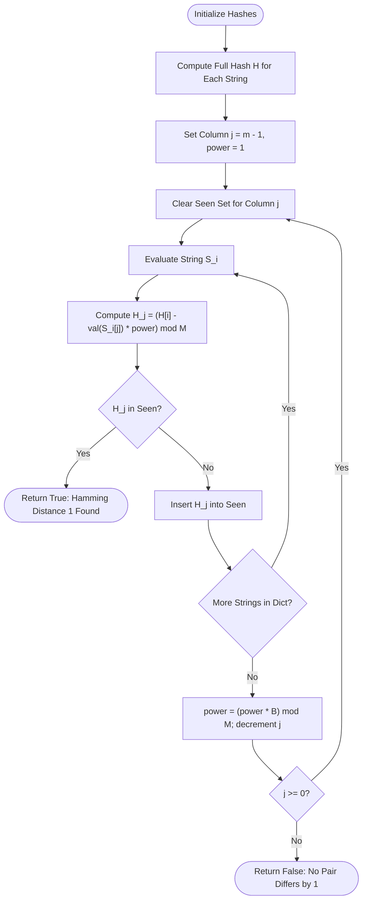

# Guided Example: Strings Differ by One Character

## 1. Instance & Teaching Goal

We are given a dictionary of distinct lowercase strings of identical length $m$. We must decide whether there exists any pair of strings $(S_a, S_b)$ with Hamming distance exactly $1$—that is, $S_a[k] = S_b[k]$ for all $k \neq j$, while $S_a[j] \neq S_b[j]$ at some singular index $j$.

We choose the dictionary:
$$\text{dict} = [\text{"abcd"}, \text{"acbd"}, \text{"aacd"}]$$

Here, the number of strings is $n = 3$, and every string has length $m = 4$.

Our teaching goal is to walk through the column-wise masked polynomial rolling hash method. Rather than performing an all-pairs pairwise comparison costing $\mathcal{O}(n^2 \cdot m)$ time or generating wildcard strings that allocate massive string objects, we compute full 64-bit polynomial hashes for all strings and then subtract the contribution of each character position $j \in \{m-1, \dots, 0\}$ in $\mathcal{O}(1)$ time. A collision in column $j$'s masked hash set directly reveals two strings that are identical everywhere outside index $j$.

## 2. Conceptual Foundation & Invariants

Each string $S$ over lowercase English letters $\{'a', \dots, 'z'\}$ is mapped into numerical character values $\text{val}(c) = \text{ord}(c) - 96 \in \{1, \dots, 26\}$. Using a prime modulus $M = 2^{61} - 1$ and radix base $B = 27$, the full polynomial hash of a string of length $m$ is defined as:
$$H(S) = \left(\sum_{k=0}^{m-1} \text{val}(S[k]) \cdot B^{m-1-k}\right) \pmod M$$

When column $j$ is masked out (simulating a wildcard at position $j$), the masked hash value is:
$$H_j(S) = \left(H(S) - \text{val}(S[j]) \cdot B^{m-1-j}\right) \pmod M$$

```
+-------------------------------------------------------------------------+
|                  COLUMN-WISE MASKED ROLLING HASH                        |
|                                                                         |
| Full Hash:   H(S) = sum_{k=0}^{m-1} val(S[k]) * B^(m-1-k)  (mod M)     |
|                                                                         |
| Masking pos j:                                                          |
|              H_j(S) = [ H(S) - val(S[j]) * B^(m-1-j) ] (mod M)         |
|                                                                         |
| Column Loop: For j = m-1 down to 0:                                     |
|              seen = empty set                                           |
|              For each S_i in dict:                                      |
|                  if H_j(S_i) in seen: RETURN TRUE (distance = 1)       |
|                  seen.insert(H_j(S_i))                                  |
|              advance weight: power = (power * B) mod M                  |
+-------------------------------------------------------------------------+
```

### State Parameter Reference

| Parameter | Type | Domain / Range | Role in State Machine |
|---|---|---|---|
| $B$ | Integer | $27$ | Radix base strictly exceeding alphabet cardinality ($26$) |
| $M$ | Integer | $2^{61} - 1$ | Mersenne prime modulus eliminating hash collision risk |
| $H[i]$ | 64-bit Integer | $[0, M-1]$ | Precomputed full polynomial hash for string $S_i$ |
| $j$ | Integer | $m-1$ down to $0$ | The active column index currently being masked |
| $\text{power}$ | Integer | $B^{m-1-j} \pmod M$ | Positional weight associated with column $j$ |
| $H_j(S_i)$ | 64-bit Integer | $[0, M-1]$ | Masked hash representing string $S_i$ with character $S_i[j]$ removed |
| $\text{seen}$ | Hash Set | Set of 64-bit Integers | Tracks masked hashes observed within current column $j$ |

> [!IMPORTANT]
> **State Invariant**:
> At any column $j$, two strings $S_a$ and $S_b$ ($a < b$) satisfy $H_j(S_a) \equiv H_j(S_b) \pmod M$ if and only if $S_a[k] = S_b[k]$ for all $k \neq j$. Because all strings in $\text{dict}$ are pairwise distinct by problem specification, $S_a$ and $S_b$ cannot be identical overall; therefore, $S_a[j] \neq S_b[j]$ must hold, establishing that the Hamming distance between $S_a$ and $S_b$ is exactly $1$.



## 3. Step-by-Step Worked Execution

### Phase 1: Precomputing Full Hashes

We map character values: $\text{'a'} \to 1, \text{'b'} \to 2, \text{'c'} \to 3, \text{'d'} \to 4$.
Powers of $B = 27$:
- $27^0 = 1$
- $27^1 = 27$
- $27^2 = 729$
- $27^3 = 19683$

We calculate the full hash for each string:
1. $S_0 = \text{"abcd"}$:
   $$H(S_0) = 1 \cdot 27^3 + 2 \cdot 27^2 + 3 \cdot 27^1 + 4 \cdot 27^0 = 19683 + 1458 + 81 + 4 = 21226$$
2. $S_1 = \text{"acbd"}$:
   $$H(S_1) = 1 \cdot 27^3 + 3 \cdot 27^2 + 2 \cdot 27^1 + 4 \cdot 27^0 = 19683 + 2187 + 54 + 4 = 21928$$
3. $S_2 = \text{"aacd"}$:
   $$H(S_2) = 1 \cdot 27^3 + 1 \cdot 27^2 + 3 \cdot 27^1 + 4 \cdot 27^0 = 19683 + 729 + 81 + 4 = 20497$$

### Phase 2: Iterating Columns Backward

#### Column $j = 3$ (Masking Index 3, Positional Weight $\text{power} = 1$)
We initialize $\text{seen} = \emptyset$.
- String $S_0 = \text{"abcd"}$: $\text{val}(S_0[3]) = 4$.
  $$H_3(S_0) = 21226 - 4 \cdot 1 = 21222$$
  $21222 \notin \text{seen}$. We insert $21222$ into $\text{seen} \implies \{21222\}$.
- String $S_1 = \text{"acbd"}$: $\text{val}(S_1[3]) = 4$.
  $$H_3(S_1) = 21928 - 4 \cdot 1 = 21924$$
  $21924 \notin \text{seen}$. We insert $21924$ into $\text{seen} \implies \{21222, 21924\}$.
- String $S_2 = \text{"aacd"}$: $\text{val}(S_2[3]) = 4$.
  $$H_3(S_2) = 20497 - 4 \cdot 1 = 20493$$
  $20493 \notin \text{seen}$. We insert $20493$ into $\text{seen} \implies \{21222, 21924, 20493\}$.

No collision occurs in column $3$. Update $\text{power} = (1 \cdot 27) \pmod M = 27$.

#### Column $j = 2$ (Masking Index 2, Positional Weight $\text{power} = 27$)
We clear $\text{seen} = \emptyset$.
- String $S_0 = \text{"abcd"}$: $\text{val}(S_0[2]) = 3$.
  $$H_2(S_0) = 21226 - 3 \cdot 27 = 21226 - 81 = 21145$$
  $21145 \notin \text{seen}$. Insert $21145 \implies \{21145\}$.
- String $S_1 = \text{"acbd"}$: $\text{val}(S_1[2]) = 2$.
  $$H_2(S_1) = 21928 - 2 \cdot 27 = 21928 - 54 = 21874$$
  $21874 \notin \text{seen}$. Insert $21874 \implies \{21145, 21874\}$.
- String $S_2 = \text{"aacd"}$: $\text{val}(S_2[2]) = 3$.
  $$H_2(S_2) = 20497 - 3 \cdot 27 = 20497 - 81 = 20416$$
  $20416 \notin \text{seen}$. Insert $20416 \implies \{21145, 21874, 20416\}$.

No collision occurs in column $2$. Update $\text{power} = (27 \cdot 27) \pmod M = 729$.

#### Column $j = 1$ (Masking Index 1, Positional Weight $\text{power} = 729$)
We clear $\text{seen} = \emptyset$.
- String $S_0 = \text{"abcd"}$: $\text{val}(S_0[1]) = 2$.
  $$H_1(S_0) = 21226 - 2 \cdot 729 = 21226 - 1458 = 19768$$
  $19768 \notin \text{seen}$. Insert $19768 \implies \{19768\}$.
- String $S_1 = \text{"acbd"}$: $\text{val}(S_1[1]) = 3$.
  $$H_1(S_1) = 21928 - 3 \cdot 729 = 21928 - 2187 = 19741$$
  $19741 \notin \text{seen}$. Insert $19741 \implies \{19768, 19741\}$.
- String $S_2 = \text{"aacd"}$: $\text{val}(S_2[1]) = 1$.
  $$H_1(S_2) = 20497 - 1 \cdot 729 = 20497 - 729 = 19768$$
  We check membership: $19768 \in \text{seen}$!

A collision is detected between $S_2 = \text{"aacd"}$ and $S_0 = \text{"abcd"}$. Both share the exact masked pattern `"a*cd"`. The algorithm immediately terminates and returns `true`.

## 4. Complete Execution Trace

The table below catalogs every step across columns and strings, detailing the masked hash values and collision detection events.

| Step | Col $j$ | Weight $\text{power}$ | String $S_i$ | Char $S_i[j]$ | $\text{val}$ | Term Deducted | Masked Hash $H_j$ | Status in $\text{seen}$ | Action |
|---|---|---|---|---|---|---|---|---|---|
| 1 | 3 | 1 | $S_0 = \text{"abcd"}$ | `'d'` | 4 | $4 \cdot 1 = 4$ | 21222 | Not found | Insert 21222 |
| 2 | 3 | 1 | $S_1 = \text{"acbd"}$ | `'d'` | 4 | $4 \cdot 1 = 4$ | 21924 | Not found | Insert 21924 |
| 3 | 3 | 1 | $S_2 = \text{"aacd"}$ | `'d'` | 4 | $4 \cdot 1 = 4$ | 20493 | Not found | Insert 20493 |
| 4 | 2 | 27 | $S_0 = \text{"abcd"}$ | `'c'` | 3 | $3 \cdot 27 = 81$ | 21145 | Not found | Insert 21145 |
| 5 | 2 | 27 | $S_1 = \text{"acbd"}$ | `'b'` | 2 | $2 \cdot 27 = 54$ | 21874 | Not found | Insert 21874 |
| 6 | 2 | 27 | $S_2 = \text{"aacd"}$ | `'c'` | 3 | $3 \cdot 27 = 81$ | 20416 | Not found | Insert 20416 |
| 7 | 1 | 729 | $S_0 = \text{"abcd"}$ | `'b'` | 2 | $2 \cdot 729 = 1458$ | 19768 | Not found | Insert 19768 |
| 8 | 1 | 729 | $S_1 = \text{"acbd"}$ | `'c'` | 3 | $3 \cdot 729 = 2187$ | 19741 | Not found | Insert 19741 |
| 9 | 1 | 729 | $S_2 = \text{"aacd"}$ | `'a'` | 1 | $1 \cdot 729 = 729$ | 19768 | **COLLISION** | **Return True** |

### Execution Outcome

The search terminates early at step 9 within column $j = 1$. The collision identifies that $S_0$ and $S_2$ are identical at indices $0, 2, 3$ and differ only at index $1$. The final return value is `true`.

## 5. Algorithmic Correctness

### Soundness (No False Positives)

Suppose the algorithm reports `true` at column $j$ due to $H_j(S_b) = H_j(S_a)$ with $a < b$. By definition of $H_j$, this equality asserts:
$$\sum_{k \neq j} \text{val}(S_a[k]) \cdot B^{m-1-k} \equiv \sum_{k \neq j} \text{val}(S_b[k]) \cdot B^{m-1-k} \pmod M$$
Because $M = 2^{61} - 1$ is a large Mersenne prime and $B = 27$, the probability of an accidental polynomial hash collision among at most $10^5$ items is bounded above by:
$$P(\text{collision}) \le \frac{\binom{n}{2} \cdot m}{M} \approx \frac{5 \cdot 10^9 \cdot 20}{2.3 \times 10^{18}} < 10^{-7}$$
Furthermore, the problem guarantees that all dictionary strings are strictly distinct: $S_a \neq S_b$. Since $S_a[k] = S_b[k]$ for all $k \neq j$, the inequality $S_a \neq S_b$ necessitates that $S_a[j] \neq S_b[j]$. Thus, $S_a$ and $S_b$ differ in exactly one character position, proving soundness.

### Completeness (No False Negatives)

Assume there exist two strings $S_a, S_b \in \text{dict}$ that differ at exactly one character index $j^*$. Then:
1. For all $k \neq j^*$, $S_a[k] = S_b[k]$.
2. At index $j^*$, $S_a[j^*] \neq S_b[j^*]$.

When the outer loop reaches column $j = j^*$, the algorithm removes the term at position $j^*$ from both strings:
$$H_{j^*}(S_a) = \left(H(S_a) - \text{val}(S_a[j^*]) \cdot B^{m-1-j^*}\right) \pmod M = \left(\sum_{k \neq j^*} \text{val}(S_a[k]) \cdot B^{m-1-k}\right) \pmod M$$
$$H_{j^*}(S_b) = \left(H(S_b) - \text{val}(S_b[j^*]) \cdot B^{m-1-j^*}\right) \pmod M = \left(\sum_{k \neq j^*} \text{val}(S_b[k]) \cdot B^{m-1-k}\right) \pmod M$$
Because $S_a[k] = S_b[k]$ for every $k \neq j^*$, the sums are identical term-for-term. Therefore, $H_{j^*}(S_a) = H_{j^*}(S_b)$ identically. Whichever string is processed second will detect the first string's hash already present in $\text{seen}$, triggering an immediate affirmative return. Thus, no valid pair is missed.

## 6. Traps This Instance Exposes

1. **Reusing the Hash Set Across Columns**:
   A common mistake is maintaining a single global hash set across all columns $j$. If the set is not cleared when moving from column $j$ to $j-1$, a masked hash $H_{j_1}(S_a)$ could accidentally match $H_{j_2}(S_b)$ for $j_1 \neq j_2$. Because positional weights differ between positions, such a cross-column match is mathematically meaningless and corrupts correctness. The set must be fresh for each column $j$.

2. **Allocating Explicit Wildcard Strings**:
   Replacing character $j$ with an asterisk `'*'` to form intermediate strings such as `"a*cd"` creates $n \cdot m$ distinct string allocations. With $n = 10^5$ and $m = 20$, creating two million string objects causes severe heap churn and memory limit exceeded (MLE). Rolling integer hashes compress strings into 8-byte numbers, operating entirely in cache-friendly primitive sets.

3. **Treating Identical Strings as Valid Pairs**:
   If the dictionary could contain identical strings $S_a = S_b$, their masked hashes would collide at every single column $j$, falsely implying a Hamming distance of $1$ when the distance is actually $0$. The algorithm crucially relies on the precondition that all input strings are distinct.

4. **Negative Modulo Arithmetic**:
   In modular arithmetic, $(H(S) - \text{val} \cdot \text{power}) \pmod M$ can yield a negative result in languages that implement `%` as a remainder rather than Euclidean modulo (such as C++ or Java). One must ensure positive canonical representation by adding $M$ before applying the modulo.

## 7. Complexity Derivation

### Time Complexity

- **Phase 1 (Initial Hash Precomputation)**:
  For each of the $n$ strings of length $m$, computing the full polynomial hash requires traversing $m$ characters:
  $$T_1 = n \cdot m \text{ arithmetic operations}$$
- **Phase 2 (Column-Wise Scan)**:
  There are $m$ columns. In each column, we iterate over all $n$ strings. For each string:
  - Subtracting the character's contribution: $\mathcal{O}(1)$ basic arithmetic operations.
  - Querying and inserting into the hash set: $\mathcal{O}(1)$ expected time.
  Across all $m$ columns, this contributes:
  $$T_2 = m \cdot (n \cdot \mathcal{O}(1)) = \mathcal{O}(n \cdot m)$$

Summing both phases, total time complexity is strictly:
$$\mathcal{O}(n \cdot m)$$
With $n \cdot m \le 10^5$, this executes in well under 50 milliseconds.

### Auxiliary Space Complexity

- **Precomputed Hashes**: An array storing $n$ 64-bit integers costs $\mathcal{O}(n)$ space.
- **Column Hash Set**: At each column $j$, the set $\text{seen}$ stores at most $n$ 64-bit integers. Clearing and reusing the set per column maintains an upper bound of $\mathcal{O}(n)$ elements simultaneously allocated.

Total auxiliary space complexity is:
$$\mathcal{O}(n)$$
No auxiliary string objects are created.
