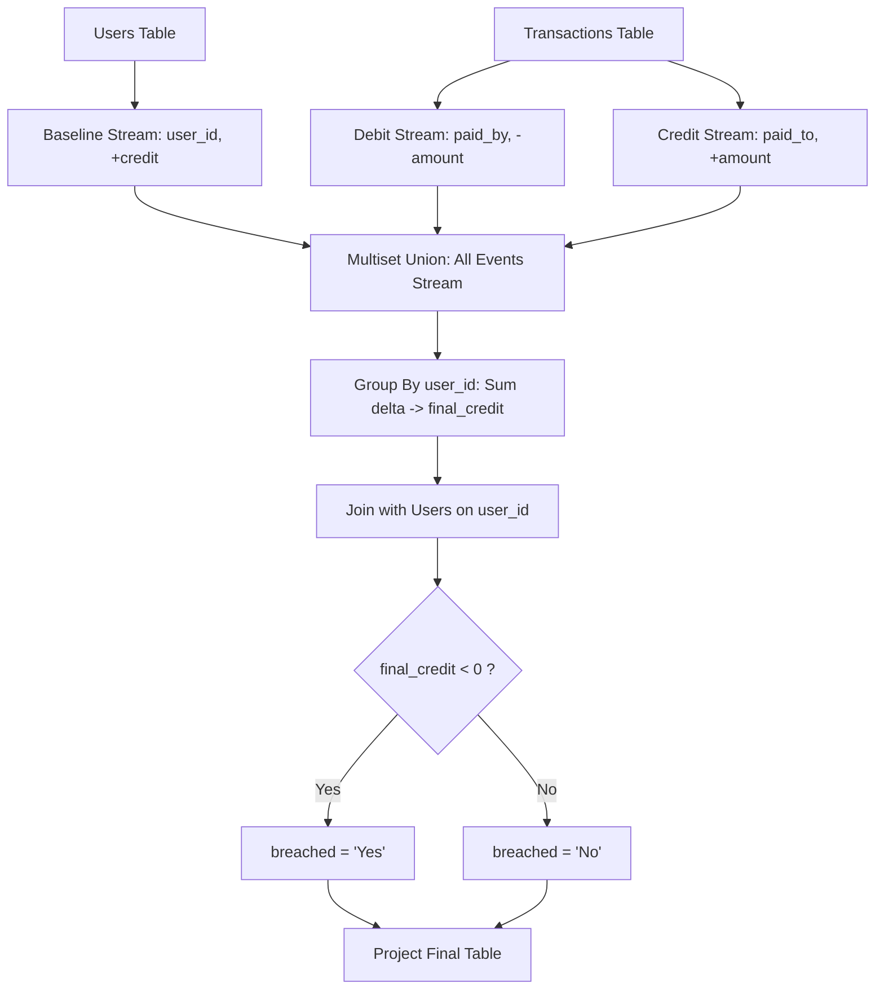

# Guided Example: Bank Account Summary

## 1. Instance & Teaching Goal

We are given two relational entities:
1. $\text{Users}(\text{user\_id}, \text{user\_name}, \text{credit})$ recording each customer's initial starting balance.
2. $\text{Transactions}(\text{trans\_id}, \text{paid\_by}, \text{paid\_to}, \text{amount}, \text{transacted\_on})$ recording bilateral payments where $\text{amount}$ is debited from $\text{paid\_by}$ and credited to $\text{paid\_to}$.

Our objective is to compute the net final balance for every user and flag whether their balance has fallen strictly below zero with the indicator $\text{"Yes"}$, or $\text{"No"}$ otherwise. Users with zero transactions must retain their starting credit without omission.

We select the standard banking ledger instance:
- **Relation $\text{Users}$**:
  - $(1, \text{"Moustafa"}, 100)$
  - $(2, \text{"Jonathan"}, 200)$
  - $(3, \text{"Winston"}, 10000)$
  - $(4, \text{"Luis"}, 800)$
- **Relation $\text{Transactions}$**:
  - $(1, 1, 3, 400, \text{"2020-08-01"})$
  - $(2, 3, 2, 500, \text{"2020-08-03"})$
  - $(3, 2, 1, 200, \text{"2020-08-03"})$

Our teaching goal is to model credit adjustment through unified multiset event stream aggregation. Instead of attempting brittle dual left joins or correlated subqueries, we decompose transfers into symmetric signed delta events, take their multiset union with starting balances, and evaluate grouped sum aggregations over relational partitions.

## 2. Conceptual Foundation & Invariants

Each financial transaction $(t, p_{\text{out}}, p_{\text{in}}, A)$ represents two simultaneous signed delta flows:
1. A debit stream: $\Delta(p_{\text{out}}) = -A$.
2. A credit stream: $\Delta(p_{\text{in}}) = +A$.

Meanwhile, each customer record in $\text{Users}(u, \text{name}, C_{\text{init}})$ contributes a baseline credit event:
3. A base credit stream: $\Delta(u) = +C_{\text{init}}$.

```
+--------------------------------------------------------------------------+
|                  RELATIONAL DELTA-STREAM CONSOLIDATION                   |
|                                                                          |
| Base Events:     T_base = Project(user_id, credit -> delta, Users)       |
| Debit Events:    T_out  = Project(paid_by -> user_id, -amount -> delta)  |
| Credit Events:   T_in   = Project(paid_to -> user_id, +amount -> delta)  |
|                                                                          |
| Disjoint Stream: T_all  = T_base UnionAll T_out UnionAll T_in            |
| Group Sum:       R_agg  = GroupBy(user_id, sum(delta) -> credit, T_all) |
| Entity Link:     R_full = R_agg InnerJoin Users on user_id               |
| Projection:      credit_limit_breached = IF(credit < 0, "Yes", "No")     |
+--------------------------------------------------------------------------+
```

### Formal Relational Algebra Formulation

Let the signed event streams be defined as:
$$T_{\text{base}} = \Pi_{\text{user\_id}, \text{credit} \to \Delta}(\text{Users})$$
$$T_{\text{out}} = \Pi_{\text{paid\_by} \to \text{user\_id}, -\text{amount} \to \Delta}(\text{Transactions})$$
$$T_{\text{in}} = \Pi_{\text{paid\_to} \to \text{user\_id}, \text{amount} \to \Delta}(\text{Transactions})$$

The unified multiset event stream is:
$$U_{\text{stream}} = T_{\text{base}} \cup_{\text{all}} T_{\text{out}} \cup_{\text{all}} T_{\text{in}}$$

The final balance per user is obtained via relational group aggregation and joined back to retrieve metadata:
$$R_{\text{agg}} = \gamma_{\text{user\_id}, \sum(\Delta) \to \text{credit}}(U_{\text{stream}})$$
$$R_{\text{result}} = \Pi_{\text{user\_id}, \text{user\_name}, \text{credit}, \text{CASE}(\text{credit} < 0, \text{"Yes"}, \text{"No"}) \to \text{credit\_limit\_breached}}(R_{\text{agg}} \bowtie_{\text{user\_id}} \text{Users})$$

### State Parameter Reference

| Parameter | Type | Domain | Semantics in Relational Pipeline |
|---|---|---|---|
| $\text{user\_id}$ | Integer | Key space of Users | Primary identification key of the account holder |
| $\text{user\_name}$ | String | Text | Descriptive label of the account holder |
| $C_{\text{init}}$ | Integer | $\ge 0$ | Initial account balance from $\text{Users}$ |
| $A$ | Integer | $> 0$ | Transfer magnitude from $\text{Transactions}$ |
| $\Delta$ | Integer | Negative, zero, or positive | Signed balance perturbation |
| $\text{final\_credit}$ | Integer | All Integers | Result of evaluating $C_{\text{init}} + \sum \Delta_{\text{in}} - \sum \Delta_{\text{out}}$ |
| $\text{breached}$ | Enum | $\{\text{"Yes"}, \text{"No"}\}$ | Binary indicator strictly evaluated as $\text{final\_credit} < 0$ |

> [!IMPORTANT]
> **Zero-Conservation Invariant**:
> For every transaction in $\text{Transactions}$, the sum of deltas added to $U_{\text{stream}}$ is strictly zero: $(-A) + (+A) = 0$. Consequently, the total sum of all user balances across the entire bank remains invariant and equals the exact sum of all initial baseline credits:
> $$\sum_{u \in \text{Users}} \text{final\_credit}(u) = \sum_{u \in \text{Users}} C_{\text{init}}(u)$$
> Individual user accounts fluctuate, but no credit is created or destroyed.



## 3. Step-by-Step Worked Execution

### Step 1: Extract Baseline Credit Events ($T_{\text{base}}$)
From the $4$ rows in $\text{Users}$:
- User $1$: $\Delta = +100$
- User $2$: $\Delta = +200$
- User $3$: $\Delta = +10000$
- User $4$: $\Delta = +800$

### Step 2: Extract Debit Events ($T_{\text{out}}$)
From the $3$ rows in $\text{Transactions}$:
- $\text{trans\_id} = 1$: $\text{paid\_by} = 1 \implies \text{User } 1, \Delta = -400$
- $\text{trans\_id} = 2$: $\text{paid\_by} = 3 \implies \text{User } 3, \Delta = -500$
- $\text{trans\_id} = 3$: $\text{paid\_by} = 2 \implies \text{User } 2, \Delta = -200$

### Step 3: Extract Credit Events ($T_{\text{in}}$)
From the $3$ rows in $\text{Transactions}$:
- $\text{trans\_id} = 1$: $\text{paid\_to} = 3 \implies \text{User } 3, \Delta = +400$
- $\text{trans\_id} = 2$: $\text{paid\_to} = 2 \implies \text{User } 2, \Delta = +500$
- $\text{trans\_id} = 3$: $\text{paid\_to} = 1 \implies \text{User } 1, \Delta = +200$

### Step 4: Partition and Aggregate by $\text{user\_id}$

We group all $10$ events by account identifier:

- **Partition $\text{user\_id} = 1$ (Moustafa)**:
  - Base credit: $+100$
  - Paid out: $-400$
  - Received: $+200$
  - Aggregated sum: $100 - 400 + 200 = -100$.
  - Threshold check: $-100 < 0$ is true $\implies \text{credit\_limit\_breached} = \text{"Yes"}$.

- **Partition $\text{user\_id} = 2$ (Jonathan)**:
  - Base credit: $+200$
  - Paid out: $-200$
  - Received: $+500$
  - Aggregated sum: $200 - 200 + 500 = 500$.
  - Threshold check: $500 < 0$ is false $\implies \text{credit\_limit\_breached} = \text{"No"}$.

- **Partition $\text{user\_id} = 3$ (Winston)**:
  - Base credit: $+10000$
  - Paid out: $-500$
  - Received: $+400$
  - Aggregated sum: $10000 - 500 + 400 = 9900$.
  - Threshold check: $9900 < 0$ is false $\implies \text{credit\_limit\_breached} = \text{"No"}$.

- **Partition $\text{user\_id} = 4$ (Luis)**:
  - Base credit: $+800$
  - Paid out: none ($0$)
  - Received: none ($0$)
  - Aggregated sum: $800$.
  - Threshold check: $800 < 0$ is false $\implies \text{credit\_limit\_breached} = \text{"No"}$.

## 4. Complete Execution Trace

The table below traces each user partition through initial credit, all debit and credit adjustments, final balance calculation, and breach classification.

| Account ID | User Name | Initial $C_{\text{init}}$ | Debits $\sum \Delta_{\text{out}}$ | Credits $\sum \Delta_{\text{in}}$ | Calculation Steps | Final Credit | Condition $(\text{Credit} < 0)$ | Breach Flag |
|---|---|---|---|---|---|---|---|---|
| 1 | Moustafa | $100$ | $-400$ | $+200$ | $100 - 400 + 200$ | $-100$ | True | $\text{"Yes"}$ |
| 2 | Jonathan | $200$ | $-200$ | $+500$ | $200 - 200 + 500$ | $500$ | False | $\text{"No"}$ |
| 3 | Winston | $10000$ | $-500$ | $+400$ | $10000 - 500 + 400$ | $9900$ | False | $\text{"No"}$ |
| 4 | Luis | $800$ | $0$ | $0$ | $800 + 0 + 0$ | $800$ | False | $\text{"No"}$ |

### Validation of Total Ledger Sum

- Sum of initial balances: $100 + 200 + 10000 + 800 = 11100$.
- Sum of final balances: $(-100) + 500 + 9900 + 800 = 11100$.
Conservation holds with exact zero deviation.

## 5. Algorithmic Correctness

### Soundness

The requirement asks for each user's net balance:
$$\text{credit}(u) = C_{\text{init}}(u) + \sum_{t \in \text{In}(u)} \text{amount}(t) - \sum_{t \in \text{Out}(u)} \text{amount}(t)$$
In our relational stream $U_{\text{stream}}$:
- Exactly one row with $\Delta = C_{\text{init}}(u)$ originates from $T_{\text{base}}$ because $\text{user\_id}$ is the primary key of $\text{Users}$.
- For every transaction where user $u$ is the recipient, exactly one row with $\Delta = +\text{amount}(t)$ originates from $T_{\text{in}}$.
- For every transaction where user $u$ is the payer, exactly one row with $\Delta = -\text{amount}(t)$ originates from $T_{\text{out}}$.

Because multiset union preserves row multiplicities without deduplication, the linear summation operator $\sum(\Delta)$ partitioned by $\text{user\_id}$ computes the exact mathematical algebraic sum. Evaluating $\text{IF}(\text{credit} < 0, \text{"Yes"}, \text{"No"})$ applies the strictly negative inequality test mandated by the problem specification.

### Completeness

Suppose a user $u^*$ participates in zero transactions ($|\text{In}(u^*)| = 0$ and $|\text{Out}(u^*)| = 0$).
In models that rely solely on joining $\text{Transactions}$, such inactive users disappear from inner joins or produce $\text{NULL}$ values that require defensive null-coalescing logic.
Under our unified multiset union approach, $T_{\text{base}}$ unconditionally contains an entry $(u^*, C_{\text{init}}(u^*))$ for every single user registered in $\text{Users}$. Therefore, every user is guaranteed to have at least one record in $U_{\text{stream}}$, ensuring their group partition is non-empty and their final aggregated credit equals $C_{\text{init}}(u^*)$. No user is dropped or omitted.

## 6. Traps This Instance Exposes

1. **Dual Left Join Row Duplication (Cartesian Explosion)**:
   A frequent relational pitfall is attempting to join `Users` simultaneously with `Transactions` on `user_id = paid_by` and `user_id = paid_to`. When a user has $k_1$ outgoing payments and $k_2$ incoming payments, a direct multi-join generates $k_1 \times k_2$ cross-product rows, causing balance amounts to be multiplied erroneously. The multiset union ($T_{\text{base}} \cup_{\text{all}} T_{\text{out}} \cup_{\text{all}} T_{\text{in}}$) serializes events into a flat stream of $1 + k_1 + k_2$ rows, completely eliminating cross-product inflation.

2. **Null Accumulation on Inactive Users**:
   If separate subqueries sum incoming and outgoing transfers, users with no transactions will evaluate to $\text{NULL}$. In standard arithmetic, $\text{credit} - \text{NULL} = \text{NULL}$. Neglecting to wrap sums in zero-coalescing operators corrupts the balance of inactive users like Luis into $\text{NULL}$. By feeding initial credit directly as a baseline event in the union, the summation is never empty.

3. **Weak Inequality on Breach Condition**:
   A balance of exactly $0$ is not a breach; the rule strictly states a breach occurs only when the balance is strictly less than zero ($\text{credit} < 0$). Classifying $\le 0$ as a breach fails whenever an account finishes with balance $0$.

4. **Dropping Zero-Transaction Users**:
   Using an inner join against transactions drops all users who have not sent or received money. Every customer in the `Users` table must appear in the final summary.

## 7. Complexity Derivation

### Time Complexity

Let $u = |\text{Users}|$ and $t = |\text{Transactions}|$. Let $N = u + t$.
- Generating $T_{\text{base}}$ scans the $u$ rows of $\text{Users}$: $\mathcal{O}(u)$.
- Generating $T_{\text{out}}$ and $T_{\text{in}}$ scans the $t$ rows of $\text{Transactions}$: $\mathcal{O}(t)$.
- The multiset union concatenates $u + 2t$ rows: $\mathcal{O}(u + t)$.
- Grouping and aggregating $U_{\text{stream}}$ by $\text{user\_id}$ using hash-based aggregation processes each of the $u + 2t$ event records in $\mathcal{O}(1)$ average time: $\mathcal{O}(u + t)$.
- Joining the resulting $u$ aggregated balances back with $\text{Users}$ takes $\mathcal{O}(u)$ time via primary key hashing.

The total processing time is:
$$\mathcal{O}(u + t) = \mathcal{O}(N)$$
Linear in the combined size of the input relations.

### Auxiliary Space Complexity

- The multiset event stream $U_{\text{stream}}$ holds $u + 2t$ stream records.
- The hash aggregation table maintains $u$ partition accumulators, each storing a running balance for one customer.
- The output relation stores $u$ materialized tuples.

The auxiliary space complexity is:
$$\mathcal{O}(u + t) = \mathcal{O}(N)$$
Proportional to the input event volume.
