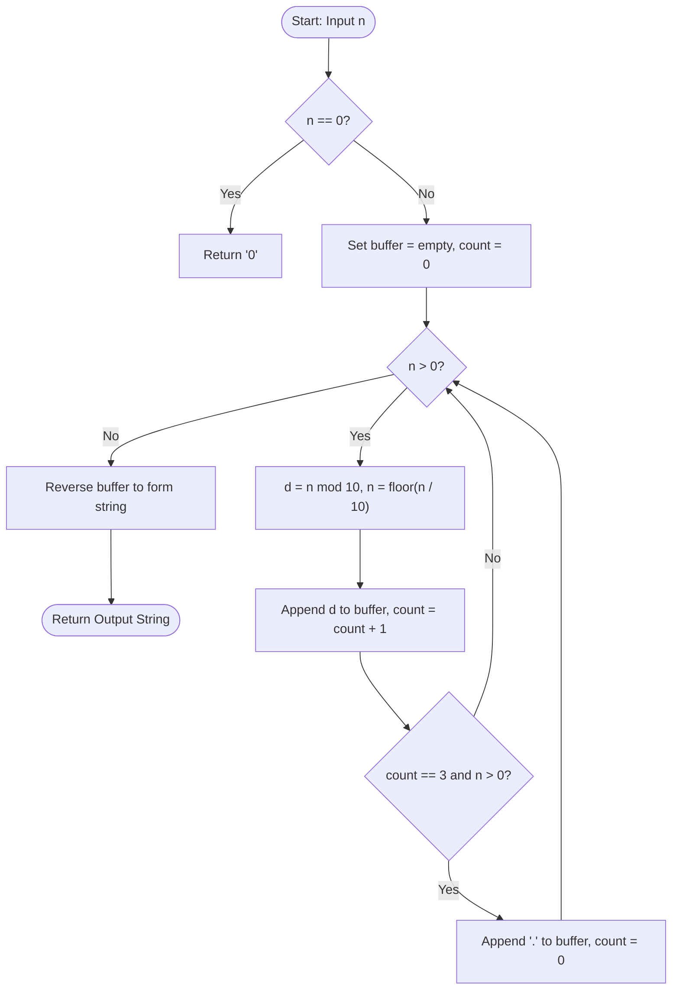

# Guided Example: Thousand Separator

## 1. Instance & Teaching Goal

We are given a non-negative integer $n$ ($0 \le n \le 2^{31} - 1$). We must return its standard decimal representation formatted with a period (`"."`) inserted every three digits from the right as a thousands separator.

We select the representative integer:
$$n = 1234567$$

The expected formatted output is:
$$\text{"1.234.567"}$$

Our teaching goal is to walk through the right-to-left decimal extraction algorithm using radix-10 integer arithmetic. We show how modular arithmetic isolates individual digits in least-significant to most-significant order, how a counter tracks three-digit groups to place separators, and why the termination condition must preempt separator insertion to prevent erroneous leading periods.

## 2. Conceptual Foundation & Invariants

Thousands separators group decimal digits into blocks of three, counted strictly from the rightmost (units) position. In a positional decimal system, repeated division by $10$ naturally yields digits in right-to-left order:
- Remainder $d = n \pmod{10}$ is the least significant remaining digit.
- Quotient $n' = \lfloor n / 10 \rfloor$ is the remaining prefix.

```
+-------------------------------------------------------------------------+
|                  DECIMAL EXTRACTION & TRIPLET GROUPING                  |
|                                                                         |
| Input:  n = 1234567                                                     |
|                                                                         |
| Extract units:      d = 7,  cnt = 1,  quotient = 123456                 |
| Extract tens:       d = 6,  cnt = 2,  quotient = 12345                  |
| Extract hundreds:   d = 5,  cnt = 3,  quotient = 1234  -> Insert '.'   |
| Extract thousands:  d = 4,  cnt = 1,  quotient = 123                    |
| Extract 10-thous:   d = 3,  cnt = 2,  quotient = 12                     |
| Extract 100-thous:  d = 2,  cnt = 3,  quotient = 1     -> Insert '.'   |
| Extract millions:   d = 1,  cnt = 1,  quotient = 0     -> Stop!         |
|                                                                         |
| Reversed buffer:    ['7', '6', '5', '.', '4', '3', '2', '.', '1']       |
| Inverted result:    "1.234.567"                                         |
+-------------------------------------------------------------------------+
```

### State Parameter Reference

| Parameter | Type | Domain | Purpose in State Machine |
|---|---|---|---|
| $n$ | Integer | $[0, 2^{31} - 1]$ | Active remaining numerical prefix |
| $d$ | Integer | $[0, 9]$ | Current least significant digit extracted via $n \pmod{10}$ |
| $\text{group\_count}$ | Integer | $[0, 3]$ | Number of digits accumulated in current right-to-left triplet |
| $\text{buffer}$ | Character List | Chars $\in \{'0'\dots'9', '.'\}$ | Reversed sequence of accumulated characters |
| $\text{output}$ | String | Formatted text | Final forward string produced by reversing $\text{buffer}$ |

> [!IMPORTANT]
> **Separator Invariant**:
> A separator period `"."` is appended to the backward accumulator if and only if the current triplet count reaches $3$ AND the remaining quotient $n$ is strictly greater than $0$. If $n = 0$, the most significant group is complete, and no leading dot may be introduced.



## 3. Step-by-Step Worked Execution

We trace the algorithm on $n = 1234567$ from an initial empty buffer $\text{buffer} = []$ and $\text{group\_count} = 0$.

### Extraction Cycle 1 (Units place)
- Compute digit: $d = 1234567 \pmod{10} = 7$.
- Update prefix: $n = \lfloor 1234567 / 10 \rfloor = 123456$.
- Append to buffer: $\text{buffer} = ['7']$.
- Increment count: $\text{group\_count} = 1$.
- Condition check: $\text{group\_count} = 1 < 3$. No separator.

### Extraction Cycle 2 (Tens place)
- Compute digit: $d = 123456 \pmod{10} = 6$.
- Update prefix: $n = \lfloor 123456 / 10 \rfloor = 12345$.
- Append to buffer: $\text{buffer} = ['7', '6']$.
- Increment count: $\text{group\_count} = 2$.
- Condition check: $\text{group\_count} = 2 < 3$. No separator.

### Extraction Cycle 3 (Hundreds place)
- Compute digit: $d = 12345 \pmod{10} = 5$.
- Update prefix: $n = \lfloor 12345 / 10 \rfloor = 1234$.
- Append to buffer: $\text{buffer} = ['7', '6', '5']$.
- Increment count: $\text{group\_count} = 3$.
- Condition check: $\text{group\_count} = 3$ and $n = 1234 > 0$. Both hold!
- Append separator `"."` and reset $\text{group\_count} = 0$:
  $\text{buffer} = ['7', '6', '5', '.']$.

### Extraction Cycle 4 (Thousands place)
- Compute digit: $d = 1234 \pmod{10} = 4$.
- Update prefix: $n = \lfloor 1234 / 10 \rfloor = 123$.
- Append to buffer: $\text{buffer} = ['7', '6', '5', '.', '4']$.
- Increment count: $\text{group\_count} = 1$.
- Condition check: $\text{group\_count} = 1 < 3$. No separator.

### Extraction Cycle 5 (Ten-thousands place)
- Compute digit: $d = 123 \pmod{10} = 3$.
- Update prefix: $n = \lfloor 123 / 10 \rfloor = 12$.
- Append to buffer: $\text{buffer} = ['7', '6', '5', '.', '4', '3']$.
- Increment count: $\text{group\_count} = 2$.
- Condition check: $\text{group\_count} = 2 < 3$. No separator.

### Extraction Cycle 6 (Hundred-thousands place)
- Compute digit: $d = 12 \pmod{10} = 2$.
- Update prefix: $n = \lfloor 12 / 10 \rfloor = 1$.
- Append to buffer: $\text{buffer} = ['7', '6', '5', '.', '4', '3', '2']$.
- Increment count: $\text{group\_count} = 3$.
- Condition check: $\text{group\_count} = 3$ and $n = 1 > 0$. Both hold!
- Append separator `"."` and reset $\text{group\_count} = 0$:
  $\text{buffer} = ['7', '6', '5', '.', '4', '3', '2', '.']$.

### Extraction Cycle 7 (Millions place)
- Compute digit: $d = 1 \pmod{10} = 1$.
- Update prefix: $n = \lfloor 1 / 10 \rfloor = 0$.
- Append to buffer: $\text{buffer} = ['7', '6', '5', '.', '4', '3', '2', '.', '1']$.
- Increment count: $\text{group\_count} = 1$.
- Loop condition: $n = 0$, iteration terminates. Notice that even if $\text{group\_count}$ were $3$, $n = 0$ forbids appending a separator.

### Final Inversion
- Invert buffer: reverse of `['7', '6', '5', '.', '4', '3', '2', '.', '1']` is:
  $$\text{"1.234.567"}$$

## 4. Complete Execution Trace

| Cycle | Active $n$ | Remainder $d$ | Next $n$ | Appended Char | Accumulator Buffer | Triplet Count | Separator Inserted? |
|---|---|---|---|---|---|---|---|
| Start | 1234567 | - | - | - | `[]` | 0 | - |
| 1 | 1234567 | 7 | 123456 | `'7'` | `['7']` | 1 | No ($1 < 3$) |
| 2 | 123456 | 6 | 12345 | `'6'` | `['7', '6']` | 2 | No ($2 < 3$) |
| 3 | 12345 | 5 | 1234 | `'5'` | `['7', '6', '5', '.']` | 0 (reset) | **Yes** (count was 3 and $n > 0$) |
| 4 | 1234 | 4 | 123 | `'4'` | `['7', '6', '5', '.', '4']` | 1 | No ($1 < 3$) |
| 5 | 123 | 3 | 12 | `'3'` | `['7', '6', '5', '.', '4', '3']` | 2 | No ($2 < 3$) |
| 6 | 12 | 2 | 1 | `'2'` | `['7', '6', '5', '.', '4', '3', '2', '.']` | 0 (reset) | **Yes** (count was 3 and $n > 0$) |
| 7 | 1 | 1 | 0 | `'1'` | `['7', '6', '5', '.', '4', '3', '2', '.', '1']` | 1 | No ($n = 0$, terminates) |
| Reversal | 0 | - | - | - | Final output string: `"1.234.567"` | - | Complete |

## 5. Algorithmic Correctness

### Soundness (Exact Triplet Formatting)

Let the decimal representation of $n > 0$ have length $L = \lfloor \log_{10} n \rfloor + 1$.
Indexing characters in standard 0-indexed left-to-right order as $c_0 c_1 \dots c_{L-1}$:
- The distance of digit $c_i$ from the right end of the number is $k = L - 1 - i$.
- Standard thousands separator rules place a separator immediately following $c_i$ if and only if $k > 0$ and $k \equiv 0 \pmod 3$.

Our extraction visits indices in decreasing order of $i$ (i.e. increasing order of $k = 0, 1, \dots, L-1$).
The counter $\text{group\_count}$ increases by $1$ with each digit $k$, resetting to $0$ upon reaching $3$. Therefore, $\text{group\_count} = 3$ occurs precisely when $k + 1 \equiv 0 \pmod 3$. The guard condition $n > 0$ ensures that $k < L - 1$, preventing any separator after the leftmost digit $c_0$. Inverting the buffer restores the original sequence order with separators situated at exactly every index satisfying $k > 0$ and $k \equiv 0 \pmod 3$. Thus, the formatting is sound.

### Completeness (Total Domain Coverage)

The domain of $n$ is $0 \le n \le 2^{31} - 1$:
- Case $n = 0$: Handled as a dedicated base case returning `"0"`.
- Case $n \in [1, 999]$: $L \le 3$. The loop executes at most $3$ times. When $L = 3$, $n$ becomes $0$ on the third cycle, so the condition $n > 0$ prevents any separator insertion, correctly outputting a 1-, 2-, or 3-digit string without dots.
- Case $L$ is a multiple of $3$ (e.g. $n = 123456$): After processing $456$, a dot is inserted because $n = 123 > 0$. After processing $123$, $n = 0$, terminating the loop without a leading dot, producing `"123.456"`.

All input integers are mapped to valid, correctly formatted strings without missing digits or malformed separators.

## 6. Traps This Instance Exposes

1. **Erroneous Leading Separator on Multiples of Three**:
   If the separator check is written simply as `if count == 3: insert '.'`, then an input whose total number of digits is a multiple of $3$ (such as $n = 123$) will append a period after digit $1$, yielding `".123"` after reversal. Checking $n > 0$ (or remaining quotient) before appending the separator prevents this flaw.

2. **Zero Handling in Division Loops**:
   A `while n > 0` loop fails completely on $n = 0$, producing an empty string `""` instead of `"0"`. An initial guard for $n = 0$ is mandatory.

3. **In-Place Left-to-Right String Insertion Overhead**:
   Converting $n$ to a string first and inserting dots from left to right using naive string concatenation creates a new string on each insertion, leading to quadratic memory copies $\mathcal{O}(L^2)$. Collecting characters in an array buffer and reversing at the end guarantees linear $\mathcal{O}(L)$ performance.

4. **Off-by-One in Left-to-Right Indexing**:
   When formatting from left to right, one must compute the offset of the first separator as $L \pmod 3$, with a special case when $L \pmod 3 = 0$. Extracting from right to left avoids this offset logic because the rightmost boundary is invariant: the first separator is always after the 3rd digit from the right.

## 7. Complexity Derivation

### Time Complexity

Let $L$ denote the number of decimal digits in $n$:
$$L = \begin{cases} 1 & \text{if } n = 0 \\ \lfloor \log_{10} n \rfloor + 1 & \text{if } n > 0 \end{cases}$$
For 32-bit signed integers, $L \le 10$ ($n \le 2\,147\,483\,647$).
- Division and modulo operations occur exactly $L$ times.
- The number of separators inserted is $\lfloor (L - 1) / 3 \rfloor \le 3$.
- Total characters appended to the buffer is $L + \lfloor (L - 1) / 3 \rfloor$.
- Reversing the buffer takes linear time in the number of characters.

Total time complexity is:
$$\mathcal{O}(L) = \mathcal{O}(\log_{10} n)$$
For any 32-bit integer, this requires at most $13$ character operations, which runs in $\mathcal{O}(1)$ time.

### Auxiliary Space Complexity

- The output buffer stores at most $L + \lfloor (L - 1) / 3 \rfloor \le 13$ characters.
- Integer registers $n, d, \text{group\_count}$ require $\mathcal{O}(1)$ scalar space.

Total auxiliary space complexity is:
$$\mathcal{O}(L) = \mathcal{O}(\log_{10} n)$$
Bounded by $13$ characters, strictly $\mathcal{O}(1)$ in practice.
