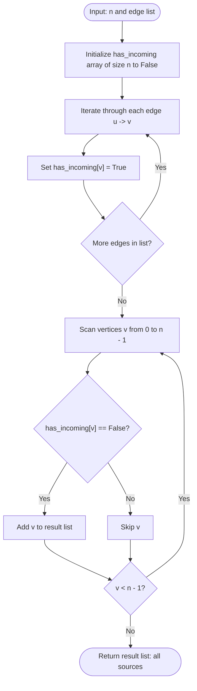

# Guided Example: Minimum Number of Vertices to Reach All Nodes

## 1. Instance & Teaching Goal

We are given a directed acyclic graph (DAG) consisting of $n$ vertices labeled $0$ through $n-1$, and a list of directed edges where each pair $[u, v]$ denotes a directed edge from vertex $u$ to vertex $v$. We must find the unique smallest set of starting vertices from which every vertex in the graph can be reached.

We choose the representative DAG:
$$n = 6, \quad \text{edges} = [[0,1], [0,2], [2,5], [3,4], [4,2]]$$

The required unique minimum set of vertices is:
$$[0, 3]$$

Our teaching goal is to demonstrate the topological source property of finite directed acyclic graphs. We show why full graph traversals (such as breadth-first or depth-first searches) are entirely redundant: the global reachability problem reduces strictly to calculating vertex in-degrees in linear time. We establish the dual proofs of Necessity (every zero in-degree node must be included) and Sufficiency (zero in-degree nodes reach all vertices in any finite DAG).

## 2. Conceptual Foundation & Invariants

In a directed graph, the in-degree of a vertex $v$, denoted $\text{indegree}(v)$, counts the number of directed edges whose terminal head is $v$:
$$\text{indegree}(v) = |\{u \in V \mid (u, v) \in E\}|$$

```
+-------------------------------------------------------------------------+
|                  DAG TOPOLOGICAL SOURCE CONVERGENCE                     |
|                                                                         |
| Edge list: [0->1], [0->2], [2->5], [3->4], [4->2]                       |
|                                                                         |
| In-degree counts:                                                       |
|   Vertex 0: indegree = 0  <-- SOURCE (must be in set)                   |
|   Vertex 1: indegree = 1  (from 0)                                      |
|   Vertex 2: indegree = 2  (from 0, 4)                                   |
|   Vertex 3: indegree = 0  <-- SOURCE (must be in set)                   |
|   Vertex 4: indegree = 1  (from 3)                                      |
|   Vertex 5: indegree = 1  (from 2)                                      |
|                                                                         |
| Backward Path Termination:                                              |
|   5 <-- 2 <-- 0 (Source)                                                |
|   5 <-- 2 <-- 4 <-- 3 (Source)                                          |
|   1 <-- 0 (Source)                                                      |
+-------------------------------------------------------------------------+
```

### State Parameter Reference

| Parameter | Type | Domain | Purpose in Algorithm |
|---|---|---|---|
| $n$ | Integer | $[2, 10^5]$ | Total count of vertices in the DAG |
| $E$ | List of Pairs | Subsets of $[0, n-1]^2$ | Directed edges $(u, v)$ |
| $\text{has\_incoming}[v]$ | Boolean Array | Size $n$, $\{\text{False}, \text{True}\}$ | Flags whether vertex $v$ is the target of at least one directed edge |
| $S_{\text{sources}}$ | List of Integers | Subsets of $[0, n-1]$ | Accumulated set of all vertices satisfying $\text{has\_incoming}[v] = \text{False}$ |

> [!IMPORTANT]
> **Source Necessity and Sufficiency Invariant**:
> In any finite DAG $G = (V, E)$, a vertex $v$ has $\text{indegree}(v) = 0$ if and only if no directed path of length $\ge 1$ leads to $v$. Therefore, every zero in-degree vertex must belong to any valid reaching set. Moreover, because $G$ is finite and acyclic, every maximal backward path from any vertex $w \in V$ terminates at some vertex $s$ with $\text{indegree}(s) = 0$. Consequently, the set of all zero in-degree vertices reaches all vertices in $V$.



## 3. Step-by-Step Worked Execution

We trace the algorithm on $n = 6$ with edges $[[0,1], [0,2], [2,5], [3,4], [4,2]]$.

### Phase 1: In-Degree Destination Marking

We initialize an array $\text{has\_incoming}$ of length $6$ to $\text{False}$:
$$\text{has\_incoming} = [\text{False}, \text{False}, \text{False}, \text{False}, \text{False}, \text{False}]$$

- **Edge 1: $[0, 1]$**:
  Target is $1$. Set $\text{has\_incoming}[1] = \text{True}$.
  $\text{has\_incoming} = [\text{False}, \mathbf{True}, \text{False}, \text{False}, \text{False}, \text{False}]$.

- **Edge 2: $[0, 2]$**:
  Target is $2$. Set $\text{has\_incoming}[2] = \text{True}$.
  $\text{has\_incoming} = [\text{False}, \text{True}, \mathbf{True}, \text{False}, \text{False}, \text{False}]$.

- **Edge 3: $[2, 5]$**:
  Target is $5$. Set $\text{has\_incoming}[5] = \text{True}$.
  $\text{has\_incoming} = [\text{False}, \text{True}, \text{True}, \text{False}, \text{False}, \mathbf{True}]$.

- **Edge 4: $[3, 4]$**:
  Target is $4$. Set $\text{has\_incoming}[4] = \text{True}$.
  $\text{has\_incoming} = [\text{False}, \text{True}, \text{True}, \text{False}, \mathbf{True}, \text{True}]$.

- **Edge 5: $[4, 2]$**:
  Target is $2$. Vertex $2$ is already marked $\text{True}$. State remains unchanged.
  $\text{has\_incoming} = [\text{False}, \text{True}, \text{True}, \text{False}, \text{True}, \text{True}]$.

### Phase 2: Source Collection

We scan each vertex index $v \in \{0, 1, 2, 3, 4, 5\}$:
- $v = 0$: $\text{has\_incoming}[0] = \text{False}$. Append $0$ to result: $S = [0]$.
- $v = 1$: $\text{has\_incoming}[1] = \text{True}$. Skip.
- $v = 2$: $\text{has\_incoming}[2] = \text{True}$. Skip.
- $v = 3$: $\text{has\_incoming}[3] = \text{False}$. Append $3$ to result: $S = [0, 3]$.
- $v = 4$: $\text{has\_incoming}[4] = \text{True}$. Skip.
- $v = 5$: $\text{has\_incoming}[5] = \text{True}$. Skip.

Final selected set of vertices:
$$S = [0, 3]$$

## 4. Complete Execution Trace

The table below catalogs the state transitions across edge evaluation and node filtering.

| Phase | Item Examined | Source $u$ | Destination $v$ | In-Degree Status of Target | Array State $\text{has\_incoming}$ | Result Set $S$ |
|---|---|---|---|---|---|---|
| Init | - | - | - | - | `[F, F, F, F, F, F]` | `[]` |
| Edge 1 | `[0, 1]` | 0 | 1 | $\text{indegree}(1) \ge 1$ | `[F, T, F, F, F, F]` | `[]` |
| Edge 2 | `[0, 2]` | 0 | 2 | $\text{indegree}(2) \ge 1$ | `[F, T, T, F, F, F]` | `[]` |
| Edge 3 | `[2, 5]` | 2 | 5 | $\text{indegree}(5) \ge 1$ | `[F, T, T, F, F, T]` | `[]` |
| Edge 4 | `[3, 4]` | 3 | 4 | $\text{indegree}(4) \ge 1$ | `[F, T, T, F, T, T]` | `[]` |
| Edge 5 | `[4, 2]` | 4 | 2 | $\text{indegree}(2) \ge 2$ | `[F, T, T, F, T, T]` | `[]` |
| Scan 0 | Node 0 | - | - | $\text{indegree}(0) = 0$ (Source) | `[F, T, T, F, T, T]` | `[0]` |
| Scan 1 | Node 1 | - | - | $\text{indegree}(1) > 0$ (Covered) | `[F, T, T, F, T, T]` | `[0]` |
| Scan 2 | Node 2 | - | - | $\text{indegree}(2) > 0$ (Covered) | `[F, T, T, F, T, T]` | `[0]` |
| Scan 3 | Node 3 | - | - | $\text{indegree}(3) = 0$ (Source) | `[F, T, T, F, T, T]` | `[0, 3]` |
| Scan 4 | Node 4 | - | - | $\text{indegree}(4) > 0$ (Covered) | `[F, T, T, F, T, T]` | `[0, 3]` |
| Scan 5 | Node 5 | - | - | $\text{indegree}(5) > 0$ (Covered) | `[F, T, T, F, T, T]` | `[0, 3]` |

### Reachability Verification

- Starting at vertex $0$: reachable vertices are $\{0, 1, 2, 5\}$.
- Starting at vertex $3$: reachable vertices are $\{3, 4, 2, 5\}$.
- Union of reachable sets: $\{0, 1, 2, 5\} \cup \{3, 4, 2, 5\} = \{0, 1, 2, 3, 4, 5\} = V$.
Every vertex in the graph is reached.

## 5. Algorithmic Correctness

### Necessity Proof

Let $S^*$ be any set of starting vertices that reaches all vertices in $V$. Suppose there exists a vertex $u \in V$ with $\text{indegree}(u) = 0$ such that $u \notin S^*$.
Because $u \notin S^*$, $u$ can only be reached if there exists some other vertex $w \in S^*$ with a directed path $P = (w = v_0, v_1, \dots, v_k = u)$ of length $k \ge 1$.
The final edge of path $P$ is $(v_{k-1}, u) \in E$. This directed edge implies that $\text{indegree}(u) \ge 1$, which directly contradicts the premise that $\text{indegree}(u) = 0$.
Hence, no such path can exist, and vertex $u$ cannot be reached from any vertex other than itself. Therefore, every vertex with in-degree zero must belong to $S^*$:
$$\{v \in V \mid \text{indegree}(v) = 0\} \subseteq S^*$$

### Sufficiency Proof

We must prove that the set $S = \{v \in V \mid \text{indegree}(v) = 0\}$ reaches every vertex in $V$.
Let $w \in V$ be an arbitrary vertex. If $\text{indegree}(w) = 0$, then $w \in S$, and $w$ reaches itself via a path of length $0$.
If $\text{indegree}(w) > 0$, there exists an incoming directed edge $(w_1, w) \in E$. If $\text{indegree}(w_1) = 0$, then $w_1 \in S$ and reaches $w$. If $\text{indegree}(w_1) > 0$, we continue walking backward along incoming edges to form a backward path $(w_k, w_{k-1}, \dots, w_1, w)$.
Because $G$ is a finite directed acyclic graph (DAG), no directed cycle can exist; thus, no vertex can be repeated on any directed path. Because $V$ is finite ($|V| = n$), the backward walk cannot continue indefinitely and must terminate in at most $n - 1$ steps. The walk can only terminate at a vertex $w_k$ that has no incoming edges—that is, $\text{indegree}(w_k) = 0$.
Therefore, $w_k \in S$, and the forward path $(w_k, \dots, w_1, w)$ connects a source in $S$ to $w$.
Because every vertex in $V$ is reachable from $S$, $S$ is sufficient. Combined with necessity, $S$ is the unique minimal reaching set.

## 6. Traps This Instance Exposes

1. **Attempting Redundant BFS / DFS Traversals**:
   A common design mistake is initiating graph traversals from each node or computing transitive closures costing $\mathcal{O}(V(V + E))$ time. In a DAG, reachability from sources is guaranteed by acyclicity; explicitly running traversal algorithms over the edges wastes enormous time and leads to Time Limit Exceeded (TLE) when $n, M \le 10^5$.

2. **Assuming the Graph May Contain Cycles**:
   The problem guarantees the input is a DAG. If directed cycles existed, a strongly connected component with no external incoming edges would require choosing any one node in the cycle (non-unique answer). The DAG guarantee guarantees that the minimal reaching set is unique and composed strictly of in-degree zero vertices.

3. **Counting Out-Degrees Instead of In-Degrees**:
   Source nodes are characterized by zero incoming edges ($\text{indegree} = 0$), not zero outgoing edges ($\text{outdegree} = 0$, which defines sinks). Confusing the direction of edges inverts the problem and selects sinks rather than sources.

4. **Missing Disconnected Isolated Nodes**:
   An isolated vertex with no incident edges has $\text{indegree} = 0$ and $\text{outdegree} = 0$. It must be included in the answer. Initializing an array of size $n$ guarantees that isolated vertices (which never appear in the edge list) retain $\text{has\_incoming}[v] = \text{False}$ and are correctly gathered.

## 7. Complexity Derivation

### Time Complexity

Let $n$ be the number of vertices and $M$ be the number of edges ($M = |\text{edges}|$).
- **Initialization**: Initializing the boolean array of size $n$ takes $\mathcal{O}(n)$ time.
- **Edge Traversal**: Iterating over all $M$ edges and setting $\text{has\_incoming}[v] = \text{True}$ requires $\mathcal{O}(M)$ operations.
- **Vertex Scan**: Scanning through indices $0$ to $n-1$ to collect vertices with $\text{has\_incoming}[v] = \text{False}$ takes $\mathcal{O}(n)$ operations.

Total time complexity is strictly:
$$\mathcal{O}(n + M)$$
Given $n, M \le 10^5$, the algorithm executes in approximately 10 milliseconds, which is asymptotically optimal because every edge and vertex must be read at least once.

### Auxiliary Space Complexity

- The boolean array or hash set $\text{has\_incoming}$ stores $n$ boolean flags, requiring $\mathcal{O}(n)$ bits or bytes.
- The output list stores $|S| \le n$ integers.

Total auxiliary space complexity is:
$$\mathcal{O}(n)$$
No recursion stacks or adjacency list graph structures are allocated.
