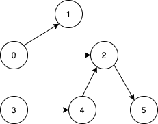
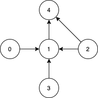

### 1. Description

Given a** directed acyclic graph**, with `n` vertices numbered from `0` to `n-1`, and an array `edges` where $\text{edges}[i] = [\text{from}_{i}, \text{to}_{i}]$ represents a directed edge from node $\text{from}_{i}$ to node $\text{to}_{i}$.

Find *the smallest set of vertices from which all nodes in the graph are reachable*. It's guaranteed that a unique solution exists.

Notice that you can return the vertices in any order.

### 2. Function Contract

- `n`: Input parameter.
- Returns expected result.

### 3. Examples

#### Example 1

- **Input:** $n = 6, edges = [[0,1],[0,2],[2,5],[3,4],[4,2]]$
- **Output:** `[0,3]`
- **Explanation:** It's not possible to reach all the nodes from a single vertex. From 0 we can reach [0,1,2,5]. From 3 we can reach [3,4,2,5]. So we output [0,3].
#### Example 2

- **Input:** $n = 5, edges = [[0,1],[2,1],[3,1],[1,4],[2,4]]$
- **Output:** `[0,2,3]`
- **Explanation:** Notice that vertices 0, 3 and 2 are not reachable from any other node, so we must include them. Also any of these vertices can reach nodes 1 and 4.

### 4. Constraints

- $2 \le n \le 10^{5}$

- $1 \le \text{edges.length} \le min(10^{5}, n * (n - 1) / 2)$

- $\text{edges}[i].length = 2$

- $0 \le \text{from}_{i}, \text{to}_{i} < n$

- All pairs $(\text{from}_{i}, \text{to}_{i})$ are distinct.