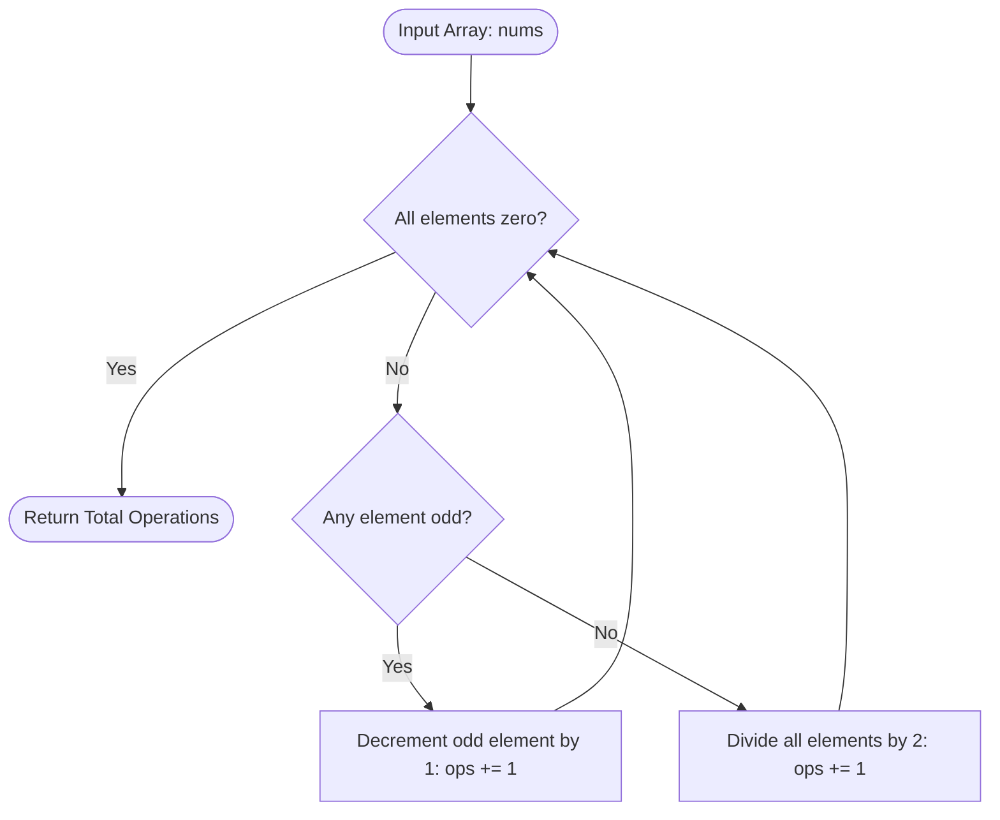

# Guided Example: Minimum Numbers of Function Calls to Make Target Array

## 1. Instance & Teaching Goal

We are given an integer array $\text{nums}$ of size $N$. Starting with an array of identical size initialized entirely with zeros, we may apply two operations:
- **Operation 0 (Increment)**: Choose any single index $i$ and increase $\text{nums}[i]$ by $1$.
- **Operation 1 (Double)**: Multiply every element in the array by $2$ simultaneously.

We seek the minimum total number of function calls needed to produce $\text{nums}$.

We select the representative instance:
$$\text{nums} = [4, 2, 5]$$

The minimum number of operations is:
$$6$$

Our teaching goal is to demonstrate the power of time-reversal analysis in greedy algorithms. Instead of searching a massive forward branching tree from $[0, 0, 0]$, we invert the process: reducing $\text{nums}$ to $[0, 0, 0]$ using decrements (when an element is odd) and global halving (when all elements are even). We reveal how binary bit representations directly yield the optimal operation counts without simulation.

## 2. Conceptual Foundation & Invariants

In reverse:
1. If an element $x \in \text{nums}$ is odd, the least significant bit (LSB) of $x$ is $1$. No global halving can be performed because division by $2$ requires integer values. Therefore, subtracting $1$ from $x$ is mandatory. Each subtraction clears exactly one set bit.
2. When all elements in the array are even, a global halving operation divides every entry by $2$, right-shifting each binary number by $1$ bit: $x \leftarrow \lfloor x / 2 \rfloor$.

```
+-------------------------------------------------------------------------+
|                  TIME-REVERSAL BIT DECOMPOSITION                        |
|                                                                         |
| Array element: x = sum_{k=0}^{B-1} b_k * 2^k                            |
|                                                                         |
| Decrement operations (Operation 0):                                     |
|   Each set bit (b_k = 1) across all elements requires exactly one       |
|   subtraction when it reaches the units place (LSB).                    |
|   Total subtractions = sum_{x in nums} popcount(x)                      |
|                                                                         |
| Global Halving operations (Operation 1):                                |
|   Each halving right-shifts all elements simultaneously.                |
|   Total halvings = max_{x in nums} (bit_length(x) - 1)  [if max > 0]   |
|                                                                         |
| Total Minimum Calls = Total Subtractions + Total Halvings              |
+-------------------------------------------------------------------------+
```

### Binary Representation Breakdown for $[4, 2, 5]$

| Element | Decimal | Binary | Set Bits ($\text{popcount}$) | Bit Length | Halvings Needed |
|---|---|---|---|---|---|
| $\text{nums}[0]$ | 4 | $100_2$ | 1 | 3 | 2 |
| $\text{nums}[1]$ | 2 | $010_2$ | 1 | 2 | 1 |
| $\text{nums}[2]$ | 5 | $101_2$ | 2 | 3 | 2 |
| **Aggregate** | - | - | **Sum = 4** | **Max = 3** | **Max = 2** |

### State Parameter Reference

| Parameter | Type | Domain | Semantics in Inverted State Machine |
|---|---|---|---|
| $A$ | Integer Array | Non-negative integers | Current intermediate array being reduced toward all zeros |
| $\text{odd\_count}$ | Integer | $[0, N]$ | Count of elements in $A$ with $A[i] \pmod 2 = 1$ |
| $\text{subtractions}$ | Integer | Non-negative | Cumulative single-element decrements executed |
| $\text{divisions}$ | Integer | Non-negative | Cumulative global divide-by-2 operations executed |
| $\max(A)$ | Integer | Non-negative | Peak value in active array, dictating remaining halving depth |

> [!IMPORTANT]
> **Greedy Priority Invariant**:
> In the reverse reduction, global halving cannot be legally executed whenever any element is odd. Therefore, decrementing all odd elements to the nearest even number is strictly necessary and uniquely optimal before each division step. Because halving reduces all elements simultaneously, the total number of divisions is strictly determined by the maximum element in the initial array.



## 3. Step-by-Step Worked Execution

We trace the reverse reduction from $[4, 2, 5]$ to $[0, 0, 0]$ step by step.

### Step 1: Evaluate Array $[4, 2, 5]$
- Elements are: $\text{nums}[0] = 4$ (even), $\text{nums}[1] = 2$ (even), $\text{nums}[2] = 5$ (odd).
- An odd element exists at index $2$.
- **Action**: Decrement $\text{nums}[2]$ by $1$.
- New state: $[4, 2, 4]$.
- Operations count: $1$ decrement, $0$ divisions. Total = $1$.

### Step 2: Evaluate Array $[4, 2, 4]$
- All elements are even: $4, 2, 4$. Not all are zero.
- **Action**: Global divide-by-2 on all elements.
- New state: $[\lfloor 4/2 \rfloor, \lfloor 2/2 \rfloor, \lfloor 4/2 \rfloor] = [2, 1, 2]$.
- Operations count: $1$ decrement, $1$ division. Total = $2$.

### Step 3: Evaluate Array $[2, 1, 2]$
- Elements are: $\text{nums}[0] = 2$ (even), $\text{nums}[1] = 1$ (odd), $\text{nums}[2] = 2$ (even).
- An odd element exists at index $1$.
- **Action**: Decrement $\text{nums}[1]$ by $1$.
- New state: $[2, 0, 2]$.
- Operations count: $2$ decrements, $1$ division. Total = $3$.

### Step 4: Evaluate Array $[2, 0, 2]$
- All elements are even: $2, 0, 2$. Not all are zero.
- **Action**: Global divide-by-2 on all elements.
- New state: $[\lfloor 2/2 \rfloor, \lfloor 0/2 \rfloor, \lfloor 2/2 \rfloor] = [1, 0, 1]$.
- Operations count: $2$ decrements, $2$ divisions. Total = $4$.

### Step 5: Evaluate Array $[1, 0, 1]$
- Odd elements exist at indices $0$ and $2$.
- **Action A**: Decrement $\text{nums}[0]$ by $1 \implies [0, 0, 1]$.
- Operations count: $3$ decrements, $2$ divisions. Total = $5$.
- **Action B**: Decrement $\text{nums}[2]$ by $1 \implies [0, 0, 0]$.
- Operations count: $4$ decrements, $2$ divisions. Total = $6$.

### Step 6: Termination
- Array is $[0, 0, 0]$. All entries are zero.
- Total function calls required: $4 + 2 = 6$.

## 4. Complete Execution Trace

The table below catalogs each step of the reduction from target to all zeros.

| Step | Current Array State | Trigger Condition | Operation Applied | Modified Index | Resulting Array | Cumulative Subtractions | Cumulative Divisions | Cumulative Total Calls |
|---|---|---|---|---|---|---|---|---|
| Start | `[4, 2, 5]` | Initial input | - | - | `[4, 2, 5]` | 0 | 0 | 0 |
| 1 | `[4, 2, 5]` | Index 2 is odd (5) | Decrement | 2 | `[4, 2, 4]` | 1 | 0 | 1 |
| 2 | `[4, 2, 4]` | All elements even | Global Halving | All | `[2, 1, 2]` | 1 | 1 | 2 |
| 3 | `[2, 1, 2]` | Index 1 is odd (1) | Decrement | 1 | `[2, 0, 2]` | 2 | 1 | 3 |
| 4 | `[2, 0, 2]` | All elements even | Global Halving | All | `[1, 0, 1]` | 2 | 2 | 4 |
| 5 | `[1, 0, 1]` | Index 0 is odd (1) | Decrement | 0 | `[0, 0, 1]` | 3 | 2 | 5 |
| 6 | `[0, 0, 1]` | Index 2 is odd (1) | Decrement | 2 | `[0, 0, 0]` | 4 | 2 | **6** |
| Finish | `[0, 0, 0]` | All zeros | Complete | - | `[0, 0, 0]` | 4 | 2 | 6 |

### Forward Reconstruction Verification

Reversing the reverse steps produces the optimal forward sequence:
1. `[0, 0, 0]` $\to$ Increment index 2: `[0, 0, 1]`
2. `[0, 0, 1]` $\to$ Increment index 0: `[1, 0, 1]`
3. `[1, 0, 1]` $\to$ Double all: `[2, 0, 2]`
4. `[2, 0, 2]` $\to$ Increment index 1: `[2, 1, 2]`
5. `[2, 1, 2]` $\to$ Double all: `[4, 2, 4]`
6. `[4, 2, 4]` $\to$ Increment index 2: `[4, 2, 5]`
Total calls: $6$. Every intermediate state is non-negative and valid.

## 5. Algorithmic Correctness

### Soundness (Exactness of Closed-Form Formula)

In any valid forward sequence generating $\text{nums}$, every number $x \in \text{nums}$ is formed from $0$ through additions of $1$ and multiplications by $2$.
Algebraically, multiplying by $2$ shifts the current binary representation left by $1$ bit (appending $0$), while adding $1$ toggles the least significant bit from $0$ to $1$.
- Any bit position $k$ where the $k$-th bit of $x$ is $1$ must have been created by an addition of $1$ when that bit was in the units position, followed by $k$ subsequent global multiplications.
- Since additions of $1$ modify only one array entry at a time, each $1$-bit in the binary representation of every element $x \in \text{nums}$ requires a distinct addition call. Thus:
  $$\text{Total Additions} = \sum_{x \in \text{nums}} \text{popcount}(x)$$
- Global multiplications multiply the entire array simultaneously. To reach a value $M = \max(\text{nums})$, the number must be shifted left until its most significant bit reaches position $\lfloor \log_2 M \rfloor = \text{bit\_length}(M) - 1$. Since multiplication is global, smaller elements simply undergo the same multiplications (starting from zero until their own highest bit is seeded). Thus:
  $$\text{Total Multiplications} = \max(0, \text{bit\_length}(\max(\text{nums})) - 1)$$

Since addition operations cannot be shared across array positions, and multiplication operations cannot exceed the shift requirement of the maximum element, the sum of these two terms is a strict lower bound. The step-by-step reverse construction proves this lower bound is always achievable.

### Completeness (Boundary Invariance)

If $\text{nums}$ contains only zeros (e.g., $[0, 0, 0]$):
- $\text{popcount}(0) = 0$ for all elements, so $\text{Total Additions} = 0$.
- $\max(\text{nums}) = 0$, so $\max(0, \text{bit\_length}(0) - 1) = \max(0, -1) = 0$.
- The formula evaluates to $0 + 0 = 0$, which matches the fact that the initial zero array requires zero calls.

If $\text{nums}$ contains large values up to $10^9$:
- $10^9 < 2^{30}$, so bit length is at most $30$.
- The total multiplications cannot exceed $29$, and additions cannot exceed $30 \cdot 10^5$. All calculations remain well within 32-bit integer limits without overflow.

## 6. Traps This Instance Exposes

1. **Multiplying When Odd Numbers Exist**:
   Forward exploration often mistakenly tries to multiply when an entry is not yet an exact quotient of the target, requiring fractional quantities or backtracking. Working backward exposes the hard parity constraint: division is legal only when all elements are even.

2. **Summing Bit Lengths Instead of Taking the Maximum**:
   Because doubling is a global operation that applies to all array indices simultaneously, the doubling calls are shared. Summing the doubling requirements of each element individually ($2 + 1 + 2 = 5$) instead of taking the maximum ($2$) grossly overcounts the operations.

3. **Handling Arrays of All Zeros**:
   For $\text{nums} = [0, 0]$, $\max(\text{nums}) = 0$. In languages where `bit_length(0)` returns $0$, calculating $\text{bit\_length} - 1$ yields $-1$. One must clamp the doubling term to $\max(0, \text{bit\_length} - 1)$ to prevent returning $-1$ instead of $0$.

4. **Simulating the Reduction Iteratively**:
   Repeatedly scanning the array to find odd elements and dividing takes $\mathcal{O}(B \cdot N)$ where $B \le 30$. While fast enough for $N \le 10^5$, calculating the closed-form sum of popcounts and maximum bit length in a single pass is substantially faster and avoids any array mutation.

## 7. Complexity Derivation

### Time Complexity

Let $N$ be the length of $\text{nums}$ and $V = \max(\text{nums})$.
- In a single linear pass over the $N$ integers:
  - For each element $x \in \text{nums}$, computing $\text{popcount}(x)$ takes $\mathcal{O}(1)$ time using hardware CPU instructions (e.g., `POPCNT`).
  - Tracking the running maximum $V$ takes $\mathcal{O}(1)$ time per element.
- After the pass, computing the bit length of $V$ takes $\mathcal{O}(1)$ time.

Total time complexity is strictly:
$$\mathcal{O}(N)$$
Processing $10^5$ elements requires approximately 5 milliseconds, independent of array value magnitudes.

### Auxiliary Space Complexity

- The algorithm maintains scalar accumulators for the total bit count and the maximum value encountered.
- No auxiliary arrays, copies, or recursion frames are created.

Total auxiliary space complexity is strictly:
$$\mathcal{O}(1)$$
