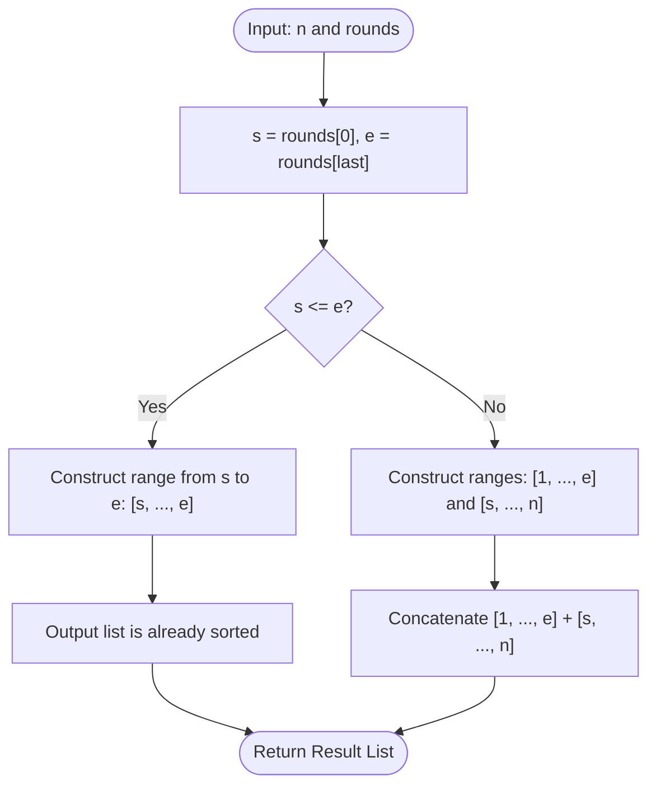

# Guided Example: Most Visited Sector in a Circular Track

## 1. Instance & Teaching Goal

We are given a circular running track with $n$ sectors numbered $1$ through $n$ in clockwise order. A marathon runner traverses the track in strictly increasing circular order (wrapping from $n$ back to $1$), guided by a sequence of checkpoints $\text{rounds} = [r_0, r_1, \dots, r_m]$.

We choose the representative instance:
$$n = 4, \quad \text{rounds} = [1, 3, 1, 2]$$

The required output is:
$$[1, 2]$$

Our teaching goal is to demonstrate the full-loop invariance principle in circular trajectories. Rather than simulating thousands of intermediate sector steps with an accumulator array, we prove that every completed lap around the track increments the visit count of every sector identically. Consequently, the set of most-visited sectors depends strictly on the net start checkpoint $s = \text{rounds}[0]$ and end checkpoint $e = \text{rounds}[-1]$, reducing the entire problem to an $\mathcal{O}(1)$ interval identification.

## 2. Conceptual Foundation & Invariants

The runner moves continuously forward along the directed cycle $1 \to 2 \to \dots \to n \to 1$.
Any continuous path along this directed cycle can be decomposed into:
1. An integer number $K \ge 0$ of complete circuits around the entire track.
2. A single partial residual path starting at $s = \text{rounds}[0]$ and terminating at $e = \text{rounds}[-1]$.

```
+-------------------------------------------------------------------------+
|                  CIRCULAR FULL-LAP CANCELATION INVARIANT                |
|                                                                         |
| Full circuits:                                                          |
|   Every complete revolution (1 -> 2 -> ... -> n -> 1) adds EXACTLY +1   |
|   to EVERY sector 1 through n.                                          |
|                                                                         |
| Partial residual path:                                                  |
|   Starts at s = rounds[0], finishes at e = rounds[-1].                  |
|                                                                         |
|   Case A (s <= e):                                                      |
|     Residual covers interval [s, e].                                    |
|     Sectors in [s, e] have count K + 1. Others have count K.            |
|     Most visited: [s, s+1, ..., e].                                     |
|                                                                         |
|   Case B (s > e):                                                       |
|     Residual wraps around track: [s, n] and [1, e].                     |
|     In sorted order: [1, ..., e] followed by [s, ..., n].               |
+-------------------------------------------------------------------------+
```

### State Parameter Reference

| Parameter | Type | Domain | Significance in Circular Invariant |
|---|---|---|---|
| $n$ | Integer | $[2, 100]$ | Track circumference (total count of sectors) |
| $s$ | Integer | $[1, n]$ | Starting checkpoint $\text{rounds}[0]$ of the marathon |
| $e$ | Integer | $[1, n]$ | Finishing checkpoint $\text{rounds}[-1]$ of the marathon |
| $K$ | Integer | $\ge 0$ | Total number of full $n$-sector revolutions completed |
| $\text{count}[v]$ | Integer | $\{K, K+1\}$ | Total visits accumulated by sector $v$ |
| $\text{max\_sectors}$ | List of Integers | Subsets of $[1, n]$ | Sectors with peak visit count $K+1$, sorted ascending |

> [!IMPORTANT]
> **Intermediate Checkpoint Irrelevance**:
> The marathon's total path is a single continuous forward trajectory on the circle. Because movement between any consecutive checkpoints $\text{rounds}[i]$ and $\text{rounds}[i+1]$ is always clockwise without reversal, the intermediate points $\text{rounds}[1 \dots m-1]$ merely record progress markers along the path. The set of sectors with maximal visits depends exclusively on the boundary endpoints $s$ and $e$.



## 3. Step-by-Step Worked Execution

We trace the algorithm on $n = 4$ and $\text{rounds} = [1, 3, 1, 2]$:
- Initial checkpoint: $s = \text{rounds}[0] = 1$.
- Intermediate checkpoint 1: $\text{rounds}[1] = 3$.
- Intermediate checkpoint 2: $\text{rounds}[2] = 1$.
- Final checkpoint: $e = \text{rounds}[3] = 2$.

### Leg-by-Leg Step Accumulation (Simulation View)
1. **Leg 1 ($1 \to 3$)**:
   - Visits sectors: $1 \to 2 \to 3$.
   - Intermediate counts: $\text{count}[1] = 1, \text{count}[2] = 1, \text{count}[3] = 1, \text{count}[4] = 0$.
2. **Leg 2 ($3 \to 1$)**:
   - Starts at $3$ (already counted at end of Leg 1). Next steps: $4 \to 1$.
   - Increments: sector $4$ gets $+1$, sector $1$ gets $+1$.
   - Cumulative counts: $\text{count}[1] = 2, \text{count}[2] = 1, \text{count}[3] = 1, \text{count}[4] = 1$.
   - Notice: this completed one full circuit! Every sector has now been visited at least once.
3. **Leg 3 ($1 \to 2$)**:
   - Starts at $1$ (already counted). Next steps: $2$.
   - Increments: sector $2$ gets $+1$.
   - Cumulative counts: $\text{count}[1] = 2, \text{count}[2] = 2, \text{count}[3] = 1, \text{count}[4] = 1$.

### Invariant Analysis (Direct Endpoint View)
- Extract start: $s = 1$.
- Extract end: $e = 2$.
- Compare endpoints: $s \le e$ ($1 \le 2$).
- Residual path covers: $[s, e] = [1, 2]$.
- Max visit count: sectors $1$ and $2$ have count $2$.
- Non-max sectors: sectors $3$ and $4$ have count $1$.
- Directly construct output: $[1, 2]$.

## 4. Complete Execution Trace

The table below traces the sector-by-sector visit evolution across the entire race and contrasts it with the closed-form classification.

| Stage | From | To | Sectors Visited on Leg | Sector 1 Count | Sector 2 Count | Sector 3 Count | Sector 4 Count | Active Max Sectors |
|---|---|---|---|---|---|---|---|---|
| Start | - | 1 | `[1]` | 1 | 0 | 0 | 0 | `[1]` |
| Leg 1 | 1 | 3 | `[2, 3]` | 1 | 1 | 1 | 0 | `[1, 2, 3]` |
| Leg 2 | 3 | 1 | `[4, 1]` | 2 | 1 | 1 | 1 | `[1]` |
| Leg 3 | 1 | 2 | `[2]` | 2 | 2 | 1 | 1 | `[1, 2]` |
| **Final State** | - | - | - | **2** | **2** | 1 | 1 | **`[1, 2]`** |

### Endpoint Closed-Form Derivation

- $s = \text{rounds}[0] = 1$
- $e = \text{rounds}[-1] = 2$
- Condition: $s \le e$ holds ($1 \le 2$)
- Target interval: $[s \dots e] = [1, 2]$
- Identical to detailed simulation outcome.

## 5. Algorithmic Correctness

### Soundness

Let the total length of the continuous traversal be $L$ steps.
On a directed cycle of $n$ vertices, any forward traversal of $L$ steps starting at vertex $s$ visits $L + 1$ vertices in sequence:
$$v_0, v_1, \dots, v_L \quad \text{where } v_0 = s \text{ and } v_L = e$$
We can write $L = q \cdot n + r$, where $q = \lfloor L / n \rfloor \ge 0$ is the quotient and $0 \le r < n$ is the remainder.
- The first $q \cdot n$ steps consist of exactly $q$ consecutive cycles of length $n$. Each such cycle of length $n$ traverses every vertex in $\{1, \dots, n\}$ exactly once.
- Therefore, the base visits contributed by the $q$ cycles is $q$ for every sector $v \in \{1, \dots, n\}$.
- The remaining $r$ steps form a partial forward path of length $r$ starting at $s$ and ending at $e = (s + r - 1) \pmod n + 1$. This path visits $r + 1$ distinct sectors, each receiving $+1$ additional visit.
- Thus, sectors on the residual path from $s$ to $e$ receive exactly $q + 1$ visits, while all other sectors receive exactly $q$ visits.
Since $q + 1 > q$, the maximum visit count is achieved strictly and exclusively by the sectors on the residual forward path from $s$ to $e$.

### Completeness

We partition into two mutually exclusive and exhaustive cases:
- **Case 1 ($s \le e$)**:
  The residual forward path does not cross the boundary $n \to 1$. The sequence of vertices visited on the residual path is $s, s+1, \dots, e$.
  In ascending numeric order, this is $[s, s+1, \dots, e]$.
- **Case 2 ($s > e$)**:
  The residual forward path starts at $s$, proceeds to $n$, wraps to $1$, and ends at $e$.
  The vertices visited are $\{s, s+1, \dots, n\} \cup \{1, 2, \dots, e\}$.
  Sorting these integers in ascending numerical order places the range $[1, e]$ first, followed by $[s, n]$.

Every possible pair of valid coordinates $(s, e)$ is covered by one of these two cases. Thus, the solution is complete and exact.

## 6. Traps This Instance Exposes

1. **Simulating Step-by-Step with Heavy Loops**:
   Iterating over every sector in every leg takes $\mathcal{O}(m \cdot n)$ time. While $n, m \le 100$ is small enough to pass, simulation introduces edge-case counting bugs (such as double-counting leg endpoints or off-by-one errors on circular wrapping). Using the endpoint invariance completely bypasses simulation.

2. **Double Counting Checkpoint Transitions**:
   In simulation, checkpoint $r_i$ is the end of leg $i$ and the start of leg $i+1$. Incrementing $r_i$ at both the end of leg $i$ and the start of leg $i+1$ inflates checkpoint counts unless strictly controlled.

3. **Ordering in Wraparound Case ($s > e$)**:
   When wrapping around ($s > e$), the runner visits $s \dots n$ and then $1 \dots e$. If an implementation outputs them in visiting order ($[s \dots n, 1 \dots e]$), it violates the requirement that sector labels must be sorted in strictly ascending numeric order ($[1 \dots e, s \dots n]$).

4. **Misinterpreting Single-Round Marathons**:
   When $\text{rounds}$ has length $2$ ($m = 1$), the same logic holds: $s = \text{rounds}[0]$ and $e = \text{rounds}[1]$. The closed-form handles $m = 1$ identically without special casing.

## 7. Complexity Derivation

### Time Complexity

- **Endpoint Extraction**: Accessing $s = \text{rounds}[0]$ and $e = \text{rounds}[-1]$ takes $\mathcal{O}(1)$ time.
- **Range Generation**:
  - When $s \le e$, constructing the range $[s, e]$ produces $e - s + 1 \le n$ integers: $\mathcal{O}(n)$.
  - When $s > e$, constructing $[1, e]$ and $[s, n]$ produces $e + (n - s + 1) \le n$ integers: $\mathcal{O}(n)$.

Total time complexity is strictly:
$$\mathcal{O}(n)$$
Completely independent of the number of checkpoints $m$.

### Auxiliary Space Complexity

- The output list stores at most $n$ integers.
- Only scalar registers for $s$ and $e$ are required.

Total auxiliary space complexity is:
$$\mathcal{O}(n)$$
Proportional to the output size.
