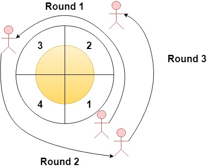

### 1. Description

Given an integer `n` and an integer array `rounds`. We have a circular track which consists of `n` sectors labeled from `1` to `n`. A marathon will be held on this track, the marathon consists of `m` rounds. The $$i^{\text{th}}$$ round starts at sector $rounds[i - 1]$ and ends at sector $\text{rounds}[i]$. For example, round 1 starts at sector $\text{rounds}[0]$ and ends at sector $\text{rounds}[1]$

Return *an array of the most visited sectors* sorted in **ascending** order.

Notice that you circulate the track in ascending order of sector numbers in the counter-clockwise direction (See the first example).

### 2. Function Contract

**Inputs**

- `n`: Input parameter (`int`).
- `rounds`: Input parameter (`List[int]`).

**Return value**

- Returns `List[int]`.

### 3. Examples

#### Example 1

- **Input:** $n = 4, rounds = [1,3,1,2]$
- **Output:** `[1,2]`
- **Explanation:** The marathon starts at sector 1. The order of the visited sectors is as follows:
1 --> 2 --> 3 (end of round 1) --> 4 --> 1 (end of round 2) --> 2 (end of round 3 and the marathon)
We can see that both sectors 1 and 2 are visited twice and they are the most visited sectors. Sectors 3 and 4 are visited only once.

#### Example 2

- **Input:** $n = 2, rounds = [2,1,2,1,2,1,2,1,2]$
- **Output:** `[2]`

#### Example 3

- **Input:** $n = 7, rounds = [1,3,5,7]$
- **Output:** `[1,2,3,4,5,6,7]`

### 4. Constraints

- $2 \le n \le 100$

- $1 \le m \le 100$

- $\text{rounds.length} = m + 1$

- $1 \le \text{rounds}[i] \le n$

- $\text{rounds}[i] \neq rounds[i + 1]$ for $0 \le i < m$
