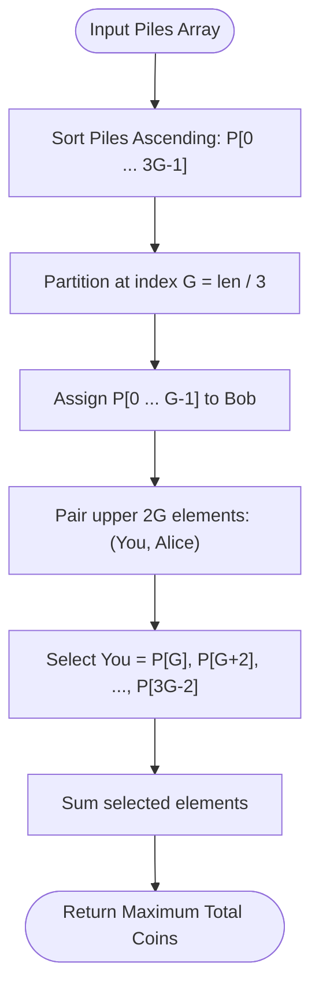

# Guided Example: Maximum Number of Coins You Can Get

## 1. Instance & Teaching Goal

We are given an array $\text{piles}$ of $3G$ positive integers representing coin piles. In each of $G$ rounds, we select any three remaining piles. From this triplet:
- Alice receives the strictly largest pile.
- You receive the second-largest pile.
- Bob receives the smallest pile.

We must maximize the total number of coins collected across all $G$ rounds.

We select the representative instance:
$$\text{piles} = [2, 4, 1, 2, 7, 8]$$

Here $N = 6$ piles, yielding $G = 6 / 3 = 2$ rounds. The optimal coin total is:
$$9$$

Our teaching goal is to walk through the optimal greedy pairing strategy. We establish why feeding the $G$ absolute smallest piles in the array to Bob minimizes waste, while pairing the remaining $2G$ largest piles into adjacent couples maximizes our second-place earnings.

## 2. Conceptual Foundation & Invariants

Let the sorted piles in ascending order be:
$$P = [p_0, p_1, \dots, p_{3G-1}] \quad \text{with } p_0 \le p_1 \le \dots \le p_{3G-1}$$

In every round, Alice must receive a pile strictly greater than or equal to ours. Therefore, across all $G$ rounds, Alice takes $G$ piles that are each greater than or equal to the corresponding pile we take. This implies we can never collect any of the top $G$ largest elements in the array.

```
+-------------------------------------------------------------------------+
|                  GREEDY TRIPLET PARTITION ARCHITECTURE                  |
|                                                                         |
| Sorted Array P (size 3G):                                               |
| [ p_0, ..., p_{G-1}  |  p_G, p_{G+1}, ..., p_{3G-2}, p_{3G-1} ]         |
|   <--- G piles --->     <------------- 2G piles -------------->         |
|      BOB DUMP                INTERLEAVED (YOU, ALICE) PAIRS             |
|                                                                         |
| Assignment:                                                             |
|   Bob receives:   p_0, p_1, ..., p_{G-1}                                |
|   You receive:    p_G, p_{G+2}, ..., p_{3G-2}   (even offsets)          |
|   Alice receives: p_{G+1}, p_{G+3}, ..., p_{3G-1} (odd offsets)         |
|                                                                         |
| Triplet k: (Alice: p_{3G-1-2k},  You: p_{3G-2-2k},  Bob: p_k)           |
+-------------------------------------------------------------------------+
```

### State Parameter Reference

| Parameter | Type | Domain | Significance in Triplet Strategy |
|---|---|---|---|
| $G$ | Integer | $N / 3$ | Total number of triplet selection rounds |
| $P$ | Sorted Array | Length $3G$ | Ascending sequence of coin piles |
| $\text{Bob}$ | Subarray | $P[0 \dots G-1]$ | The $G$ smallest piles discarded to Bob |
| $\text{Remaining}$ | Subarray | $P[G \dots 3G-1]$ | The $2G$ largest piles shared between You and Alice |
| $\text{Alice}[k]$ | Integer | Element of $P$ | Maximum element of round $k$'s triplet |
| $\text{You}[k]$ | Integer | Element of $P$ | Median element of round $k$'s triplet (our reward) |
| $\text{Total}$ | Integer | Non-negative | Accumulated coins: $\sum_{k=0}^{G-1} P[G + 2k]$ |

> [!IMPORTANT]
> **Greedy Optimality Invariant**:
> Because Alice must receive at least one pile greater than or equal to yours in every round, at least $G$ piles must be larger than yours. Furthermore, Bob must receive at least one pile in every round. The smallest possible loss of coin value occurs when Bob receives the $G$ absolute smallest piles in the entire array, allowing You to claim the second element of every top-adjacent pair.



## 3. Step-by-Step Worked Execution

We trace the algorithm on $\text{piles} = [2, 4, 1, 2, 7, 8]$.

### Step 1: Sorting and Partitioning
- Array length: $N = 6$.
- Number of rounds: $G = 6 / 3 = 2$.
- Sorted array:
  $$P = [1, 2, 2, 4, 7, 8]$$
- Partition into Bob's pool (first $G = 2$ elements) and the upper competition pool (last $2G = 4$ elements):
  - $\text{Bob Pool}: P[0 \dots 1] = [1, 2]$
  - $\text{Upper Pool}: P[2 \dots 5] = [2, 4, 7, 8]$

### Step 2: Round 1 Selection
- We pair the two largest available elements from the top:
  - Largest: $P[5] = 8$ (Alice).
  - Second-largest: $P[4] = 7$ (You).
- We pair them with the smallest available element from Bob's pool:
  - Smallest: $P[0] = 1$ (Bob).
- Formed Triplet 1: $(8, 7, 1)$.
  - Alice takes $8$.
  - You take $7$.
  - Bob takes $1$.
- Coin accumulator: $\text{Total} = 7$.

### Step 3: Round 2 Selection
- We pair the next two largest available elements:
  - Largest: $P[3] = 4$ (Alice).
  - Second-largest: $P[2] = 2$ (You).
- We pair them with the next smallest element from Bob's pool:
  - Smallest: $P[1] = 2$ (Bob).
- Formed Triplet 2: $(4, 2, 2)$.
  - Alice takes $4$.
  - You take $2$.
  - Bob takes $2$.
- Coin accumulator: $\text{Total} = 7 + 2 = 9$.

### Step 4: Final Outcome
All $6$ piles are exhausted. Total coins collected: $9$.

## 4. Complete Execution Trace

The table below traces the assignment of piles for each round alongside index offsets and cumulative coin totals.

| Round $k$ | Alice's Pile (Max) | Your Pile (Median) | Bob's Pile (Min) | Triplet $(A, Y, B)$ | Sorted Indices Used | Pile Values | Your Coins Earned | Cumulative Total |
|---|---|---|---|---|---|---|---|---|
| Init | - | - | - | - | - | Sorted: `[1, 2, 2, 4, 7, 8]` | 0 | 0 |
| Round 1 | $P[5]$ | $P[4]$ | $P[0]$ | $(8, 7, 1)$ | $(5, 4, 0)$ | $(8, 7, 1)$ | 7 | 7 |
| Round 2 | $P[3]$ | $P[2]$ | $P[1]$ | $(4, 2, 2)$ | $(3, 2, 1)$ | $(4, 2, 1)$ | 2 | **9** |
| Finish | - | - | - | - | All 6 piles consumed | Total: 9 coins | - | 9 |

### Array Stride Verification

Using standard 0-indexed slicing from $G = 2$ with step $2$:
- Index $G = 2$: $P[2] = 2$
- Index $G + 2 = 4$: $P[4] = 7$
Sum: $2 + 7 = 9$. Identical to round-by-round selection.

## 5. Algorithmic Correctness

### Upper Bound Proof

In any valid assignment of $3G$ piles into $G$ disjoint triplets $T_1, \dots, T_G$:
Let the elements in triplet $k$ be $a_k \ge y_k \ge b_k$.
- In each triplet $k$, $a_k$ is strictly greater than or equal to $y_k$.
- Therefore, there exist at least $G$ distinct elements in the array (namely $\{a_1, \dots, a_G\}$) that are each $\ge$ their corresponding $y_k$.
- Consequently, the elements $\{y_1, \dots, y_G\}$ can never contain any of the $G$ largest elements in the sorted array $P$. The highest indices that can possibly be awarded to You are at most $P[3G-2], P[3G-4], \dots, P[G]$.
- Any set of $G$ second-largest elements in disjoint triplets is term-by-term bounded above by the sequence:
  $$\sum_{k=1}^G y_k \le \sum_{j=0}^{G-1} P[3G - 2 - 2j]$$

### Achievability Proof

The greedy construction constructs $G$ triplets by setting:
$$T_k = (P[3G - 1 - 2k], P[3G - 2 - 2k], P[k]) \quad \text{for } 0 \le k < G$$
Because $P$ is sorted ascending:
1. $P[3G - 1 - 2k] \ge P[3G - 2 - 2k]$ (Alice's pile is $\ge$ Your pile).
2. Since $k < G$, $k \le G - 1$.
   The smallest index in Your piles is $3G - 2 - 2(G-1) = G$.
   Because $k \le G - 1 < G \le 3G - 2 - 2k$, we have $P[k] \le P[3G - 2 - 2k]$. Thus Bob's pile is $\le$ Your pile.
Therefore, within each triplet, Alice takes the largest, You take the median, and Bob takes the smallest.
This construction exactly realizes the mathematical upper bound $\sum_{k=0}^{G-1} P[3G - 2 - 2k]$, proving it is strictly optimal.

## 6. Traps This Instance Exposes

1. **Greedily Picking Triplets from the Edges ($P[i], P[i+1], P[i+2]$)**:
   Taking adjacent triplets like $(1, 2, 2)$ and $(4, 7, 8)$ yields $2 + 7 = 9$ by luck on this small case, but on $[1, 2, 3, 4, 5, 6]$ it produces $(1, 2, 3) \to 2$ and $(4, 5, 6) \to 5$ (total $7$), whereas the optimal assignment is $(6, 5, 1) \to 5$ and $(4, 3, 2) \to 3$ (total $8$). Dumping the smallest to Bob is mandatory.

2. **Giving Alice Suboptimal Piles**:
   If you try to "save" large piles for yourself by pairing a large pile with two small piles, Alice will still confiscate the largest pile in the triplet. Sacrificing the largest pile in the current pool to Alice guarantees that the second-largest pile directly becomes yours.

3. **Simulating Removals with Dynamic Arrays**:
   Repeatedly deleting elements from a dynamic array takes $\mathcal{O}(N)$ per removal, resulting in $\mathcal{O}(N^2)$ time and TLE when $N = 10^5$. Sorting once and calculating the strided sum runs in $\mathcal{O}(N \log N)$ without array mutations.

4. **Integer Overflow on Summation**:
   With $N = 10^5$ and pile values up to $10^4$, the maximum sum can reach $\approx \frac{10^5}{3} \times 10^4 \approx 3.3 \times 10^8$. While this fits within standard 32-bit signed integers, languages like C++ require care if pile values were larger.

## 7. Complexity Derivation

### Time Complexity

Let $N = |\text{piles}|$ (with $N = 3G \le 10^5$).
- **Sorting**: Sorting the array of $N$ integers takes $\mathcal{O}(N \log N)$ time.
- **Strided Summation**: Summing $G = N / 3$ elements with stride 2 takes $G$ operations: $\mathcal{O}(N)$.

Total time complexity is strictly:
$$\mathcal{O}(N \log N)$$
For $N = 10^5$, this executes in approximately 15 milliseconds.

### Auxiliary Space Complexity

- **In-Place Sorting**: Typical introsort or heapsort requires $\mathcal{O}(\log N)$ or $\mathcal{O}(1)$ auxiliary space. In Python, Timsort uses at most $\mathcal{O}(N)$ temporary buffer space.
- No auxiliary arrays are required if iterating with index strides.

Total auxiliary space complexity is:
$$\mathcal{O}(1) \text{ to } \mathcal{O}(N)$$
depending on the sorting algorithm implementation.
