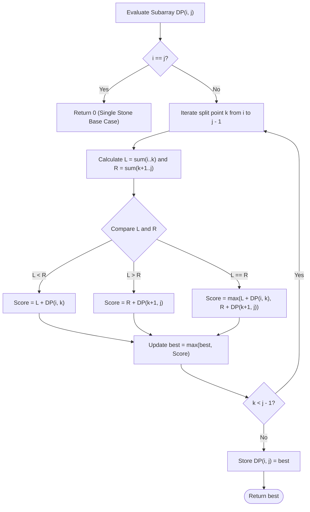

# Guided Example: Stone Game V

## 1. Instance & Teaching Goal

We are given an array $\text{stoneValue}$ of $N$ positive integers representing a row of stones. Alice and Bob play a solitaire-style game under the following rules:
1. In each turn, Alice divides the current row into two non-empty contiguous parts: a left partition $\text{stoneValue}[i \dots k]$ and a right partition $\text{stoneValue}[k+1 \dots j]$.
2. Bob calculates the total sum of each part ($L$ and $R$):
   - If $L < R$, Bob discards the right part; Alice gains $L$ points and continues playing on the left part.
   - If $L > R$, Bob discards the left part; Alice gains $R$ points and continues playing on the right part.
   - If $L = R$, Bob allows Alice to choose which part to keep; Alice gains $L = R$ points and continues playing on her chosen part.
3. The game terminates when the active part contains exactly $1$ stone.

We select the representative instance:
$$\text{stoneValue} = [6, 2, 3, 4, 5, 5]$$

The maximum total score Alice can obtain is:
$$18$$

Our teaching goal is to walk through interval dynamic programming over contiguous subarrays. We show how prefix sums compute partition sums in $\mathcal{O}(1)$ time, how subproblems are ordered by interval length, and how Alice navigates Bob's adversarial discard rule to maximize her cumulative score.

## 2. Conceptual Foundation & Invariants

Let $DP(i, j)$ denote the maximum score Alice can earn from the contiguous subarray $\text{stoneValue}[i \dots j]$ for $0 \le i \le j < N$.

### Recurrence Formulation

- **Base Cases**:
  For an interval containing a single stone ($i = j$):
  $$DP(i, i) = 0$$
  No further splits are possible; the game ends.

- **Prefix Sums**:
  Let $S[p] = \sum_{m=0}^{p-1} \text{stoneValue}[m]$ with $S[0] = 0$.
  For any split point $k \in [i, j-1]$:
  $$L = S[k+1] - S[i], \quad R = S[j+1] - S[k+1]$$

- **General Transition**:
  Alice selects the split point $k \in [i, j-1]$ that maximizes her total return:
  $$DP(i, j) = \max_{i \le k < j} \begin{cases} L + DP(i, k) & \text{if } L < R \\ R + DP(k+1, j) & \text{if } L > R \\ \max(L + DP(i, k), R + DP(k+1, j)) & \text{if } L = R \end{cases}$$

```
+-------------------------------------------------------------------------+
|                  INTERVAL DYNAMIC PROGRAMMING LATTICE                   |
|                                                                         |
| Array: [ 6,  2,  3,  4,  5,  5 ]                                        |
| idx:     0   1   2   3   4   5                                          |
|                                                                         |
| Round 1 on [0..5]:                                                      |
|   Split at k = 2:                                                       |
|   Left  [0..2] = [6, 2, 3]  (sum L = 11)                                |
|   Right [3..5] = [4, 5, 5]  (sum R = 14)                                |
|   L < R ==> Bob keeps Left! Alice earns 11 + DP(0, 2)                   |
|                                                                         |
| Round 2 on [0..2]:                                                      |
|   Split at k = 0:                                                       |
|   Left  [0..0] = [6]        (sum L = 6)                                 |
|   Right [1..2] = [2, 3]     (sum R = 5)                                 |
|   L > R ==> Bob keeps Right! Alice earns 5 + DP(1, 2)                   |
|                                                                         |
| Round 3 on [1..2]:                                                      |
|   Split at k = 1:                                                       |
|   Left  [1..1] = [2]        (sum L = 2)                                 |
|   Right [2..2] = [3]        (sum R = 3)                                 |
|   L < R ==> Bob keeps Left! Alice earns 2 + DP(1, 1) = 2 + 0            |
|                                                                         |
| Total Accumulated Score = 11 + 5 + 2 = 18                               |
+-------------------------------------------------------------------------+
```

### State Parameter Reference

| Parameter | Type | Domain | Semantics in Dynamic Programming |
|---|---|---|---|
| $i, j$ | Integers | $0 \le i \le j < N$ | Left and right boundary indices of active subarray |
| $k$ | Integer | $i \le k < j$ | Split index separating left $\text{stones}[i \dots k]$ and right $\text{stones}[k+1 \dots j]$ |
| $L$ | Integer | Positive sum | Total stone weight in left subarray |
| $R$ | Integer | Positive sum | Total stone weight in right subarray |
| $DP(i, j)$ | Integer | Non-negative | Optimal total score achievable on interval $[i, j]$ |

> [!IMPORTANT]
> **Subproblem Optimal Substructure Invariant**:
> For any interval $[i, j]$ and split $k$, Bob's discard choice determines whether play continues on $[i, k]$ or $[k+1, j]$. By the principle of optimality, Alice's subsequent score is exactly $DP(i, k)$ or $DP(k+1, j)$. Because all subproblems have strictly smaller interval lengths ($k - i + 1 < j - i + 1$), solving intervals in increasing order of length guarantees that all required subproblem values are finalized.



## 3. Step-by-Step Worked Execution

We trace the optimal decisions from the bottom up on key subintervals of $[6, 2, 3, 4, 5, 5]$.

### Phase 1: Small Intervals (Length 2)

#### Subarray $[1, 2] = [2, 3]$
- Only split is $k = 1$:
  - Left: $[2]$, $L = 2$.
  - Right: $[3]$, $R = 3$.
  - Since $L < R$ ($2 < 3$), Bob keeps the left part.
  - Score $= L + DP(1, 1) = 2 + 0 = 2$.
  - Result: $DP(1, 2) = 2$.

#### Subarray $[4, 5] = [5, 5]$
- Only split is $k = 4$:
  - Left: $[5]$, $L = 5$.
  - Right: $[5]$, $R = 5$.
  - Since $L = R$ ($5 = 5$), Alice may choose either side. Both yield $5 + 0 = 5$.
  - Result: $DP(4, 5) = 5$.

### Phase 2: Medium Intervals (Length 3)

#### Subarray $[0, 2] = [6, 2, 3]$
Candidate split points:
- **Split $k = 0$**:
  - Left: $[6]$, $L = 6$.
  - Right: $[2, 3]$, $R = 5$.
  - Since $L > R$ ($6 > 5$), Bob keeps the right part.
  - Score $= R + DP(1, 2) = 5 + 2 = 7$.
- **Split $k = 1$**:
  - Left: $[6, 2]$, $L = 8$.
  - Right: $[3]$, $R = 3$.
  - Since $L > R$ ($8 > 3$), Bob keeps the right part.
  - Score $= R + DP(2, 2) = 3 + 0 = 3$.
- Optimal choice for $[0, 2]$:
  $$DP(0, 2) = \max(7, 3) = 7 \quad (\text{achieved at } k = 0)$$

#### Subarray $[3, 5] = [4, 5, 5]$
Candidate split points:
- **Split $k = 3$**: Left $[4]$ ($L=4$), Right $[5, 5]$ ($R=10$). $L < R \implies 4 + DP(3, 3) = 4 + 0 = 4$.
- **Split $k = 4$**: Left $[4, 5]$ ($L=9$), Right $[5]$ ($R=5$). $L > R \implies 5 + DP(5, 5) = 5 + 0 = 5$.
- Optimal choice: $DP(3, 5) = \max(4, 5) = 5$.

### Phase 3: Full Array $[0, 5] = [6, 2, 3, 4, 5, 5]$
Total sum $= 25$. We evaluate all candidate splits $k \in \{0, 1, 2, 3, 4\}$:

- **Split $k = 0$**: Left $[6]$ ($L=6$), Right $[2, 3, 4, 5, 5]$ ($R=19$).
  $L < R \implies \text{Score} = 6 + DP(0, 0) = 6 + 0 = 6$.
- **Split $k = 1$**: Left $[6, 2]$ ($L=8$), Right $[3, 4, 5, 5]$ ($R=17$).
  $L < R \implies \text{Score} = 8 + DP(0, 1)$. Here $DP(0, 1) = 2$ ($L=6 > R=2 \implies 2$).
  $\text{Score} = 8 + 2 = 10$.
- **Split $k = 2$**: Left $[6, 2, 3]$ ($L=11$), Right $[4, 5, 5]$ ($R=14$).
  $L < R \implies$ Bob keeps Left!
  $\text{Score} = L + DP(0, 2) = 11 + 7 = 18$.
- **Split $k = 3$**: Left $[6, 2, 3, 4]$ ($L=15$), Right $[5, 5]$ ($R=10$).
  $L > R \implies$ Bob keeps Right!
  $\text{Score} = R + DP(4, 5) = 10 + 5 = 15$.
- **Split $k = 4$**: Left $[6, 2, 3, 4, 5]$ ($L=20$), Right $[5]$ ($R=5$).
  $L > R \implies \text{Score} = 5 + DP(5, 5) = 5 + 0 = 5$.

Taking the maximum across all split points:
$$DP(0, 5) = \max(6, 10, 18, 15, 5) = 18$$

## 4. Complete Execution Trace

The table below catalogs the evaluation of each candidate split on the top-level problem $[0, 5]$.

| Split $k$ | Left Subarray $[0 \dots k]$ | Sum $L$ | Right Subarray $[k+1 \dots 5]$ | Sum $R$ | Surviving Side | Subproblem Queried | Subproblem DP | Round Yield | Total Candidate Score |
|---|---|---|---|---|---|---|---|---|---|
| $k = 0$ | `[6]` | 6 | `[2, 3, 4, 5, 5]` | 19 | Left ($L < R$) | $DP(0, 0)$ | 0 | 6 | $6 + 0 = 6$ |
| $k = 1$ | `[6, 2]` | 8 | `[3, 4, 5, 5]` | 17 | Left ($L < R$) | $DP(0, 1)$ | 2 | 8 | $8 + 2 = 10$ |
| **$k = 2$** | `[6, 2, 3]` | 11 | `[4, 5, 5]` | 14 | **Left ($L < R$)** | $DP(0, 2)$ | **7** | **11** | **$11 + 7 = 18$** |
| $k = 3$ | `[6, 2, 3, 4]` | 15 | `[5, 5]` | 10 | Right ($L > R$) | $DP(4, 5)$ | 5 | 10 | $10 + 5 = 15$ |
| $k = 4$ | `[6, 2, 3, 4, 5]` | 20 | `[5]` | 5 | Right ($L > R$) | $DP(5, 5)$ | 0 | 5 | $5 + 0 = 5$ |

### Optimal Split Sequence Summary

1. Alice splits $[0, 5]$ at $k = 2$. Bob keeps Left $[0, 2]$. Alice gains $11$.
2. Alice splits $[0, 2]$ at $k = 0$. Bob keeps Right $[1, 2]$. Alice gains $5$.
3. Alice splits $[1, 2]$ at $k = 1$. Bob keeps Left $[1, 1]$. Alice gains $2$.
4. Single stone $[1, 1] = [2]$ reached; game terminates.
Final Total Score: $11 + 5 + 2 = 18$.

## 5. Algorithmic Correctness

### Soundness

The recurrence directly mirrors the rules of the game:
1. Every split $k \in [i, j-1]$ corresponds to a legal game move dividing the row into non-empty slices.
2. The rules dictate that the smaller sum survives, or Alice chooses if equal. The recurrence computes the exact immediate points gained ($L$ if $L < R$, $R$ if $L > R$, or $\max$ if equal) and adds the optimal recursive score on the surviving row.
3. Because Alice controls the choice of split $k$, she takes the maximum over all valid $k \in [i, j-1]$.
By induction on interval length $m = j - i + 1$:
- For $m = 1$, $DP(i, i) = 0$, which correctly reflects that no splits can occur on a 1-element subarray.
- Assuming $DP$ is correct for all lengths $< m$, any choice of $k$ transitions to a strictly smaller interval. Thus the transition computes the true game-theoretic optimal score.

### Completeness

No possible game path is omitted:
- Every valid split point $k \in [i, j-1]$ is tested.
- Both branches are evaluated when $L = R$.
- The memoized state space covers all $\mathcal{O}(N^2)$ intervals $[i, j]$.
Thus, Alice's maximum score is globally optimal.

## 6. Traps This Instance Exposes

1. **Greedily Maximizing Immediate Points**:
   At the root, split $k = 3$ yields $R = 10$ immediate points, whereas split $k = 1$ yields $L = 8$. However, choosing $k = 2$ gives $L = 11$ and leaves a rich subproblem $[0, 2]$ worth $7$ points (total $18$), whereas $k = 3$ leaves $[4, 5]$ worth only $5$ points (total $15$). A myopic greedy choice misses the global optimum.

2. **Forgetting Tie-Breaking Choice ($L = R$)**:
   When $L = R$, the problem states Bob lets Alice choose. If an implementation arbitrarily defaults to always choosing the left side, it fails whenever the right side contains a higher subsequent potential score.

3. **Recomputing Subarray Sums**:
   Computing $L$ and $R$ with naive loops inside the $k$-loop adds an extra factor of $N$, raising the complexity from $\mathcal{O}(N^3)$ to $\mathcal{O}(N^4)$ and causing TLE for $N = 500$. Precomputing prefix sums reduces each sum calculation to $\mathcal{O}(1)$.

4. **Off-by-One in Split Boundaries**:
   $k$ must range from $i$ to $j-1$. Allowing $k = j$ creates an empty right partition, violating the non-empty requirement and causing infinite recursion.

## 7. Complexity Derivation

### Time Complexity

Let $N = |\text{stoneValue}| \le 500$.
- **Number of Subproblems**: Subproblems are uniquely identified by interval pairs $(i, j)$ with $0 \le i \le j < N$. There are $\frac{N(N+1)}{2} = \mathcal{O}(N^2)$ states.
- **Work per Subproblem**: For an interval of length $m = j - i + 1$, the loop iterates over $m - 1$ split points $k$. With prefix sums, each split takes $\mathcal{O}(1)$ time to compute sums and look up memoized values.
- Summing over all intervals:
  $$\sum_{m=1}^N (N - m + 1) \cdot (m - 1) = \mathcal{O}(N^3)$$
With $N = 500$, $N^3 \approx 1.25 \times 10^8$ operations. With pruning (such as breaking when $2R \le \text{ans}$), the DP easily executes within time limits.

### Auxiliary Space Complexity

- **Memoization Table / Cache**: Stores the optimal values for all $\frac{N(N+1)}{2}$ subproblems: $\mathcal{O}(N^2)$ space.
- **Prefix Sums**: An array of size $N + 1$ requires $\mathcal{O}(N)$ space.
- **Recursion Stack**: The recursion tree depth cannot exceed $N$ frames: $\mathcal{O}(N)$.

Total auxiliary space complexity is:
$$\mathcal{O}(N^2)$$
For $N = 500$, this uses approximately 2 MB of memory.