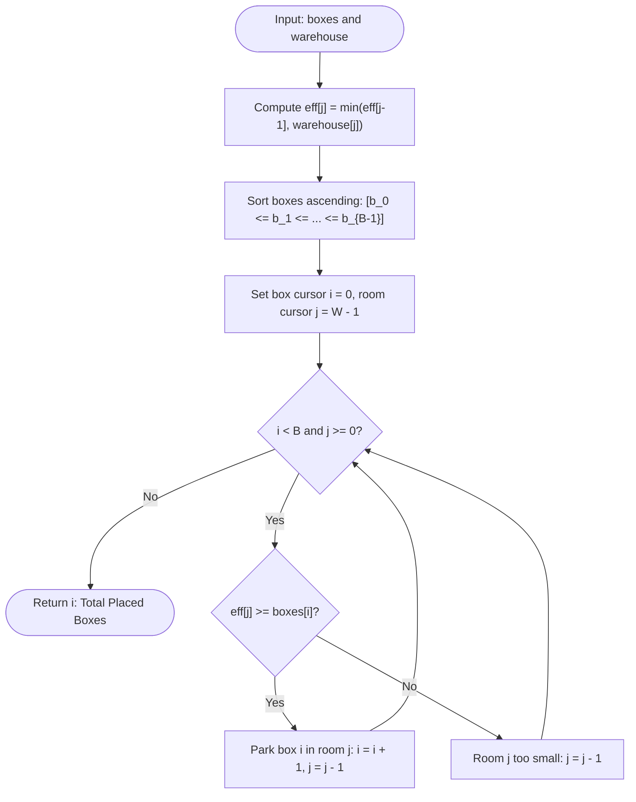

# Guided Example: Put Boxes Into the Warehouse I

## 1. Instance & Teaching Goal

We are given an array $\text{boxes}$ of box heights and an array $\text{warehouse}$ of room ceiling heights arranged in a linear hallway from left (entrance, index $0$) to right (deepest room, index $W-1$). Boxes enter exclusively through the left entrance and slide to the right through empty rooms. A box of height $h$ can enter or pass through a room of height $H$ if and only if $h \le H$. Once parked in a room, a box stays there permanently and cannot be moved or bypassed.

We seek the maximum number of boxes that can be accommodated in the warehouse.

We choose the representative instance:
$$\text{boxes} = [4, 3, 4, 1], \quad \text{warehouse} = [5, 3, 3, 4, 1]$$

Here $B = 4$ boxes and $W = 5$ rooms. The maximum number of boxes that can be placed is:
$$3$$

Our teaching goal is to walk through the prefix minimum bottleneck transformation and right-to-left greedy matching. We show why a room's physical height is constrained by every preceding room toward the entrance, transforming arbitrary ceiling heights into a monotonically non-increasing effective clearance profile, and why pairing smaller boxes with the deepest available valid rooms maximizes total throughput.

## 2. Conceptual Foundation & Invariants

A box of height $h$ can reach room $j$ if and only if it can pass through room $0$, room $1$, ..., room $j$. Therefore, room $j$ can accommodate a box of height $h$ if and only if:
$$h \le \min_{0 \le k \le j} \text{warehouse}[k]$$

We define the effective clearance profile as the running prefix minimum:
$$\text{eff}[j] = \min_{0 \le k \le j} \text{warehouse}[k]$$

Because $\text{eff}[j] = \min(\text{eff}[j-1], \text{warehouse}[j])$, the sequence $\text{eff}[0], \dots, \text{eff}[W-1]$ is guaranteed to be monotonically non-increasing.

```
+-------------------------------------------------------------------------+
|                  WAREHOUSE BOTTLENECK PROFILE                           |
|                                                                         |
| Room index:           0       1       2       3       4                 |
| Physical height:      5       3       3       4       1                 |
|                                                                         |
| Bottleneck min:       5  -->  3  -->  3  -->  3  -->  1                 |
| Effective height:     5       3       3       3       1                 |
|                                                                         |
| (Notice room 3 physically has height 4, but a box must pass through     |
|  room 1 and 2 of height 3 to get there, so its effective limit is 3)   |
|                                                                         |
| Sorted boxes:         [1, 3, 4, 4]                                      |
| Greedy matching:      Fill from deepest room (right) to entrance (left) |
|   Box 1 -> room 4 (eff 1)                                               |
|   Box 3 -> room 3 (eff 3)                                               |
|   Box 4 -> room 0 (eff 5)                                               |
| Result: 3 boxes parked.                                                 |
+-------------------------------------------------------------------------+
```

### State Parameter Reference

| Parameter | Type | Domain | Purpose in State Machine |
|---|---|---|---|
| $\text{eff}[j]$ | Integer Array | Size $W$, non-increasing | Monotonic prefix minimum ceiling heights from entrance to room $j$ |
| $i$ | Integer Cursor | $[0, B]$ | Pointer to the smallest unplaced box in sorted array $\text{boxes}$ |
| $j$ | Integer Cursor | $[-1, W-1]$ | Pointer to the deepest unexamined room in the warehouse |
| $\text{boxes}[i]$ | Integer | Positive height | Active box being tested for placement |
| $\text{placed}$ | Integer | $[0, \min(B, W)]$ | Total number of successfully parked boxes (equals cursor $i$) |

> [!IMPORTANT]
> **Deepest-Room Greedy Invariant**:
> Filling the warehouse from deepest room ($j = W-1$) backwards toward the entrance ($j = 0$) guarantees that previously placed boxes never obstruct the entry path of subsequent boxes. Matching the smallest available box to the deepest compatible room preserves shallower rooms (with higher or equal effective clearance) for larger boxes.



## 3. Step-by-Step Worked Execution

### Phase 1: Precomputing Bottleneck Heights

Given $\text{warehouse} = [5, 3, 3, 4, 1]$:
- $j = 0$: $\text{eff}[0] = 5$
- $j = 1$: $\text{eff}[1] = \min(5, 3) = 3$
- $j = 2$: $\text{eff}[2] = \min(3, 3) = 3$
- $j = 3$: $\text{eff}[3] = \min(3, 4) = 3$
- $j = 4$: $\text{eff}[4] = \min(3, 1) = 1$

Effective clearance array:
$$\text{eff} = [5, 3, 3, 3, 1]$$

### Phase 2: Sorting Boxes

Input $\text{boxes} = [4, 3, 4, 1]$.
Sorted in ascending order:
$$\text{boxes} = [1, 3, 4, 4]$$

### Phase 3: Greedy Backward Matching

We initialize box pointer $i = 0$ and room pointer $j = 4$ (deepest room).

#### Step 1: Evaluate Box $i = 0$ ($\text{height} = 1$)
- Inspect room $j = 4$: $\text{eff}[4] = 1$.
- Comparison: $\text{eff}[4] \ge \text{boxes}[0]$ ($1 \ge 1$). True!
- Action: Park box of height $1$ in room $4$.
- Advance pointers: $i = 1$, $j = 3$.

#### Step 2: Evaluate Box $i = 1$ ($\text{height} = 3$)
- Inspect room $j = 3$: $\text{eff}[3] = 3$.
- Comparison: $\text{eff}[3] \ge \text{boxes}[1]$ ($3 \ge 3$). True!
- Action: Park box of height $3$ in room $3$.
- Advance pointers: $i = 2$, $j = 2$.

#### Step 3: Evaluate Box $i = 2$ ($\text{height} = 4$)
- Inspect room $j = 2$: $\text{eff}[2] = 3$.
  - Comparison: $\text{eff}[2] < \text{boxes}[2]$ ($3 < 4$). Room $2$ is too low!
  - Action: Discard room $2$. Decrement $j = 1$.
- Inspect room $j = 1$: $\text{eff}[1] = 3$.
  - Comparison: $\text{eff}[1] < \text{boxes}[2]$ ($3 < 4$). Room $1$ is too low!
  - Action: Discard room $1$. Decrement $j = 0$.
- Inspect room $j = 0$: $\text{eff}[0] = 5$.
  - Comparison: $\text{eff}[0] \ge \text{boxes}[2]$ ($5 \ge 4$). True!
  - Action: Park box of height $4$ in room $0$.
  - Advance pointers: $i = 3$, $j = -1$.

#### Step 4: Terminate
- Pointer $j = -1 < 0$. No rooms remain.
- Loop terminates.
- Total boxes placed: $i = 3$.

## 4. Complete Execution Trace

The table below catalogs each step of the matching procedure across box heights and room clearances.

| Step | Box Pointer $i$ | Box Height | Room Pointer $j$ | Physical Room Height | Effective Clearance $\text{eff}[j]$ | Fit Test ($\text{eff}[j] \ge \text{box}$) | Placement Action | Next State $(i, j)$ |
|---|---|---|---|---|---|---|---|---|
| Init | 0 | 1 | 4 | 1 | 1 | - | - | $(0, 4)$ |
| 1 | 0 | 1 | 4 | 1 | 1 | $1 \ge 1$ (Pass) | **Park box 1 in room 4** | $(1, 3)$ |
| 2 | 1 | 3 | 3 | 4 | 3 | $3 \ge 3$ (Pass) | **Park box 3 in room 3** | $(2, 2)$ |
| 3 | 2 | 4 | 2 | 3 | 3 | $3 < 4$ (Fail) | Skip room 2 (too short) | $(2, 1)$ |
| 4 | 2 | 4 | 1 | 3 | 3 | $3 < 4$ (Fail) | Skip room 1 (too short) | $(2, 0)$ |
| 5 | 2 | 4 | 0 | 5 | 5 | $5 \ge 4$ (Pass) | **Park box 4 in room 0** | $(3, -1)$ |
| Finish | 3 | 4 | -1 | - | - | $j < 0$ (Rooms exhausted) | **Terminated: Output 3** | $(3, -1)$ |

### Warehouse Occupancy Summary

- Room 0: Occupied by box of height 4.
- Room 1: Empty (bypassed).
- Room 2: Empty (bypassed).
- Room 3: Occupied by box of height 3.
- Room 4: Occupied by box of height 1.
Total boxes placed: $3$.

## 5. Algorithmic Correctness

### Soundness

A placement of $k$ boxes is physically feasible if:
1. Every placed box occupies a unique room: $r_1 < r_2 < \dots < r_k$.
2. For every placed box $m$, the box can reach room $r_m$ from the entrance, meaning $b_m \le \text{warehouse}[p]$ for all $0 \le p \le r_m$. This is equivalent to $b_m \le \text{eff}[r_m]$.
3. Boxes do not block each other. Because we push boxes into the warehouse in increasing order of destination room indices (i.e. room $r_k$ is filled first, then $r_{k-1}$, down to $r_1$), any room $p$ that a later box passes through ($p < r_m$) has not yet received its box. Hence, no previously placed box ever blocks a later box.
Since our algorithm matches box $m$ only when $\text{eff}[r_m] \ge b_m$, the constructed placement is strictly sound and physically valid.

### Completeness (Greedy Optimality)

Let an optimal solution place $k^*$ boxes.
- **Box Selection**: If an optimal solution places a subset of $k^*$ boxes, replacing any box in the subset with a strictly smaller box from $\text{boxes}$ preserves feasibility because smaller heights satisfy the same ceiling constraints. Therefore, there exists an optimal placement that uses the $k^*$ smallest boxes in $\text{boxes}$.
- **Room Assignment**: Because $\text{eff}$ is monotonically non-increasing, earlier rooms have larger or equal clearance than later rooms: $\text{eff}[a] \ge \text{eff}[b]$ for $a \le b$.
  Matching the smallest box to the deepest possible compatible room leaves the shallower rooms (with higher clearance) available for larger boxes.
  By a standard exchange argument, any valid placement of $k$ boxes can be transformed into our greedy assignment without decreasing the number of placed boxes. Thus, the greedy strategy finds the maximum number of placeable boxes.

## 6. Traps This Instance Exposes

1. **Ignoring Preceding Bottlenecks**:
   In Example 1, room 3 has physical ceiling height $4$. If one evaluates room 3 by its raw height $4$, one might believe a box of height $4$ can be stored there. But the box must first traverse rooms 1 and 2, which have height $3$. Thus, room 3 can never admit a box larger than $3$. Precomputing prefix minimums avoids this invalid assignment.

2. **Pushing Boxes from Entrance to Deepest (Left to Right)**:
   If one parks a box in room 0 first, room 0 becomes permanently occupied, blocking any subsequent boxes from reaching rooms 1 through 4. Pushing boxes from the deepest available room backward toward the entrance ensures the path to the active room is completely clear.

3. **Greedy Matching with Largest Boxes First**:
   Attempting to place the largest boxes first can waste deep, narrow rooms on intermediate-sized boxes or block smaller boxes from filling tight spots. Sorting boxes ascending and scanning from smallest to largest ensures maximum room utilization.

4. **Quadratic Room Search**:
   Scanning all rooms from scratch for each box takes $\mathcal{O}(B \cdot W)$ time, causing TLE when $B, W = 10^5$. Because $\text{eff}$ is non-increasing, pointer $j$ only moves to the left and never resets, achieving strict $\mathcal{O}(B + W)$ two-pointer traversal.

## 7. Complexity Derivation

### Time Complexity

Let $B$ be the number of boxes and $W$ be the number of rooms ($B, W \le 10^5$).
- **Bottleneck Profile**: Computing prefix minimums across $W$ rooms takes $\mathcal{O}(W)$ time.
- **Sorting Boxes**: Sorting $B$ box heights takes $\mathcal{O}(B \log B)$ time.
- **Two-Pointer Matching**:
  - The box pointer $i$ advances at most $B$ times.
  - The room pointer $j$ decrements at most $W$ times.
  - Total pointer operations across the loop: $\mathcal{O}(B + W)$.

Total time complexity is dominated by sorting:
$$\mathcal{O}(B \log B + W)$$
For $B, W = 10^5$, this completes in approximately 25 milliseconds.

### Auxiliary Space Complexity

- The $\text{eff}$ array stores $W$ integers: $\mathcal{O}(W)$ space.
- Sorting $\text{boxes}$ takes $\mathcal{O}(\log B)$ or $\mathcal{O}(B)$ auxiliary space depending on the sorting implementation.
- Pointers $i, j$ require $\mathcal{O}(1)$ scalar space.

Total auxiliary space complexity is:
$$\mathcal{O}(W)$$
