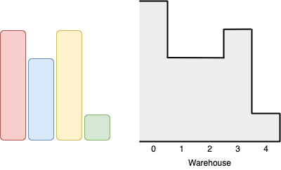
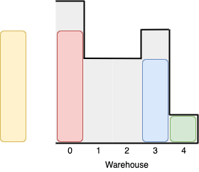
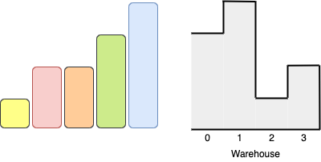
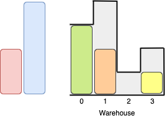

### 1. Description

You are given two arrays of positive integers, `boxes` and `warehouse`, representing the heights of some boxes of unit width and the heights of `n` rooms in a warehouse respectively. The warehouse's rooms are labelled from `0` to $n - 1$ from left to right where $\text{warehouse}[i]$ (0-indexed) is the height of the $$i^{\text{th}}$$ room.

Boxes are put into the warehouse by the following rules:

- Boxes cannot be stacked.

- You can rearrange the insertion order of the boxes.

- Boxes can only be pushed into the warehouse from left to right only.

- If the height of some room in the warehouse is less than the height of a box, then that box and all other boxes behind it will be stopped before that room.

Return *the maximum number of boxes you can put into the warehouse.*

### 2. Function Contract

**Inputs**

- `boxes`: A non-empty list of box heights ($1 \le \text{boxes.length} \le 10^5$, $1 \le \text{boxes}[i] \le 10^9$).
- `warehouse`: A non-empty list of warehouse room heights ($1 \le \text{warehouse.length} \le 10^5$, $1 \le \text{warehouse}[i] \le 10^9$).

**Return value**

Return an integer representing the maximum number of boxes that can be placed into the warehouse from the left entrance.

### 3. Examples

#### Example 1

- **Input:** $boxes = [4,3,4,1], warehouse = [5,3,3,4,1]$
- **Output:** `3`
- **Explanation:** 
We can first put the box of height 1 in room 4. Then we can put the box of height 3 in either of the 3 rooms 1, 2, or 3. Lastly, we can put one box of height 4 in room 0.
There is no way we can fit all 4 boxes in the warehouse.

#### Example 2

- **Input:** $boxes = [1,2,2,3,4], warehouse = [3,4,1,2]$
- **Output:** `3`
- **Explanation:** 
Notice that it's not possible to put the box of height 4 into the warehouse since it cannot pass the first room of height 3.
Also, for the last two rooms, 2 and 3, only boxes of height 1 can fit.
We can fit 3 boxes maximum as shown above. The yellow box can also be put in room 2 instead.
Swapping the orange and green boxes is also valid, or swapping one of them with the red box.

#### Example 3

- **Input:** $boxes = [1,2,3], warehouse = [1,2,3,4]$
- **Output:** `1`
- **Explanation:** Since the first room in the warehouse is of height 1, we can only put boxes of height 1.

### 4. Constraints

- $n = \text{warehouse.length}$

- $1 \le \text{boxes.length}, \text{warehouse.length} \le 10^{5}$

- $1 \le \text{boxes}[i], \text{warehouse}[i] \le 10^{9}$
