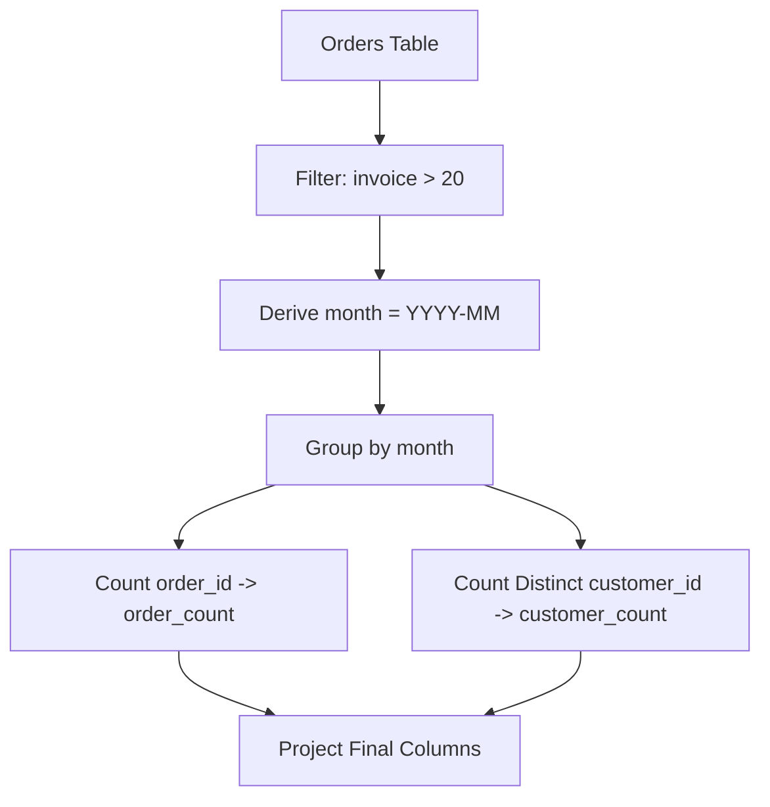

# Guided Example: Unique Orders and Customers Per Month

## 1. Instance & Teaching Goal

We are given an `Orders` relational table recording commercial purchases:
$$\text{Orders}(\text{order\_id}, \text{order\_date}, \text{customer\_id}, \text{invoice})$$

We are tasked with filtering for high-value orders whose invoice amount is strictly greater than $20$ ($\text{invoice} > 20$) and, for each active calendar month, reporting:
1. The calendar month formatted as $\text{"YYYY-MM"}$.
2. The total count of qualifying orders ($\text{order\_count}$).
3. The count of distinct customers who placed those qualifying orders ($\text{customer\_count}$).

We select the representative dataset:
- Order 1: $(1, \text{"2020-09-15"}, 1, 30)$
- Order 2: $(2, \text{"2020-09-17"}, 2, 90)$
- Order 3: $(3, \text{"2020-10-06"}, 3, 20)$
- Order 4: $(4, \text{"2020-10-21"}, 3, 102)$
- Order 5: $(5, \text{"2020-11-19"}, 2, 18)$
- Order 6: $(6, \text{"2020-12-01"}, 4, 55)$
- Order 7: $(7, \text{"2020-12-25"}, 4, 45)$

The required output relation is:
- $(\text{"2020-09"}, 2, 2)$
- $(\text{"2020-10"}, 1, 1)$
- $(\text{"2020-12"}, 2, 1)$

Our teaching goal is to express SQL analytical transformations through rigorous relational algebra. We trace predicate filtration, month-grain temporal truncation, and composite group aggregation featuring both multiset cardinality and distinct set cardinality.

## 2. Conceptual Foundation & Invariants

The data pipeline consists of three sequential relational operators:
1. **Predicate Selection**: Discard low-value orders using the strict condition $\sigma_{\text{invoice} > 20}$.
2. **Temporal Projection**: Extract the Year-Month string representation $\tau_{\text{YYYY-MM}}(\text{order\_date})$ to define the partition key.
3. **Partitioned Group Aggregation**: Partition the surviving tuples by month, computing both total order records and distinct customer identifiers.

```
+--------------------------------------------------------------------------+
|                  RELATIONAL AGGREGATION PIPELINE                         |
|                                                                          |
| Step 1: Selection                                                        |
|         R_1 = Filter(invoice > 20, Orders)                               |
|         (Eliminates order 3 [invoice=20] and order 5 [invoice=18])       |
|                                                                          |
| Step 2: Temporal Derivation                                              |
|         R_2 = Project(order_id, customer_id,                             |
|                       DateTruncMonth(order_date) -> month, R_1)          |
|                                                                          |
| Step 3: Group Aggregation                                                |
|         R_final = GroupBy(month,                                         |
|                           count(order_id) -> order_count,                |
|                           count_distinct(customer_id) -> customer_count, |
|                           R_2)                                           |
+--------------------------------------------------------------------------+
```

### Formal Relational Algebra Formulation

Let the base relation be $\text{Orders}$.
$$\text{Filtered} = \sigma_{\text{invoice} > 20}(\text{Orders})$$
$$\text{Projected} = \Pi_{\text{order\_id}, \text{customer\_id}, \text{SUBSTRING}(\text{order\_date}, 1, 7) \to \text{month}}(\text{Filtered})$$
$$\text{Result} = \gamma_{\text{month}, \text{COUNT}(\text{order\_id}) \to \text{order\_count}, \text{COUNT\_DISTINCT}(\text{customer\_id}) \to \text{customer\_count}}(\text{Projected})$$

### State Parameter Reference

| Parameter | Type | Domain | Semantics in Relational Pipeline |
|---|---|---|---|
| $\text{order\_id}$ | Integer | Primary key space | Unique identifier of an individual transaction |
| $\text{order\_date}$ | Date / String | $\text{"YYYY-MM-DD"}$ | Full date of the transaction |
| $\text{month}$ | String | $\text{"YYYY-MM"}$ | Truncated year-month grouping key |
| $\text{customer\_id}$ | Integer | Customer key space | Entity identifier of the purchasing customer |
| $\text{invoice}$ | Integer | Positive integer | Billed monetary amount of the order |
| $\text{order\_count}$ | Integer | $\ge 1$ | Multiset cardinality: total qualifying orders in that month |
| $\text{customer\_count}$ | Integer | $\ge 1$ | Set cardinality: distinct unique customers active in that month |

> [!IMPORTANT]
> **Strict Threshold & Month Pruning Invariant**:
> Orders with $\text{invoice} = 20$ are strictly excluded because the predicate is $\text{invoice} > 20$. Furthermore, months that contain zero qualifying orders (such as November 2020) produce empty partitions under inner relational filtering and are omitted entirely from the output relation.



## 3. Step-by-Step Worked Execution

We trace each of the 7 rows in the dataset through the relational pipeline.

### Step 1: Predicate Filtration ($\sigma_{\text{invoice} > 20}$)

We test each row against $\text{invoice} > 20$:
- Row 1: $(1, \text{"2020-09-15"}, 1, 30) \implies 30 > 20$ (Kept)
- Row 2: $(2, \text{"2020-09-17"}, 2, 90) \implies 90 > 20$ (Kept)
- Row 3: $(3, \text{"2020-10-06"}, 3, 20) \implies 20 > 20$ is False (Excluded: threshold is strictly greater than 20)
- Row 4: $(4, \text{"2020-10-21"}, 3, 102) \implies 102 > 20$ (Kept)
- Row 5: $(5, \text{"2020-11-19"}, 2, 18) \implies 18 > 20$ is False (Excluded: below threshold)
- Row 6: $(6, \text{"2020-12-01"}, 4, 55) \implies 55 > 20$ (Kept)
- Row 7: $(7, \text{"2020-12-25"}, 4, 45) \implies 45 > 20$ (Kept)

Five tuples survive the filtration stage: Rows 1, 2, 4, 6, 7.

### Step 2: Month Key Derivation

From the surviving tuples, derive the 7-character Year-Month substring:
- Row 1: $\text{order\_date} = \text{"2020-09-15"} \implies \text{month} = \text{"2020-09"}$
- Row 2: $\text{order\_date} = \text{"2020-09-17"} \implies \text{month} = \text{"2020-09"}$
- Row 4: $\text{order\_date} = \text{"2020-10-21"} \implies \text{month} = \text{"2020-10"}$
- Row 6: $\text{order\_date} = \text{"2020-12-01"} \implies \text{month} = \text{"2020-12"}$
- Row 7: $\text{order\_date} = \text{"2020-12-25"} \implies \text{month} = \text{"2020-12"}$

### Step 3: Partitioning and Aggregation

#### Partition 1: $\text{month} = \text{"2020-09"}$
- Tuples: $\{ (1, \text{cust } 1), (2, \text{cust } 2) \}$.
- Order IDs: $\{1, 2\}$. Total orders $= 2$.
- Customer IDs: $\{1, 2\}$. Distinct customer set $= \{1, 2\}$. Set size $= 2$.
- Result row: $(\text{"2020-09"}, 2, 2)$.

#### Partition 2: $\text{month} = \text{"2020-10"}$
- Tuples: $\{ (4, \text{cust } 3) \}$.
- Order IDs: $\{4\}$. Total orders $= 1$.
- Customer IDs: $\{3\}$. Distinct customer set $= \{3\}$. Set size $= 1$.
- Result row: $(\text{"2020-10"}, 1, 1)$.

#### Partition 3: $\text{month} = \text{"2020-11"}$
- Zero surviving tuples. No partition created. Omitted from output.

#### Partition 4: $\text{month} = \text{"2020-12"}$
- Tuples: $\{ (6, \text{cust } 4), (7, \text{cust } 4) \}$.
- Order IDs: $\{6, 7\}$. Total orders $= 2$.
- Customer IDs: $\{4, 4\}$. Distinct customer set $= \{4\}$. Set size $= 1$.
- Result row: $(\text{"2020-12"}, 2, 1)$.

## 4. Complete Execution Trace

The table below catalogs the step-by-step row evaluation, filtration decisions, and month grouping accumulators.

| Order ID | Order Date | Derived Month | Customer ID | Invoice | Predicate $(\text{Invoice} > 20)$ | Action | Assigned Partition | Running Partition Orders | Running Partition Customers |
|---|---|---|---|---|---|---|---|---|---|
| 1 | 2020-09-15 | 2020-09 | 1 | 30 | $30 > 20$ (True) | Retain | 2020-09 | `[1]` (count 1) | `{1}` (distinct 1) |
| 2 | 2020-09-17 | 2020-09 | 2 | 90 | $90 > 20$ (True) | Retain | 2020-09 | `[1, 2]` (count 2) | `{1, 2}` (distinct 2) |
| 3 | 2020-10-06 | 2020-10 | 3 | 20 | $20 > 20$ (False) | **Discard** | - | - | - |
| 4 | 2020-10-21 | 2020-10 | 3 | 102 | $102 > 20$ (True) | Retain | 2020-10 | `[4]` (count 1) | `{3}` (distinct 1) |
| 5 | 2020-11-19 | 2020-11 | 2 | 18 | $18 > 20$ (False) | **Discard** | - | - | - |
| 6 | 2020-12-01 | 2020-12 | 4 | 55 | $55 > 20$ (True) | Retain | 2020-12 | `[6]` (count 1) | `{4}` (distinct 1) |
| 7 | 2020-12-25 | 2020-12 | 4 | 45 | $45 > 20$ (True) | Retain | 2020-12 | `[6, 7]` (count 2) | `{4}` (distinct 1) |

### Final Grouped Output Table

| Month | Order Count | Customer Count |
|---|---|---|
| 2020-09 | 2 | 2 |
| 2020-10 | 1 | 1 |
| 2020-12 | 2 | 1 |

## 5. Algorithmic Correctness

### Soundness

The relational specification mandates:
1. Only orders satisfying $\text{invoice} > 20$ are considered. The operator $\sigma_{\text{invoice} > 20}$ rigorously eliminates all tuples with $\text{invoice} \le 20$, ensuring no low-value transactions pollute the counts.
2. Grouping by the truncated string `YYYY-MM` groups all orders that fall within the same calendar year and month into the exact same bucket.
3. The count of orders evaluates the bag cardinality $|\{t \in \text{Partition} \mid \text{order\_id}\}|$, which correctly counts total orders.
4. The customer count evaluates the set cardinality $|\{c \mid \exists t \in \text{Partition}, t.\text{customer\_id} = c\}|$, which correctly collapses multiple orders placed by the same customer (e.g., customer $4$ in December) into a single distinct count.

### Completeness

Every qualifying order belongs to exactly one calendar month. Because relational grouping partitions the entire surviving set $\text{Filtered}$ into disjoint subsets by month, every valid order and customer is accounted for in its corresponding month. Months with zero qualifying orders are naturally omitted because an empty relation produces zero groups.

## 6. Traps This Instance Exposes

1. **Weak vs. Strict Inequality ($\ge 20$ vs. $> 20$)**:
   The problem specifies that the invoice must be strictly greater than $20$. If one applies `invoice >= 20`, order 3 (with invoice 20) would be improperly retained, producing an erroneous `order_count = 2` for month 2020-10.

2. **Conflating Total Customers with Distinct Customers**:
   In month 2020-12, customer 4 placed two separate orders. An ordinary count of customer identifiers would return $2$, whereas the distinct set cardinality is $1$. Applying set deduplication (`COUNT(DISTINCT customer_id)`) is required.

3. **Including Months with Zero Qualifying Orders**:
   Month 2020-11 contained order 5, but its invoice was $18 \le 20$. Grouping before filtering would retain 2020-11 with counts of $0$. Filtering before grouping ensures that non-qualifying months are pruned from the result.

4. **Date Formatting Locale Dependencies**:
   Formatting dates using month names (e.g. `Sep 2020`) violates the required `YYYY-MM` ISO pattern. Extracting the first 7 characters or using ISO date truncations maintains uniform canonical keys.

## 7. Complexity Derivation

### Time Complexity

Let $R$ be the number of records in the `Orders` table.
- **Filter and Date Formatting**: Scanning $R$ records, testing $\text{invoice} > 20$, and truncating the date string takes $\mathcal{O}(R)$ time.
- **Hash Grouping**: Inserting each surviving tuple into a hash-based grouping table by `month` takes $\mathcal{O}(1)$ average time per record: $\mathcal{O}(R)$.
- **Distinct Deduplication**: For each month group $m$, maintaining a hash set of customer IDs processes each tuple in $\mathcal{O}(1)$ average time.
- Across all $M \le R$ qualifying orders, the entire pipeline operates in:
$$\mathcal{O}(R)$$
Linear in the number of orders.

### Auxiliary Space Complexity

- The grouping hash map holds at most $U \le R$ distinct months.
- The hash sets for distinct customer counts store at most $M \le R$ total customer entries across all groups.

Total auxiliary space complexity is:
$$\mathcal{O}(R)$$
Proportional to the input table size.
